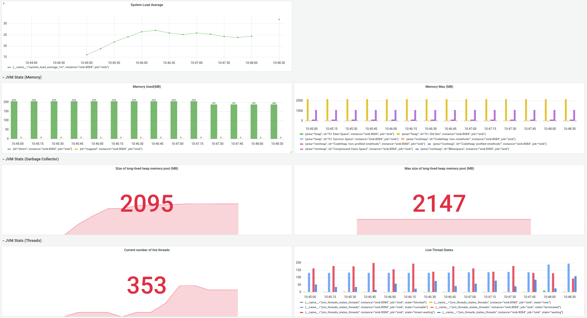

## Sink Connector(Lightweight) monitoring

The `sink-connector-client` executable or the storage database created by sink connector can be used to monitor the replication lag.

**sink-connector-client**
The `sink-connector-client show_replica_status` command prints two values that can be used for monitoring.
`Seconds_Behind_Source` can be monitored and alerted if it exceeds a threshold value.
`Replica_Running` can also be monitored to check if the replication was stopped.

```
bash-4.4# ./sink-connector-client show_replica_status
[
  {
    "Seconds_Behind_Source": 18000
  },
  {
    "Replica_Running": false
  },
  {
    "Database": "test"
  },
  {
    "record_insert_ts": 2024-03-28T12,
    "offset_key": "[\"company-1\",{\"server\":\"embeddedconnector\"}]",
    "record_insert_seq": 186,
    "id": "9cae16ad-f938-480c-b833-07f6f7c02f36",
    "offset_val": "{\"transaction_id\":null,\"ts_sec\":1711645477,\"file\":\"mysql-bin.000003\",\"pos\":276,\"gtids\":\"cbba0506-ed24-11ee-8921-0242ac180005:1-56\",\"row\":1,\"server_id\":604,\"event\":2}"
  }
]
```


**Query**
Querying the storage database directly to get the `seconds_behind_source` column value.
Alerts can be setup on this column(`seconds_behind_source`) if this exceeds a threshold value

```
SELECT
now() - fromUnixTimestamp(JSONExtractUInt(offset_val, 'ts_sec')) AS
seconds_behind_source,
toDateTime(fromUnixTimestamp(JSONExtractUInt(offset_val,
'ts_sec')), 'UTC') AS utc_time,
fromUnixTimestamp(JSONExtractUInt(offset_val, 'ts_sec')) AS
local_time,
*
FROM altinity_sink_connector.replica_source_info
FINAL
```
```
Query id: 061bedc0-f587-49a3-96fa-acb55d6f28f5
Row 1:
seconds_behind_source: 2
utc_time:
2024-03-28 06:11:15
local_time:
2024-03-28 01:11:15
id:
3513a07a-7d88-40d9-895c-5bb2aee80984
offset_key:
["company-1",{"server":"embeddedconnector"}]
offset_val:
{"transaction_id":null,"ts_sec":1711606275,"
file":"binary.126436","pos":765189094,"row":27,"server_id":142,"event":
280}
record_insert_ts:
2024-03-28 01:11:16
record_insert_seq:
6570
```

**Query to monitor INSERT duration in ClickHouse**

```select event_time, written_rows from system.query_log where event_time > now () - interval 60 minute and type='QueryFinish' and query like 'insert into table(%'```

**Query to monitor Part log in ClickHouse**

```select event_time, database, table, rows, duration_ms,size_in_bytes from system.part_log where table='table' and event_type='NewPart' and event_time > now () - interval 30 minute and database='db' ;```

## Grafana Dashboard
JMX metrics of sink connector are exposed through the port

The JMX_exporter docker image scrapes the JMX metrics from the sink connector
The metrics can be read through the following URL
http://localhost:9072/metrics

A Grafana dashboard is included to view JMX metrics.
The docker-compose launches Grafana application which can be accessed in **http://localhost:3000**
The default username/password is `admin/admin`




**Memory**

Sink Connector Config
OpenJDK 11.0.14.1 

-Xms256M, -Xmx2G,


**Throughput**
Increase the `fetch.min.bytes` property to increase the size of message
consumed \
[1] https://strimzi.io/blog/2021/01/07/consumer-tuning/

