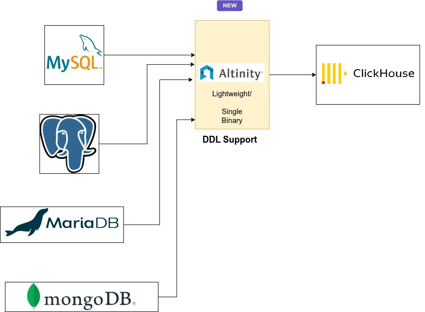
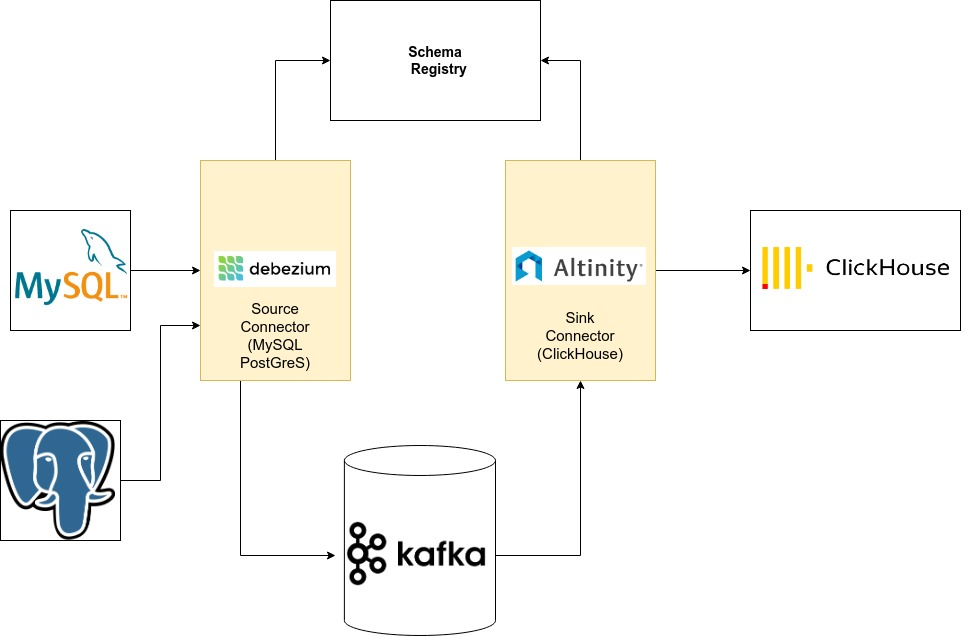

# Sink Connector Architecture Overview

The Sink Connector extracts transactions from upstream databases 
using [Debezium](debezium) into a common log format and then applies those 
transactions to tables in ClickHouse. 

There are two modes of operation. 
* Lightweight Sink Connector - Combines extract and apply operations 
  into a single process. 
* Kafka Sink Connector - Separates extract and apply operations into separate
  processes, using a Kafka-compatible event stream for transport between them. 

Debezium offers change data capture on a number of database types. The 
Sink Connector has been tested extensively on MySQL and PostgreSQL. 

## Lightweight Sink Connector

New tool to replicate data from MySQL, PostgreSQL, MariaDB and Mongo
without additional dependencies.  Single executable and lightweight.

The Lightweight Sink Connector translates MySQL DDL to ClickHouse 
schema. This includes picking up and applying schema changes. 

## Kafka Sink Connector 

Kafka Sink Connector transfers data from Kafka to Clickhouse using
the Kafka Connect framework.

The connector is tested with the following converters
- JsonConverter
- AvroConverter (Using [Apicurio Schema Registry](https://www.apicur.io/registry/) or Confluent Schema Registry)

The Kafka Sink Connector has a complete set of features for transactional 
replication. 

- Inserts, Updates and Deletes using ReplacingMergeTree - [Updates/Deletes](doc/mutable_data.md)
- Auto create tables in ClickHouse
- Exactly once semantics 
- Bulk insert to Clickhouse 
- Store [Kafka metadata](Kafka_metadata.md)
- Kafka topic to ClickHouse table mapping, use case where MySQL table can be mapped to a different CH table name.
- Store raw data in JSON(For Auditing purposes)
- Monitoring(Using Grafana/Prometheus) Dashboard to monitor lag
- Kafka Offset management in ClickHouse
- Increased Parallelism(Customize thread pool for JDBC connections)

### Exactly Once Semantics

Exactly once semantics are guaranteed by storing offsets(by topic,
partition) in a separate clickhouse table. The table will be ordered
by time and a materialized view will be created as a cache to avoid
expensive table scans.

Topic management will be disabled in Kafka connect and the `precommit()`
function in SinkTask would return the offsets stored in clickhouse.

References:
[1] https://stackoverflow.com/questions/55608325/clickhouse-select-last-record-without-max-on-all-table
