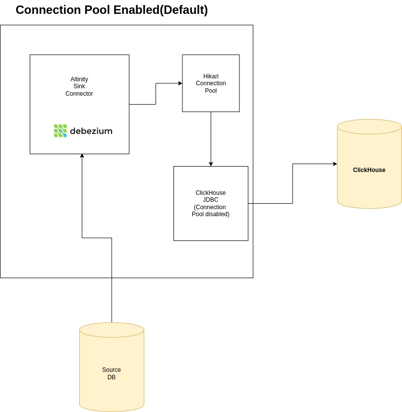
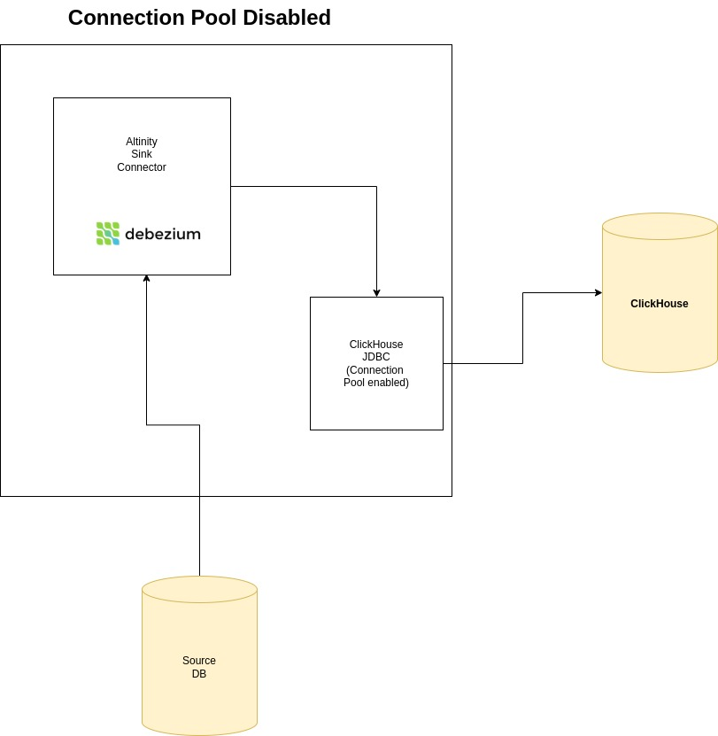

## Connection Pool

The connection pool is used to manage connections to the ClickHouse server.

### Configuration

The connection pool is configured using the following properties:
Refer to HikariCP documentation for more details.[HikariCP docs](https://github.com/brettwooldridge/HikariCP)

connection.pool.max.size - Maximum number of connections in the pool.
connection.pool.timeout - Timeout for acquiring a connection from the pool.
connection.pool.min.idle - Minimum number of idle connections in the pool.
connection.pool.max.lifetime - Maximum lifetime of a connection in the pool.

### Usage

The connection pool is used to acquire connections from the pool when a new request is made.
The connection is released back to the pool when the request is complete.

By default the connection pool is enabled.
To disable the connection pool set the following property to true.

```
connection.pool.disable=true
```

## Connection Pool (Enabled)


By Default the  Hikari connection pool is enabled. All the clickhouse calls are routed through the connection pool.
Hikari Connection pool manages the Clickhouse JDBC DataSource objects.

## Connection Pool (Disabled)


When the connection pool is disabled, the Clickhouse JDBC DataSource objects are not managed by the connection pool.
The Clickhouse JDBC DataSource objects are created when the request is made and closed when the request is complete.
There is a default Apache connection pool that is created in ClickHouse JDBC library.


