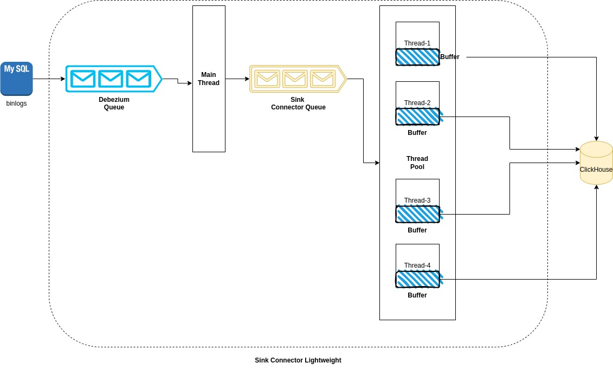

## Production setup



### Improving throughput and/or Memory usage.

As detailed in the diagram above, there are components that store the messages and
can be configured to improve throughput and/or memory usage.

1. **Debezium Queue**:

The following configuration parameters are used to configure the size of the debezium queue
in terms of number of elements the queue can hold and the maximum size of the queue in bytes.
    
    ```    
    #Positive integer value that specifies the maximum size of each batch of events that should be processed during each iteration of this connector. Defaults to 2048.
    max.batch.size: 20000

    #Positive integer value that specifies the maximum number of records that the blocking queue can hold.
    max.queue.size: 100000

    # A long integer value that specifies the maximum volume of the blocking queue in bytes.
    max.queue.size.in.bytes: 1000000000
    ```

2. **Sink connector Queue**:

```
    # The maximum number of records that should be loaded into memory while streaming data from MySQL to ClickHouse.
    sink.connector.max.queue.size: "100000"

```

3. **Thread Pool**:
```
     # Maximum number of threads in the thread pool for processing CDC records.
    thread.pool.size: 10
    
    # Max number of records for the flush buffer.
    buffer.max.records: "1000000"
    
    Flush time of the buffer in milliseconds. The buffer that is stored in memory before being flushed to ClickHouse.
    buffer.flush.time.ms: "1000"
```

## Snapshots (Out of Memory)

The following parameters might be useful to reduce the memory usage of the connector during the snapshotting phase.


**Reduce the number of tables**: Use the `snapshot.include.collection.list` to filter include only the necessary tables
as part of the snapshot which will reduce the data retrieved from source.

**snapshot.fetch.size**: This defines the maximum number of rows that are fetched as part of the batch from the database.
Use a lower number to reduce memory usage.
**Incremental**
```
incremental.snapshot.chunk.size
Default value: 1024
The maximum number of rows that the connector fetches and reads into memory when it retrieves an incremental snapshot chunk. Increasing the chunk size provides greater efficiency, because the snapshot runs fewer snapshot queries of a greater size. However, larger chunk sizes also require more memory to buffer the snapshot data. Adjust the chunk size to a value that provides the best performance in your environment.
```

**snapshot.max.threads**: Increase this number from 1 to a higher value to enable parallel snapshotting.

