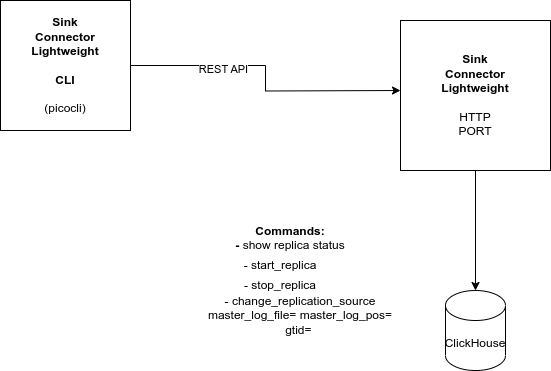

# Sink Connector Lightweight (CLI)

## Design Overview 

The CLI application will translate the CLI commands to REST payload messages.

Option in sink connector lightweight to not start automatically unless
the user specifies the **start_replica** flag.(skip-replica-start) in the yaml file.
This will give users option to set the binlog status/position, gtid
**change_replication_source** before starting the replication.

## Operations

1. **Startup**, the CLI application will send a REST API call to the server, if it gets a 200, it will continue or throw an error.
2. **Start_replica**, CLI application will send a REST API call to the server to start replication(start Debezium event loop)
3. **Stop_replica**, CLI application will send a REST API call to the server to stop replication(stop Debezium event loop)
4. **change_replication_source**, CLI application will send the gtid, binlog file, and binlog position to the server to change the replication source
 Server will update the table with this information will restart the debezium event loop.
5. **show replica status** Return the information from the **replica_status** table.

