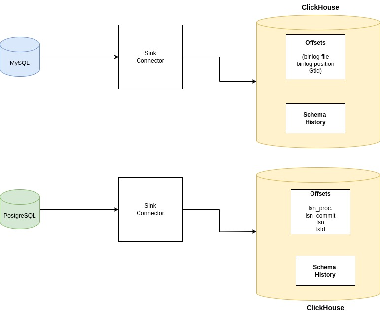

## State Storage

Sink connector is designed to store data about the replication state.
Currently the only supported state storage is by persisting the information in ClickHouse tables.

### ClickHouse State Storage

To use ClickHouse as a state storage, you need to specify the following configuration properties:



# Offsets table(MySQL)
The offsets table defined by the `offset.storage.jdbc.table.name`
Default: **"altinity_sink_connector.replica_source_info"**
This table is used to store the binlog file, position and gtids.
| Column Name | Description                                                          | Example |
|-------------|----------------------------------------------------------------------|---------|
| id          | UUID                                                                 |         | 
| offset_key  | This is the Unique key for every connector. Its a combination of `name` configuration variable and the `topic.prefix` configuration variable               | [\"debezium-embedded-postgres\",{\"server\":\"embeddedconnector\"}]"| 
| offset_val  | This column stores the offset information for MySQL, **file**- binlog file, **pos**- binlog position, **gtids**- GTID                                    | {"ts_sec":1724849901,"file":"mysql-bin.000003","pos":197,"gtids":"03d24fcc-6567-11ef-9978-0242ac130003:1-56"}  
| record_insert_seq  | Timestamp when record is inserted.                                                               | 2024-08-28 12:58:22         |
| record_insert_ts  |  Monotonically increasing number                                                              |    174      |

# Schema History table(MySQL)
The schema history table defined by the `schema.history.internal.jdbc.table.name`
Default: **"altinity_sink_connector.replicate_schema_history"**
This table is used by Debezium to store historical DDL statements so the DDL statements can be parsed. 
| Column Name | Description                                                          | Example |
|-------------|----------------------------------------------------------------------|---------|
| id          | UUID of the record. Since Debezium 3.3 every part of one record shares it |         | 
| history_data          | binlog information and DDL; a record longer than 65000 characters is split over several rows  |  {"source":{"server":"embeddedconnector"},"position":{"ts_sec":1724867891,"file":"mysql-bin.000003","pos":197,"gtids":"03d24fcc-6567-11ef-9978-0242ac130003:1-56","snapshot":true},"ts_ms":1724867891697,"databaseName":"test","ddl":"DROP TABLE IF EXISTS `test`.`orders`","tableChanges":[{"type":"DROP","id":"\"test\".\"orders\""}]}        | 
| history_data_seq          | Part number of the record (0, 1, 2, ...)                                                                   |         | 
| record_insert_seq  | Monotonically increasing number (per connector process)                                                               |    174      |
| record_insert_ts  | Timestamp when record is inserted.                                                              | 2024-08-28 12:58:22         |

**Layout requirement (Debezium 3.3+).** All parts of one record share `id`,
`record_insert_ts` and `record_insert_seq`, so a `ReplacingMergeTree` keyed by
`id` alone keeps only one part and the next restart cannot recover the schema
(Altinity/clickhouse-sink-connector#1450). The table must be keyed
`ORDER BY (id, history_data_seq)`:

```sql
CREATE TABLE IF NOT EXISTS altinity_sink_connector.replicate_schema_history
(`id` VARCHAR(36) NOT NULL, `history_data` VARCHAR(65000), `history_data_seq` INTEGER,
 `record_insert_ts` TIMESTAMP NOT NULL, `record_insert_seq` INTEGER NOT NULL)
ENGINE = ReplacingMergeTree(record_insert_seq) ORDER BY (id, history_data_seq)
```

At start-up the connector checks the table and migrates an existing
non-replicated `ORDER BY id` table in an Atomic database automatically (copy,
verify, `EXCHANGE TABLES`, the previous table kept as
`<table>_pre_dbz33_<timestamp>`); anything it cannot migrate safely stops the
start with the manual procedure (spec 09.05).


# Offsets table.(PostgreSQL)
The offsets table defined by the `offset.storage.jdbc.table.name`
Default: **"altinity_sink_connector.replica_source_info"**
This table is used to store the binlog file, position and gtids.
| Column Name | Description                                                          | Example |
|-------------|----------------------------------------------------------------------|---------|
| id          | UUID                                                                 |         | 
| offset_key  | This is the Unique key for every connector. Its a combination of `name` configuration variable and the `topic.prefix` configuration variable               | [\"debezium-embedded-postgres\",{\"server\":\"embeddedconnector\"}]"| 
| offset_val  | This column stores the LSN information for PostgreSQL                                   | {"last_snapshot_record":true,"lsn":27476744,"txId":744,"ts_usec":1724875350871964,"snapshot":true} 
| record_insert_seq  | Timestamp when record is inserted.                                                               | 2024-08-28 12:58:22         |
| record_insert_ts  |  Monotonically increasing number                                                                     |

### offsets_value
- **lsn_proc** - Last processed LSN
- **lsn_commit** - Last committed LSN
- **messageType** - Type of message(INSERT, UPDATE, DELETE)
- 
