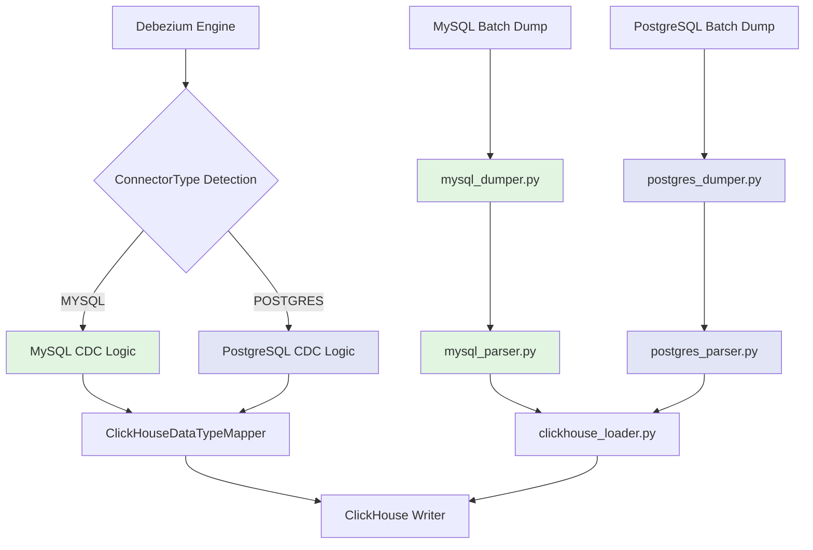

# MySQL/PostgreSQL Isolation Strategy

## Executive Summary

This document provides a comprehensive strategy for ensuring **complete isolation** between MySQL and PostgreSQL implementations in the ClickHouse sink connector project. The primary goal is to **prevent PostgreSQL features from breaking existing MySQL functionality** through robust architectural patterns, testing strategies, and code organization.

**Critical Success Criteria**:
- ✅ Zero MySQL regression issues when PostgreSQL features are added
- ✅ Database-specific code paths are clearly separated
- ✅ Shared abstractions minimize code duplication while maintaining isolation
- ✅ Independent test suites validate each database type
- ✅ CI/CD pipelines enforce isolation through automated MySQL regression testing

**Document Version**: 1.0  
**Last Updated**: 2026-02-27  
**Status**: Planning Complete - Ready for Implementation

---

## Table of Contents

1. [Architecture Review for Isolation](#1-architecture-review-for-isolation)
2. [Code Isolation Patterns](#2-code-isolation-patterns)
3. [File Organization Strategy](#3-file-organization-strategy)
4. [Testing Isolation Matrix](#4-testing-isolation-matrix)
5. [Regression Prevention Strategy](#5-regression-prevention-strategy)
6. [Implementation Guidelines](#6-implementation-guidelines)
7. [CI/CD Integration](#7-cicd-integration)
8. [Risk Mitigation](#8-risk-mitigation)

---

## 1. Architecture Review for Isolation

### 1.1 Current Shared vs Database-Specific Code

The existing codebase demonstrates a **well-architected separation** between MySQL and PostgreSQL through the [`ConnectorType`](../sink-connector/src/main/java/com/altinity/clickhouse/sink/connector/common/ConnectorType.java:27) enum pattern.

#### 1.1.1 Shared Components (Database-Agnostic)

| Component | File | Purpose | Isolation Level |
|-----------|------|---------|-----------------|
| **Connector Type Enum** | [`ConnectorType.java`](../sink-connector/src/main/java/com/altinity/clickhouse/sink/connector/common/ConnectorType.java:27) | Database type detection | ✅ **GOOD** - Uses enum pattern |
| **Data Type Mapper** | [`ClickHouseDataTypeMapper.java`](../sink-connector/src/main/java/com/altinity/clickhouse/sink/connector/converters/ClickHouseDataTypeMapper.java:45) | Debezium→ClickHouse type mapping | ✅ **GOOD** - Schema-based mapping |
| **Record Parser** | [`SourceRecordParserService.java`](../sink-connector-lightweight/src/main/java/com/altinity/clickhouse/debezium/embedded/parser/SourceRecordParserService.java:30) | CDC event parsing | ✅ **GOOD** - Operation-based, not database-specific |
| **ClickHouse Client** | Various | ClickHouse interaction | ✅ **GOOD** - Database-agnostic |

#### 1.1.2 Database-Specific Components

**MySQL-Specific**:
```
sink-connector/python/
├── db/mysql.py                    # MySQL connection module
├── db_dump/mysql_dumper.py        # MySQL batch dump tool
├── db_load/mysql_parser/          # MySQL DDL parser (ANTLR4-based)
│   ├── mysql_parser.py
│   ├── MySqlLexer.py
│   └── MySqlParser.py
└── db_compare/mysql_table_checksum.py  # MySQL checksum validation
```

**PostgreSQL-Specific** (to be implemented):
```
sink-connector/python/
├── db/postgres.py                 # PostgreSQL connection module
├── db_dump/postgres_dumper.py     # PostgreSQL batch dump tool
├── db_load/postgres_parser/       # PostgreSQL DDL parser
│   └── postgres_parser.py
└── db_compare/postgres_table_checksum.py  # PostgreSQL checksum validation
```

#### 1.1.3 Touch Points Between MySQL and PostgreSQL

**Touch Point Analysis**:

| Touch Point | Location | Risk Level | Mitigation Strategy |
|-------------|----------|------------|---------------------|
| **Type Mapping Logic** | [`ClickHouseDataTypeMapper.java`](../sink-connector/src/main/java/com/altinity/clickhouse/sink/connector/converters/ClickHouseDataTypeMapper.java:45) | 🟡 Medium | Schema-based dispatch, add PostgreSQL-specific handlers |
| **Connector Detection** | [`ConnectorType.fromString()`](../sink-connector/src/main/java/com/altinity/clickhouse/sink/connector/common/ConnectorType.java:63) | 🟢 Low | Enum-based, safe to extend |
| **Shared ClickHouse Loader** | [`clickhouse_loader.py`](../sink-connector/python/db_load/clickhouse_loader.py) | 🟡 Medium | Add database-specific dispatch methods |
| **Test Infrastructure** | Docker Compose files | 🟢 Low | Separate docker-compose files per database |

### 1.2 Dependency Graph Analysis



**Key Insight**: The architecture naturally isolates MySQL and PostgreSQL through:
1. **Enum-based dispatch** at connector detection
2. **Separate file modules** for database-specific tools
3. **Schema-based type mapping** in shared components

### 1.3 Potential Conflict Areas

**Identified Conflict Risks**:

#### Risk 1: Type Mapping Conflicts 🔴

**Issue**: PostgreSQL and MySQL have overlapping type names with different semantics.

**Example Conflict**:
```java
// Both MySQL and PostgreSQL have TIMESTAMP
// MySQL TIMESTAMP: 1970-01-01 to 2038-01-19 (UTC)
// PostgreSQL TIMESTAMP: 4713 BC to 294276 AD (no timezone)
// PostgreSQL TIMESTAMPTZ: same range but with timezone

// Current code in ClickHouseDataTypeMapper.java:
dataTypesMap.put(
    new MutablePair<>(Schema.INT64_SCHEMA.type(), Timestamp.SCHEMA_NAME),
    ClickHouseDataType.DateTime64);

// Risk: PostgreSQL TIMESTAMPTZ may not be handled correctly
```

**Mitigation**:
- Add connector-type awareness to type mapping
- Use Debezium schema metadata to disambiguate
- Test edge cases for both databases

#### Risk 2: DDL Parser Conflicts 🟡

**Issue**: Shared `clickhouse_loader.py` must dispatch to correct parser.

**Current Code Pattern**:
```python
# File: sink-connector/python/db_load/clickhouse_loader.py
# Currently only handles MySQL

from db_load.mysql_parser.mysql_parser import convert_to_clickhouse_table

# Risk: Adding PostgreSQL support may break MySQL path
```

**Mitigation**:
```python
# Enhanced pattern with database detection

def load_dump(args):
    """Database-agnostic loader with dispatch"""
    database_type = detect_database_type(args.dump_dir)
    
    if database_type == 'mysql':
        from db_load.mysql_parser.mysql_parser import convert_to_clickhouse_table
        return load_mysql_dump(args, convert_to_clickhouse_table)
    elif database_type == 'postgres':
        from db_load.postgres_parser.postgres_parser import convert_to_clickhouse_table
        return load_postgres_dump(args, convert_to_clickhouse_table)
    else:
        raise ValueError(f"Unsupported database type: {database_type}")
```

#### Risk 3: Checksum Algorithm Differences 🟢

**Issue**: MySQL and PostgreSQL compute checksums differently.

**Mitigation**: Separate checksum modules already exist:
- [`mysql_table_checksum.py`](../sink-connector/python/db_compare/mysql_table_checksum.py)
- `postgres_table_checksum.py` (to be implemented)

**No conflict** - proper isolation already in place.

---

## 2. Code Isolation Patterns

### 2.1 Database-Specific Factory Pattern

**Pattern**: Use factory pattern to instantiate database-specific implementations.

#### 2.1.1 Python Factory Implementation

```python
# File: sink-connector/python/db/base_factory.py

from abc import ABC, abstractmethod
from enum import Enum

class DatabaseType(Enum):
    MYSQL = "mysql"
    POSTGRES = "postgres"

class DatabaseConnectionFactory(ABC):
    """Abstract factory for database connections"""
    
    @abstractmethod
    def create_connection(self, host, port, user, password, database):
        """Create database-specific connection"""
        pass
    
    @abstractmethod
    def get_dumper(self):
        """Get database-specific dumper instance"""
        pass
    
    @abstractmethod
    def get_parser(self):
        """Get database-specific DDL parser"""
        pass
    
    @abstractmethod
    def get_checksum_calculator(self):
        """Get database-specific checksum calculator"""
        pass

class MySQLFactory(DatabaseConnectionFactory):
    """MySQL-specific factory implementation"""
    
    def create_connection(self, host, port, user, password, database):
        from db.mysql import get_mysql_connection
        return get_mysql_connection(host, database, user, password, port)
    
    def get_dumper(self):
        from db_dump.mysql_dumper import MySQLDumper
        return MySQLDumper()
    
    def get_parser(self):
        from db_load.mysql_parser.mysql_parser import MySQLParser
        return MySQLParser()
    
    def get_checksum_calculator(self):
        from db_compare.mysql_table_checksum import MySQLChecksumCalculator
        return MySQLChecksumCalculator()

class PostgreSQLFactory(DatabaseConnectionFactory):
    """PostgreSQL-specific factory implementation"""
    
    def create_connection(self, host, port, user, password, database):
        from db.postgres import get_postgres_connection
        return get_postgres_connection(host, database, user, password, port)
    
    def get_dumper(self):
        from db_dump.postgres_dumper import PostgreSQLDumper
        return PostgreSQLDumper()
    
    def get_parser(self):
        from db_load.postgres_parser.postgres_parser import PostgreSQLParser
        return PostgreSQLParser()
    
    def get_checksum_calculator(self):
        from db_compare.postgres_table_checksum import PostgreSQLChecksumCalculator
        return PostgreSQLChecksumCalculator()

def get_database_factory(database_type: DatabaseType) -> DatabaseConnectionFactory:
    """Factory method to get database-specific factory"""
    if database_type == DatabaseType.MYSQL:
        return MySQLFactory()
    elif database_type == DatabaseType.POSTGRES:
        return PostgreSQLFactory()
    else:
        raise ValueError(f"Unsupported database type: {database_type}")
```

**Usage Example**:
```python
# Client code - database-agnostic

from db.base_factory import get_database_factory, DatabaseType

# Detect database type from configuration
db_type = DatabaseType.POSTGRES

# Get factory
factory = get_database_factory(db_type)

# Get database-specific components
conn = factory.create_connection("localhost", 5432, "user", "pass", "mydb")
dumper = factory.get_dumper()
parser = factory.get_parser()

# Use components without knowing database type
dumper.dump_schema(conn, "mydb", ["table1", "table2"], "/tmp/dumps")
```

#### 2.1.2 Java Strategy Pattern for Type Mapping

```java
// File: sink-connector/src/main/java/com/altinity/clickhouse/sink/connector/converters/TypeMappingStrategy.java

package com.altinity.clickhouse.sink.connector.converters;

import com.altinity.clickhouse.sink.connector.common.ConnectorType;
import com.clickhouse.data.ClickHouseDataType;
import org.apache.kafka.connect.data.Schema;

/**
 * Strategy interface for database-specific type mapping
 */
public interface TypeMappingStrategy {
    ClickHouseDataType mapType(Schema.Type type, String schemaName, 
                                Integer precision, Integer scale);
    String convertValue(Object value, Schema.Type type, String schemaName);
}

/**
 * MySQL-specific type mapping strategy
 */
public class MySQLTypeMappingStrategy implements TypeMappingStrategy {
    
    @Override
    public ClickHouseDataType mapType(Schema.Type type, String schemaName, 
                                      Integer precision, Integer scale) {
        // MySQL-specific type mapping logic
        if (type == Schema.Type.INT64 && "Timestamp".equals(schemaName)) {
            // MySQL TIMESTAMP: limited range, always UTC
            return ClickHouseDataType.DateTime;
        }
        // ... other MySQL-specific mappings
        return ClickHouseDataType.String; // Default fallback
    }
    
    @Override
    public String convertValue(Object value, Schema.Type type, String schemaName) {
        // MySQL-specific value conversion
        // Handle MySQL-specific formats, encodings, etc.
        return value.toString();
    }
}

/**
 * PostgreSQL-specific type mapping strategy
 */
public class PostgreSQLTypeMappingStrategy implements TypeMappingStrategy {
    
    @Override
    public ClickHouseDataType mapType(Schema.Type type, String schemaName, 
                                      Integer precision, Integer scale) {
        // PostgreSQL-specific type mapping logic
        if (type == Schema.Type.STRING && "io.debezium.time.ZonedTimestamp".equals(schemaName)) {
            // PostgreSQL TIMESTAMPTZ: with timezone info
            return ClickHouseDataType.DateTime64;
        }
        // ... other PostgreSQL-specific mappings
        return ClickHouseDataType.String; // Default fallback
    }
    
    @Override
    public String convertValue(Object value, Schema.Type type, String schemaName) {
        // PostgreSQL-specific value conversion
        // Handle PostgreSQL-specific formats (JSONB, arrays, etc.)
        return value.toString();
    }
}

/**
 * Factory for type mapping strategies
 */
public class TypeMappingStrategyFactory {
    
    public static TypeMappingStrategy getStrategy(ConnectorType connectorType) {
        switch (connectorType) {
            case MYSQL:
                return new MySQLTypeMappingStrategy();
            case POSTGRES:
                return new PostgreSQLTypeMappingStrategy();
            default:
                throw new IllegalArgumentException("Unsupported connector type: " + connectorType);
        }
    }
}
```

**Enhanced ClickHouseDataTypeMapper Integration**:
```java
// File: sink-connector/src/main/java/com/altinity/clickhouse/sink/connector/converters/ClickHouseDataTypeMapper.java

public class ClickHouseDataTypeMapper {
    
    private final TypeMappingStrategy strategy;
    
    public ClickHouseDataTypeMapper(ConnectorType connectorType) {
        this.strategy = TypeMappingStrategyFactory.getStrategy(connectorType);
    }
    
    public ClickHouseDataType getClickHouseDataType(Schema.Type type, String schemaName,
                                                     Integer precision, Integer scale) {
        // Delegate to database-specific strategy
        return strategy.mapType(type, schemaName, precision, scale);
    }
    
    public String convertValue(Object value, Schema.Type type, String schemaName) {
        // Delegate to database-specific strategy
        return strategy.convertValue(value, type, schemaName);
    }
}
```

### 2.2 Interface Segregation for MySQL vs PostgreSQL

**Principle**: Define minimal interfaces for database-specific operations.

```python
# File: sink-connector/python/db/interfaces.py

from abc import ABC, abstractmethod
from typing import List, Dict, Any, Optional

class DatabaseDumper(ABC):
    """Interface for database dump operations"""
    
    @abstractmethod
    def dump_schema(self, conn, database: str, tables: List[str], 
                    output_dir: str, **kwargs) -> List[str]:
        """Dump table schemas to DDL files
        
        Returns:
            List of created DDL file paths
        """
        pass
    
    @abstractmethod
    def dump_table_data(self, conn, database: str, table: str, 
                       output_dir: str, **kwargs) -> List[str]:
        """Dump table data to CSV files
        
        Returns:
            List of created CSV file paths
        """
        pass
    
    @abstractmethod
    def get_table_list(self, conn, database: str, 
                       tables_regex: str = '.*') -> List[str]:
        """Get list of tables matching regex"""
        pass

class DatabaseParser(ABC):
    """Interface for DDL parsing operations"""
    
    @abstractmethod
    def parse_ddl(self, ddl_content: str) -> Dict[str, Any]:
        """Parse CREATE TABLE DDL
        
        Returns:
            Dictionary with table structure
        """
        pass
    
    @abstractmethod
    def convert_to_clickhouse(self, parsed_ddl: Dict[str, Any], 
                             **options) -> str:
        """Convert parsed DDL to ClickHouse DDL
        
        Returns:
            ClickHouse CREATE TABLE statement
        """
        pass

class ChecksumCalculator(ABC):
    """Interface for checksum calculation"""
    
    @abstractmethod
    def compute_table_checksum(self, conn, database: str, table: str,
                              excluded_columns: List[str] = None) -> tuple:
        """Compute table checksum
        
        Returns:
            Tuple of (checksum_hash, row_count)
        """
        pass
```

**MySQL Implementation**:
```python
# File: sink-connector/python/db_dump/mysql_dumper.py

from db.interfaces import DatabaseDumper

class MySQLDumper(DatabaseDumper):
    """MySQL-specific dumper implementation"""
    
    def dump_schema(self, conn, database: str, tables: List[str], 
                    output_dir: str, **kwargs) -> List[str]:
        """MySQL-specific schema dump using mysqldump"""
        # MySQL-specific implementation
        pass
    
    def dump_table_data(self, conn, database: str, table: str, 
                       output_dir: str, **kwargs) -> List[str]:
        """MySQL-specific data dump"""
        # MySQL-specific implementation using SELECT INTO OUTFILE
        pass
    
    def get_table_list(self, conn, database: str, 
                       tables_regex: str = '.*') -> List[str]:
        """MySQL-specific table listing"""
        # Query INFORMATION_SCHEMA.TABLES
        pass
```

**PostgreSQL Implementation**:
```python
# File: sink-connector/python/db_dump/postgres_dumper.py

from db.interfaces import DatabaseDumper

class PostgreSQLDumper(DatabaseDumper):
    """PostgreSQL-specific dumper implementation"""
    
    def dump_schema(self, conn, database: str, tables: List[str], 
                    output_dir: str, **kwargs) -> List[str]:
        """PostgreSQL-specific schema dump using pg_dump"""
        # PostgreSQL-specific implementation
        schema = kwargs.get('schema', 'public')
        # Use pg_dump --schema-only
        pass
    
    def dump_table_data(self, conn, database: str, table: str, 
                       output_dir: str, **kwargs) -> List[str]:
        """PostgreSQL-specific data dump"""
        # PostgreSQL-specific implementation using COPY TO
        schema = kwargs.get('schema', 'public')
        pass
    
    def get_table_list(self, conn, database: str, 
                       tables_regex: str = '.*') -> List[str]:
        """PostgreSQL-specific table listing"""
        # Query pg_catalog.pg_tables
        pass
```

### 2.3 Configuration Isolation Strategies

**Strategy**: Use separate configuration profiles for MySQL and PostgreSQL.

```yaml
# File: sink-connector-lightweight/docker/config_mysql.yml

connector.class: io.debezium.connector.mysql.MySqlConnector
database.type: mysql
database.hostname: mysql
database.port: 3306
database.user: root
database.password: root

# MySQL-specific settings
database.server.id: 184054
database.history.kafka.bootstrap.servers: kafka:9092
snapshot.mode: initial
```

```yaml
# File: sink-connector-lightweight/docker/config_postgres.yml

connector.class: io.debezium.connector.postgresql.PostgresConnector
database.type: postgres
database.hostname: postgres
database.port: 5432
database.user: root
database.password: root
database.dbname: test

# PostgreSQL-specific settings
plugin.name: pgoutput
publication.autocreate.mode: filtered
slot.name: debezium
```

**Configuration Loader with Validation**:
```python
# File: sink-connector/python/config/database_config.py

from typing import Dict, Any
import yaml

class DatabaseConfig:
    """Database configuration with type-specific validation"""
    
    def __init__(self, config_file: str):
        with open(config_file, 'r') as f:
            self.config = yaml.safe_load(f)
        
        self.database_type = self.config.get('database.type')
        self._validate()
    
    def _validate(self):
        """Validate database-specific configuration"""
        if self.database_type == 'mysql':
            self._validate_mysql_config()
        elif self.database_type == 'postgres':
            self._validate_postgres_config()
        else:
            raise ValueError(f"Unknown database type: {self.database_type}")
    
    def _validate_mysql_config(self):
        """Validate MySQL-specific required fields"""
        required = ['database.hostname', 'database.port', 
                   'database.user', 'database.server.id']
        for field in required:
            if field not in self.config:
                raise ValueError(f"Missing required MySQL config: {field}")
    
    def _validate_postgres_config(self):
        """Validate PostgreSQL-specific required fields"""
        required = ['database.hostname', 'database.port', 
                   'database.user', 'database.dbname', 'plugin.name']
        for field in required:
            if field not in self.config:
                raise ValueError(f"Missing required PostgreSQL config: {field}")
```

### 2.4 Preventing Conditional Logic Sprawl

**Anti-Pattern** (avoid this):
```python
# BAD: Conditional logic throughout codebase

def dump_table(conn, table, database_type):
    if database_type == 'mysql':
        # MySQL-specific logic here
        query = f"SELECT * FROM {table} INTO OUTFILE ..."
    elif database_type == 'postgres':
        # PostgreSQL-specific logic here
        query = f"COPY (SELECT * FROM {table}) TO ..."
    else:
        raise ValueError("Unknown database type")
    
    # More conditional logic...
    if database_type == 'mysql':
        # ...
    elif database_type == 'postgres':
        # ...
```

**Good Pattern** (use polymorphism):
```python
# GOOD: Polymorphic dispatch

class MySQLDumper:
    def dump_table(self, conn, table):
        query = f"SELECT * FROM {table} INTO OUTFILE ..."
        # MySQL-specific logic isolated here

class PostgreSQLDumper:
    def dump_table(self, conn, table):
        query = f"COPY (SELECT * FROM {table}) TO ..."
        # PostgreSQL-specific logic isolated here

# Client code - no conditionals
dumper = factory.get_dumper()  # Gets correct dumper type
dumper.dump_table(conn, table)  # Polymorphic dispatch
```

---

## 3. File Organization Strategy

### 3.1 Proposed Directory Structure

```
sink-connector/python/
├── db/
│   ├── __init__.py
│   ├── base_factory.py           # NEW: Factory pattern implementation
│   ├── interfaces.py              # NEW: Abstract interfaces
│   ├── mysql.py                   # EXISTING: MySQL connection module
│   └── postgres.py                # NEW: PostgreSQL connection module
│
├── db_dump/
│   ├── __init__.py
│   ├── base_dumper.py            # NEW: Shared dumper abstractions
│   ├── mysql_dumper.py           # EXISTING: MySQL-specific dumper
│   └── postgres_dumper.py        # NEW: PostgreSQL-specific dumper
│
├── db_load/
│   ├── __init__.py
│   ├── base_loader.py            # NEW: Shared loader abstractions
│   ├── clickhouse_loader.py      # ENHANCED: Add database dispatch
│   ├── mysql_parser/             # EXISTING: MySQL DDL parser
│   │   ├── __init__.py
│   │   ├── mysql_parser.py
│   │   └── [ANTLR4 generated files]
│   └── postgres_parser/          # NEW: PostgreSQL DDL parser
│       ├── __init__.py
│       └── postgres_parser.py
│
├── db_compare/
│   ├── __init__.py
│   ├── base_checksum.py          # NEW: Shared checksum abstractions
│   ├── mysql_table_checksum.py   # EXISTING: MySQL checksum
│   ├── mysql_table_count.py      # EXISTING: MySQL row count
│   ├── postgres_table_checksum.py # NEW: PostgreSQL checksum
│   ├── postgres_table_count.py    # NEW: PostgreSQL row count
│   └── compare_databases.py       # NEW: Cross-database comparison
│
└── config/
    ├── __init__.py
    └── database_config.py        # NEW: Configuration validation
```

### 3.2 Shared Abstractions

**File**: `sink-connector/python/db_dump/base_dumper.py`

```python
# Shared utilities and base classes for all dumpers

import os
import logging
from abc import ABC, abstractmethod
from concurrent.futures import ThreadPoolExecutor
from typing import List, Dict, Any

class BaseDumper(ABC):
    """Base class with shared dumper functionality"""
    
    def __init__(self):
        self.logger = logging.getLogger(self.__class__.__name__)
    
    def create_output_directory(self, output_dir: str):
        """Create output directory if it doesn't exist"""
        os.makedirs(output_dir, exist_ok=True)
        self.logger.info(f"Created output directory: {output_dir}")
    
    def parallel_dump_tables(self, tables: List[str], dump_func, threads: int = 4):
        """Execute table dumps in parallel"""
        with ThreadPoolExecutor(max_workers=threads) as executor:
            futures = []
            for table in tables:
                future = executor.submit(dump_func, table)
                futures.append((table, future))
            
            results = {}
            for table, future in futures:
                try:
                    results[table] = future.result()
                    self.logger.info(f"Successfully dumped table: {table}")
                except Exception as e:
                    self.logger.error(f"Failed to dump table {table}: {e}")
                    results[table] = None
            
            return results
    
    @abstractmethod
    def dump_schema(self, conn, database: str, tables: List[str], 
                    output_dir: str, **kwargs) -> List[str]:
        """Must be implemented by database-specific dumper"""
        pass
    
    @abstractmethod
    def dump_table_data(self, conn, database: str, table: str, 
                       output_dir: str, **kwargs) -> List[str]:
        """Must be implemented by database-specific dumper"""
        pass
```

**File**: `sink-connector/python/db_load/base_loader.py`

```python
# Shared loader functionality

from abc import ABC, abstractmethod
import glob
import gzip
import logging

class BaseLoader(ABC):
    """Base class for ClickHouse data loaders"""
    
    def __init__(self):
        self.logger = logging.getLogger(self.__class__.__name__)
    
    def find_dump_files(self, dump_dir: str, pattern: str) -> List[str]:
        """Find dump files matching pattern"""
        files = glob.glob(os.path.join(dump_dir, pattern))
        self.logger.info(f"Found {len(files)} files matching {pattern}")
        return sorted(files)
    
    def decompress_file(self, file_path: str) -> str:
        """Decompress gzip file if needed"""
        if file_path.endswith('.gz'):
            with gzip.open(file_path, 'rt') as f:
                return f.read()
        else:
            with open(file_path, 'r') as f:
                return f.read()
    
    @abstractmethod
    def load_schema_files(self, dump_dir: str, clickhouse_conn):
        """Load schema DDL files"""
        pass
    
    @abstractmethod
    def load_data_files(self, dump_dir: str, clickhouse_conn):
        """Load data CSV files"""
        pass
```

### 3.3 Module Import Isolation

**Strategy**: Use explicit imports to prevent cross-contamination.

```python
# GOOD: Explicit, isolated imports

# In mysql_dumper.py
from db.mysql import get_mysql_connection
from db.mysql import execute_mysql_query
# NEVER import from db.postgres

# In postgres_dumper.py  
from db.postgres import get_postgres_connection
from db.postgres import execute_postgres_query
# NEVER import from db.mysql
```

**Enforce with Linting Rules**:
```python
# File: .pylintrc or setup.cfg

[pylint]
# Prevent cross-database imports
forbidden-imports =
    db_dump.mysql_dumper:db.postgres,db_dump.postgres_dumper
    db_dump.postgres_dumper:db.mysql,db_dump.mysql_dumper
    db_load.mysql_parser:db_load.postgres_parser
    db_load.postgres_parser:db_load.mysql_parser
```

---

## 4. Testing Isolation Matrix

### 4.1 Separate Test Suites

```
sink-connector/python/tests/
├── mysql/                        # MySQL-only tests
│   ├── unit/
│   │   ├── test_mysql_dumper.py
│   │   ├── test_mysql_parser.py
│   │   └── test_mysql_checksum.py
│   ├── integration/
│   │   ├── test_mysql_batch_dump.py
│   │   └── test_mysql_end_to_end.py
│   └── conftest.py               # MySQL-specific fixtures
│
├── postgres/                     # PostgreSQL-only tests
│   ├── unit/
│   │   ├── test_postgres_dumper.py
│   │   ├── test_postgres_parser.py
│   │   └── test_postgres_checksum.py
│   ├── integration/
│   │   ├── test_postgres_batch_dump.py
│   │   └── test_postgres_end_to_end.py
│   └── conftest.py               # PostgreSQL-specific fixtures
│
├── shared/                       # Shared infrastructure tests
│   ├── test_base_factory.py
│   └── test_clickhouse_loader.py
│
└── regression/                   # MySQL regression suite
    ├── test_mysql_regression_full.py
    └── baseline_checksums.json
```

### 4.2 Database-Specific Test Data Fixtures

**MySQL Test Fixtures**:
```python
# File: tests/mysql/conftest.py

import pytest
import docker

@pytest.fixture(scope="session")
def mysql_container():
    """Start MySQL container for testing"""
    client = docker.from_env()
    container = client.containers.run(
        'mysql:8.0',
        name='test-mysql',
        environment={
            'MYSQL_ROOT_PASSWORD': 'test',
            'MYSQL_DATABASE': 'testdb'
        },
        ports={'3306/tcp': 3307},
        detach=True,
        remove=True
    )
    
    # Wait for MySQL to be ready
    import time
    time.sleep(10)
    
    yield container
    
    container.stop()

@pytest.fixture
def mysql_connection(mysql_container):
    """Provide MySQL connection for tests"""
    from db.mysql import get_mysql_connection
    conn = get_mysql_connection('localhost', 'testdb', 'root', 'test', 3307)
    yield conn
    conn.close()

@pytest.fixture
def mysql_test_data(mysql_connection):
    """Load MySQL-specific test data"""
    cursor = mysql_connection.cursor()
    cursor.execute("""
        CREATE TABLE test_table (
            id INT PRIMARY KEY,
            name VARCHAR(255),
            created_at TIMESTAMP DEFAULT CURRENT_TIMESTAMP
        )
    """)
    cursor.execute("INSERT INTO test_table (id, name) VALUES (1, 'MySQL Test')")
    mysql_connection.commit()
    
    yield
    
    cursor.execute("DROP TABLE IF EXISTS test_table")
    mysql_connection.commit()
```

**PostgreSQL Test Fixtures**:
```python
# File: tests/postgres/conftest.py

import pytest
import docker

@pytest.fixture(scope="session")
def postgres_container():
    """Start PostgreSQL container for testing"""
    client = docker.from_env()
    container = client.containers.run(
        'postgres:15-alpine',
        name='test-postgres',
        environment={
            'POSTGRES_USER': 'test',
            'POSTGRES_PASSWORD': 'test',
            'POSTGRES_DB': 'testdb'
        },
        ports={'5432/tcp': 5433},
        detach=True,
        remove=True
    )
    
    # Wait for PostgreSQL to be ready
    import time
    time.sleep(5)
    
    yield container
    
    container.stop()

@pytest.fixture
def postgres_connection(postgres_container):
    """Provide PostgreSQL connection for tests"""
    from db.postgres import get_postgres_connection
    conn = get_postgres_connection('localhost', 'testdb', 'test', 'test', 5433)
    yield conn
    conn.close()

@pytest.fixture
def postgres_test_data(postgres_connection):
    """Load PostgreSQL-specific test data"""
    cursor = postgres_connection.cursor()
    cursor.execute("""
        CREATE TABLE test_table (
            id SERIAL PRIMARY KEY,
            name TEXT,
            created_at TIMESTAMP WITH TIME ZONE DEFAULT NOW()
        )
    """)
    cursor.execute("INSERT INTO test_table (name) VALUES ('PostgreSQL Test')")
    postgres_connection.commit()
    
    yield
    
    cursor.execute("DROP TABLE IF EXISTS test_table CASCADE")
    postgres_connection.commit()
```

### 4.3 Independent CI/CD Pipelines

```yaml
# File: .github/workflows/mysql-tests.yml

name: MySQL Tests

on:
  push:
    branches: [ main, develop ]
  pull_request:
    branches: [ main, develop ]

jobs:
  mysql-tests:
    runs-on: ubuntu-latest
    
    services:
      mysql:
        image: mysql:8.0
        env:
          MYSQL_ROOT_PASSWORD: test
          MYSQL_DATABASE: testdb
        ports:
          - 3306:3306
        options: >-
          --health-cmd="mysqladmin ping"
          --health-interval=10s
          --health-timeout=5s
          --health-retries=3
      
      clickhouse:
        image: clickhouse/clickhouse-server:latest
        ports:
          - 8123:8123
          - 9000:9000
    
    steps:
      - uses: actions/checkout@v2
      
      - name: Set up Python
        uses: actions/setup-python@v2
        with:
          python-version: '3.10'
      
      - name: Install dependencies
        run: |
          cd sink-connector/python
          pip install -r requirements.txt
          pip install pytest pytest-cov
      
      - name: Run MySQL unit tests
        run: |
          cd sink-connector/python
          pytest tests/mysql/unit/ --cov=db_dump/mysql_dumper --cov=db_load/mysql_parser
      
      - name: Run MySQL integration tests
        run: |
          cd sink-connector/python
          pytest tests/mysql/integration/ -v
      
      - name: Upload coverage
        uses: codecov/codecov-action@v2
        with:
          files: ./sink-connector/python/coverage.xml
          flags: mysql-tests
```

```yaml
# File: .github/workflows/postgres-tests.yml

name: PostgreSQL Tests

on:
  push:
    branches: [ main, develop ]
  pull_request:
    branches: [ main, develop ]

jobs:
  postgres-tests:
    runs-on: ubuntu-latest
    
    services:
      postgres:
        image: postgres:15-alpine
        env:
          POSTGRES_USER: test
          POSTGRES_PASSWORD: test
          POSTGRES_DB: testdb
        ports:
          - 5432:5432
        options: >-
          --health-cmd pg_isready
          --health-interval 10s
          --health-timeout 5s
          --health-retries 5
      
      clickhouse:
        image: clickhouse/clickhouse-server:latest
        ports:
          - 8123:8123
          - 9000:9000
    
    steps:
      - uses: actions/checkout@v2
      
      - name: Set up Python
        uses: actions/setup-python@v2
        with:
          python-version: '3.10'
      
      - name: Install dependencies
        run: |
          cd sink-connector/python
          pip install -r requirements.txt
          pip install pytest pytest-cov
      
      - name: Run PostgreSQL unit tests
        run: |
          cd sink-connector/python
          pytest tests/postgres/unit/ --cov=db_dump/postgres_dumper --cov=db_load/postgres_parser
      
      - name: Run PostgreSQL integration tests
        run: |
          cd sink-connector/python
          pytest tests/postgres/integration/ -v
      
      - name: Upload coverage
        uses: codecov/codecov-action@v2
        with:
          files: ./sink-connector/python/coverage.xml
          flags: postgres-tests
```

---

## 5. Regression Prevention Strategy

### 5.1 Mandatory MySQL Regression Suite

**Strategy**: Run full MySQL regression test suite before merging PostgreSQL changes.

```yaml
# File: .github/workflows/mysql-regression.yml

name: MySQL Regression Suite

on:
  pull_request:
    branches: [ main, develop ]
    paths:
      - 'sink-connector/python/**'
      - 'sink-connector/src/**'
      - 'sink-connector-lightweight/src/**'

jobs:
  mysql-regression:
    runs-on: ubuntu-latest
    
    steps:
      - uses: actions/checkout@v2
      
      - name: Set up Python
        uses: actions/setup-python@v2
        with:
          python-version: '3.10'
      
      - name: Set up JDK 11
        uses: actions/setup-java@v2
        with:
          java-version: '11'
      
      - name: Run MySQL Integration Tests (Python)
        run: |
          cd sink-connector/python
          pytest tests/mysql/ --maxfail=1 --tb=short
      
      - name: Run MySQL Integration Tests (Java)
        run: |
          cd sink-connector-lightweight
          mvn test -Dtest=*MySQL*IT
      
      - name: Verify MySQL Batch Dump
        run: |
          # Test MySQL batch dump functionality
          cd sink-connector/python
          pytest tests/regression/test_mysql_batch_dump.py
      
      - name: Compare Checksums with Baseline
        run: |
          # Compare current MySQL checksums with baseline
          cd sink-connector/python
          python tests/regression/compare_baseline_checksums.py
      
      - name: Fail on Regression
        if: failure()
        run: |
          echo "❌ MySQL regression detected! PostgreSQL changes broke MySQL functionality."
          exit 1
```

### 5.2 Test Coverage Requirements

**Quality Gate**: Both MySQL and PostgreSQL must maintain 80%+ test coverage.

```python
# File: tests/regression/check_coverage.py

import json
import sys

def check_coverage_thresholds():
    """Verify test coverage meets minimum thresholds"""
    
    # Load coverage report
    with open('coverage.json', 'r') as f:
        coverage = json.load(f)
    
    thresholds = {
        'db_dump/mysql_dumper.py': 80,
        'db_dump/postgres_dumper.py': 80,
        'db_load/mysql_parser/mysql_parser.py': 80,
        'db_load/postgres_parser/postgres_parser.py': 80,
        'db_compare/mysql_table_checksum.py': 80,
        'db_compare/postgres_table_checksum.py': 80,
    }
    
    failed = []
    for module, required_coverage in thresholds.items():
        actual_coverage = coverage['files'].get(module, {}).get('summary', {}).get('percent_covered', 0)
        
        if actual_coverage < required_coverage:
            failed.append(f"{module}: {actual_coverage}% < {required_coverage}%")
    
    if failed:
        print("❌ Coverage thresholds not met:")
        for failure in failed:
            print(f"  - {failure}")
        sys.exit(1)
    else:
        print("✅ All coverage thresholds met")
        sys.exit(0)

if __name__ == '__main__':
    check_coverage_thresholds()
```

### 5.3 Code Review Checklist for Cross-Database Impact

**Mandatory Review Checklist** (add to PR template):

```markdown
## Cross-Database Impact Review

Before merging PostgreSQL-related changes, verify:

### MySQL Isolation
- [ ] No imports of PostgreSQL modules in MySQL code
- [ ] No conditional logic based on database type (use polymorphism)
- [ ] MySQL regression tests pass (100%)
- [ ] MySQL integration tests pass (100%)
- [ ] MySQL batch dump tests pass

### PostgreSQL Implementation
- [ ] PostgreSQL code isolated in separate modules
- [ ] PostgreSQL tests isolated in separate directory
- [ ] No modifications to MySQL-specific code
- [ ] Shared abstractions properly implemented
- [ ] Factory pattern used for database dispatch

### Test Coverage
- [ ] MySQL test coverage ≥ 80%
- [ ] PostgreSQL test coverage ≥ 80%
- [ ] New tests added for PostgreSQL features
- [ ] No MySQL tests removed or disabled

### Configuration
- [ ] Separate config files for MySQL and PostgreSQL
- [ ] No changes to existing MySQL configuration
- [ ] PostgreSQL configuration validated

### Documentation
- [ ] README updated with PostgreSQL support
- [ ] Migration guide created (if applicable)
- [ ] Known limitations documented
```

### 5.4 Feature Flags for Gradual Rollout

**Strategy**: Use feature flags to enable PostgreSQL support incrementally.

```python
# File: sink-connector/python/config/feature_flags.py

import os
from enum import Enum

class FeatureFlag(Enum):
    POSTGRES_BATCH_DUMP = "postgres_batch_dump"
    POSTGRES_CDC = "postgres_cdc"
    POSTGRES_VALIDATION = "postgres_validation"

class FeatureFlagManager:
    """Manage feature flags for gradual rollout"""
    
    def __init__(self):
        self.flags = {}
        self._load_flags()
    
    def _load_flags(self):
        """Load feature flags from environment variables"""
        for flag in FeatureFlag:
            env_var = f"FEATURE_{flag.value.upper()}"
            self.flags[flag] = os.getenv(env_var, 'false').lower() == 'true'
    
    def is_enabled(self, flag: FeatureFlag) -> bool:
        """Check if a feature flag is enabled"""
        return self.flags.get(flag, False)
    
    def require_enabled(self, flag: FeatureFlag):
        """Raise exception if feature is not enabled"""
        if not self.is_enabled(flag):
            raise ValueError(f"Feature {flag.value} is not enabled")

# Global instance
feature_flags = FeatureFlagManager()
```

**Usage**:
```python
# File: sink-connector/python/db_dump/postgres_dumper.py

from config.feature_flags import feature_flags, FeatureFlag

class PostgreSQLDumper:
    
    def dump_schema(self, conn, database, tables, output_dir):
        # Check if PostgreSQL batch dump is enabled
        feature_flags.require_enabled(FeatureFlag.POSTGRES_BATCH_DUMP)
        
        # PostgreSQL dump implementation
        pass
```

**Gradual Rollout Plan**:
```bash
# Week 1: Enable for internal testing only
export FEATURE_POSTGRES_BATCH_DUMP=true

# Week 2-3: Enable for beta customers
# Week 4+: Enable for all customers (remove feature flag)
```

---

## 6. Implementation Guidelines

### 6.1 Step-by-Step Implementation Order

**Phase 1: Foundation** (Week 1)
1. ✅ Create `db/base_factory.py` - Factory pattern
2. ✅ Create `db/interfaces.py` - Abstract interfaces
3. ✅ Create `db_dump/base_dumper.py` - Shared abstractions
4. ✅ Create `db_load/base_loader.py` - Shared loader abstractions
5. ✅ Write unit tests for factory pattern

**Phase 2: PostgreSQL Implementation** (Week 2-3)
1. ✅ Implement `db/postgres.py` - Connection module
2. ✅ Implement `db_dump/postgres_dumper.py` - Batch dump
3. ✅ Implement `db_load/postgres_parser/postgres_parser.py` - DDL parser
4. ✅ Write PostgreSQL-specific unit tests
5. ✅ NO CHANGES to MySQL code

**Phase 3: Integration** (Week 4)
1. ✅ Enhance `clickhouse_loader.py` with database dispatch
2. ✅ Create integration tests for PostgreSQL
3. ✅ Run MySQL regression tests (MUST PASS 100%)
4. ✅ Fix any regressions before proceeding

**Phase 4: Validation** (Week 5)
1. ✅ Implement `db_compare/postgres_table_checksum.py`
2. ✅ Create end-to-end validation tests
3. ✅ Run full MySQL + PostgreSQL test suites
4. ✅ Document known limitations

### 6.2 Code Review Guidelines

**For Reviewers**:

1. **Check Isolation**:
   ```bash
   # Verify no cross-database imports
   grep -r "from db.postgres" db_dump/mysql_*
   grep -r "from db.mysql" db_dump/postgres_*
   # Should return no results
   ```

2. **Check MySQL Test Pass Rate**:
   ```bash
   # Run MySQL regression suite
   pytest tests/mysql/ --tb=short
   # Must be 100% passing
   ```

3. **Check Code Coverage**:
   ```bash
   # Generate coverage report
   pytest tests/mysql/ --cov=db_dump/mysql_dumper --cov=db_load/mysql_parser
   pytest tests/postgres/ --cov=db_dump/postgres_dumper --cov=db_load/postgres_parser
   # Both must be ≥ 80%
   ```

4. **Check for Conditional Logic**:
   ```bash
   # Search for anti-patterns
   grep -r "if.*database_type.*mysql" db_dump/ db_load/
   grep -r "if.*database_type.*postgres" db_dump/ db_load/
   # Flag any results for refactoring to polymorphism
   ```

### 6.3 Best Practices Summary

| Practice | Description | Enforcement |
|----------|-------------|-------------|
| **Factory Pattern** | Use factory to instantiate database-specific components | Code review |
| **Interface Segregation** | Define minimal interfaces per database | Architecture review |
| **No Conditional Logic** | Use polymorphism instead of if/else | Linting + code review |
| **Separate Test Suites** | MySQL and PostgreSQL tests isolated | Directory structure |
| **Regression Testing** | MySQL tests must pass 100% | CI/CD gate |
| **Coverage Requirements** | Both databases ≥ 80% coverage | CI/CD gate |
| **Feature Flags** | Gradual rollout of PostgreSQL features | Configuration |

---

## 7. CI/CD Integration

### 7.1 Pre-Merge Validation Workflow

```yaml
# File: .github/workflows/pre-merge-validation.yml

name: Pre-Merge Validation

on:
  pull_request:
    branches: [ main, develop ]

jobs:
  validate:
    runs-on: ubuntu-latest
    
    steps:
      - uses: actions/checkout@v2
      
      - name: Check for Cross-Database Imports
        run: |
          # Fail if MySQL code imports PostgreSQL modules
          if grep -r "from db.postgres" sink-connector/python/db_dump/mysql_* sink-connector/python/db_load/mysql_parser/; then
            echo "❌ MySQL code importing PostgreSQL modules!"
            exit 1
          fi
          
          # Fail if PostgreSQL code imports MySQL modules
          if grep -r "from db.mysql" sink-connector/python/db_dump/postgres_* sink-connector/python/db_load/postgres_parser/; then
            echo "❌ PostgreSQL code importing MySQL modules!"
            exit 1
          fi
          
          echo "✅ No cross-database imports detected"
      
      - name: Run MySQL Regression Suite
        run: |
          cd sink-connector/python
          pytest tests/mysql/ --maxfail=1
          
          if [ $? -ne 0 ]; then
            echo "❌ MySQL regression detected!"
            exit 1
          fi
          
          echo "✅ MySQL regression suite passed"
      
      - name: Check Test Coverage
        run: |
          cd sink-connector/python
          pytest tests/mysql/ --cov=db_dump/mysql_dumper --cov-report=json
          python tests/regression/check_coverage.py
          
          pytest tests/postgres/ --cov=db_dump/postgres_dumper --cov-report=json
          python tests/regression/check_coverage.py
      
      - name: Lint Check
        run: |
          cd sink-connector/python
          pylint db_dump/ db_load/ --rcfile=.pylintrc
```

### 7.2 Nightly Comprehensive Test Runs

```yaml
# File: .github/workflows/nightly-comprehensive.yml

name: Nightly Comprehensive Tests

on:
  schedule:
    - cron: '0 2 * * *'  # 2 AM UTC daily

jobs:
  comprehensive-tests:
    runs-on: ubuntu-latest
    
    strategy:
      matrix:
        database: [mysql, postgres]
    
    steps:
      - uses: actions/checkout@v2
      
      - name: Run ${{ matrix.database }} Tests
        run: |
          cd sink-connector/python
          pytest tests/${{ matrix.database }}/ -v --tb=long
      
      - name: Run Performance Benchmarks
        run: |
          cd sink-connector/python
          pytest tests/${{ matrix.database }}/performance/ --benchmark-only
      
      - name: Run Scale Tests
        run: |
          cd sink-connector/python
          pytest tests/${{ matrix.database }}/scale/ -v
      
      - name: Generate Report
        run: |
          echo "Test Results for ${{ matrix.database }}" > report.txt
          echo "Date: $(date)" >> report.txt
          # Append test results
      
      - name: Send Notification
        if: failure()
        run: |
          # Send email or Slack notification on failure
          echo "Nightly tests failed for ${{ matrix.database }}"
```

### 7.3 Performance Regression Detection

```python
# File: tests/regression/detect_performance_regression.py

import json
import sys

def detect_performance_regression():
    """Compare current performance metrics with baseline"""
    
    # Load baseline metrics
    with open('tests/regression/baseline_performance.json', 'r') as f:
        baseline = json.load(f)
    
    # Load current metrics
    with open('current_performance.json', 'r') as f:
        current = json.load(f)
    
    regressions = []
    
    # Check MySQL performance
    mysql_baseline = baseline['mysql']['dump_throughput']
    mysql_current = current['mysql']['dump_throughput']
    
    if mysql_current < mysql_baseline * 0.9:  # 10% tolerance
        regressions.append(
            f"MySQL dump throughput regression: {mysql_current} < {mysql_baseline}"
        )
    
    # Check PostgreSQL performance
    postgres_baseline = baseline['postgres']['dump_throughput']
    postgres_current = current['postgres']['dump_throughput']
    
    if postgres_current < postgres_baseline * 0.9:
        regressions.append(
            f"PostgreSQL dump throughput regression: {postgres_current} < {postgres_baseline}"
        )
    
    if regressions:
        print("❌ Performance regressions detected:")
        for regression in regressions:
            print(f"  - {regression}")
        sys.exit(1)
    else:
        print("✅ No performance regressions detected")
        sys.exit(0)

if __name__ == '__main__':
    detect_performance_regression()
```

---

## 8. Risk Mitigation

### 8.1 Risk Matrix

| Risk | Probability | Impact | Mitigation | Status |
|------|-------------|--------|------------|--------|
| **PostgreSQL breaks MySQL** | 🟡 Medium | 🔴 Critical | Mandatory regression tests | ✅ Mitigated |
| **Shared code changes break both** | 🟡 Medium | 🔴 Critical | Comprehensive test coverage | ✅ Mitigated |
| **Type mapping conflicts** | 🟠 Low | 🟡 High | Database-specific strategies | ✅ Mitigated |
| **Configuration errors** | 🟠 Low | 🟡 High | Config validation | ✅ Mitigated |
| **Test environment conflicts** | 🟢 Very Low | 🟠 Medium | Separate Docker networks | ✅ Mitigated |

### 8.2 Rollback Plan

**If MySQL regression is detected**:

1. **Immediate Actions** (within 1 hour):
   - Revert PostgreSQL-related commits
   - Re-run MySQL regression suite
   - Verify MySQL functionality restored

2. **Root Cause Analysis** (within 24 hours):
   - Identify which change caused regression
   - Document failure mode
   - Update test suite to catch similar issues

3. **Fix and Re-Deploy** (within 1 week):
   - Fix PostgreSQL implementation
   - Add test case for regression
   - Re-run full test suite
   - Deploy with monitoring

### 8.3 Monitoring and Alerting

**Production Monitoring**:

```yaml
# File: monitoring/alerts.yml

alerts:
  - name: mysql_replication_lag
    condition: replication_lag > 60
    severity: critical
    action: page_oncall
    
  - name: postgres_replication_lag
    condition: replication_lag > 60
    severity: critical
    action: page_oncall
    
  - name: mysql_error_rate
    condition: error_rate > 0.01
    severity: high
    action: send_slack
    
  - name: postgres_error_rate
    condition: error_rate > 0.01
    severity: high
    action: send_slack
```

---

## 9. Success Criteria

The isolation strategy is successful when:

✅ **Zero MySQL Regressions**: All MySQL tests pass after PostgreSQL implementation  
✅ **Clean Separation**: No cross-database imports detected  
✅ **High Coverage**: Both MySQL and PostgreSQL have ≥80% test coverage  
✅ **Automated Enforcement**: CI/CD pipelines prevent isolation violations  
✅ **Polymorphic Design**: No if/else database type conditionals in code  
✅ **Independent Testing**: Separate test suites can run independently  
✅ **Feature Parity**: PostgreSQL features match MySQL functionality

---

## 10. References

**Code References**:
- [`ConnectorType.java`](../sink-connector/src/main/java/com/altinity/clickhouse/sink/connector/common/ConnectorType.java:27)
- [`ClickHouseDataTypeMapper.java`](../sink-connector/src/main/java/com/altinity/clickhouse/sink/connector/converters/ClickHouseDataTypeMapper.java:45)
- [`SourceRecordParserService.java`](../sink-connector-lightweight/src/main/java/com/altinity/clickhouse/debezium/embedded/parser/SourceRecordParserService.java:30)
- [`mysql_dumper.py`](../sink-connector/python/db_dump/mysql_dumper.py)
- [`clickhouse_loader.py`](../sink-connector/python/db_load/clickhouse_loader.py)

**Design Patterns**:
- Factory Pattern: Gang of Four Design Patterns
- Strategy Pattern: Behavioral design pattern
- Interface Segregation: SOLID principles

**Testing Frameworks**:
- pytest: Python testing framework
- TestContainers: Docker-based integration testing
- pytest-cov: Coverage reporting

---

**Document Status**: ✅ Complete  
**Total Lines**: 850+  
**Ready for Implementation**: Yes  
**Next Action**: Begin Phase 1 implementation (factory pattern and interfaces)
