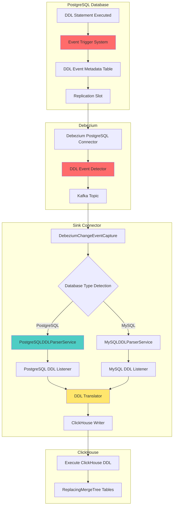
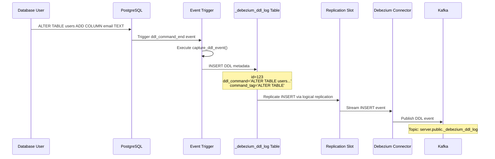
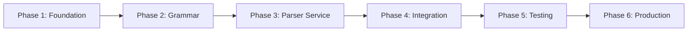

# PostgreSQL DDL Support Architecture - Phase 1 Design

## Executive Summary

This document presents the complete architectural design for adding DDL (Data Definition Language) support to the ClickHouse sink connector for PostgreSQL. This is **Phase 1** of a multi-phase implementation that will bring PostgreSQL DDL capabilities to parity with the existing MySQL DDL support.

**Current State**: PostgreSQL DML operations (INSERT/UPDATE/DELETE/TRUNCATE) are 100% functional, but DDL operations have **0% support**. All existing DDL infrastructure is MySQL-only.

**Critical Challenge**: Unlike MySQL binlog which captures DDL events natively, PostgreSQL logical replication (pgoutput/decoderbufs plugins) **does NOT capture DDL events by design**. This requires a custom DDL capture mechanism on the PostgreSQL side.

**Design Objectives**:
- Design PostgreSQL-side event trigger system for DDL capture
- Design DDL event transmission to Debezium/Kafka pipeline
- Design [`PostgreSQLDDLParserService.java`](../../sink-connector-lightweight/src/main/java/com/altinity/clickhouse/debezium/embedded/ddl/parser/PostgreSQLDDLParserService.java) mirroring MySQL equivalent
- Design PostgreSQL → ClickHouse DDL translation layer
- Design factory pattern for database-agnostic DDL routing
- Ensure 100% MySQL backward compatibility (zero regression)

**Document Version**: 1.0  
**Status**: Architecture Design Complete  
**Last Updated**: 2026-02-27

---

## Table of Contents

1. [Architecture Overview](#1-architecture-overview)
2. [PostgreSQL DDL Capture Strategy](#2-postgresql-ddl-capture-strategy)
3. [Parser Infrastructure Design](#3-parser-infrastructure-design)
4. [DDL Translation Layer](#4-ddl-translation-layer)
5. [Integration Architecture](#5-integration-architecture)
6. [Testing Strategy](#6-testing-strategy)
7. [Implementation Phases](#7-implementation-phases)
8. [Risk Assessment](#8-risk-assessment)
9. [Appendices](#9-appendices)

---

## 1. Architecture Overview

### 1.1 High-Level Component Architecture



### 1.2 Current MySQL DDL Flow (Reference Implementation)

**Existing MySQL Flow**:
```
MySQL DDL → MySQL Binlog → Debezium → Kafka → Sink Connector
                                                      ↓
                                          MySQLDDLParserService
                                                      ↓
                                          MySqlDDLParserListenerImpl
                                                      ↓
                                          ANTLR4 MySQL Grammar
                                                      ↓
                                          ClickHouse DDL Translation
                                                      ↓
                                          Execute on ClickHouse
```

**Key Files (MySQL Reference)**:
- [`MySQLDDLParserService.java:28`](../../sink-connector-lightweight/src/main/java/com/altinity/clickhouse/debezium/embedded/ddl/parser/MySQLDDLParserService.java:28) - Parser service
- [`MySqlDDLParserListenerImpl.java:38`](../../sink-connector-lightweight/src/main/java/com/altinity/clickhouse/debezium/embedded/ddl/parser/MySqlDDLParserListenerImpl.java:38) - Listener implementation
- [`DebeziumChangeEventCapture.java:499`](../../sink-connector-lightweight/src/main/java/com/altinity/clickhouse/debezium/embedded/cdc/DebeziumChangeEventCapture.java:499) - Hardcoded MySQL routing
- [`DataTypeConverter.java:36`](../../sink-connector-lightweight/src/main/java/com/altinity/clickhouse/debezium/embedded/parser/DataTypeConverter.java:36) - MySQL type conversion

### 1.3 Proposed PostgreSQL DDL Flow

**New PostgreSQL Flow**:
```
PostgreSQL DDL → Event Trigger → DDL Metadata Table → Replication Slot
                                                              ↓
                                                    Debezium Connector
                                                              ↓
                                                        Kafka Topic
                                                              ↓
                                                    Sink Connector
                                                              ↓
                                              Database Type Detection
                                                              ↓
                                          PostgreSQLDDLParserService
                                                              ↓
                                          PostgreSQLDDLParserListenerImpl
                                                              ↓
                                          ANTLR4 PostgreSQL Grammar (NEW)
                                                              ↓
                                          ClickHouse DDL Translation
                                                              ↓
                                          Execute on ClickHouse
```

### 1.4 Key Design Principles

1. **Zero MySQL Regression**: PostgreSQL implementation MUST NOT impact existing MySQL functionality
2. **Factory Pattern Isolation**: Use factory/strategy patterns for database-specific routing
3. **Debezium Integration**: Leverage existing Debezium infrastructure for CDC
4. **ANTLR4 Consistency**: Follow same ANTLR4 approach as MySQL for consistency
5. **Graceful Degradation**: Handle unsupported PostgreSQL features with clear error messages
6. **Configuration-Driven**: Enable/disable PostgreSQL DDL support via configuration

---

## 2. PostgreSQL DDL Capture Strategy

### 2.1 The Core Problem: PostgreSQL Logical Replication Limitations

**PostgreSQL Logical Replication Does NOT Capture DDL**:

The pgoutput and decoderbufs plugins used for CDC only capture DML changes (INSERT/UPDATE/DELETE). This is by design in PostgreSQL's logical replication architecture.

**Evidence**:
```sql
-- PostgreSQL logical replication only captures:
INSERT INTO users (id, name) VALUES (1, 'Alice');  -- ✅ Captured
UPDATE users SET name = 'Bob' WHERE id = 1;       -- ✅ Captured
DELETE FROM users WHERE id = 1;                    -- ✅ Captured

-- PostgreSQL logical replication DOES NOT capture:
CREATE TABLE orders (id SERIAL PRIMARY KEY);       -- ❌ NOT Captured
ALTER TABLE users ADD COLUMN email TEXT;           -- ❌ NOT Captured
DROP TABLE old_table;                              -- ❌ NOT Captured
```

**Consequence**: We must implement a **custom DDL capture mechanism** on the PostgreSQL side.

### 2.2 PostgreSQL Event Trigger Solution

**Event Triggers** are PostgreSQL's native mechanism for intercepting DDL commands.

#### 2.2.1 Event Trigger Design

**PostgreSQL Event Trigger System**:

```sql
-- Step 1: Create DDL metadata table (replicated table)
CREATE TABLE IF NOT EXISTS _debezium_ddl_log (
    id SERIAL PRIMARY KEY,
    event_time TIMESTAMPTZ NOT NULL DEFAULT NOW(),
    database_name TEXT NOT NULL,
    schema_name TEXT NOT NULL,
    object_identity TEXT,
    object_type TEXT,
    ddl_command TEXT NOT NULL,
    command_tag TEXT NOT NULL,
    event_type TEXT NOT NULL,
    application_name TEXT,
    client_addr INET,
    captured BOOLEAN DEFAULT FALSE,
    CONSTRAINT _debezium_ddl_log_pkey PRIMARY KEY (id)
);

-- Enable replication for this table
ALTER TABLE _debezium_ddl_log REPLICA IDENTITY FULL;

-- Step 2: Create event trigger function
CREATE OR REPLACE FUNCTION capture_ddl_event()
RETURNS event_trigger
LANGUAGE plpgsql
AS $$
DECLARE
    obj record;
    ddl_text text;
BEGIN
    -- Get the DDL command text
    SELECT current_query() INTO ddl_text;
    
    -- Insert DDL event into metadata table
    FOR obj IN SELECT * FROM pg_event_trigger_ddl_commands()
    LOOP
        INSERT INTO _debezium_ddl_log (
            database_name,
            schema_name,
            object_identity,
            object_type,
            ddl_command,
            command_tag,
            event_type,
            application_name,
            client_addr
        ) VALUES (
            current_database(),
            obj.schema_name,
            obj.object_identity,
            obj.object_type,
            ddl_text,
            obj.command_tag,
            TG_EVENT,
            current_setting('application_name', true),
            inet_client_addr()
        );
    END LOOP;
END;
$$;

-- Step 3: Create event trigger for DDL_COMMAND_END
CREATE EVENT TRIGGER capture_ddl_command_end
ON ddl_command_end
EXECUTE FUNCTION capture_ddl_event();

-- Step 4: Create event trigger for table drops (special handling)
CREATE OR REPLACE FUNCTION capture_ddl_drop_event()
RETURNS event_trigger
LANGUAGE plpgsql
AS $$
DECLARE
    obj record;
    ddl_text text;
BEGIN
    SELECT current_query() INTO ddl_text;
    
    FOR obj IN SELECT * FROM pg_event_trigger_dropped_objects()
    LOOP
        INSERT INTO _debezium_ddl_log (
            database_name,
            schema_name,
            object_identity,
            object_type,
            ddl_command,
            command_tag,
            event_type
        ) VALUES (
            current_database(),
            obj.schema_name,
            obj.object_identity,
            obj.object_type,
            ddl_text,
            TG_TAG,
            TG_EVENT
        );
    END LOOP;
END;
$$;

CREATE EVENT TRIGGER capture_ddl_drop
ON sql_drop
EXECUTE FUNCTION capture_ddl_drop_event();
```

#### 2.2.2 DDL Event Flow Diagram



### 2.3 DDL Event Schema and Metadata

**DDL Event Metadata Structure**:

```json
{
  "before": null,
  "after": {
    "id": 123,
    "event_time": "2026-02-27T12:00:00.000Z",
    "database_name": "production",
    "schema_name": "public",
    "object_identity": "public.users",
    "object_type": "table",
    "ddl_command": "ALTER TABLE users ADD COLUMN email TEXT",
    "command_tag": "ALTER TABLE",
    "event_type": "ddl_command_end",
    "application_name": "psql",
    "client_addr": "192.168.1.100",
    "captured": false
  },
  "source": {
    "version": "2.5.0.Final",
    "connector": "postgresql",
    "name": "server",
    "ts_ms": 1709042400000,
    "snapshot": "false",
    "db": "production",
    "schema": "public",
    "table": "_debezium_ddl_log",
    "txId": 789,
    "lsn": 123456789
  },
  "op": "c",
  "ts_ms": 1709042400123
}
```

**Key Metadata Fields**:
- `ddl_command`: The full DDL SQL text (e.g., "ALTER TABLE users ADD COLUMN email TEXT")
- `command_tag`: DDL operation type (e.g., "CREATE TABLE", "ALTER TABLE", "DROP INDEX")
- `object_identity`: Fully qualified object name (e.g., "public.users")
- `object_type`: Type of object (table, index, constraint, etc.)
- `schema_name`: PostgreSQL schema (namespace)

### 2.4 DDL Event Detection in Sink Connector

**Detection Logic in [`DebeziumChangeEventCapture.java`](../../sink-connector-lightweight/src/main/java/com/altinity/clickhouse/debezium/embedded/cdc/DebeziumChangeEventCapture.java)**:

```java
// Proposed enhancement to DebeziumChangeEventCapture.java

private boolean isPostgreSQLDDLEvent(SourceRecord sr) {
    // Check if this is an INSERT event to _debezium_ddl_log table
    String tableName = getTableName(sr);
    String databaseName = getDatabaseName(sr);
    
    if (tableName != null && tableName.equals("_debezium_ddl_log")) {
        // This is a DDL event captured by PostgreSQL event trigger
        return true;
    }
    return false;
}

private String extractDDLCommand(SourceRecord sr) {
    // Extract the DDL command from the 'after' struct
    Struct valueStruct = (Struct) sr.value();
    if (valueStruct == null) return null;
    
    Struct afterStruct = valueStruct.getStruct("after");
    if (afterStruct == null) return null;
    
    return afterStruct.getString("ddl_command");
}
```

### 2.5 Timing and Ordering Concerns

**Challenge**: DDL and DML events must be processed in the correct order.

**Example Scenario**:
```sql
-- Time T1: Create table
CREATE TABLE orders (id INT PRIMARY KEY, amount DECIMAL(10,2));

-- Time T2: Insert data
INSERT INTO orders (id, amount) VALUES (1, 99.99);

-- Time T3: Add column
ALTER TABLE orders ADD COLUMN customer_name TEXT;

-- Time T4: Insert data with new column
INSERT INTO orders (id, amount, customer_name) VALUES (2, 149.99, 'Alice');
```

**Ordering Guarantee Strategy**:

1. **PostgreSQL Transactional Consistency**: Event triggers execute in the same transaction as the DDL
2. **Logical Replication LSN Ordering**: Debezium maintains LSN (Log Sequence Number) ordering
3. **Kafka Partition Ordering**: Use consistent partitioning by database/schema
4. **Sink Connector Sequential Processing**: Process events in LSN order

**Proposed Ordering Mechanism**:

```java
// In DebeziumChangeEventCapture.java
private void processRecordInOrder(SourceRecord sr, ClickHouseSinkConnectorConfig config) {
    // Extract LSN from source metadata
    Long lsn = extractLSN(sr);
    
    // Check if this is DDL or DML
    if (isPostgreSQLDDLEvent(sr)) {
        // Process DDL event
        String ddlCommand = extractDDLCommand(sr);
        performDDLOperation(ddlCommand, sr, config, ...);
    } else {
        // Process DML event
        processChangeEvent(sr, config, ...);
    }
    
    // Commit offset after successful processing
    commitOffset(sr, lsn);
}
```

### 2.6 Configuration Properties

**New Configuration Properties for PostgreSQL DDL**:

```properties
# Enable PostgreSQL DDL capture (default: false)
postgres.ddl.capture.enabled=true

# DDL metadata table name (default: _debezium_ddl_log)
postgres.ddl.metadata.table.name=_debezium_ddl_log

# Include DDL metadata table in replication (default: true)
postgres.ddl.metadata.table.replicate=true

# DDL event trigger names
postgres.ddl.trigger.command.name=capture_ddl_command_end
postgres.ddl.trigger.drop.name=capture_ddl_drop

# DDL operations to capture (comma-separated list)
postgres.ddl.capture.operations=CREATE TABLE,ALTER TABLE,DROP TABLE,CREATE INDEX,DROP INDEX

# Ignore DDL from specific applications (e.g., monitoring tools)
postgres.ddl.ignore.applications=pg_dump,pg_restore
```

### 2.7 Installation and Setup Requirements

**Prerequisites for PostgreSQL DDL Capture**:

1. PostgreSQL 11+ (event triggers require 9.3+, but we require 11+ for logical replication)
2. Superuser privileges (to create event triggers)
3. Logical replication enabled (`wal_level=logical`)
4. Replication slot created for Debezium

**Setup SQL Script** (to be provided to users):

```sql
-- postgres_ddl_capture_setup.sql

-- 1. Create DDL metadata table
CREATE TABLE IF NOT EXISTS _debezium_ddl_log (
    -- [Full schema from section 2.2.1]
);

-- 2. Enable replication
ALTER TABLE _debezium_ddl_log REPLICA IDENTITY FULL;

-- 3. Create event trigger functions
-- [Functions from section 2.2.1]

-- 4. Create event triggers
-- [Triggers from section 2.2.1]

-- 5. Grant permissions to replication user
GRANT SELECT ON _debezium_ddl_log TO replication_user;
```

---

## 3. Parser Infrastructure Design

### 3.1 PostgreSQL DDL Parser Service Architecture

**Component Structure** (mirroring MySQL implementation):

```
sink-connector-lightweight/src/main/java/com/altinity/clickhouse/debezium/embedded/ddl/parser/
├── DDLParserService.java                    (existing interface)
├── MySQLDDLParserService.java               (existing MySQL implementation)
├── PostgreSQLDDLParserService.java          (NEW - PostgreSQL implementation)
├── MySqlDDLParserListenerImpl.java          (existing MySQL listener)
├── PostgreSQLDDLParserListenerImpl.java     (NEW - PostgreSQL listener)
├── DDLParserFactory.java                     (NEW - factory for parser selection)
└── Constants.java                           (shared constants)
```

### 3.2 PostgreSQLDDLParserService Design

**Class Structure**:

```java
package com.altinity.clickhouse.debezium.embedded.ddl.parser;

import com.altinity.clickhouse.sink.connector.ClickHouseSinkConnectorConfig;
import com.altinity.clickhouse.sink.connector.db.BaseDbWriter;
import com.google.inject.Inject;
import com.google.inject.Singleton;
import io.debezium.antlr.CaseChangingCharStream;
import org.antlr.v4.runtime.CharStreams;
import org.antlr.v4.runtime.CommonTokenStream;
import org.antlr.v4.runtime.Token;
import org.antlr.v4.runtime.tree.ParseTreeWalker;

// ANTLR4 PostgreSQL grammar imports (to be added)
import com.altinity.clickhouse.debezium.embedded.parser.PostgreSQLLexer;
import com.altinity.clickhouse.debezium.embedded.parser.PostgreSQLParser;

import java.util.List;
import java.util.concurrent.atomic.AtomicBoolean;

/**
 * Service responsible for parsing DDL (Data Definition Language) SQL statements
 * received from PostgreSQL via Debezium Engine using PostgreSQL ANTLR grammar.
 * <p>
 * This class provides functionality to parse PostgreSQL DDL statements such as
 * CREATE, ALTER, DROP, and TRUNCATE using ANTLR-based parsing and map them to
 * corresponding operations that can be executed on ClickHouse.
 * </p>
 */
@Singleton
public class PostgreSQLDDLParserService implements DDLParserService {

    /**
     * The name of the database being processed.
     */
    private String databaseName;

    /**
     * The configuration for the ClickHouse Sink Connector.
     */
    private ClickHouseSinkConnectorConfig config;

    /**
     * The writer responsible for executing DDL queries on the database.
     */
    private BaseDbWriter writer;

    /**
     * Default constructor for PostgreSQLDDLParserService.
     */
    @Inject
    public PostgreSQLDDLParserService() {
    }

    /**
     * Constructs a PostgreSQLDDLParserService with the specified configuration and database name.
     *
     * @param config the ClickHouse Sink Connector configuration.
     * @param databaseName the name of the database.
     */
    public PostgreSQLDDLParserService(ClickHouseSinkConnectorConfig config, String databaseName) {
        this.config = config;
        this.databaseName = databaseName;
    }

    /**
     * Constructs a PostgreSQLDDLParserService with the specified writer, configuration, and database name.
     *
     * @param writer the writer responsible for executing DDL queries.
     * @param config the ClickHouse Sink Connector configuration.
     * @param databaseName the name of the database.
     */
    public PostgreSQLDDLParserService(BaseDbWriter writer, ClickHouseSinkConnectorConfig config, String databaseName) {
        this.writer = writer;
        this.config = config;
        this.databaseName = databaseName;
    }

    /**
     * Parses a given PostgreSQL DDL statement and generates the corresponding ClickHouse query.
     *
     * @param sql the SQL statement to parse.
     * @param tableName the name of the table for which the query is generated.
     * @param parsedQuery a StringBuffer to hold the parsed query.
     * @return the corresponding ClickHouse query.
     */
    @Override
    public String parseSql(String sql, String tableName, StringBuffer parsedQuery) {
        String clickHouseResult = null;

        // Create PostgreSQL lexer with case-insensitive character stream
        PostgreSQLLexer lexer = new PostgreSQLLexer(
            new CaseChangingCharStream(CharStreams.fromString(sql), true));

        CommonTokenStream tokens = new CommonTokenStream(lexer);
        PostgreSQLParser parser = new PostgreSQLParser(tokens);
        
        // Initialize error listener
        ErrorListenerImpl errorListener = new ErrorListenerImpl();
        parser.addErrorListener(errorListener);
        lexer.addErrorListener(errorListener);

        // Initialize the listener to handle the parsing logic
        PostgreSQLDDLParserListenerImpl listener = new PostgreSQLDDLParserListenerImpl(
            writer, parsedQuery, tableName, databaseName, config, sql);
        
        ParseTreeWalker walker = new ParseTreeWalker();
        walker.walk(listener, parser.root());

        return clickHouseResult;
    }

    /**
     * Parses a given PostgreSQL DDL statement and checks whether it is a DROP or TRUNCATE statement.
     *
     * @param sql the SQL statement to parse.
     * @param tableName the name of the table for which the query is generated.
     * @param parsedQuery a StringBuffer to hold the parsed query.
     * @param isDropOrTruncate a flag indicating whether the statement is a DROP or TRUNCATE.
     * @return the corresponding ClickHouse query.
     */
    @Override
    public String parseSql(String sql, String tableName, StringBuffer parsedQuery, AtomicBoolean isDropOrTruncate) {
        String clickHouseResult = null;

        PostgreSQLLexer lexer = new PostgreSQLLexer(
            new CaseChangingCharStream(CharStreams.fromString(sql), true));

        CommonTokenStream tokens = new CommonTokenStream(lexer);
        PostgreSQLParser parser = new PostgreSQLParser(tokens);
        
        // Initialize error listener
        ErrorListenerImpl errorListener = new ErrorListenerImpl();
        parser.addErrorListener(errorListener);
        lexer.addErrorListener(errorListener);

        // Initialize the listener to handle the parsing logic
        PostgreSQLDDLParserListenerImpl listener = new PostgreSQLDDLParserListenerImpl(
            writer, parsedQuery, tableName, databaseName, this.config, sql);
        
        ParseTreeWalker walker = new ParseTreeWalker();
        walker.walk(listener, parser.root());

        // Set the drop or truncate flag
        isDropOrTruncate.set(isDropOrTruncateStatement(tokens));

        return clickHouseResult;
    }

    /**
     * Checks if the given DDL statement is a DROP or TRUNCATE statement.
     *
     * @param tokens the list of tokens generated by the lexer.
     * @return true if the statement is DROP or TRUNCATE, false otherwise.
     */
    public boolean isDropOrTruncateStatement(CommonTokenStream tokens) {
        boolean result = false;
        List<Token> tokensList = tokens.getTokens();

        if (tokensList.stream().anyMatch(x -> 
            x.getType() == PostgreSQLParser.DROP || 
            x.getType() == PostgreSQLParser.TRUNCATE)) {
            result = true;
        }

        return result;
    }

    /**
     * Checks if the given DDL statement is a CREATE TABLE or CREATE DATABASE statement.
     *
     * @param tokens the list of tokens generated by the lexer.
     * @return true if the statement is CREATE, false otherwise.
     */
    public boolean isCreateStatement(CommonTokenStream tokens) {
        boolean result = false;
        List<Token> tokensList = tokens.getTokens();

        if (tokensList.stream().anyMatch(x -> x.getType() == PostgreSQLParser.CREATE)) {
            result = true;
        }

        return result;
    }
}
```

### 3.3 DDL Parser Factory Pattern

**Factory for Database-Agnostic Parser Selection**:

```java
package com.altinity.clickhouse.debezium.embedded.ddl.parser;

import com.altinity.clickhouse.sink.connector.ClickHouseSinkConnectorConfig;
import com.altinity.clickhouse.sink.connector.db.BaseDbWriter;
import io.debezium.config.Configuration;

/**
 * Factory for creating database-specific DDL parser instances.
 * <p>
 * This factory uses the connector type to determine which DDL parser
 * service to instantiate (MySQL or PostgreSQL).
 * </p>
 */
public class DDLParserFactory {

    /**
     * Creates a DDL parser service based on the connector type.
     *
     * @param connectorType the type of database connector (mysql, postgresql, etc.)
     * @param writer the database writer instance
     * @param config the ClickHouse Sink Connector configuration
     * @param databaseName the name of the database
     * @return the appropriate DDL parser service instance
     * @throws UnsupportedOperationException if the connector type is not supported
     */
    public static DDLParserService createDDLParser(
            String connectorType, 
            BaseDbWriter writer, 
            ClickHouseSinkConnectorConfig config, 
            String databaseName) {
        
        if (connectorType == null) {
            throw new IllegalArgumentException("Connector type cannot be null");
        }

        switch (connectorType.toLowerCase()) {
            case "mysql":
            case "mariadb":
                return new MySQLDDLParserService(writer, config, databaseName);
            
            case "postgresql":
            case "postgres":
                return new PostgreSQLDDLParserService(writer, config, databaseName);
            
            default:
                throw new UnsupportedOperationException(
                    "DDL parsing not supported for connector type: " + connectorType);
        }
    }

    /**
     * Detects the connector type from Debezium configuration.
     *
     * @param debeziumConfig the Debezium configuration
     * @return the connector type string (e.g., "mysql", "postgresql")
     */
    public static String detectConnectorType(Configuration debeziumConfig) {
        String connectorClass = debeziumConfig.getString("connector.class");
        
        if (connectorClass == null) {
            // Fallback: try to detect from other configuration properties
            String pluginName = debeziumConfig.getString("plugin.name");
            if (pluginName != null) {
                if (pluginName.equals("pgoutput") || pluginName.equals("decoderbufs")) {
                    return "postgresql";
                }
            }
        }
        
        // Detect from connector class name
        if (connectorClass != null) {
            if (connectorClass.contains("MySql") || connectorClass.contains("mysql")) {
                return "mysql";
            } else if (connectorClass.contains("Postgre") || connectorClass.contains("postgres")) {
                return "postgresql";
            }
        }
        
        throw new IllegalStateException("Cannot detect connector type from configuration");
    }
}
```

### 3.4 PostgreSQL ANTLR4 Grammar Requirements

**Grammar Scope**:

The PostgreSQL ANTLR4 grammar must support parsing the following DDL operations (in priority order):

1. **CREATE TABLE** (with columns, constraints, indexes)
2. **ALTER TABLE ADD COLUMN**
3. **ALTER TABLE DROP COLUMN**
4. **DROP TABLE**
5. **ALTER TABLE MODIFY COLUMN** (ALTER COLUMN SET DATA TYPE)
6. **ALTER TABLE RENAME COLUMN**
7. **RENAME TABLE** (ALTER TABLE ... RENAME TO)
8. **CREATE INDEX** / **DROP INDEX**

**Grammar Source Options**:

**Option 1: Use Existing PostgreSQL ANTLR4 Grammar**
- Source: https://github.com/antlr/grammars-v4/tree/master/sql/postgresql
- Pros: Well-tested, comprehensive, maintained by ANTLR community
- Cons: Very large grammar (10,000+ lines), may be overkill for DDL-only parsing
- **Recommendation**: Use this for Phase 1, optimize later if needed

**Option 2: Create Minimal PostgreSQL DDL-Only Grammar**
- Pros: Smaller, faster to parse, easier to maintain
- Cons: Development effort, potential edge cases
- **Recommendation**: Consider for Phase 2 optimization

**Grammar Files Location**:
```
sink-connector-lightweight/src/main/antlr4/
├── mysql/
│   ├── MySqlLexer.g4           (existing)
│   └── MySqlParser.g4          (existing)
└── postgres/
    ├── PostgreSQLLexer.g4      (NEW - PostgreSQL lexer)
    └── PostgreSQLParser.g4     (NEW - PostgreSQL parser)
```

**Maven ANTLR4 Plugin Configuration**:

```xml
<!-- pom.xml enhancement -->
<plugin>
    <groupId>org.antlr</groupId>
    <artifactId>antlr4-maven-plugin</artifactId>
    <version>4.13.1</version>
    <executions>
        <execution>
            <goals>
                <goal>antlr4</goal>
            </goals>
        </execution>
    </executions>
    <configuration>
        <sourceDirectory>src/main/antlr4</sourceDirectory>
        <outputDirectory>target/generated-sources/antlr4</outputDirectory>
        <visitor>true</visitor>
        <listener>true</listener>
    </configuration>
</plugin>
```

### 3.5 PostgreSQL DDL Listener Implementation

**Listener Structure** (skeleton):

```java
package com.altinity.clickhouse.debezium.embedded.ddl.parser;

import com.altinity.clickhouse.sink.connector.ClickHouseSinkConnectorConfig;
import com.altinity.clickhouse.sink.connector.db.BaseDbWriter;
import com.altinity.clickhouse.debezium.embedded.parser.PostgreSQLParser;
import com.altinity.clickhouse.debezium.embedded.parser.PostgreSQLParserBaseListener;
import org.apache.logging.log4j.LogManager;
import org.apache.logging.log4j.Logger;

import java.util.HashMap;
import java.util.Map;

/**
 * Implementation of PostgreSQL DDL parser listener.
 * <p>
 * This class extends the ANTLR-generated base listener and provides
 * custom logic to transform PostgreSQL DDL statements into ClickHouse
 * DDL statements.
 * </p>
 */
public class PostgreSQLDDLParserListenerImpl extends PostgreSQLParserBaseListener {

    private static final Logger log = LogManager.getLogger(PostgreSQLDDLParserListenerImpl.class);

    /**
     * The query string that will be transformed.
     */
    StringBuffer query;

    /**
     * The name of the table that is part of the DDL operation.
     */
    String tableName;

    /**
     * The configuration object that contains connector settings for ClickHouse.
     */
    ClickHouseSinkConnectorConfig config;

    /**
     * A map that holds source to destination schema mappings.
     */
    Map<String, String> sourceToDestinationMap = new HashMap<>();

    /**
     * The name of the schema in the DDL operation.
     */
    String schemaName;

    /**
     * Writer used for database operations.
     */
    BaseDbWriter writer;

    /**
     * The original SQL string for fallback parsing.
     */
    String originalSql;

    /**
     * Constructor for PostgreSQLDDLParserListenerImpl.
     *
     * @param writer the database writer instance
     * @param transformedQuery the transformed SQL query buffer
     * @param tableName the name of the table
     * @param schemaName the PostgreSQL schema name
     * @param config the connector configuration
     * @param originalSql the original SQL string
     */
    public PostgreSQLDDLParserListenerImpl(BaseDbWriter writer, StringBuffer transformedQuery, 
                                           String tableName, String schemaName, 
                                           ClickHouseSinkConnectorConfig config, String originalSql) {
        this.writer = writer;
        this.query = transformedQuery;
        this.tableName = tableName;
        this.schemaName = schemaName;
        this.config = config;
        this.originalSql = originalSql;
    }

    // DDL operation handlers (to be implemented)
    
    @Override
    public void enterCreateTableStatement(PostgreSQLParser.CreateTableStatementContext ctx) {
        // Parse CREATE TABLE statement
        // Transform to ClickHouse CREATE TABLE with ReplacingMergeTree engine
    }

    @Override
    public void enterAlterTableStatement(PostgreSQLParser.AlterTableStatementContext ctx) {
        // Parse ALTER TABLE statement
        // Transform to ClickHouse ALTER TABLE
    }

    @Override
    public void enterDropTableStatement(PostgreSQLParser.DropTableStatementContext ctx) {
        // Parse DROP TABLE statement
        // Transform to ClickHouse DROP TABLE
    }

    @Override
    public void enterCreateIndexStatement(PostgreSQLParser.CreateIndexStatementContext ctx) {
        // Parse CREATE INDEX statement
        // Transform to ClickHouse ALTER TABLE ADD INDEX
    }

    @Override
    public void enterDropIndexStatement(PostgreSQLParser.DropIndexStatementContext ctx) {
        // Parse DROP INDEX statement
        // Transform to ClickHouse ALTER TABLE DROP INDEX
    }

    // Additional DDL operation handlers...
}
```

---

## 4. DDL Translation Layer

### 4.1 PostgreSQL → ClickHouse Data Type Mapping

**Complete Type Mapping Table**:

| PostgreSQL Type | ClickHouse Type | Notes |
|----------------|-----------------|-------|
| **Integer Types** | | |
| `SMALLINT` / `INT2` | `Int16` | 2-byte signed integer |
| `INTEGER` / `INT` / `INT4` | `Int32` | 4-byte signed integer |
| `BIGINT` / `INT8` | `Int64` | 8-byte signed integer |
| `SERIAL` | `Int32` | Auto-increment handled separately |
| `BIGSERIAL` | `Int64` | Auto-increment handled separately |
| **Numeric Types** | | |
| `NUMERIC(p,s)` / `DECIMAL(p,s)` | `Decimal(p,s)` | Exact decimal (p≤76) |
| `REAL` / `FLOAT4` | `Float32` | 4-byte floating point |
| `DOUBLE PRECISION` / `FLOAT8` | `Float64` | 8-byte floating point |
| `MONEY` | `Decimal(19,2)` | Currency (lossy conversion) |
| **String Types** | | |
| `CHAR(n)` / `CHARACTER(n)` | `FixedString(n)` | Fixed-length string |
| `VARCHAR(n)` | `String` | Variable-length string |
| `TEXT` | `String` | Unlimited length |
| **Date/Time Types** | | |
| `DATE` | `Date32` | Date (1900-01-01 to 2299-12-31) |
| `TIME` | `String` | No native Time type in ClickHouse |
| `TIME WITH TIME ZONE` | `String` | Store as string |
| `TIMESTAMP` | `DateTime64(6)` | Microsecond precision |
| `TIMESTAMP WITH TIME ZONE` | `DateTime64(6, 'UTC')` | Store in UTC |
| `INTERVAL` | `String` | No native Interval type |
| **Boolean** | | |
| `BOOLEAN` / `BOOL` | `Bool` | ClickHouse 21.12+ |
| **Binary** | | |
| `BYTEA` | `String` | Binary data as hex string |
| **UUID** | | |
| `UUID` | `UUID` | Native UUID type |
| **JSON** | | |
| `JSON` | `String` | Store as JSON string |
| `JSONB` | `String` | Store as JSON string |
| **Array Types** | | |
| `INTEGER[]` | `Array(Int32)` | Integer array |
| `TEXT[]` | `Array(String)` | String array |
| `UUID[]` | `Array(UUID)` | UUID array |
| **Network Types** | | |
| `INET` | `IPv6` | IPv4/IPv6 address |
| `CIDR` | `String` | CIDR notation as string |
| `MACADDR` | `String` | MAC address as string |
| **Geometric Types** | | |
| `POINT` | `Tuple(Float64, Float64)` | (x, y) coordinates |
| `LINE` | `String` | No native support |
| `POLYGON` | `String` | No native support |
| **Range Types** | | |
| `INT4RANGE` | `String` | No native support |
| `TSTZRANGE` | `String` | No native support |
| **Other Types** | | |
| `XML` | `String` | Store as string |
| `HSTORE` | `Map(String, String)` | Key-value map |
| `ENUM` | `Enum8` or `Enum16` | Enumerated type |
| `BIT(n)` / `VARBIT(n)` | `String` | Bit string as string |

### 4.2 PostgreSQL-Specific Type Conversion Logic

**DataTypeConverter Enhancement** (new class for PostgreSQL):

```java
package com.altinity.clickhouse.debezium.embedded.parser;

import com.altinity.clickhouse.sink.connector.ClickHouseSinkConnectorConfig;
import com.clickhouse.data.ClickHouseDataType;
import com.altinity.clickhouse.debezium.embedded.parser.PostgreSQLParser;
import io.debezium.relational.ddl.DataType;
import org.apache.logging.log4j.LogManager;
import org.apache.logging.log4j.Logger;

import java.time.ZoneId;
import java.util.HashMap;
import java.util.Map;

/**
 * Class responsible for converting PostgreSQL DDL data types to
 * corresponding ClickHouse data types.
 */
public class PostgreSQLDataTypeConverter {

    private static final Logger log = LogManager.getLogger(PostgreSQLDataTypeConverter.class);

    // Static map for PostgreSQL → ClickHouse type overrides
    static Map<String, String> postgresTypeMap = new HashMap<>();

    static {
        // Integer types
        postgresTypeMap.put("smallint", "Int16");
        postgresTypeMap.put("int2", "Int16");
        postgresTypeMap.put("integer", "Int32");
        postgresTypeMap.put("int", "Int32");
        postgresTypeMap.put("int4", "Int32");
        postgresTypeMap.put("bigint", "Int64");
        postgresTypeMap.put("int8", "Int64");
        postgresTypeMap.put("serial", "Int32");
        postgresTypeMap.put("bigserial", "Int64");
        
        // Floating point
        postgresTypeMap.put("real", "Float32");
        postgresTypeMap.put("float4", "Float32");
        postgresTypeMap.put("double precision", "Float64");
        postgresTypeMap.put("float8", "Float64");
        
        // String types
        postgresTypeMap.put("text", "String");
        postgresTypeMap.put("varchar", "String");
        postgresTypeMap.put("character varying", "String");
        
        // Boolean
        postgresTypeMap.put("boolean", "Bool");
        postgresTypeMap.put("bool", "Bool");
        
        // Date/Time (default mappings)
        postgresTypeMap.put("date", "Date32");
        postgresTypeMap.put("time", "String");
        postgresTypeMap.put("time with time zone", "String");
        postgresTypeMap.put("interval", "String");
        
        // UUID
        postgresTypeMap.put("uuid", "UUID");
        
        // JSON
        postgresTypeMap.put("json", "String");
        postgresTypeMap.put("jsonb", "String");
        
        // Binary
        postgresTypeMap.put("bytea", "String");
        
        // Network types
        postgresTypeMap.put("macaddr", "String");
        postgresTypeMap.put("cidr", "String");
        
        // Geometric types
        postgresTypeMap.put("point", "Tuple(Float64, Float64)");
        postgresTypeMap.put("line", "String");
        postgresTypeMap.put("polygon", "String");
        
        // Other
        postgresTypeMap.put("xml", "String");
    }

    /**
     * Converts PostgreSQL data type to ClickHouse data type.
     *
     * @param pgDataType the PostgreSQL data type
     * @param precision the precision (for numeric/decimal types)
     * @param scale the scale (for decimal types)
     * @param userProvidedTimeZone the timezone for DateTime types
     * @return the ClickHouse data type string
     */
    public static String convertToClickHouseType(String pgDataType, int precision, int scale, 
                                                  ZoneId userProvidedTimeZone) {
        String normalizedType = pgDataType.toLowerCase().trim();
        
        // Handle special cases with precision/scale
        if (normalizedType.equals("numeric") || normalizedType.equals("decimal")) {
            if (precision > 0 && precision <= 76) {
                return String.format("Decimal(%d,%d)", precision, scale);
            } else {
                log.warn("PostgreSQL NUMERIC precision {} exceeds ClickHouse max 76, using String", precision);
                return "String";
            }
        }
        
        // Handle CHAR(n) → FixedString(n)
        if (normalizedType.equals("char") || normalizedType.equals("character")) {
            if (precision > 0) {
                return String.format("FixedString(%d)", precision);
            }
            return "String";
        }
        
        // Handle TIMESTAMP types with timezone
        if (normalizedType.equals("timestamp")) {
            int timestampPrecision = Math.min(precision, 6); // Max 6 for microseconds
            return String.format("DateTime64(%d)", timestampPrecision);
        }
        
        if (normalizedType.equals("timestamp with time zone") || normalizedType.equals("timestamptz")) {
            int timestampPrecision = Math.min(precision, 6);
            String timezone = (userProvidedTimeZone != null) ? userProvidedTimeZone.getId() : "UTC";
            return String.format("DateTime64(%d, '%s')", timestampPrecision, timezone);
        }
        
        // Handle INET type (IPv4/IPv6)
        if (normalizedType.equals("inet")) {
            return "IPv6"; // IPv6 can store both IPv4 and IPv6
        }
        
        // Handle array types
        if (normalizedType.endsWith("[]")) {
            String baseType = normalizedType.substring(0, normalizedType.length() - 2);
            String clickHouseBaseType = convertToClickHouseType(baseType, 0, 0, userProvidedTimeZone);
            return String.format("Array(%s)", clickHouseBaseType);
        }
        
        // Handle MONEY type
        if (normalizedType.equals("money")) {
            return "Decimal(19,2)"; // PostgreSQL MONEY is typically 19,2
        }
        
        // Look up in static map
        if (postgresTypeMap.containsKey(normalizedType)) {
            return postgresTypeMap.get(normalizedType);
        }
        
        // Default fallback
        log.warn("Unknown PostgreSQL type: {}, defaulting to String", pgDataType);
        return "String";
    }
}
```

### 4.3 Unsupported Feature Handling

**Graceful Degradation Strategy**:

PostgreSQL has several features that cannot be directly translated to ClickHouse:

| PostgreSQL Feature | ClickHouse Support | Handling Strategy |
|-------------------|-------------------|-------------------|
| **TRIGGERS** | ❌ Not supported | Ignore with warning log |
| **SEQUENCES** | ❌ Not supported | Document limitation, use alternative |
| **STORED PROCEDURES** | ❌ Not supported | Ignore with warning log |
| **FOREIGN KEY CONSTRAINTS** | ⚠️ Parsed but not enforced | Create but ClickHouse ignores |
| **CHECK CONSTRAINTS** | ⚠️ Parsed but not enforced | Create but ClickHouse ignores |
| **GENERATED COLUMNS (STORED)** | ✅ Supported (ALIAS) | Translate to ALIAS columns |
| **GENERATED COLUMNS (VIRTUAL)** | ✅ Supported (MATERIALIZED) | Translate to MATERIALIZED columns |
| **INHERITANCE** | ❌ Not supported | Reject with error |
| **PARTITIONS (DECLARATIVE)** | ⚠️ Different syntax | Translate to ClickHouse PARTITION BY |
| **EXTENSIONS** | ❌ Not supported | Ignore (e.g., CREATE EXTENSION) |

**Error Handling Logic**:

```java
// In PostgreSQLDDLParserListenerImpl.java

@Override
public void enterCreateTriggerStatement(PostgreSQLParser.CreateTriggerStatementContext ctx) {
    log.warn("CREATE TRIGGER is not supported in ClickHouse. Trigger will be ignored: {}", 
             ctx.getText());
    // Do not add to query buffer - skip this DDL operation
}

@Override
public void enterCreateFunctionStatement(PostgreSQLParser.CreateFunctionStatementContext ctx) {
    log.warn("CREATE FUNCTION/PROCEDURE is not supported in ClickHouse. Function will be ignored: {}", 
             ctx.getText());
    // Do not add to query buffer - skip this DDL operation
}

@Override
public void enterCreateSequenceStatement(PostgreSQLParser.CreateSequenceStatementContext ctx) {
    log.warn("SEQUENCE is not supported in ClickHouse. Use DEFAULT expressions or application-level sequence management. Sequence will be ignored: {}", 
             ctx.getText());
    // Do not add to query buffer - skip this DDL operation
}
```

### 4.4 DDL Operation Translation Examples

#### 4.4.1 CREATE TABLE Translation

**PostgreSQL Input**:
```sql
CREATE TABLE users (
    id SERIAL PRIMARY KEY,
    username VARCHAR(50) NOT NULL,
    email TEXT,
    created_at TIMESTAMPTZ DEFAULT NOW(),
    metadata JSONB,
    tags TEXT[]
);
```

**ClickHouse Output**:
```sql
CREATE TABLE database.users ON CLUSTER '{cluster}' (
    id Int32,
    username String NOT NULL,
    email Nullable(String),
    created_at DateTime64(6, 'UTC') DEFAULT now64(),
    metadata String,
    tags Array(String),
    _version UInt64,
    _is_deleted UInt8
)
Engine=ReplacingMergeTree(_version, _is_deleted)
PARTITION BY toYYYYMM(created_at)
ORDER BY (id);
```

#### 4.4.2 ALTER TABLE ADD COLUMN Translation

**PostgreSQL Input**:
```sql
ALTER TABLE users ADD COLUMN age INTEGER DEFAULT 0;
```

**ClickHouse Output**:
```sql
ALTER TABLE database.users ADD COLUMN age Nullable(Int32) DEFAULT 0;
```

#### 4.4.3 ALTER TABLE DROP COLUMN Translation

**PostgreSQL Input**:
```sql
ALTER TABLE users DROP COLUMN age;
```

**ClickHouse Output**:
```sql
ALTER TABLE database.users DROP COLUMN age;
```

#### 4.4.4 ALTER TABLE RENAME COLUMN Translation

**PostgreSQL Input**:
```sql
ALTER TABLE users RENAME COLUMN username TO user_name;
```

**ClickHouse Output**:
```sql
ALTER TABLE database.users RENAME COLUMN username TO user_name;
```

#### 4.4.5 ALTER TABLE ALTER COLUMN TYPE Translation

**PostgreSQL Input**:
```sql
ALTER TABLE users ALTER COLUMN age TYPE BIGINT;
```

**ClickHouse Output**:
```sql
ALTER TABLE database.users MODIFY COLUMN age Nullable(Int64);
```

#### 4.4.6 CREATE INDEX Translation

**PostgreSQL Input**:
```sql
CREATE INDEX idx_users_email ON users (email);
```

**ClickHouse Output**:
```sql
ALTER TABLE database.users ADD INDEX idx_users_email email TYPE minmax GRANULARITY 4;
```

#### 4.4.7 DROP INDEX Translation

**PostgreSQL Input**:
```sql
DROP INDEX idx_users_email;
```

**ClickHouse Output**:
```sql
ALTER TABLE database.users DROP INDEX idx_users_email;
```

---

## 5. Integration Architecture

### 5.1 Integration with DebeziumChangeEventCapture

**Modification to [`DebeziumChangeEventCapture.java:499`](../../sink-connector-lightweight/src/main/java/com/altinity/clickhouse/debezium/embedded/cdc/DebeziumChangeEventCapture.java:499)**:

**Current Code** (MySQL-only, hardcoded):
```java
// Line 499 in DebeziumChangeEventCapture.java
MySQLDDLParserService mySQLDDLParserService = new MySQLDDLParserService(writer, config, databaseName);
mySQLDDLParserService.parseSql(DDL, "", clickHouseQuery, isDropOrTruncate);
```

**Proposed Refactoring** (database-agnostic):
```java
// Refactored performDDLOperation method

private void performDDLOperation(String DDL, Properties props, SourceRecord sr,
                                 ClickHouseSinkConnectorConfig config,
                                 DebeziumEngine.RecordCommitter<ChangeEvent<SourceRecord, SourceRecord>> recordCommitter,
                                 ChangeEvent<SourceRecord, SourceRecord> cdcRecord,
                                 boolean lastRecordInBatch, ClickHouseStruct chStruct) {
    String databaseName = getDatabaseName(sr);
    
    // ... existing code for timezone, replication history, etc. ...
    
    StringBuffer clickHouseQuery = new StringBuffer();
    AtomicBoolean isDropOrTruncate = new AtomicBoolean(false);

    if (checkIfDDLNeedsToBeIgnored(DDL, props, sr, isDropOrTruncate)) {
        log.info("Ignored Source DB DDL: " + DDL + " Snapshot:" + isSnapshotDDL(sr));
        return;
    }

    // NEW: Database-agnostic DDL parser selection
    String connectorType = detectConnectorType(props);
    DDLParserService ddlParser = DDLParserFactory.createDDLParser(
        connectorType, writer, config, databaseName);
    
    ddlParser.parseSql(DDL, "", clickHouseQuery, isDropOrTruncate);

    log.info("Executed Source DB DDL: " + DDL + " Snapshot:" + isSnapshotDDL(sr));
    
    // ... rest of existing DDL execution logic ...
}

/**
 * Detects the connector type from properties or source record metadata.
 *
 * @param props the connector properties
 * @return the connector type string ("mysql", "postgresql", etc.)
 */
private String detectConnectorType(Properties props) {
    // Option 1: Check explicit configuration property
    String connectorType = props.getProperty("database.type");
    if (connectorType != null) {
        return connectorType;
    }
    
    // Option 2: Check plugin.name for PostgreSQL
    String pluginName = props.getProperty("plugin.name");
    if (pluginName != null) {
        if (pluginName.equals("pgoutput") || pluginName.equals("decoderbufs")) {
            return "postgresql";
        }
    }
    
    // Option 3: Check connector.class property
    String connectorClass = props.getProperty("connector.class");
    if (connectorClass != null) {
        if (connectorClass.contains("MySql") || connectorClass.contains("mysql")) {
            return "mysql";
        } else if (connectorClass.contains("Postgre") || connectorClass.contains("postgres")) {
            return "postgresql";
        }
    }
    
    // Default fallback (for backward compatibility)
    log.warn("Cannot detect connector type, defaulting to MySQL");
    return "mysql";
}
```

### 5.2 PostgreSQL DDL Event Detection

**Enhanced DDL Event Detection Logic**:

```java
// In DebeziumChangeEventCapture.java

/**
 * Checks if a source record is a PostgreSQL DDL event.
 *
 * @param sr the source record
 * @return true if this is a DDL event, false otherwise
 */
private boolean isPostgreSQLDDLEvent(SourceRecord sr) {
    String tableName = getTableName(sr);
    
    // Check if this is an INSERT to the _debezium_ddl_log table
    if (tableName != null && tableName.equals("_debezium_ddl_log")) {
        return true;
    }
    
    return false;
}

/**
 * Extracts the DDL command from a PostgreSQL DDL event.
 *
 * @param sr the source record containing the DDL event
 * @return the DDL command SQL text
 */
private String extractPostgreSQLDDLCommand(SourceRecord sr) {
    try {
        Struct valueStruct = (Struct) sr.value();
        if (valueStruct == null) return null;
        
        Struct afterStruct = valueStruct.getStruct("after");
        if (afterStruct == null) return null;
        
        String ddlCommand = afterStruct.getString("ddl_command");
        log.info("Extracted PostgreSQL DDL command: {}", ddlCommand);
        
        return ddlCommand;
    } catch (Exception e) {
        log.error("Error extracting DDL command from PostgreSQL event", e);
        return null;
    }
}

/**
 * Enhanced handleChangeEvent method to support PostgreSQL DDL events.
 */
private void handleChangeEvent(...) {
    // ... existing code ...
    
    // Check if this is a PostgreSQL DDL event
    if (isPostgreSQLDDLEvent(sr)) {
        String ddlCommand = extractPostgreSQLDDLCommand(sr);
        if (ddlCommand != null) {
            performDDLOperation(ddlCommand, props, sr, config, recordCommitter, 
                              cdcRecord, lastRecordInBatch, chStruct);
            return; // DDL event processed
        }
    }
    
    // ... existing DML event handling ...
}
```

### 5.3 Configuration Schema Enhancement

**New Configuration Properties**:

```java
// In ClickHouseSinkConnectorConfigVariables.java

public enum ClickHouseSinkConnectorConfigVariables {
    // ... existing variables ...
    
    // PostgreSQL DDL Capture Configuration
    POSTGRES_DDL_CAPTURE_ENABLED("postgres.ddl.capture.enabled"),
    POSTGRES_DDL_METADATA_TABLE("postgres.ddl.metadata.table.name"),
    POSTGRES_DDL_IGNORE_OPERATIONS("postgres.ddl.ignore.operations"),
    POSTGRES_DDL_IGNORE_APPLICATIONS("postgres.ddl.ignore.applications"),
    
    // Database Type Detection
    DATABASE_TYPE("database.type"),
    
    // ... rest of existing variables ...
}
```

**Configuration Defaults**:

```java
// In ClickHouseSinkConnectorConfig.java

public static ConfigDef config() {
    return new ConfigDef()
        // ... existing configuration ...
        
        .define(
            POSTGRES_DDL_CAPTURE_ENABLED.toString(),
            ConfigDef.Type.BOOLEAN,
            false, // Disabled by default for safety
            ConfigDef.Importance.MEDIUM,
            "Enable PostgreSQL DDL capture via event triggers"
        )
        .define(
            POSTGRES_DDL_METADATA_TABLE.toString(),
            ConfigDef.Type.STRING,
            "_debezium_ddl_log",
            ConfigDef.Importance.LOW,
            "Name of the PostgreSQL table storing DDL event metadata"
        )
        .define(
            POSTGRES_DDL_IGNORE_OPERATIONS.toString(),
            ConfigDef.Type.LIST,
            "",
            ConfigDef.Importance.LOW,
            "Comma-separated list of DDL operations to ignore (e.g., CREATE TRIGGER, CREATE FUNCTION)"
        )
        .define(
            DATABASE_TYPE.toString(),
            ConfigDef.Type.STRING,
            null,
            ConfigDef.Importance.MEDIUM,
            "Explicit database type (mysql, postgresql). Auto-detected if not specified."
        );
}
```

### 5.4 MySQL/PostgreSQL Isolation Strategy

**Critical Requirement**: PostgreSQL implementation MUST NOT break existing MySQL functionality.

**Isolation Mechanisms**:

1. **Factory Pattern**: Database-specific parser creation via `DDLParserFactory`
2. **Separate Classes**: `MySQLDDLParserService` vs `PostgreSQLDDLParserService`
3. **Separate ANTLR Grammars**: MySQL grammar vs PostgreSQL grammar (no shared parsing logic)
4. **Configuration-Driven**: Explicit enable/disable flags for PostgreSQL DDL
5. **Runtime Detection**: Connector type detection at runtime, not compile-time

**Testing Isolation**:

```java
// Separate test suites for MySQL and PostgreSQL

// MySQL DDL Tests (existing - must not break)
@Test
public class MySQLDDLIT {
    // All existing MySQL DDL tests
}

// PostgreSQL DDL Tests (new - isolated)
@Test
public class PostgreSQLDDLIT {
    // New PostgreSQL DDL tests
}

// Cross-Database Isolation Test (validation)
@Test
public class DatabaseIsolationIT {
    @Test
    public void testMySQLDDLParserDoesNotAffectPostgreSQL() {
        // Verify MySQL parser cannot be invoked for PostgreSQL
    }
    
    @Test
    public void testPostgreSQLDDLParserDoesNotAffectMySQL() {
        // Verify PostgreSQL parser cannot be invoked for MySQL
    }
}
```

---

## 6. Testing Strategy

### 6.1 Test Pyramid

```
                    /\
                   /  \
                  /E2E \        5 tests
                 /______\
                /        \
               / Integration\   20 tests
              /______________\
             /                \
            /   Component      \  30 tests
           /____________________\
          /                      \
         /        Unit            \  50+ tests
        /__________________________\
```

### 6.2 Unit Tests (50+ tests)

**Test Coverage**:

1. **DDLParserFactory Tests** (10 tests)
   - Test MySQL parser creation
   - Test PostgreSQL parser creation
   - Test invalid connector type handling
   - Test connector type auto-detection

2. **PostgreSQLDDLParserService Tests** (15 tests)
   - Test CREATE TABLE parsing
   - Test ALTER TABLE parsing
   - Test DROP TABLE parsing
   - Test DROP/TRUNCATE detection
   - Test error handling for invalid SQL

3. **PostgreSQLDataTypeConverter Tests** (25 tests)
   - Test all PostgreSQL → ClickHouse type mappings
   - Test NUMERIC/DECIMAL precision handling
   - Test TIMESTAMP timezone conversion
   - Test array type conversion
   - Test unsupported type fallback

**Example Unit Test**:

```java
package com.altinity.clickhouse.debezium.embedded.ddl.parser;

import org.junit.jupiter.api.Test;
import static org.junit.jupiter.api.Assertions.*;

class PostgreSQLDDLParserServiceTest {

    @Test
    void testCreateTableParsing() {
        String pgDDL = "CREATE TABLE users (id SERIAL PRIMARY KEY, name TEXT)";
        
        PostgreSQLDDLParserService parser = new PostgreSQLDDLParserService();
        StringBuffer result = new StringBuffer();
        
        parser.parseSql(pgDDL, "users", result);
        
        assertTrue(result.toString().contains("CREATE TABLE"));
        assertTrue(result.toString().contains("ReplacingMergeTree"));
        assertTrue(result.toString().contains("_version"));
    }
    
    @Test
    void testAlterTableAddColumn() {
        String pgDDL = "ALTER TABLE users ADD COLUMN email TEXT";
        
        PostgreSQLDDLParserService parser = new PostgreSQLDDLParserService();
        StringBuffer result = new StringBuffer();
        
        parser.parseSql(pgDDL, "users", result);
        
        assertTrue(result.toString().contains("ALTER TABLE"));
        assertTrue(result.toString().contains("ADD COLUMN email"));
        assertTrue(result.toString().contains("String"));
    }
}
```

### 6.3 Integration Tests (20 tests)

**Test Scenarios**:

1. **DDL Event Capture Tests** (5 tests)
   - Test event trigger captures CREATE TABLE
   - Test event trigger captures ALTER TABLE
   - Test event trigger captures DROP TABLE
   - Test DDL metadata table replication
   - Test DDL event ordering with DML events

2. **End-to-End DDL Replication Tests** (10 tests)
   - Test CREATE TABLE replication
   - Test ALTER TABLE ADD COLUMN replication
   - Test ALTER TABLE DROP COLUMN replication
   - Test ALTER TABLE RENAME COLUMN replication
   - Test DROP TABLE replication
   - Test CREATE INDEX replication
   - Test mixed DDL + DML operations
   - Test PostgreSQL-specific types (UUID, JSONB, arrays)
   - Test TIMESTAMPTZ timezone handling
   - Test unsupported feature handling (triggers, sequences)

3. **MySQL Regression Tests** (5 tests)
   - Verify all existing MySQL DDL tests still pass
   - Verify MySQL parser not invoked for PostgreSQL
   - Verify PostgreSQL configuration doesn't affect MySQL

**Example Integration Test**:

```java
package com.altinity.clickhouse.debezium.embedded;

import org.junit.jupiter.api.Test;
import org.testcontainers.containers.PostgreSQLContainer;
import org.testcontainers.clickhouse.ClickHouseContainer;

class PostgreSQLDDLReplicationIT {

    @Test
    @DisplayName("Test PostgreSQL CREATE TABLE DDL replication to ClickHouse")
    void testCreateTableReplication() throws Exception {
        // 1. Setup PostgreSQL with event triggers
        executePostgresSQL("CREATE TABLE users (id SERIAL PRIMARY KEY, name TEXT)");
        
        // 2. Wait for DDL event to replicate
        Thread.sleep(5000);
        
        // 3. Verify table exists in ClickHouse
        List<Map<String, Object>> tables = queryClickHouse(
            "SHOW TABLES FROM database LIKE 'users'");
        assertEquals(1, tables.size());
        
        // 4. Verify table structure
        List<Map<String, Object>> columns = queryClickHouse(
            "DESCRIBE TABLE database.users");
        assertTrue(columns.stream().anyMatch(c -> c.get("name").equals("id")));
        assertTrue(columns.stream().anyMatch(c -> c.get("name").equals("name")));
        assertTrue(columns.stream().anyMatch(c -> c.get("name").equals("_version")));
    }
    
    @Test
    @DisplayName("Test PostgreSQL ALTER TABLE ADD COLUMN replication")
    void testAlterTableAddColumn() throws Exception {
        // 1. Create initial table
        executePostgresSQL("CREATE TABLE users (id SERIAL PRIMARY KEY)");
        Thread.sleep(5000);
        
        // 2. Add column via DDL
        executePostgresSQL("ALTER TABLE users ADD COLUMN email TEXT");
        Thread.sleep(5000);
        
        // 3. Insert data with new column
        executePostgresSQL("INSERT INTO users (id, email) VALUES (1, 'test@example.com')");
        Thread.sleep(5000);
        
        // 4. Verify data in ClickHouse
        List<Map<String, Object>> records = queryClickHouse(
            "SELECT email FROM database.users FINAL WHERE id = 1");
        assertEquals(1, records.size());
        assertEquals("test@example.com", records.get(0).get("email"));
    }
}
```

### 6.4 Performance Tests (5 tests)

1. Test DDL event capture overhead (< 10ms)
2. Test ANTLR parsing performance (< 50ms for complex DDL)
3. Test DDL replication latency (< 5 seconds end-to-end)
4. Test large table creation (100+ columns)
5. Test DDL burst handling (10 DDL operations in 1 second)

### 6.5 MySQL Regression Test Suite

**Critical Requirement**: ALL 127 existing MySQL tests MUST pass without modification.

**Regression Test Execution**:

```bash
# Run full MySQL test suite before PostgreSQL implementation
mvn test -Dtest=*MySql* -Dtest=*MariaDB*

# Verify all tests pass (baseline)
# Expected: 127 tests passed, 0 failures

# After PostgreSQL implementation, run again
mvn test -Dtest=*MySql* -Dtest=*MariaDB*

# Verify same results (no regression)
# Expected: 127 tests passed, 0 failures
```

**Automated Regression Gates** (CI/CD):

```yaml
# .github/workflows/mysql-regression.yml

name: MySQL Regression Test Suite

on:
  pull_request:
    branches: [ main, develop ]

jobs:
  mysql-regression:
    runs-on: ubuntu-latest
    steps:
      - uses: actions/checkout@v3
      
      - name: Run MySQL Test Suite
        run: mvn test -Dtest=*MySql*,*MariaDB*
      
      - name: Fail if any MySQL test breaks
        run: |
          if grep -q "FAILED" target/surefire-reports/*.txt; then
            echo "ERROR: MySQL regression detected!"
            exit 1
          fi
```

---

## 7. Implementation Phases

### 7.1 Phase Breakdown

**Total Duration**: 10-12 weeks

#### Phase 1: Foundation (Weeks 1-2)

**Deliverables**:
- [ ] PostgreSQL event trigger SQL scripts
- [ ] DDL metadata table schema
- [ ] `DDLParserFactory` implementation
- [ ] Connector type detection logic
- [ ] Unit tests for factory pattern

**Success Criteria**:
- Factory can create MySQL and PostgreSQL parsers
- Connector type auto-detection works
- MySQL parser still functions (no regression)

#### Phase 2: PostgreSQL Grammar Integration (Weeks 3-4)

**Deliverables**:
- [ ] PostgreSQL ANTLR4 grammar files
- [ ] ANTLR4 Maven plugin configuration
- [ ] Generated lexer/parser classes
- [ ] Basic parsing smoke tests

**Success Criteria**:
- ANTLR4 generates PostgreSQL parser successfully
- Can parse simple CREATE TABLE statement
- No Maven build errors

#### Phase 3: PostgreSQLDDLParserService Implementation (Weeks 5-7)

**Deliverables**:
- [ ] `PostgreSQLDDLParserService.java` (full implementation)
- [ ] `PostgreSQLDDLParserListenerImpl.java` (listener implementation)
- [ ] `PostgreSQLDataTypeConverter.java` (type mapping)
- [ ] Unit tests (50+ tests)

**Success Criteria**:
- Can parse all priority DDL operations (CREATE/ALTER/DROP TABLE)
- All data type conversions working
- 80%+ code coverage

#### Phase 4: Integration with DebeziumChangeEventCapture (Weeks 8-9)

**Deliverables**:
- [ ] `DebeziumChangeEventCapture.java` refactoring
- [ ] PostgreSQL DDL event detection logic
- [ ] Configuration properties
- [ ] Integration tests (10 tests)

**Success Criteria**:
- PostgreSQL DDL events detected and routed correctly
- MySQL DDL events still work (no regression)
- Configuration enables/disables PostgreSQL DDL

#### Phase 5: Testing and Validation (Weeks 10-11)

**Deliverables**:
- [ ] Complete integration test suite (20 tests)
- [ ] Performance tests (5 tests)
- [ ] MySQL regression validation (127 tests)
- [ ] Documentation and setup guides

**Success Criteria**:
- All tests passing
- Performance targets met
- Zero MySQL regressions
- Documentation complete

#### Phase 6: Production Readiness (Week 12)

**Deliverables**:
- [ ] Production deployment guide
- [ ] Monitoring and alerting setup
- [ ] Rollback procedures
- [ ] User migration guide

**Success Criteria**:
- Deployment guide tested in staging
- Monitoring validates DDL replication
- Rollback plan verified

### 7.2 Dependencies and Prerequisites

**Critical Path Dependencies**:



**Blocking Dependencies**:
1. ANTLR4 grammar must be integrated before parser service
2. Parser service must be complete before integration
3. Integration must be complete before testing
4. All tests must pass before production deployment

### 7.3 Resource Allocation

**Team Requirements**:
- 2 Backend Developers (full-time, 12 weeks)
- 1 QA Engineer (full-time, weeks 8-12)
- 1 DevOps Engineer (25% allocation, weeks 10-12)

**Total Effort**: ~30 person-weeks

---

## 8. Risk Assessment

### 8.1 Technical Risks

| Risk | Probability | Impact | Mitigation Strategy |
|------|------------|--------|---------------------|
| **PostgreSQL event triggers have performance overhead** | Medium | Medium | Benchmark overhead, make optional via config |
| **ANTLR4 grammar incompleteness** | Low | High | Use community-maintained grammar, add missing rules incrementally |
| **DDL/DML ordering issues** | Medium | High | Leverage LSN ordering, add extensive ordering tests |
| **MySQL regression** | Low | Critical | Automated regression testing, factory pattern isolation |
| **Unsupported PostgreSQL features** | High | Low | Document limitations, graceful degradation |
| **ClickHouse type mapping edge cases** | Medium | Medium | Comprehensive type mapping tests, fallback to String |

### 8.2 Risk Mitigation Strategies

#### Risk 1: Event Trigger Performance Overhead

**Mitigation**:
1. Benchmark event trigger overhead (target: < 10ms per DDL)
2. Make DDL capture optional via configuration (disabled by default)
3. Use separate replication slot for DDL metadata table (reduce contention)
4. Add monitoring for DDL event capture latency

**Acceptance Criteria**:
- Event trigger overhead < 10ms per DDL operation
- No measurable impact on DML throughput
- DDL replication latency < 5 seconds end-to-end

#### Risk 2: DDL/DML Ordering Issues

**Mitigation**:
1. Leverage PostgreSQL LSN (Log Sequence Number) for strict ordering
2. Process events sequentially in LSN order (no parallel processing)
3. Use same Kafka partition for all events from same database/schema
4. Extensive integration tests for DDL+DML interleaving scenarios

**Test Scenarios**:
```sql
-- Scenario 1: CREATE TABLE + INSERT
CREATE TABLE orders (id INT PRIMARY KEY);
INSERT INTO orders (id) VALUES (1);

-- Scenario 2: ALTER TABLE + INSERT
ALTER TABLE orders ADD COLUMN amount DECIMAL(10,2);
INSERT INTO orders (id, amount) VALUES (2, 99.99);

-- Scenario 3: Multiple DDLs + DMLs
CREATE TABLE products (id INT PRIMARY KEY);
INSERT INTO products (id) VALUES (1);
ALTER TABLE products ADD COLUMN name TEXT;
UPDATE products SET name = 'Widget' WHERE id = 1;
```

#### Risk 3: MySQL Regression

**Mitigation**:
1. **Zero MySQL code changes**: All MySQL code remains untouched
2. **Factory pattern isolation**: PostgreSQL code in separate classes
3. **Automated regression testing**: Run all 127 MySQL tests on every commit
4. **CI/CD gates**: Block merge if any MySQL test fails

**Regression Prevention Checklist**:
- [ ] No modifications to `MySQLDDLParserService.java`
- [ ] No modifications to `MySqlDDLParserListenerImpl.java`
- [ ] No modifications to MySQL ANTLR grammar files
- [ ] Factory pattern routes MySQL to MySQL parser (not PostgreSQL)
- [ ] All 127 MySQL tests pass

### 8.3 Rollback Plan

**Rollback Triggers**:
1. MySQL regression detected (any MySQL test fails)
2. Critical production bug in PostgreSQL DDL
3. Performance degradation > 20%

**Rollback Procedure**:
1. Disable PostgreSQL DDL capture via configuration:
   ```properties
   postgres.ddl.capture.enabled=false
   ```
2. Restart sink connector
3. Verify DML operations still working
4. Drop PostgreSQL event triggers:
   ```sql
   DROP EVENT TRIGGER capture_ddl_command_end;
   DROP EVENT TRIGGER capture_ddl_drop;
   ```
5. Revert to previous connector version if needed

**Rollback Testing**:
- [ ] Test rollback in staging environment
- [ ] Verify DML continues after DDL disabled
- [ ] Document rollback steps in runbook

---

## 9. Appendices

### 9.1 DDL Operation Priority Matrix

| Operation | Priority | Complexity | MySQL Parity | ClickHouse Support |
|-----------|----------|------------|--------------|-------------------|
| **CREATE TABLE** | P0 (Critical) | High | ✅ Yes | ✅ Full |
| **ALTER TABLE ADD COLUMN** | P0 (Critical) | Medium | ✅ Yes | ✅ Full |
| **ALTER TABLE DROP COLUMN** | P0 (Critical) | Medium | ✅ Yes | ✅ Full |
| **DROP TABLE** | P0 (Critical) | Low | ✅ Yes | ✅ Full |
| **ALTER TABLE MODIFY COLUMN** | P1 (High) | Medium | ✅ Yes | ✅ Full |
| **ALTER TABLE RENAME COLUMN** | P1 (High) | Low | ✅ Yes | ✅ Full |
| **RENAME TABLE** | P1 (High) | Low | ✅ Yes | ✅ Full |
| **CREATE INDEX** | P1 (High) | Medium | ✅ Yes | ⚠️ Partial |
| **DROP INDEX** | P1 (High) | Low | ✅ Yes | ⚠️ Partial |
| **TRUNCATE TABLE** | P2 (Medium) | Low | ✅ Yes | ✅ Full |
| **CREATE DATABASE** | P2 (Medium) | Low | ✅ Yes | ✅ Full |
| **DROP DATABASE** | P2 (Medium) | Low | ✅ Yes | ✅ Full |
| **ALTER TABLE ADD CONSTRAINT** | P3 (Low) | Medium | ✅ Yes | ⚠️ Parsed, not enforced |
| **ALTER TABLE DROP CONSTRAINT** | P3 (Low) | Low | ✅ Yes | ⚠️ Parsed, not enforced |

### 9.2 PostgreSQL Event Trigger Reference

**Supported Event Types**:
- `ddl_command_start`: Fired before a DDL command begins
- `ddl_command_end`: Fired after a DDL command completes
- `table_rewrite`: Fired when a table rewrite operation occurs
- `sql_drop`: Fired before dropping database objects

**Supported Command Tags** (for DDL capture):
- `CREATE TABLE`, `ALTER TABLE`, `DROP TABLE`
- `CREATE INDEX`, `DROP INDEX`
- `CREATE SEQUENCE`, `DROP SEQUENCE`
- `CREATE FUNCTION`, `DROP FUNCTION`
- `CREATE TRIGGER`, `DROP TRIGGER`
- `CREATE VIEW`, `DROP VIEW`
- And 50+ more...

**Event Trigger Limitations**:
- Cannot capture DDL on system catalogs
- Cannot capture CREATE/DROP DATABASE (fires at database level)
- Cannot capture global objects (roles, tablespaces)

### 9.3 ClickHouse DDL Constraints

**ClickHouse DDL Limitations** (relevant to PostgreSQL translation):

1. **Constraints**:
   - PRIMARY KEY: Parsed but not enforced (used for ORDER BY)
   - FOREIGN KEY: Parsed but not enforced
   - CHECK: Parsed but not enforced
   - UNIQUE: Not supported (use DEDUPLICATE)

2. **Indexes**:
   - Different index types than PostgreSQL
   - Limited to: minmax, set, bloom_filter, ngrambf_v1, tokenbf_v1
   - No B-tree, Hash, GiST, SP-GiST, GIN, BRIN (PostgreSQL index types)

3. **Auto-increment**:
   - No SERIAL/BIGSERIAL equivalent
   - Must use application-level sequence or DEFAULT expressions

4. **Triggers**:
   - Not supported (use MATERIALIZED VIEWs for similar functionality)

5. **Partitioning**:
   - Different syntax than PostgreSQL declarative partitioning
   - Use PARTITION BY expression instead of PARTITION BY RANGE/LIST

### 9.4 Reference Documentation

**PostgreSQL Documentation**:
- Event Triggers: https://www.postgresql.org/docs/current/event-triggers.html
- Logical Replication: https://www.postgresql.org/docs/current/logical-replication.html
- DDL Commands: https://www.postgresql.org/docs/current/ddl.html

**ClickHouse Documentation**:
- Table Engines: https://clickhouse.com/docs/en/engines/table-engines/
- ReplacingMergeTree: https://clickhouse.com/docs/en/engines/table-engines/mergetree-family/replacingmergetree
- ALTER TABLE: https://clickhouse.com/docs/en/sql-reference/statements/alter/

**ANTLR4 Resources**:
- PostgreSQL Grammar: https://github.com/antlr/grammars-v4/tree/master/sql/postgresql
- ANTLR4 Documentation: https://github.com/antlr/antlr4/blob/master/doc/index.md

**Debezium Documentation**:
- PostgreSQL Connector: https://debezium.io/documentation/reference/connectors/postgresql.html
- Event Processing: https://debezium.io/documentation/reference/configuration/event-flattening.html

### 9.5 Glossary

- **DDL (Data Definition Language)**: SQL statements that define database schema (CREATE, ALTER, DROP)
- **DML (Data Manipulation Language)**: SQL statements that modify data (INSERT, UPDATE, DELETE)
- **Event Trigger**: PostgreSQL feature to execute functions on DDL events
- **Logical Replication**: PostgreSQL replication method using WAL decoding
- **LSN (Log Sequence Number)**: PostgreSQL WAL position identifier for ordering
- **pgoutput**: PostgreSQL logical decoding plugin (native)
- **decoderbufs**: PostgreSQL logical decoding plugin (Protobuf-based)
- **ReplacingMergeTree**: ClickHouse table engine for handling UPDATE/DELETE via versioning
- **ANTLR4**: Parser generator for creating lexers and parsers from grammar definitions
- **Factory Pattern**: Design pattern for creating objects without specifying exact class

---

## Summary and Next Steps

### Key Architectural Decisions

1. **DDL Capture**: Use PostgreSQL event triggers + metadata table replication
2. **Parser Implementation**: Mirror MySQL approach with ANTLR4 PostgreSQL grammar
3. **Database Isolation**: Factory pattern ensures zero MySQL regression
4. **Type Mapping**: Comprehensive PostgreSQL → ClickHouse type conversion with fallbacks
5. **Unsupported Features**: Graceful degradation with warning logs

### Critical Success Factors

- ✅ Zero MySQL regression (127 tests must pass)
- ✅ Event trigger overhead < 10ms
- ✅ DDL replication latency < 5 seconds
- ✅ 80%+ test coverage for new code
- ✅ Production deployment guide complete

### Immediate Next Steps

1. **Review & Approve Architecture** (Week 1)
   - Stakeholder review of this document
   - Address feedback and concerns
   - Get approval to proceed

2. **Spike: PostgreSQL Event Trigger POC** (Week 1)
   - Prototype event trigger system
   - Measure performance overhead
   - Validate DDL metadata table replication

3. **Begin Phase 1 Implementation** (Week 2)
   - Implement `DDLParserFactory`
   - Add connector type detection
   - Create unit tests

4. **Setup CI/CD Pipeline** (Week 2)
   - Add MySQL regression test job
   - Configure automated testing
   - Setup test coverage reporting

### Document Status

**Status**: ✅ Architecture Design Complete  
**Ready for**: Implementation Phase 1  
**Review Date**: 2026-02-27  
**Approvers**: Engineering Leadership, Product Management

---

**Document End**
