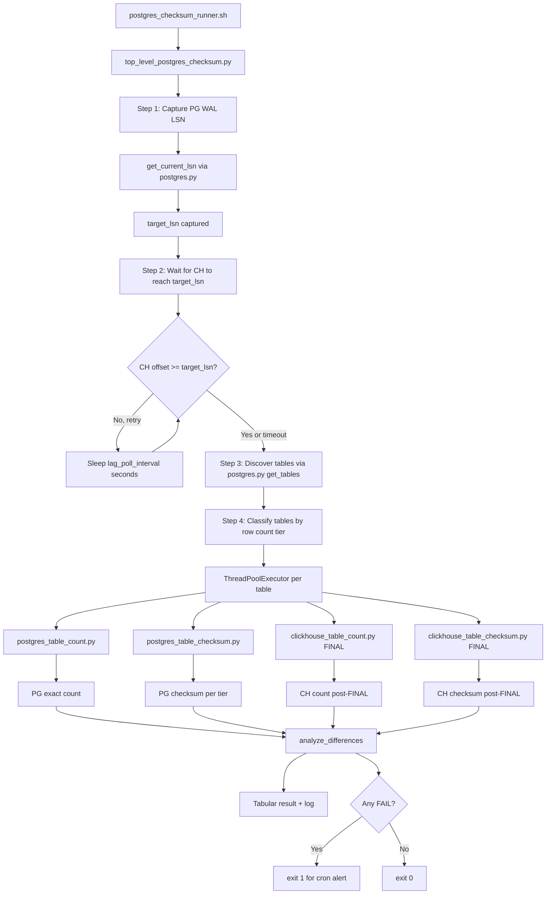
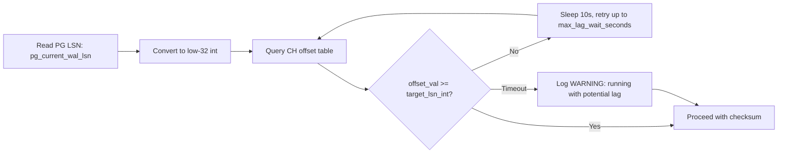
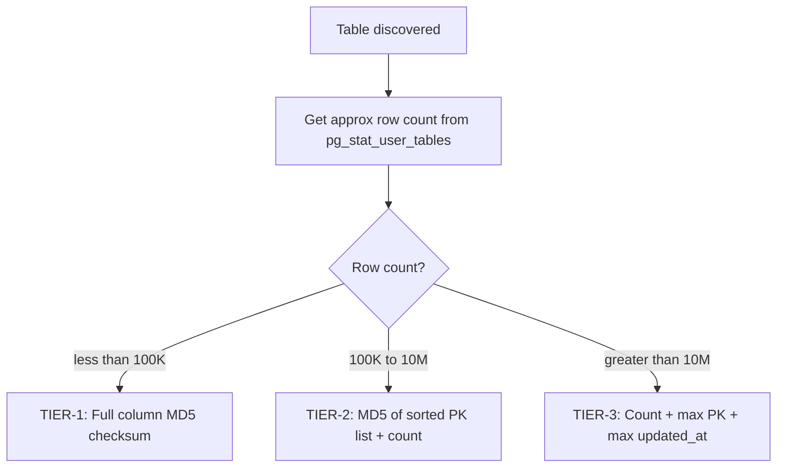

# Plan 12 — PostgreSQL / ClickHouse Periodic Checksum Verification

**Target pipeline:** `awacs-qa` (PostgreSQL on `fpif1-postgresl1`) → `awacs-qa` (ClickHouse on `fpif-dbachl4`)  
**Transport:** Altinity Debezium sink-connector (CDC, ReplacingMergeTree)  
**Plan status:** Draft — for review before implementation

---

## Table of Contents

1. [Overview — Why LSN-Aware Checksums Are Needed](#1-overview)
2. [Architecture — How the Comparison Works](#2-architecture)
3. [New Files to Create](#3-new-files-to-create)
4. [Checksum Algorithm Tiers by Table Size](#4-checksum-algorithm-tiers)
5. [ClickHouse Query Patterns with FINAL](#5-clickhouse-query-patterns)
6. [PostgreSQL Query Patterns for Stable Reads](#6-postgresql-query-patterns)
7. [Replication Lag Detection](#7-replication-lag-detection)
8. [Output Format and Result Reporting](#8-output-format)
9. [Cron Setup on fpif-dbachl4](#9-cron-setup)
10. [Alert Thresholds and Failure Modes](#10-alert-thresholds)
11. [YAML Configuration File Schema](#11-yaml-configuration)
12. [Implementation Checklist](#12-implementation-checklist)

---

## 1. Overview

### The Core Problem

A CDC replication pipeline is **eventually consistent**, not instantaneously consistent.  At any given moment ClickHouse may be:

- **Behind** PostgreSQL by N seconds of WAL lag (replication lag)
- **Ahead** temporarily for a row that was already in the Kafka buffer but not yet acknowledged
- **Divergent** due to a schema mismatch, dropped message, or Debezium bug

A naive `SELECT COUNT(*)` comparison therefore always produces false positives — ClickHouse `FINAL` deduplication is expensive, and if run while rows are still being applied the window shifts under your feet.

### Why LSN-Aware Checksums

The correct approach is:

1. **Capture** the current PostgreSQL WAL LSN before any checksum query runs — call it `target_lsn`.
2. **Wait** until ClickHouse's Debezium offset for this connector reaches `target_lsn` (or time out after a configurable lag tolerance).
3. **Only then** run the count/checksum queries.  At that moment PG and CH should represent the same logical point in time.

This mirrors the pattern already used in [`postgres_dumper.py`](../../sink-connector/python/db_dump/postgres_dumper.py) and [`postgres.py`](../../sink-connector/python/db/postgres.py) — both of which capture the LSN via `get_current_lsn()` before snapshot operations.

### Key insight from the existing codebase

[`get_current_lsn()`](../../sink-connector/python/db/postgres.py:356) already returns **both** the full LSN string (e.g. `0/1A3F000`) and the Debezium-compatible low-32-bit integer — the same integer stored in the ClickHouse offset table `altinity_sink_connector.replica_source_info_*`.  The checksum runner reuses this function directly.

---

## 2. Architecture

### Data Flow



### LSN Wait Logic



### Three-tier Checksum Decision



---

## 3. New Files to Create

All new files mirror the MySQL/ClickHouse pattern exactly.  The existing [`mysql_table_checksum.py`](../../sink-connector/python/db_compare/mysql_table_checksum.py), [`clickhouse_table_checksum.py`](../../sink-connector/python/db_compare/clickhouse_table_checksum.py), and [`top_level_table_checksum.py`](../../sink-connector/python/db_compare/top_level_table_checksum.py) are the direct templates.

### 3.1 `sink-connector/python/db_compare/postgres_table_checksum.py`

**Role:** Compute a row-hash checksum for a single PostgreSQL table (Tier-1 and Tier-2 only).  
**Pattern mirrors:** [`mysql_table_checksum.py`](../../sink-connector/python/db_compare/mysql_table_checksum.py)

**Key differences from MySQL version:**

| Aspect | MySQL version | PostgreSQL version |
|--------|--------------|-------------------|
| Connection helper | `get_mysql_connection()` from `db.mysql` | `get_postgres_connection()` from `db.postgres` |
| Column introspection | `information_schema.columns` with `column_type` | `information_schema.columns` with `data_type` + `udt_name` |
| Nullable handling | `ifnull(col,'')` | `coalesce(col::text,'')` |
| MD5 function | `md5(concat_ws('#', ...))` | `md5(concat_ws('#', ...::text, ...))` |
| Binary columns | `lower(hex(...))` or `to_base64(...)` | `encode(col, 'hex')` |
| Timestamp formatting | Various `cast(... as char)` tricks | `to_char(col, 'YYYY-MM-DD HH24:MI:SS.US')` |
| User variables for rolling sum | `@md5sum := ...` MySQL session vars | Python-side: accumulate `(cnt, a, b, c, d)` tuple over chunks |
| Row-level hash | `md5(concat_ws('#', cols))` | `md5(col1::text \|\| '#' \|\| col2::text \|\| ...)` |
| Thread-safe connections | `get_mysql_connection()` per thread | `get_postgres_connection()` per thread (psycopg2 not thread-safe) |

**Module-level arguments (argparse):**

```
--pg_host            PostgreSQL host (required)
--pg_port            PostgreSQL port (default: 5432)
--pg_database        PostgreSQL database (required)
--pg_schema          PostgreSQL schema (default: public)
--pg_user            PostgreSQL user
--pg_password        PostgreSQL password (discouraged; use ~/.pgpass)
--pgpass_file        Path to .pgpass file (default: ~/.pgpass)
--tables_regex       Table name regex (required)
--where              Additional WHERE clause
--ignore_tables_regex  Tables to skip
--no_wc              Treat --tables_regex as literal table name
--exclude_columns    Columns to exclude from checksum (default: none for PG side)
--threads_per_table  Parallel chunk threads per table (default: 1)
--chunk_size         PK chunk size (default: 50000)
--threads            Parallel tables (default: 1)
--include_floating_point_columns  (default: False)
--include_json_columns  (default: True)
--debug_output       Write raw hash rows to out.<table>.pg.txt
--debug_limit        Limit rows in debug output
--debug              Enable DEBUG logging
```

**Core checksum SQL (Tier-1, full column MD5):**

```sql
-- PostgreSQL Tier-1 checksum for table <schema>.<table>
-- Uses the same 4-bucket accumulation as the MySQL version:
--   split the 32-hex MD5 into four 8-hex chunks,
--   interpret each as a signed int64, sum across all rows.
-- The final Python hashlib.md5() of "cnt#a#b#c#d#" is the table checksum.

SELECT
    count(*)                                                AS cnt,
    sum(('x' || substring(row_hash, 1, 8))::bit(32)::int8) AS a,
    sum(('x' || substring(row_hash, 9, 8))::bit(32)::int8) AS b,
    sum(('x' || substring(row_hash,17, 8))::bit(32)::int8) AS c,
    sum(('x' || substring(row_hash,25, 8))::bit(32)::int8) AS d
FROM (
    SELECT md5(
        concat_ws('#',
            -- each column cast to text; NULLs become '' via coalesce
            coalesce("col1"::text, ''),
            coalesce("col2"::text, ''),
            -- ... (all non-excluded columns)
            -- NULL indicator bitmap appended:
            (CASE WHEN "col1" IS NULL THEN '1' ELSE '0' END) ||
            (CASE WHEN "col2" IS NULL THEN '1' ELSE '0' END)
        )
    ) AS row_hash
    FROM "<schema>"."<table>"
    WHERE 1=1
      AND <pk_col> BETWEEN <min_pk> AND <max_pk>   -- chunk boundary
) t
```

**Python accumulation (mirrors MySQL rolling-sum pattern):**

```python
# Each chunk returns (cnt, a, b, c, d)
# Aggregate across chunks:
to_add = (0, 0, 0, 0, 0)
for r in chunk_results:
    to_add = (to_add[0]+r[0], to_add[1]+r[1],
              to_add[2]+r[2], to_add[3]+r[3], to_add[4]+r[4])
md5_input = '#'.join(str(x) for x in to_add) + '#'
table_checksum = hashlib.md5(md5_input.encode()).hexdigest()
```

**Column type handling for PostgreSQL:**

```python
def build_pg_select_expression(col_name, pg_type, is_nullable, udt_name):
    """
    Returns a SQL fragment for one column that produces a stable text value
    comparable with the ClickHouse side.
    """
    q = f'"{col_name}"'
    expr = ""

    # Boolean: cast to 0/1 to match CH UInt8
    if pg_type in ('boolean', 'bool'):
        expr = f"CASE WHEN {q} THEN '1' ELSE '0' END"

    # Timestamps: normalize to microsecond precision string
    elif 'timestamp' in pg_type:
        expr = f"to_char({q}, 'YYYY-MM-DD HH24:MI:SS.US')"

    # Date: normalize to YYYY-MM-DD
    elif pg_type == 'date':
        expr = f"to_char({q}, 'YYYY-MM-DD')"

    # Time types: normalize
    elif 'time' in pg_type:
        expr = f"to_char({q}, 'HH24:MI:SS.US')"

    # Bytea: hex-encode to match CH String representation
    elif pg_type == 'bytea':
        expr = f"encode({q}, 'hex')"

    # Numeric/decimal: ensure trailing zeros match CH toDecimalString()
    elif pg_type in ('numeric', 'decimal'):
        # Use to_char with fixed scale from information_schema.numeric_scale
        expr = f"to_char({q}, 'FM9999999999999999990.999999')"

    # UUID: lower-case string
    elif pg_type == 'uuid':
        expr = f"lower({q}::text)"

    # JSON/JSONB: excluded by default (non-deterministic ordering)
    elif pg_type in ('json', 'jsonb'):
        expr = f"{q}::text"    # included only when --include_json_columns

    # Arrays: text representation
    elif udt_name.startswith('_') or pg_type.endswith('[]'):
        expr = f"array_to_string({q}, ',')"

    # Everything else: simple cast
    else:
        expr = f"{q}::text"

    # NULL handling: coalesce to empty string, then append null indicator
    if is_nullable:
        return f"coalesce({expr}, '')"
    return expr
```

---

### 3.2 `sink-connector/python/db_compare/postgres_table_count.py`

**Role:** Exact `COUNT(*)` for a PostgreSQL table (always run, regardless of tier).  
**Pattern mirrors:** [`mysql_table_count.py`](../../sink-connector/python/db_compare/mysql_table_count.py)

**Arguments (subset):**

```
--pg_host / --pg_port / --pg_database / --pg_schema / --pg_user / --pg_password / --pgpass_file
--tables_regex / --no_wc / --ignore_tables_regex / --where
--threads
--debug
```

**Core query:**

```sql
-- PostgreSQL exact count
SELECT count(*) AS cnt
FROM "<pg_schema>"."<table>"
WHERE 1=1
  -- optional: AND <where_clause>
```

**Output format (mirrors MySQL version):**

```
2026-03-01 07:00:01 - INFO - MainThread - Count for table awacs-qa.public.alerts_alertevent = 71234567
```

---

### 3.3 `sink-connector/python/db_compare/top_level_postgres_checksum.py`

**Role:** Orchestrator that drives the full PG→CH comparison for all tables.  
**Pattern mirrors:** [`top_level_table_checksum.py`](../../sink-connector/python/db_compare/top_level_table_checksum.py)

**Differences from MySQL orchestrator:**

| Aspect | MySQL orchestrator | PostgreSQL orchestrator |
|--------|-------------------|------------------------|
| Source connection | `get_mysql_connection()` | `get_postgres_connection()` |
| Table discovery | `get_tables_from_regex()` via information_schema | `get_tables()` from `db.postgres` |
| PK discovery | `mysql_pk_columns()` | `get_table_pk()` from `db.postgres` |
| Row count estimate | `get_min_max_pk_value()` | `get_table_row_count()` from `db.postgres` (pg_stat_user_tables) |
| LSN capture | N/A | `get_current_lsn()` → `target_lsn` |
| Lag wait | N/A | Poll CH offset table until `offset_val >= target_lsn` |
| Table locking | `FLUSH TABLE WITH READ LOCK` (optional) | Not supported; use LSN-wait instead |
| Config file source key | `source.mysql` | `source.postgres` |
| Checksum command builder | `get_mysql_checksum_command()` | `get_postgres_checksum_command()` |

**YAML config file format:**

```yaml
source:
  postgres:
    host: fpif1-postgresl1.host
    port: 5432
    database: awacs-qa
    schema: public
    pgpass_file: ~/.pgpass          # optional, default ~/.pgpass
    table_include_list: "awacs-qa.public.alerts_alertevent,awacs-qa.public.users"  # optional CSV
    ignored_columns:
      - awacs-qa.public.alerts_alertevent.some_noisy_column
    tables:                         # per-table where overrides
      - awacs-qa.public.alerts_alertevent:
          where: "created_at > '2024-01-01'"

replicas:
  - clickhouse:
      host: fpif-dbachl4.host
      port: 9000
      database: awacs_qa            # CH database name (underscore, not dash)
      config_file: ./clickhouse-client.xml
      offset_table: altinity_sink_connector.replica_source_info_awacs_qa_dev
      connector_name: sink-connector-awacs-qa-sink-dev

checksum:
  lag_tolerance_seconds: 300       # max seconds to wait for CH to catch up
  lag_poll_interval_seconds: 10    # how often to poll the offset table
  tier1_max_rows: 100000           # full MD5 threshold
  tier2_max_rows: 10000000         # sorted-PK MD5 threshold (>10M → Tier-3)
  chunk_size: 50000                # PK range chunk size for Tier-1/2
  threads_per_table: 2             # parallel chunks per table
  threads: 4                       # parallel tables
  exclude_ch_columns:              # always excluded on CH side
    - _version
    - is_deleted
    - _is_deleted
  alert_count_delta_pct: 0.01      # alert if |PG_cnt - CH_cnt| / PG_cnt > 1%
  log_file: /var/log/pg_ch_checksum/awacs_qa.log
```

**LSN wait implementation:**

```python
def wait_for_ch_lsn(ch_conn, offset_table, target_lsn_int, connector_name,
                    max_wait_seconds=300, poll_interval=10):
    """
    Poll the ClickHouse offset table until the stored LSN integer
    is >= target_lsn_int.  Returns True if caught up, False on timeout.

    The offset table schema (from postgres_dumper.py pattern):
        altinity_sink_connector.replica_source_info_<db>
    Relevant columns: offset_key (String), offset_val (Int64)

    Debezium stores the low-32-bit half of the WAL LSN in offset_val.
    See get_current_lsn() in db/postgres.py for the exact encoding.
    """
    deadline = time.time() + max_wait_seconds
    while time.time() < deadline:
        sql = f"""
            SELECT toInt64(offset_val) AS lsn
            FROM {offset_table}
            WHERE offset_key LIKE '%{connector_name}%'
            ORDER BY id DESC
            LIMIT 1
        """
        (rows, cnt) = execute_sql(ch_conn, sql)
        if cnt > 0:
            ch_lsn = rows[0][0]
            lag = target_lsn_int - ch_lsn
            if ch_lsn >= target_lsn_int:
                logging.info(f"CH caught up: ch_lsn={ch_lsn} >= target={target_lsn_int}")
                return True
            logging.info(
                f"Waiting for CH to catch up: ch_lsn={ch_lsn}, "
                f"target={target_lsn_int}, lag_bytes={lag}"
            )
        time.sleep(poll_interval)
    logging.warning(
        f"Timeout after {max_wait_seconds}s: CH may still be behind. "
        f"Running checksum anyway — results may show false positives."
    )
    return False
```

**Result comparison logic:**

```python
def analyze_differences(pg_result, ch_result, table_name, alert_count_delta_pct):
    """
    Compare PG and CH results for a single table.
    Returns a ChecksumResult dataclass.
    """
    pg_cnt   = pg_result['count']
    ch_cnt   = ch_result['count']
    pg_cksum = pg_result.get('checksum')   # None for Tier-3
    ch_cksum = ch_result.get('checksum')   # None for Tier-3
    pg_max_pk = pg_result.get('max_pk')
    ch_max_pk = ch_result.get('max_pk')
    pg_max_ts = pg_result.get('max_updated_at')
    ch_max_ts = ch_result.get('max_updated_at')

    count_delta = ch_cnt - pg_cnt
    count_delta_pct = abs(count_delta) / pg_cnt if pg_cnt > 0 else 0

    count_ok = (count_delta == 0)
    count_warn = (not count_ok) and (count_delta_pct <= alert_count_delta_pct)
    count_fail = count_delta_pct > alert_count_delta_pct

    checksum_ok = (pg_cksum == ch_cksum) if (pg_cksum and ch_cksum) else None
    max_pk_ok   = (pg_max_pk == ch_max_pk) if (pg_max_pk and ch_max_pk) else None

    return ChecksumResult(
        table=table_name,
        pg_count=pg_cnt,
        ch_count=ch_cnt,
        count_delta=count_delta,
        count_delta_pct=count_delta_pct,
        checksum_match=checksum_ok,
        max_pk_match=max_pk_ok,
        pg_max_pk=pg_max_pk,
        ch_max_pk=ch_max_pk,
        pg_max_ts=pg_max_ts,
        ch_max_ts=ch_max_ts,
        status='PASS' if (count_ok and checksum_ok is not False and max_pk_ok is not False)
               else ('WARN' if count_warn else 'FAIL'),
    )
```

**Orchestrator main flow:**

```python
def run_config(config):
    # 1. Connect to PG
    pg_conn = get_postgres_connection(...)

    # 2. Capture WAL LSN
    (lsn_str, lsn_int) = get_current_lsn(pg_conn)
    logging.info(f"Target LSN: {lsn_str} (int={lsn_int})")

    # 3. Discover tables
    tables = get_tables(pg_conn, pg_schema,
                        include_regex=tables_regex,
                        exclude_regex=exclude_tables_regex)

    # 4. Connect to CH, wait for replication to reach target LSN
    ch_conn = clickhouse_connection(...)
    caught_up = wait_for_ch_lsn(ch_conn, offset_table, lsn_int, connector_name, ...)

    # 5. Get approximate row counts for tier classification
    table_sizes = {t: get_table_row_count(pg_conn, pg_schema, t) for t in tables}

    # 6. Run per-table checksum in thread pool
    with ThreadPoolExecutor(max_workers=threads) as ex:
        futures = {ex.submit(checksum_table, t, table_sizes[t], ...): t
                   for t in tables}
        for future in as_completed(futures):
            result = future.result()
            print_result_row(result)

    # 7. Print summary table
    print_summary(all_results)

    # 8. Exit non-zero if any FAIL
    if any(r.status == 'FAIL' for r in all_results):
        sys.exit(1)
    sys.exit(0)
```

---

### 3.4 `sink-connector/python/db_compare/postgres_checksum_runner.sh`

**Role:** Cron-compatible shell wrapper that activates the virtualenv, sets credentials, and invokes the orchestrator.

```bash
#!/usr/bin/env bash
# -- ===========================================================================
# -- FileName    : postgres_checksum_runner.sh
# -- Summary     : Cron wrapper for PG→CH periodic checksum on fpif-dbachl4
# -- Usage       : ./postgres_checksum_runner.sh [--config config.yaml] [--debug]
# -- Cron        : 0 * * * * /opt/sink-connector/python/db_compare/postgres_checksum_runner.sh
# -- ===========================================================================
set -euo pipefail

SCRIPT_DIR="$(cd "$(dirname "${BASH_SOURCE[0]}")" && pwd)"
PYTHON_DIR="$(dirname "$SCRIPT_DIR")"
LOG_DIR="/var/log/pg_ch_checksum"
LOG_FILE="${LOG_DIR}/awacs_qa_$(date +%Y%m%d).log"
CONFIG_FILE="${SCRIPT_DIR}/awacs_qa_checksum.yaml"
VENV="${PYTHON_DIR}/.venv"

mkdir -p "$LOG_DIR"

# Activate virtualenv (same one used by postgres_dumper.py)
if [ -f "${VENV}/bin/activate" ]; then
    source "${VENV}/bin/activate"
fi

cd "$PYTHON_DIR"

echo "=== $(date -u +%Y-%m-%dT%H:%M:%SZ) PG→CH checksum starting ===" >> "$LOG_FILE"

python db_compare/top_level_postgres_checksum.py \
    --config_file "$CONFIG_FILE" \
    "$@" \
    2>&1 | tee -a "$LOG_FILE"

EXIT_CODE=${PIPESTATUS[0]}

if [ "$EXIT_CODE" -ne 0 ]; then
    echo "CHECKSUM FAILED (exit=$EXIT_CODE) — see $LOG_FILE" >&2
    # Optional: send alert via email or PagerDuty
    # mail -s "PG→CH checksum FAILED: awacs-qa" ops@example.com < "$LOG_FILE"
fi

echo "=== $(date -u +%Y-%m-%dT%H:%M:%SZ) PG→CH checksum finished (exit=$EXIT_CODE) ===" >> "$LOG_FILE"
exit "$EXIT_CODE"
```

---

## 4. Checksum Algorithm Tiers

### Tier Classification

Row count comes from [`get_table_row_count()`](../../sink-connector/python/db/postgres.py:338) which reads `pg_stat_user_tables.n_live_tup` — a fast approximate count requiring no full scan.

| Tier | Condition | PG Algorithm | CH Algorithm | What It Catches |
|------|-----------|-------------|-------------|-----------------|
| **Tier-1** | `< 100K rows` | Full MD5 of all non-excluded columns, all rows | Full MD5 using `FINAL` + `is_deleted=0` | Any data difference, NULL divergence, type coercion mismatch |
| **Tier-2** | `100K – 10M rows` | MD5 of sorted PK values concatenated + COUNT | MD5 of sorted PK values + COUNT using `FINAL` | Missing rows, duplicate rows, count errors |
| **Tier-3** | `> 10M rows` | COUNT + MAX(pk) + MAX(updated_at if exists) | COUNT + MAX(pk) + MAX(updated_at) using `FINAL` | Count divergence, freshness gap |

All tiers **always** run a COUNT comparison first (cheap and always meaningful).

### Tier-1: Full Column MD5 (< 100K rows)

**PostgreSQL:**

```sql
-- Tier-1 full checksum: compute MD5 of every column for every row
-- Chunk boundaries applied: WHERE pk BETWEEN :min_pk AND :max_pk
SELECT
    count(*) AS cnt,
    sum(('x' || substring(row_hash, 1, 8))::bit(32)::int8) AS a,
    sum(('x' || substring(row_hash, 9, 8))::bit(32)::int8) AS b,
    sum(('x' || substring(row_hash,17, 8))::bit(32)::int8) AS c,
    sum(('x' || substring(row_hash,25, 8))::bit(32)::int8) AS d
FROM (
    SELECT md5(
        concat_ws('#',
            coalesce("id"::text,           ''),
            coalesce("name"::text,         ''),
            coalesce("created_at"::text,   ''),
            coalesce("status"::text,       ''),
            -- NULL indicator: 1 if NULL else 0, per nullable column
            (CASE WHEN "name"       IS NULL THEN '1' ELSE '0' END) ||
            (CASE WHEN "created_at" IS NULL THEN '1' ELSE '0' END) ||
            (CASE WHEN "status"     IS NULL THEN '1' ELSE '0' END)
        )
    ) AS row_hash
    FROM "public"."<table>"
    WHERE "id" BETWEEN :min_pk AND :max_pk
) t
```

**ClickHouse (corresponding Tier-1):**

```sql
-- Tier-1 full checksum on CH side (mirrors clickhouse_table_checksum.py pattern)
-- Uses FINAL to dedup ReplacingMergeTree and excludes is_deleted=1 rows
SELECT
    count(*) AS cnt,
    sum(reinterpretAsInt64(reverse(unhex(substring(hash, 1,  8))))) AS a,
    sum(reinterpretAsInt64(reverse(unhex(substring(hash, 9,  8))))) AS b,
    sum(reinterpretAsInt64(reverse(unhex(substring(hash, 17, 8))))) AS c,
    sum(reinterpretAsInt64(reverse(unhex(substring(hash, 25, 8))))) AS d
FROM (
    SELECT hex(MD5(
        toString("id")        || '#' ||
        coalesce(toString("name"), '')        || '#' ||
        coalesce(toString("created_at"), '')  || '#' ||
        coalesce(toString("status"), '')      || '#' ||
        -- NULL indicator: '1' if null else '0'
        (case when "name"       is null then '1' else '0' end) ||
        (case when "created_at" is null then '1' else '0' end) ||
        (case when "status"     is null then '1' else '0' end)
    )) AS hash
    FROM <ch_database>.<table> FINAL
    WHERE is_deleted = 0
      -- optional: AND _version > 0    (if snapshot rows with _version=0 should be excluded)
) t
SETTINGS do_not_merge_across_partitions_select_final = 1,
         max_memory_usage = 80000000000
```

### Tier-2: PK-List MD5 (100K – 10M rows)

**PostgreSQL:**

```sql
-- Tier-2: MD5 of sorted PK values — detects missing/extra rows quickly
-- Run in pk-range chunks if table is chunked
SELECT
    count(*) AS cnt,
    sum(('x' || substring(pk_hash, 1, 8))::bit(32)::int8) AS a,
    sum(('x' || substring(pk_hash, 9, 8))::bit(32)::int8) AS b,
    sum(('x' || substring(pk_hash,17, 8))::bit(32)::int8) AS c,
    sum(('x' || substring(pk_hash,25, 8))::bit(32)::int8) AS d
FROM (
    SELECT md5("id"::text) AS pk_hash
    FROM "public"."<table>"
    WHERE "id" BETWEEN :min_pk AND :max_pk
    ORDER BY "id"
) t
```

**ClickHouse:**

```sql
-- Tier-2 on CH side
SELECT
    count(*) AS cnt,
    sum(reinterpretAsInt64(reverse(unhex(substring(hash, 1,  8))))) AS a,
    sum(reinterpretAsInt64(reverse(unhex(substring(hash, 9,  8))))) AS b,
    sum(reinterpretAsInt64(reverse(unhex(substring(hash, 17, 8))))) AS c,
    sum(reinterpretAsInt64(reverse(unhex(substring(hash, 25, 8))))) AS d
FROM (
    SELECT hex(MD5(toString("id"))) AS hash
    FROM <ch_database>.<table> FINAL
    WHERE is_deleted = 0
    ORDER BY "id"
) t
SETTINGS do_not_merge_across_partitions_select_final = 1
```

### Tier-3: Count + Max Metrics (> 10M rows)

**PostgreSQL:**

```sql
-- Tier-3: Count + freshness indicators
-- Does NOT compute a full checksum — too expensive for 71M row tables
SELECT
    count(*)      AS cnt,
    max("id")     AS max_pk,
    max("updated_at") AS max_updated_at   -- only if column exists
FROM "public"."<table>"
-- No chunk needed: these aggregates are index-efficient
```

**ClickHouse:**

```sql
-- Tier-3 on CH side
SELECT
    count(*)          AS cnt,
    max("id")         AS max_pk,
    max("updated_at") AS max_updated_at
FROM <ch_database>.<table> FINAL
WHERE is_deleted = 0
SETTINGS do_not_merge_across_partitions_select_final = 1
```

**Note on `alerts_alertevent` (71M rows):** This table falls into Tier-3.  
The plan should monitor:
- Count delta (most sensitive signal)
- `max(id)` alignment (catches truncation at the tail)
- `max(updated_at)` gap (catches stalled replication lag)

---

## 5. ClickHouse Query Patterns

### Always Use `FINAL` for ReplacingMergeTree

Every CH query in this toolset must use `FINAL` to dedup the CDC change stream.  Without `FINAL`, a single row updated 10 times appears 10 times in the result (or 11 if the snapshot row is also present).

```sql
-- CORRECT: deduplicated read
SELECT count(*) FROM awacs_qa.alerts_alertevent FINAL WHERE is_deleted = 0;

-- WRONG: counts raw CDC events, not logical rows
SELECT count(*) FROM awacs_qa.alerts_alertevent WHERE is_deleted = 0;
```

### Performance Setting for FINAL

The key ClickHouse setting for `FINAL` on partitioned tables is:

```sql
SETTINGS do_not_merge_across_partitions_select_final = 1
```

This prevents cross-partition merging during `FINAL` which can exhaust memory.  It is already used in [`clickhouse_table_checksum.py`](../../sink-connector/python/db_compare/clickhouse_table_checksum.py:251) and [`clickhouse_table_count.py`](../../sink-connector/python/db_compare/clickhouse_table_count.py:73).

### Column Exclusions on CH Side

The CH-side queries always exclude these CDC-internal columns from checksum computation (not from count):

```python
DEFAULT_CH_EXCLUDE_COLUMNS = ['_version', 'is_deleted', '_is_deleted', '__is_deleted']
```

This mirrors the default in [`clickhouse_table_checksum.py`](../../sink-connector/python/db_compare/clickhouse_table_checksum.py:354):
```
--exclude_columns _sign,_version,is_deleted,_is_deleted
```

### Detecting Soft-Deleted Rows

ClickHouse `ReplacingMergeTree` with `is_deleted` semantics:

```sql
-- Count logical (non-deleted) rows that should exist in PG:
SELECT count(*) FROM awacs_qa.<table> FINAL
WHERE is_deleted = 0
SETTINGS do_not_merge_across_partitions_select_final = 1;

-- Sanity check: rows that WERE deleted in PG should show is_deleted=1 in CH:
SELECT count(*) FROM awacs_qa.<table> FINAL
WHERE is_deleted = 1
SETTINGS do_not_merge_across_partitions_select_final = 1;
```

### Reading the Debezium Offset LSN from CH

```sql
-- Get the most recent LSN that the Debezium connector has processed:
SELECT
    offset_key,
    toInt64(offset_val) AS lsn_int,
    _timestamp
FROM altinity_sink_connector.replica_source_info_awacs_qa_dev
WHERE offset_key LIKE '%sink-connector-awacs-qa-sink-dev%'
ORDER BY _timestamp DESC
LIMIT 1;
```

---

## 6. PostgreSQL Query Patterns for Stable Reads

### Capturing the LSN (reuses existing helper)

```python
# From db/postgres.py — already implemented:
(lsn_str, lsn_int) = get_current_lsn(pg_conn)
# lsn_str  = "0/1A3F000" (full WAL position)
# lsn_int  = 27459584    (low-32 int — matches Debezium offset_val encoding)
```

The full SQL behind `get_current_lsn()`:

```sql
SELECT pg_current_wal_lsn()::text AS lsn;
-- Returns e.g. "0/1A3F000"
-- Python splits on "/" and takes the right part as hex:
-- int("1A3F000", 16) = 27459584
```

### Discovering Tables for Comparison

```python
# Reuse get_tables() from db/postgres.py:
tables = get_tables(
    conn,
    pg_schema='public',
    include_regex=args.tables_regex,   # e.g. '.' for all
    exclude_regex=args.exclude_regex,  # e.g. 'django_migrations|django_session'
)
```

Underlying SQL:

```sql
SELECT table_name
FROM information_schema.tables
WHERE table_schema = 'public'
  AND table_type = 'BASE TABLE'
  AND table_name ~ '<include_regex>'
  AND table_name !~ '<exclude_regex>'
ORDER BY table_name;
```

### Discovering Primary Keys

```python
# Reuse get_table_pk() from db/postgres.py:
pk_cols = get_table_pk(conn, pg_schema='public', table_name='alerts_alertevent')
# Returns e.g. ['id']
```

### Approximate Row Count for Tier Classification

```python
# Reuse get_table_row_count() from db/postgres.py:
approx_rows = get_table_row_count(conn, pg_schema='public', table_name='alerts_alertevent')
# Returns n_live_tup from pg_stat_user_tables — no full scan needed
```

If `n_live_tup` returns `-1` (stats not available, e.g. after a fresh VACUUM), fall back to `SELECT COUNT(*)`.

### Chunked PK Range for Tier-1/2

```sql
-- Step 1: Get min/max PK for chunk boundaries
SELECT min("id") AS min_pk, max("id") AS max_pk
FROM "public"."<table>";

-- Step 2: Each chunk covers chunk_size PK values:
-- chunk 0: WHERE "id" BETWEEN min_pk AND min_pk + chunk_size - 1
-- chunk 1: WHERE "id" BETWEEN min_pk + chunk_size AND min_pk + 2*chunk_size - 1
-- etc.
```

For composite PKs, chunking degrades to full-table (no WHERE chunk boundary); the query runs as a single chunk.

### Stable Read Snapshot in PostgreSQL

PostgreSQL does not need an explicit `SET TRANSACTION SNAPSHOT` for checksum purposes — a regular `SELECT` is already consistent within its own transaction (MVCC).  Since we are already using LSN-wait to synchronize with ClickHouse before running, no additional locking is needed.

If stricter consistency is required, wrap the query in:

```sql
BEGIN TRANSACTION ISOLATION LEVEL REPEATABLE READ;
SET TRANSACTION SNAPSHOT '<snapshot_id>';
-- run checksum query
COMMIT;
```

But this is not needed for the initial implementation.

---

## 7. Replication Lag Detection

### Two Signals to Monitor

**Signal 1: LSN numeric distance**

```python
# After wait_for_ch_lsn() completes:
pg_lsn_int = lsn_int          # captured at start of checksum run
ch_lsn_int = ch_lsn_from_offset_table

lsn_lag_bytes = pg_lsn_int - ch_lsn_int
# LSN distance in WAL bytes — not directly translatable to time,
# but a good proxy: if > 100MB, replication is significantly behind
```

**Signal 2: Wall-clock replication lag**

```sql
-- PostgreSQL: get replication slot lag for the Debezium slot
SELECT
    slot_name,
    pg_wal_lsn_diff(pg_current_wal_lsn(), confirmed_flush_lsn) AS lag_bytes,
    now() - pg_last_xact_replay_timestamp() AS lag_seconds
FROM pg_replication_slots
WHERE slot_name LIKE 'debezium%'
   OR slot_name LIKE 'altinity%';
```

### Lag Reporting in Output

Each row in the tabular output includes a `lag_seconds` column derived from comparing the `max(updated_at)` delta between PG and CH (where the column exists):

```python
# For tables with an updated_at column:
lag_seconds = (pg_max_ts - ch_max_ts).total_seconds()
# Negative means CH is ahead (unlikely but possible with in-flight events)
# > 300 seconds → WARNING
# > 3600 seconds → ALERT (if checksum also fails)
```

---

## 8. Output Format

### Console Output (per-table)

Each table prints a single INFO-level log line (matching the MySQL orchestrator format):

```
2026-03-01 07:00:15 - INFO  - MainThread - [alerts_alertevent] TIER=3 PG=71234567 CH=71234567 DELTA=0 MAX_PK=PG:71234999/CH:71234999 UPDATED_AT_LAG=2.3s STATUS=PASS
2026-03-01 07:00:16 - INFO  - MainThread - [users]             TIER=1 PG=12450    CH=12450    DELTA=0 CHECKSUM=PG:a3f8b2c1d4e5/CH:a3f8b2c1d4e5 STATUS=PASS
2026-03-01 07:00:17 - WARNING - MainThread - [webhook_events]  TIER=2 PG=543210   CH=543196   DELTA=-14 DELTA_PCT=0.003% CHECKSUM=MISMATCH STATUS=FAIL
```

### Summary Table (printed at end of run)

```
=== PostgreSQL → ClickHouse Checksum Summary (awacs-qa) ===
Target LSN: 0/1A3F000  CH lag at start: 0 bytes (fully caught up)
Run time  : 2026-03-01T07:00:00Z → 2026-03-01T07:03:45Z (225s)

Table                          Tier  PG Count    CH Count    Delta   Delta%   Checksum  Status
------------------------------ ----  ----------  ----------  ------  -------  --------  ------
alerts_alertevent              3     71,234,567  71,234,567       0   0.000%  N/A       PASS
alerts_incidentevent           3      8,123,456   8,123,456       0   0.000%  N/A       PASS
users                          1         12,450      12,450       0   0.000%  MATCH     PASS
webhook_events                 2        543,210     543,196     -14   0.003%  MISMATCH  FAIL
django_migrations              1             87          87       0   0.000%  MATCH     PASS

RESULT: FAIL — 1 of 5 tables have mismatches
Exit code: 1
```

### Log File Rotation

Logs are written to `/var/log/pg_ch_checksum/awacs_qa_<YYYYMMDD>.log`.  Recommend 30-day retention via `logrotate`:

```
/var/log/pg_ch_checksum/*.log {
    daily
    rotate 30
    compress
    missingok
    notifempty
}
```

---

## 9. Cron Setup on fpif-dbachl4

### Recommended Cron Schedule

```crontab
# PostgreSQL → ClickHouse periodic checksum verification
# Run hourly, at minute 5 past the hour (avoids top-of-hour contention)
5 * * * * /opt/sink-connector/python/db_compare/postgres_checksum_runner.sh \
    --config /opt/sink-connector/python/db_compare/awacs_qa_checksum.yaml \
    >> /var/log/pg_ch_checksum/cron.log 2>&1

# Optional: daily full summary with debug output (runs at 02:05 UTC)
5 2 * * * /opt/sink-connector/python/db_compare/postgres_checksum_runner.sh \
    --config /opt/sink-connector/python/db_compare/awacs_qa_checksum.yaml \
    --debug \
    >> /var/log/pg_ch_checksum/daily_$(date +\%Y\%m\%d).log 2>&1
```

### Installation Steps on fpif-dbachl4

```bash
# 1. Ensure the Python virtualenv has all required packages
cd /opt/sink-connector/python
pip install psycopg2-binary clickhouse-driver pyyaml

# 2. Create log directory
sudo mkdir -p /var/log/pg_ch_checksum
sudo chown $(whoami) /var/log/pg_ch_checksum

# 3. Create the YAML config file
cp sink-connector/python/db_compare/awacs_qa_checksum.yaml.example \
   /opt/sink-connector/python/db_compare/awacs_qa_checksum.yaml
# Edit with actual hostnames, credentials path, connector_name

# 4. Create ~/.pgpass for passwordless PG auth (mode 600 required)
echo "fpif1-postgresl1.host:5432:awacs-qa:replicator:<password>" \
    >> ~/.pgpass
chmod 600 ~/.pgpass

# 5. Create clickhouse-client.xml for passwordless CH auth
cat > /opt/sink-connector/python/db_compare/clickhouse-client.xml << 'EOF'
<config>
    <user>default</user>
    <password>REDACTED</password>
</config>
EOF

# 6. Make the runner script executable
chmod +x /opt/sink-connector/python/db_compare/postgres_checksum_runner.sh

# 7. Test a dry run
cd /opt/sink-connector/python
python db_compare/top_level_postgres_checksum.py \
    --config_file db_compare/awacs_qa_checksum.yaml \
    --tables_regex '^django_migrations$' \
    --debug

# 8. Install the crontab
crontab -e
# Paste the cron lines from above
```

### Virtualenv Path

The script expects the virtualenv at `../python/.venv` relative to `db_compare/`.  If the virtualenv is elsewhere, update the `VENV` variable in [`postgres_checksum_runner.sh`](#34-sink-connectorphythondb_comparepostgres_checksum_runnersh).

---

## 10. Alert Thresholds and Failure Modes

### Threshold Table

| Metric | WARNING | FAIL (exit 1) |
|--------|---------|---------------|
| Count delta % | 0 < delta% ≤ 0.01% | delta% > 0.01% |
| Count delta absolute | 0 < delta ≤ 100 | delta > 100 |
| Checksum mismatch | — | Any mismatch (Tier-1 or Tier-2) |
| Max PK mismatch | — | CH max_pk < PG max_pk (rows missing at tail) |
| Max updated_at lag | 5 min < lag ≤ 30 min | lag > 30 min AND count delta > 0 |
| LSN wait timeout | Logged as WARNING | Does NOT fail (run continues with caveat) |

**Note:** The script exits `1` on any `FAIL`.  `WARNING` is logged but exits `0` (so cron does not alert for minor replication transients).  The exit code can be adjusted in the YAML config.

### Common Failure Modes and Remediation

| Failure | Cause | Remediation |
|---------|-------|-------------|
| CH count < PG count | Rows lost in Kafka/Debezium | Check Kafka dead-letter queue; replay topic |
| CH count > PG count after FINAL | Stale unmerged parts | Run `OPTIMIZE TABLE <t> FINAL` on CH |
| Checksum mismatch, count matches | Type coercion bug or NULL handling | Run `--debug_output` to compare raw rows |
| LSN wait timeout | CH severely behind | Check Debezium connector health; increase `lag_tolerance_seconds` |
| max_pk CH < PG | Tail rows not replicated yet | Wait and rerun; check connector offset |
| All tables FAIL after restart | Offset table stale | Verify offset_table connector_name matches config |

---

## 11. YAML Configuration File Schema

Full annotated example (`awacs_qa_checksum.yaml`):

```yaml
# PostgreSQL → ClickHouse checksum configuration
# Used by top_level_postgres_checksum.py
# Mirrors the format of top_level_table_checksum.py but with postgres source

source:
  postgres:
    host: fpif1-postgresl1.host
    port: 5432
    database: awacs-qa
    schema: public
    pgpass_file: ~/.pgpass             # credentials resolved from .pgpass
    # Optional table filter (CSV of "database.schema.table" regex patterns):
    table_include_list: ""             # empty = all tables
    # Columns to globally ignore in checksum (not in count):
    ignored_columns: []
    # Per-table where overrides:
    tables: []

replicas:
  - clickhouse:
      host: fpif-dbachl4.host
      port: 9000
      database: awacs_qa
      config_file: ./clickhouse-client.xml
      secure: false
      # Debezium offset table to poll for LSN catch-up:
      offset_table: altinity_sink_connector.replica_source_info_awacs_qa_dev
      # Must match "name" in the Java connector's config.yml exactly:
      connector_name: sink-connector-awacs-qa-sink-dev
      # Optional: override CH database per source database
      # database_override_map: "awacs-qa:awacs_qa"

checksum:
  # LSN wait settings:
  lag_tolerance_seconds: 300         # give up waiting after 5 minutes
  lag_poll_interval_seconds: 10      # poll CH offset every 10s
  # Table size tier thresholds:
  tier1_max_rows: 100000             # < 100K → full column MD5
  tier2_max_rows: 10000000           # 100K–10M → PK-list MD5
                                     # > 10M → count + max metrics only
  # Chunking for Tier-1/2:
  chunk_size: 50000                  # PK range per chunk
  threads_per_table: 2               # parallel chunks per table
  threads: 4                         # parallel tables
  # Columns always excluded from CH checksum:
  exclude_ch_columns:
    - _version
    - is_deleted
    - _is_deleted
  # Alert thresholds:
  alert_count_delta_pct: 0.0001      # 0.01% → FAIL
  alert_count_delta_abs: 100         # abs delta > 100 → FAIL
  alert_lag_warn_seconds: 300        # 5 min lag → WARN
  alert_lag_fail_seconds: 1800       # 30 min lag + count mismatch → FAIL
  # Logging:
  log_file: /var/log/pg_ch_checksum/awacs_qa.log
  # Type handling:
  include_floating_point_columns: false
  include_json_columns: false        # JSON column ordering is non-deterministic
```

---

## 12. Implementation Checklist

```
[ ] Create plans/postgres/12-postgres-clickhouse-checksum-plan.md  ← THIS FILE
[ ] Create sink-connector/python/db_compare/postgres_table_count.py
[ ] Create sink-connector/python/db_compare/postgres_table_checksum.py
[ ] Create sink-connector/python/db_compare/top_level_postgres_checksum.py
[ ] Create sink-connector/python/db_compare/postgres_checksum_runner.sh
[ ] Create sink-connector/python/db_compare/awacs_qa_checksum.yaml.example
[ ] Unit test: verify Tier-1 PG checksum matches CH checksum for a known small table
[ ] Unit test: verify count comparison works with FINAL
[ ] Unit test: verify LSN wait logic (mock CH offset table)
[ ] Integration test: run against awacs-qa / awacs_qa with tables_regex='^django_migrations$'
[ ] Integration test: run against a medium table (Tier-2)
[ ] Integration test: run against alerts_alertevent (Tier-3, 71M rows)
[ ] Install crontab on fpif-dbachl4
[ ] Set up logrotate for /var/log/pg_ch_checksum/
[ ] Document known column exclusions for awacs-qa (e.g. JSON columns, array columns)
```

---

## Key Design Decisions

### Decision 1: LSN-Wait over Table Locking

PostgreSQL `LOCK TABLE` is destructive to application traffic.  MySQL's `FLUSH TABLE WITH READ LOCK` approach (used in [`top_level_table_checksum.py`](../../sink-connector/python/db_compare/top_level_table_checksum.py:315)) is not available in PostgreSQL without superuser and application disruption.

**Resolution:** Use LSN-wait instead.  Capture the LSN before any query runs, then poll the ClickHouse offset table until the connector catches up.  This gives a consistent comparison window without any locking.

### Decision 2: Four-Bucket MD5 Accumulation

The existing MySQL and ClickHouse checksum scripts both use the "split MD5 into four 8-hex chunks, treat each as int64, sum across rows" technique (from the [Sisense blog post referenced in the script headers](https://www.sisense.com/blog/hashing-tables-to-ensure-consistency-in-postgres-redshift-and-mysql/)).

The PostgreSQL version uses the same technique but with PostgreSQL-native bit casting:

```sql
-- MySQL uses session variables (@a, @b, @c, @d) for rolling accumulation
-- PostgreSQL version does: sum(('x' || substring(hash, pos, 8))::bit(32)::int8)
-- Same mathematical result — accumulate in Python, then final hashlib.md5()
```

This ensures the final `hashlib.md5(cnt#a#b#c#d#)` is directly comparable between both sides.

### Decision 3: Column Type Normalization Strategy

The biggest challenge is making PG and CH produce identical text representations for the same logical value.  Key normalizations:

- **Boolean:** PG `true`/`false` → `'1'`/`'0'`; CH `UInt8` `1`/`0` → `toString()` gives `'1'`/`'0'` ✓
- **Timestamp:** PG `to_char(col, 'YYYY-MM-DD HH24:MI:SS.US')`; CH `toString()` of `DateTime64(6)` gives `'YYYY-MM-DD HH:MM:SS.ffffff'` — these match when microseconds are present
- **Numeric/Decimal:** PG `to_char()` with fixed scale; CH `toDecimalString(x, scale)` — match with same scale
- **UUID:** PG natural lowercase; CH `toString()` — match ✓
- **Bytea:** PG `encode(col, 'hex')`; CH stores as `String` (hex from Debezium) — match ✓

### Decision 4: Tier-3 for Large Tables (> 10M rows)

`alerts_alertevent` has 71M rows.  A full MD5 would require reading all 71M rows from both PG and CH, which at typical read speeds would take 15–30 minutes.  For an hourly cron job this is not acceptable.

**Tier-3** uses `COUNT + max(id) + max(updated_at)` which executes in seconds using index scans.  It catches:
- Row count divergence (most common failure mode)
- Stale replication (max updated_at gap)
- Truncation at the tail (max id mismatch)

It does NOT catch corrupted column values in existing rows.  For deeper validation of large tables, run Tier-2 (PK-list MD5) on a configurable random PK sample using `WHERE id IN (SELECT id FROM t ORDER BY random() LIMIT 10000)`.  This is an optional enhancement for Phase 2.

### Decision 5: `SETTINGS do_not_merge_across_partitions_select_final = 1`

This CH setting is critical for correctness and performance on large partitioned tables.  It is already used in the existing [`clickhouse_table_checksum.py`](../../sink-connector/python/db_compare/clickhouse_table_checksum.py:251) and [`clickhouse_table_count.py`](../../sink-connector/python/db_compare/clickhouse_table_count.py:73).  All CH queries in the new scripts will include it.

---

*Plan written: 2026-03-01. Target implementation: Code mode after plan approval.*
