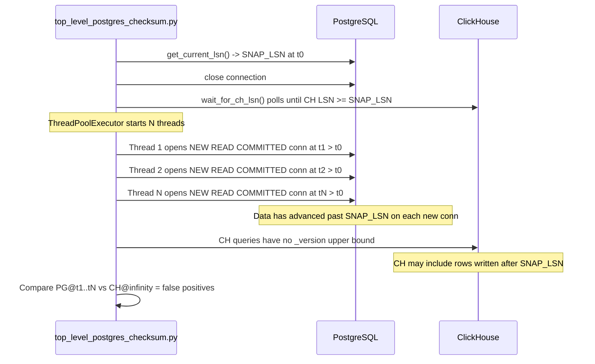
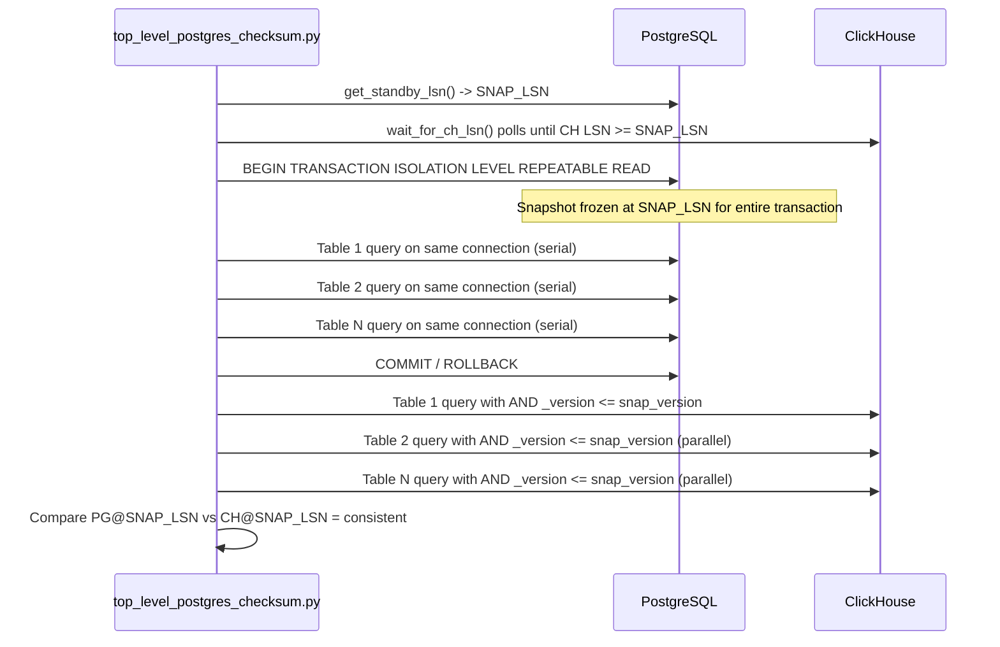

# PostgreSQL → ClickHouse Checksum Improvement Plan

**Document:** `plans/postgres/14-checksum-improvement-plan.md`
**Status:** Design / Architecture
**Scope:** Two major improvement areas — LSN-consistent snapshot checksumming and configurable type-specific checksum handling

---

## Relevant Source Files

| File | Role |
|------|------|
| [`top_level_postgres_checksum.py`](sink-connector/python/db_compare/top_level_postgres_checksum.py) | Orchestrator: LSN capture, table discovery, CH wait, per-table concurrency |
| [`postgres_table_checksum.py`](sink-connector/python/db_compare/postgres_table_checksum.py) | Per-table PG checksum: column expression builder, chunk queries, MD5 accumulation |
| [`postgres_checksum_runner.sh`](sink-connector/python/db_compare/scripts/postgres_checksum_runner.sh) | Cron shell wrapper for the orchestrator |
| [`config_checksum.yml`](sink-connector-lightweight/deployment/awacs-qa/config_checksum.yml) | Deployment config with all tunable parameters |

---

## Current State vs Target State

| Dimension | Current State | Target State |
|-----------|--------------|--------------|
| **PG read isolation** | Fresh `READ COMMITTED` connection opened per-table in separate threads | Single `REPEATABLE READ` transaction for all PG table queries |
| **LSN snapshot point** | `pg_current_wal_lsn()` captured once at t0, then PG connection closed; each per-table thread opens a new connection at a later, advanced WAL position | `pg_last_wal_replay_lsn()` (standby) or `pg_current_wal_lsn()` (primary) captured once; all PG queries run inside the same open transaction at that snapshot |
| **CH version bounding** | No upper bound on `_version`; CH may include rows written after the PG snapshot | `AND _version <= snap_version` added to all CH queries (count, checksum, Tier-3 metrics) |
| **Standby support** | `get_current_lsn()` always calls `pg_current_wal_lsn()` — unavailable on hot standbys | Falls back to `pg_last_wal_replay_lsn()` automatically; new `get_standby_lsn()` function |
| **LSN encoding** | `wait_for_ch_lsn()` compares the Debezium low-32-bit LSN integer against `pg_current_wal_lsn()` full 64-bit integer — these are different number spaces | Audited and configured via `lsn_encoding: full64\|low32`; comparison uses the correct integer space |
| **Float columns** | Always skipped (`include_floating_point_columns: false`) | Configurable: `quantize` (default), `skip`, or `epsilon_separate` |
| **JSON/JSONB columns** | Always skipped (`include_json_columns: false`) | Configurable: `canonical_compare` (default) or `skip` |
| **Bytea columns** | Always skipped (Debezium Base64 vs. dump hex mismatch) | Configurable: `raw_bytes_md5` (default), `hex_normalize`, or `skip`; ingestion path fix via Debezium `binary.handling.mode: hex` |
| **Range type columns** | Always skipped (Debezium JSON struct vs. PG bracket notation) | Configurable after ingestion decomposition; recommend decomposing into scalar columns at ingest |
| **PG parallelism** | Tables run in parallel threads, each opening its own connection | PG table queries serialized on one connection inside one transaction; CH queries still parallel |

---

## Part 1: LSN-Consistent Snapshot Checksumming

### 1.1 Problem Statement

The current flow in [`run_config()`](sink-connector/python/db_compare/top_level_postgres_checksum.py:795):

1. Opens a PG connection, calls [`get_current_lsn()`](sink-connector/python/db_compare/top_level_postgres_checksum.py:867) to capture `SNAP_LSN` (t0).
2. **Closes that connection immediately.**
3. Discovers tables, then passes PG credentials to `ThreadPoolExecutor`.
4. Each thread in [`compare_table()`](sink-connector/python/db_compare/top_level_postgres_checksum.py:474) opens a **new** `READ COMMITTED` connection — by which time PG has advanced beyond `SNAP_LSN`.
5. [`wait_for_ch_lsn()`](sink-connector/python/db_compare/top_level_postgres_checksum.py:127) polls the CH offset table until CH LSN ≥ target, then CH is queried with no upper `_version` bound.

**Result:** PG and CH never read from the same WAL position. False-positive mismatches occur whenever active writes are happening.

### 1.2 Design: PG Side — Single `REPEATABLE READ` Transaction

Open **one** PG connection before table discovery and start a `REPEATABLE READ` transaction. Keep this connection open for the entire checksum run. All per-table PG queries execute serially on this single connection.

**Why serial?** PostgreSQL `pg_export_snapshot()` is not available on hot standbys. To guarantee all tables are read from the same snapshot on a standby, all queries must run within the same open transaction on the same connection. CH queries are not bound by this and can still run in parallel.

**Execution order:**

```
(a) Read SNAP_LSN (pg_last_wal_replay_lsn on standby, pg_current_wal_lsn on primary)
(b) Poll CH offset table until CH LSN >= SNAP_LSN
(c) BEGIN TRANSACTION ISOLATION LEVEL REPEATABLE READ  [on single PG connection]
(d) Run all PG table queries serially on that connection
(e) Run CH queries in parallel with AND _version <= snap_version
(f) Compare results and report
```

### 1.3 Design: CH Side — `_version` Upper Bound

Add `AND _version <= snap_version` to every CH query:

- [`get_ch_count()`](sink-connector/python/db_compare/top_level_postgres_checksum.py:235) — count query
- [`get_ch_checksum()`](sink-connector/python/db_compare/top_level_postgres_checksum.py:367) — Tier-1 and Tier-2 checksum queries
- [`get_ch_tier3_metrics()`](sink-connector/python/db_compare/top_level_postgres_checksum.py:255) — Tier-3 count/max metrics

`snap_version` is the 64-bit integer derived from `SNAP_LSN`. When `snap_version` is `None` (feature disabled or LSN encoding not yet audited), the clause is omitted and the current behavior is preserved — making this change fully backward-compatible.

### 1.4 Design: Standby LSN Source

A new function `get_standby_lsn()` is needed. It should:

1. Try `SELECT pg_last_wal_replay_lsn()` — returns non-NULL on a hot standby.
2. Fall back to `SELECT pg_current_wal_lsn()` — available on a primary.
3. Parse the PG LSN string (format `XXXXXXXX/YYYYYYYY`) into both the full 64-bit integer and the low-32-bit integer, returning both.

The existing [`get_current_lsn()`](sink-connector/python/db_compare/top_level_postgres_checksum.py:867) in `db.postgres` only calls `pg_current_wal_lsn()` and returns only the low-32-bit form. This function needs updating or a new variant.

### 1.5 LSN Encoding Audit

The Debezium PostgreSQL connector stores the LSN in the offset table JSON as the **low 32-bit segment** of the WAL LSN, not the full 64-bit integer.

A PG LSN like `0/1A2B3C4D` is:
- Full 64-bit: `0x000000001A2B3C4D` = `439,804,493`
- Low 32-bit: `0x1A2B3C4D` = `439,804,493` (same when high segment = 0)
- But `1/1A2B3C4D` full 64-bit: `0x0000000​11A2B3C4D` = `4,732,543,053`; low 32-bit: `0x1A2B3C4D` = `439,804,493`

**Before any LSN comparison can be trusted**, the team must confirm which form Debezium stores in the offset table by inspecting a live row:

```sql
SELECT offset_val FROM altinity_sink_connector.replica_source_info_awacs_qa_dev FINAL LIMIT 1
```

The current [`wait_for_ch_lsn()`](sink-connector/python/db_compare/top_level_postgres_checksum.py:127) comment at line 137 already documents this: *"the low-32-bit integer of the WAL LSN (Debezium encoding)"*. But the comparison `ch_lsn >= target_lsn_int` compares a low-32-bit CH value against a potentially full-64-bit PG value — they are only compatible when the high segment of the LSN is zero.

**Config key to add:**

```yaml
checksum:
  lsn_encoding: low32   # Options: full64 | low32 (default: low32 for Debezium compatibility)
```

### 1.6 `max_standby_streaming_delay` Requirement

When running a long `REPEATABLE READ` transaction on a PostgreSQL hot standby, WAL application may be delayed by the standby's `max_standby_streaming_delay` setting. If the checksum run takes longer than this setting, the standby will terminate the transaction to apply conflicting WAL.

**Operational requirement:** Set `max_standby_streaming_delay` to at least the expected checksum runtime plus a safety margin. For a pipeline with many large tables, this may need to be `600s` or higher. Document this in the deployment runbook.

### 1.7 New Config Keys for Part 1

Add to the `checksum:` section of [`config_checksum.yml`](sink-connector-lightweight/deployment/awacs-qa/config_checksum.yml):

```yaml
checksum:
  # Enable LSN-consistent snapshot mode (single REPEATABLE READ PG transaction)
  snapshot_mode: false            # default false until LSN encoding is audited

  # How Debezium encodes LSN in the CH offset table
  # low32: low 32-bit integer (current Debezium default)
  # full64: full 64-bit integer (future or custom connector builds)
  lsn_encoding: low32

  # Source for snap_version used in CH _version <= snap_version bound
  # lsn_direct: derive snap_version directly from SNAP_LSN integer
  # sentinel: write a sentinel row to CH and wait for it (higher accuracy, extra write)
  snap_version_source: lsn_direct
```

---

## Part 2: Configurable Type-Specific Checksum Handling

All four type groups currently result in `skip` behavior — they are excluded from the checksum entirely. The goal is to make each group independently configurable with a recommended non-skip default.

The column type dispatch lives in [`build_pg_select_expression()`](sink-connector/python/db_compare/postgres_table_checksum.py:35) on the PG side and [`_build_ch_col_expr()`](sink-connector/python/db_compare/top_level_postgres_checksum.py:336) on the CH side.

---

### 2A: Float / Double Columns

**Current behavior:** Excluded unconditionally when `include_floating_point_columns: false` (the default). The skip logic is at [`build_pg_select_expression()`](sink-connector/python/db_compare/postgres_table_checksum.py:66–69) lines 66–69.

**Root cause of skip:** Non-deterministic text representation. `1.0/3.0` renders as `0.3333333333333333` in Python but may differ in PostgreSQL `::text` and ClickHouse `toString()` at extreme precision.

**Recommended default:** `quantize` — multiply by 1,000,000 and cast to int64, then compare integer strings. This gives six decimal places of precision, which is sufficient for most non-monetary floats.

#### Options Table

| Option | Description | PG Expression | CH Expression | Config Value |
|--------|-------------|---------------|---------------|--------------|
| `quantize` (**recommended default**) | Multiply by scale, cast to int64, compare integer strings | `((col * 1e6)::bigint)::text` | `toString(toInt64(round(col * 1e6)))` | `float_mode: quantize` |
| `skip` (current) | Exclude column from checksum entirely | — | — | `float_mode: skip` |
| `epsilon_separate` | Exclude from main hash; validate separately with per-row absolute tolerance query | Excluded from hash | Excluded from hash; separate tolerance pass | `float_mode: epsilon_separate` |

#### Config Keys

```yaml
checksum:
  include_floating_point_columns: true    # was: false
  float_mode: quantize                    # new key; options: quantize | skip | epsilon_separate
  float_quantize_scale: 1000000           # new key; multiplier for quantize mode (default 1e6)
```

#### Ingestion Best Practice

If float columns represent monetary or high-precision values, store them as `Decimal` / `NUMERIC` in PostgreSQL and `Decimal128` in ClickHouse. `NUMERIC` has exact text representation (`12.345` → `"12.345"`) eliminating the need for any normalization in the checksum. This is the strongest long-term fix for floats with business-critical precision requirements.

---

### 2B: JSON / JSONB Columns

**Current behavior:** Excluded when `include_json_columns: false` (the default). The skip logic is at [`build_pg_select_expression()`](sink-connector/python/db_compare/postgres_table_checksum.py:71–75) lines 71–75.

**Root cause of skip:** Non-deterministic key ordering in JSON serialization. `{"b":1,"a":2}` and `{"a":2,"b":1}` are semantically identical but produce different hashes.

**Key insight:** PostgreSQL `jsonb` output **is** already sorted by key (it is a binary format that normalizes key order). The problem is only on the ClickHouse side if it stores the JSON string in a different canonical form than PostgreSQL's `jsonb::text`.

**Recommended default:** `canonical_compare` — sort JSON keys on both sides before hashing.

#### Options Table

| Option | Description | PG Expression | CH Expression | Config Value |
|--------|-------------|---------------|---------------|--------------|
| `canonical_compare` (**recommended**) | Sort keys on both sides before hashing. PG `jsonb::text` is already sorted. CH needs Python-side `canonicalize_json()` helper | `jsonb_col::text` (already sorted) | Python helper: `json.dumps(json.loads(val), sort_keys=True, separators=(',', ': '))` | `json_mode: canonical_compare` |
| `skip` (current) | Exclude JSON columns entirely | — | — | `json_mode: skip` |

**Note on spacing:** PostgreSQL `jsonb::text` uses `": "` (colon-space) as key-value separator. The Python canonical helper must use `separators=(',', ': ')` to match exactly.

#### Config Keys

```yaml
checksum:
  include_json_columns: true     # was: false
  json_mode: canonical_compare   # new key; options: canonical_compare | skip
```

#### Ingestion Best Practice

Normalize JSON at write time in **both** the Python dump pipeline and the Java CDC connector using the same canonical form (sorted keys, PostgreSQL-compatible `": "` spacing). Once JSON is stored canonically at ingestion, the checksum works without runtime transformation — the `canonical_compare` mode then becomes a no-op pass-through on the PG side.

---

### 2C: Bytea Columns

**Current behavior:** Excluded unconditionally. The skip is explicit at [`build_pg_select_expression()`](sink-connector/python/db_compare/postgres_table_checksum.py:99–101) lines 99–101 and mirrored in the CH column filter at [`compare_table()`](sink-connector/python/db_compare/top_level_postgres_checksum.py:652–653) lines 652–653.

**Root cause of skip:** Format mismatch between ingestion paths:
- Python dump pipeline stores bytea as `\xHEXSTRING` (PostgreSQL hex escape format)
- Debezium CDC connector stores bytea as Base64-encoded string

The checksum cannot compare these directly.

**Recommended default:** `raw_bytes_md5` — hash the raw bytes on both sides, then compare the MD5 hex strings.

#### Options Table

| Option | Description | PG Expression | CH Expression | Config Value |
|--------|-------------|---------------|---------------|--------------|
| `raw_bytes_md5` (**recommended**) | Hash raw bytes on both sides; compare MD5 hex | `md5(col)` (hashes raw bytes, returns hex) | `lower(hex(MD5(base64Decode(col))))` when CH stores Base64; `lower(hex(MD5(unhex(col))))` when CH stores hex | `bytea_mode: raw_bytes_md5` |
| `hex_normalize` | Both sides produce lowercase hex string, then compare | `encode(col, 'hex')` | `lower(hex(base64Decode(col)))` (Base64) or `lower(col)` (hex) | `bytea_mode: hex_normalize` |
| `skip` (current) | Exclude bytea columns entirely | — | — | `bytea_mode: skip` |

#### Config Keys

```yaml
checksum:
  include_bytea_columns: true        # new key; was implicitly false
  bytea_mode: raw_bytes_md5          # new key; options: raw_bytes_md5 | hex_normalize | skip
  bytea_ch_storage: base64           # new key; tells checksum which format CH actually stores
                                     # options: base64 (Debezium default) | hex (after migration)
```

#### Ingestion Best Practice

Set Debezium connector property `binary.handling.mode: hex`. With this setting, ClickHouse stores bytea as a lowercase hex string (e.g., `deadbeef`) instead of Base64. This eliminates the format mismatch entirely — both PG (`encode(col, 'hex')`) and CH produce the same hex string with no transformation needed. This is the strongest long-term fix and makes the checksum a simple string comparison.

**Migration note:** Existing CH tables that already contain Base64-encoded bytea columns require a schema migration to re-encode the stored values. Set `bytea_ch_storage: base64` in the config for those tables until the migration is complete, then switch to `bytea_ch_storage: hex` after.

#### Edge Cases

| Scenario | PG behavior | CH behavior | Handling |
|----------|-------------|-------------|----------|
| Empty bytea | `\x` (zero-length) | `""` (empty string in Base64 mode) or `""` (hex mode) | `md5(col)` on PG → MD5 of zero bytes; `MD5(base64Decode(''))` on CH → same. Safe. |
| NULL bytea | NULL | NULL | Both sides wrapped with `coalesce(..., '')` — null indicator bitmap handles this. |
| NULL vs empty distinction | NULL ≠ `\x` in PG | NULL ≠ `""` in CH | The null indicator bitmap appended to the concat expression captures this correctly. |

---

### 2D: Range Type Columns

**Affected types:** `tstzrange`, `tsrange`, `daterange`, `int4range`, `int8range`, `numrange`

**Current behavior:** Excluded unconditionally. The skip is at [`build_pg_select_expression()`](sink-connector/python/db_compare/postgres_table_checksum.py:104–108) lines 104–108 and mirrored in [`compare_table()`](sink-connector/python/db_compare/top_level_postgres_checksum.py:655–658) lines 655–658.

**Root cause of skip:** Debezium serializes range types as a JSON struct (e.g., `{"lower": "2024-01-01T00:00:00Z", "upper": "2024-12-31T23:59:59Z", "lower-inclusive": true, "upper-inclusive": false}`), while PostgreSQL `::text` uses bracket notation (e.g., `[2024-01-01 00:00:00+00,2025-01-01 00:00:00+00)`). These cannot be directly compared.

#### Ingestion Best Practice — Decompose into Scalar Columns

The most robust long-term approach is to decompose each range column into separate scalar columns in ClickHouse **at ingestion time**. This eliminates the serialization mismatch entirely and makes checksumming straightforward.

For a range column `col` of type `tstzrange`, create:

| CH Column | CH Type | Description |
|-----------|---------|-------------|
| `col_lower` | `Nullable(DateTime64(6, 'UTC'))` | Lower bound value |
| `col_upper` | `Nullable(DateTime64(6, 'UTC'))` | Upper bound value |
| `col_lower_inc` | `UInt8` | 1 if lower bound is inclusive, 0 if exclusive |
| `col_upper_inc` | `UInt8` | 1 if upper bound is inclusive, 0 if exclusive |
| `col_is_empty` | `UInt8` | 1 if the range is the empty range |

For `daterange`: use `Nullable(Date)` for bounds. For `int4range`/`int8range`: use `Nullable(Int32)` / `Nullable(Int64)`. For `numrange`: use `Nullable(Decimal128(6))`.

**Special values:**
- `infinity` bound in PG → store as `NULL` + add `col_lower_unbounded UInt8` / `col_upper_unbounded UInt8` flag columns
- `empty` range → `col_is_empty = 1`, all other fields NULL or 0

**Important:** PostgreSQL silently normalizes discrete integer ranges (e.g., `(0,10)` → `[1,10)`). Always use the `lower()`, `upper()`, `lower_inc()`, `upper_inc()` functions on the PG side rather than trusting the raw text form when building checksum expressions.

#### Checksum Options (after ingestion decomposition)

| Option | Description | PG Expression | CH Expression | Config Value |
|--------|-------------|---------------|---------------|--------------|
| `epoch_micros` (**recommended for timestamp ranges**) | Convert both bounds to epoch microseconds integer string | `(extract(epoch FROM lower(col)) * 1000000)::bigint::text` | `toString(toInt64(toUnixTimestamp64Micro(col_lower)))` | `range_ts_mode: epoch_micros` |
| `canonical_string` | Reconstruct Postgres bracket notation on both sides | `lower_inc(col)` → `[` or `(` + `lower(col)::text` + `,` + `upper(col)::text` + `upper_inc(col)` → `]` or `)` | Same from decomposed columns | `range_ts_mode: canonical_string` |
| `bounds_only` | Compare lower and upper values only; ignore inclusivity flags. Lower precision. | `lower(col)::text \|\| ',' \|\| upper(col)::text` | `toString(col_lower) \|\| ',' \|\| toString(col_upper)` | `range_ts_mode: bounds_only` |
| `skip` (current) | Exclude range columns entirely | — | — | `range_ts_mode: skip` |

#### Config Keys

```yaml
checksum:
  include_range_columns: true        # new key; requires ingestion decomposition first
  range_ts_mode: epoch_micros        # for tstzrange, tsrange
  range_int_mode: direct             # for int4range, int8range: compare bound integers directly
  range_num_mode: quantize           # for numrange: apply quantize (same as float_quantize_scale)
  range_date_mode: epoch_days        # for daterange: convert to days since epoch integer
```

---

## Part 3: Implementation Order

The following table lists all implementation steps in priority order. Steps are designed to be independent where possible; earlier steps reduce risk for later ones.

| # | Step | What Changes | Change Type | Risk | Schema Migration Required |
|---|------|-------------|-------------|------|--------------------------|
| 1 | **Audit LSN encoding** — inspect a live CH offset table row; confirm whether Debezium stores low-32-bit or full-64-bit LSN | No code change; operational verification only | Audit | Low | No |
| 2 | **Fix LSN encoding comparison in [`wait_for_ch_lsn()`](sink-connector/python/db_compare/top_level_postgres_checksum.py:127)** — add `lsn_encoding` config key; apply correct integer space for comparison based on audit result | [`top_level_postgres_checksum.py`](sink-connector/python/db_compare/top_level_postgres_checksum.py), [`config_checksum.yml`](sink-connector-lightweight/deployment/awacs-qa/config_checksum.yml) | Checksum-time | Low | No |
| 3 | **Add `get_standby_lsn()` fallback function** — try `pg_last_wal_replay_lsn()`, fall back to `pg_current_wal_lsn()`; return both full-64-bit and low-32-bit integers | `db/postgres.py` (or [`top_level_postgres_checksum.py`](sink-connector/python/db_compare/top_level_postgres_checksum.py)) | Checksum-time | Low | No |
| 4 | **Add `snap_version` bounds to CH queries** — add optional `AND _version <= snap_version` to [`get_ch_count()`](sink-connector/python/db_compare/top_level_postgres_checksum.py:235), [`get_ch_checksum()`](sink-connector/python/db_compare/top_level_postgres_checksum.py:367), [`get_ch_tier3_metrics()`](sink-connector/python/db_compare/top_level_postgres_checksum.py:255); `snap_version=None` → current behavior (additive, backward-compatible) | [`top_level_postgres_checksum.py`](sink-connector/python/db_compare/top_level_postgres_checksum.py) | Checksum-time | Low | No |
| 5 | **Implement single `REPEATABLE READ` PG connection mode** — add `snapshot_mode` config key; when enabled, open one PG connection before table discovery, `BEGIN REPEATABLE READ`, run all PG table queries serially on it; disable PG-side thread parallelism | [`top_level_postgres_checksum.py`](sink-connector/python/db_compare/top_level_postgres_checksum.py), [`config_checksum.yml`](sink-connector-lightweight/deployment/awacs-qa/config_checksum.yml) | Checksum-time | Medium — changes execution model; runtime will increase due to serialization | No |
| 6 | **Enable float `quantize` mode** — implement `float_mode: quantize` in [`build_pg_select_expression()`](sink-connector/python/db_compare/postgres_table_checksum.py:35) and [`_build_ch_col_expr()`](sink-connector/python/db_compare/top_level_postgres_checksum.py:336); add `float_quantize_scale` config key; set `include_floating_point_columns: true` as new recommended default | [`postgres_table_checksum.py`](sink-connector/python/db_compare/postgres_table_checksum.py), [`top_level_postgres_checksum.py`](sink-connector/python/db_compare/top_level_postgres_checksum.py), [`config_checksum.yml`](sink-connector-lightweight/deployment/awacs-qa/config_checksum.yml) | Checksum-time | Low | No |
| 7 | **Enable JSON `canonical_compare` mode** — implement `json_mode: canonical_compare`; add Python `canonicalize_json()` helper; apply in [`_build_ch_col_expr()`](sink-connector/python/db_compare/top_level_postgres_checksum.py:336) for CH side; set `include_json_columns: true` as new recommended default | [`postgres_table_checksum.py`](sink-connector/python/db_compare/postgres_table_checksum.py), [`top_level_postgres_checksum.py`](sink-connector/python/db_compare/top_level_postgres_checksum.py), [`config_checksum.yml`](sink-connector-lightweight/deployment/awacs-qa/config_checksum.yml) | Checksum-time | Low | No |
| 8 | **Enable bytea `raw_bytes_md5` mode** — implement `bytea_mode: raw_bytes_md5`; add `bytea_ch_storage` config key; implement correct CH expression based on storage format; set `include_bytea_columns: true` as new recommended default | [`postgres_table_checksum.py`](sink-connector/python/db_compare/postgres_table_checksum.py), [`top_level_postgres_checksum.py`](sink-connector/python/db_compare/top_level_postgres_checksum.py), [`config_checksum.yml`](sink-connector-lightweight/deployment/awacs-qa/config_checksum.yml) | Checksum-time | Low | No |
| 9 | **Set Debezium `binary.handling.mode: hex`** — update Debezium connector config; update `bytea_ch_storage: hex` in checksum config after migration | Debezium connector config (Java/properties), [`config_checksum.yml`](sink-connector-lightweight/deployment/awacs-qa/config_checksum.yml) | Ingestion-time | Medium — requires per-table CH schema migration for existing bytea columns | **Yes** — existing Base64 values must be re-encoded |
| 10 | **Decompose range type columns at ingestion** — design and implement the `col_lower`, `col_upper`, `col_lower_inc`, `col_upper_inc`, `col_is_empty` column pattern in CH; update Debezium connector or transform layer to populate decomposed columns | Debezium connector transform config, CH DDL, [`config_checksum.yml`](sink-connector-lightweight/deployment/awacs-qa/config_checksum.yml) | Ingestion-time | High — schema migration on all CH tables with range columns; significant effort | **Yes** — new columns must be added to CH tables |
| 11 | **Enable range checksum mode** — implement `range_ts_mode`, `range_int_mode`, etc. in [`build_pg_select_expression()`](sink-connector/python/db_compare/postgres_table_checksum.py:35) and [`_build_ch_col_expr()`](sink-connector/python/db_compare/top_level_postgres_checksum.py:336); set `include_range_columns: true` | [`postgres_table_checksum.py`](sink-connector/python/db_compare/postgres_table_checksum.py), [`top_level_postgres_checksum.py`](sink-connector/python/db_compare/top_level_postgres_checksum.py), [`config_checksum.yml`](sink-connector-lightweight/deployment/awacs-qa/config_checksum.yml) | Checksum-time | Low (after step 10 is complete) | No (migration done in step 10) |

---

## Appendix A: Execution Flow Diagrams

### Current Flow (Broken Snapshot Consistency)



### Target Flow (LSN-Consistent Snapshot)



---

## Appendix B: Complete Config Reference for New Keys

The following block shows all new keys to add to the `checksum:` section of [`config_checksum.yml`](sink-connector-lightweight/deployment/awacs-qa/config_checksum.yml), with their recommended defaults and available options:

```yaml
checksum:
  # --- Part 1: LSN-consistent snapshot ---

  # Enable single REPEATABLE READ PG transaction for all table queries.
  # Requires LSN encoding audit (step 1) before enabling.
  # When false: current behavior (per-table READ COMMITTED connections in threads).
  snapshot_mode: false

  # How Debezium encodes LSN in the CH offset table JSON.
  # low32: the low 32-bit segment only (Debezium PostgreSQL connector default)
  # full64: the full 64-bit integer (non-standard builds)
  lsn_encoding: low32

  # How to derive snap_version for the CH _version <= snap_version bound.
  # lsn_direct: cast SNAP_LSN integer directly to snap_version
  # sentinel: write sentinel row and wait for its _version (higher accuracy)
  snap_version_source: lsn_direct

  # --- Part 2A: Float columns ---

  include_floating_point_columns: true   # was: false
  # quantize: multiply by scale and compare as int64 strings (recommended)
  # skip: exclude float columns entirely (current behavior)
  # epsilon_separate: exclude from hash, validate separately with tolerance
  float_mode: quantize
  float_quantize_scale: 1000000           # 1e6 -> 6 decimal places

  # --- Part 2B: JSON/JSONB columns ---

  include_json_columns: true             # was: false
  # canonical_compare: sort keys on both sides before hashing (recommended)
  # skip: exclude JSON columns entirely (current behavior)
  json_mode: canonical_compare

  # --- Part 2C: Bytea columns ---

  include_bytea_columns: true            # new key (was implicitly false)
  # raw_bytes_md5: hash raw bytes on both sides, compare MD5 hex (recommended)
  # hex_normalize: normalize both sides to hex string then compare
  # skip: exclude bytea columns entirely (current behavior)
  bytea_mode: raw_bytes_md5
  # base64: Debezium stores bytea as Base64 (current default)
  # hex: after setting binary.handling.mode=hex in Debezium connector
  bytea_ch_storage: base64

  # --- Part 2D: Range type columns ---
  # Requires ingestion decomposition (step 10) before enabling.

  include_range_columns: false           # keep false until step 10 complete
  # For tstzrange, tsrange:
  # epoch_micros: convert bounds to epoch microseconds integer string (recommended)
  # canonical_string: reconstruct PG bracket notation
  # bounds_only: compare lower and upper values only, ignore inclusivity
  # skip: exclude range columns entirely (current behavior)
  range_ts_mode: epoch_micros
  # For int4range, int8range: direct integer comparison
  range_int_mode: direct
  # For numrange: quantize (uses float_quantize_scale)
  range_num_mode: quantize
  # For daterange: days since epoch integer
  range_date_mode: epoch_days
```
