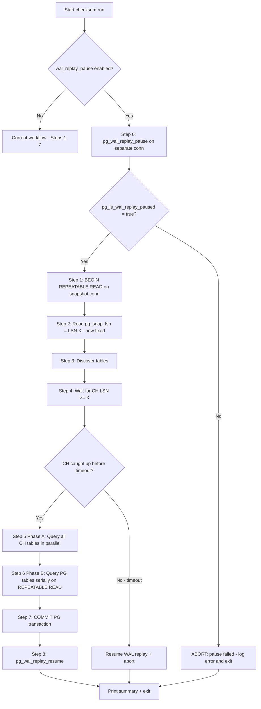
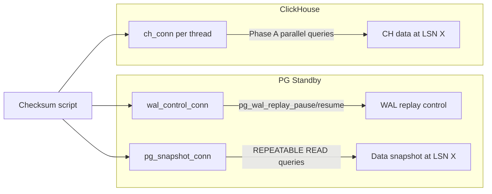

# WAL Replay Pause Integration for PostgreSQL Checksum Workflow

**Document:** `plans/postgres/16-wal-replay-pause-design.md`
**Status:** Design
**Depends on:** [15-checksum-run-results.md](15-checksum-run-results.md) (Run 17 results)
**Scope:** Eliminate CDC timing artifacts by pausing WAL replay on the PG standby during the checksum window

---

## Relevant Source Files

| File | Role |
|------|------|
| [`top_level_postgres_checksum.py`](../../sink-connector/python/db_compare/top_level_postgres_checksum.py) | Orchestrator: `run_config()` at line 866 — Phase A/B logic, LSN catch-up |
| [`db/postgres.py`](../../sink-connector/python/db/postgres.py) | `get_standby_lsn()` at line 405 — reads `pg_last_wal_replay_lsn()` |
| [`config_postgres_awacs_qa.yml`](../../sink-connector-lightweight/deployment/awacs-qa/config_postgres_awacs_qa.yml) | Deployment config — new `wal_replay_pause` key goes here |

---

## 1. Problem Statement

### 1.1 Current Architecture — Run 17

The checksum workflow in [`run_config()`](../../sink-connector/python/db_compare/top_level_postgres_checksum.py:866) with `snapshot_mode=True`:

1. **Step 1**: Open PG `REPEATABLE READ` transaction → PG snapshot pinned at some WAL position
2. **Step 2**: Read `pg_snap_lsn` = [`get_standby_lsn()`](../../sink-connector/python/db/postgres.py:405) inside the transaction
3. **Step 3**: Discover tables on the same connection
4. **Step 4**: Wait for CH offset LSN ≥ `pg_snap_lsn` via [`wait_for_ch_lsn()`](../../sink-connector/python/db_compare/top_level_postgres_checksum.py:128)
5. **Step 5 — Phase A**: Query ALL 36 CH tables in parallel (~1.1s)
6. **Step 6 — Phase B**: Query PG tables serially on the `REPEATABLE READ` connection (~15 min)
7. **Step 7**: Commit PG transaction

### 1.2 The Drift Window

The PG source is a **hot standby** receiving streaming replication from a primary. The standby continuously replays WAL records from the primary. During the time between:

- **Step 4** completes: CH has caught up to `pg_snap_lsn` = LSN X
- **Step 5** starts: CH tables are queried

New WAL records are replayed on the standby. The CDC pipeline (Debezium → Kafka → sink connector) processes these new events and writes them to CH. This creates a small but measurable window where:

- **CH sees rows that PG's snapshot doesn't** — events committed after PG's `REPEATABLE READ` snapshot was taken, replayed on the standby, captured by Debezium, and written to CH before the Phase A queries execute
- **PG's snapshot sees rows that CH doesn't yet have** — less likely in the current Phase A/B ordering, but possible for deletes in transit

### 1.3 Run 17 Evidence

5 of the 6 failures were classified as CDC timing artifacts:

| Table | Delta | % | Direction |
|-------|-------|---|-----------|
| `alerts_alertincident` | −765 | 0.003% | PG > CH — events still in CDC pipeline |
| `alerts_alertevent` | +119 | 0.0002% | CH > PG — soft-deleted rows not yet merged |
| `alerts_alert` | −1 | 0.0003% | CDC timing |
| `alerts_alertattachment` | −1 | 0.004% | CDC timing |
| `alerts_oncall` | +2 | 0.002% | CDC timing |

The 6th failure (`alerts_tagcache` +40,417 / 8.63%) is a **genuine connector gap**, not timing.

---

## 2. Proposed Solution: Pause WAL Replay

PostgreSQL provides built-in functions to pause and resume WAL replay on a standby:

```sql
SELECT pg_wal_replay_pause();    -- Stop applying WAL records
SELECT pg_wal_replay_resume();   -- Resume applying WAL records
SELECT pg_is_wal_replay_paused();  -- Check current state (boolean)
```

When paused:
- The standby **stops applying new WAL records** from the primary
- The primary continues generating and shipping WAL — it accumulates on the standby
- All existing data on the standby remains readable and unchanged
- The CDC pipeline (Debezium) receives **no new events** from this standby during the pause
- After resume, the standby catches up by replaying the accumulated WAL

---

## 3. Revised Workflow

### 3.1 Integration Point

WAL replay must be paused **before** reading the snapshot LSN (Step 2). The critical insight is:

> We want PG frozen at a known, fixed LSN. Then we wait for CH to catch up to that exact LSN. Then we query both sides knowing they represent the same WAL position.

If we pause after reading the LSN, a race exists where new WAL is replayed between the LSN read and the pause call. By pausing first, the LSN we read is guaranteed to be stable.

### 3.2 New Step-by-Step Flow

```
CURRENT (Run 17)                          NEW (with WAL pause)
─────────────────                         ────────────────────
                                          Step 0: pg_wal_replay_pause()
                                                  → PG standby frozen at LSN X
                                                  → verify with pg_is_wal_replay_paused()
Step 1: BEGIN REPEATABLE READ             Step 1: BEGIN REPEATABLE READ
Step 2: Read pg_snap_lsn (moving target)  Step 2: Read pg_snap_lsn (now FIXED = X)
Step 3: Discover tables                   Step 3: Discover tables
Step 4: Wait for CH LSN ≥ pg_snap_lsn    Step 4: Wait for CH LSN ≥ X
                                                  → CH processes all events up to X
                                                  → No new events arrive (replay paused)
                                                  → CH is now at exactly X
Step 5: Phase A — query CH (drift risk!)  Step 5: Phase A — query CH (no drift!)
Step 6: Phase B — query PG               Step 6: Phase B — query PG (frozen at X)
Step 7: COMMIT PG transaction             Step 7: COMMIT PG transaction
                                          Step 8: pg_wal_replay_resume()
                                                  → standby catches up
```

### 3.3 Workflow Diagram



### 3.4 Why This Eliminates the Drift

With replay paused at LSN X:

1. **PG is frozen** — `REPEATABLE READ` snapshot sees data as of LSN X, and no new WAL is applied, so there is no window for new data to appear
2. **CH catches up to exactly LSN X** — since no new WAL is being applied, Debezium delivers all events up to X and then stops. The offset table reflects LSN X
3. **No new CDC events during Phase A** — because the standby isn't replaying WAL, Debezium has nothing new to capture. CH data is stable during the ~1.1s Phase A window
4. **Both sides represent the identical WAL position** — PG at LSN X (frozen), CH at LSN X (caught up, no new events)

---

## 4. Safety Considerations

### 4.1 Script Crash — WAL Replay Stays Paused

**Risk:** If the checksum script crashes, gets killed, or the SSH session drops, WAL replay remains paused indefinitely. The standby falls further and further behind the primary. This can lead to:
- Replication lag growing unbounded
- WAL accumulation exhausting disk space on the standby
- Other consumers of the standby seeing stale data

**Mitigation: `try`/`finally` + signal handlers**

```python
import signal

wal_control_conn = None  # module-level for signal handler access

def _resume_wal_replay():
    """Safety net: resume WAL replay if it was paused by us."""
    global wal_control_conn
    if wal_control_conn:
        try:
            with wal_control_conn.cursor() as cur:
                cur.execute("SELECT pg_wal_replay_resume()")
            logging.info("WAL replay resumed (safety handler)")
        except Exception as e:
            logging.error(f"CRITICAL: Failed to resume WAL replay: {e}")
        finally:
            try:
                wal_control_conn.close()
            except Exception:
                pass
            wal_control_conn = None

def _signal_handler(signum, frame):
    """Handle SIGTERM/SIGINT — resume WAL replay before exit."""
    logging.warning(f"Caught signal {signum} — resuming WAL replay before exit")
    _resume_wal_replay()
    sys.exit(128 + signum)

# Register in run_config():
signal.signal(signal.SIGTERM, _signal_handler)
signal.signal(signal.SIGINT, _signal_handler)
```

The entire checksum run must be wrapped in `try`/`finally`:

```python
try:
    # Step 0: Pause WAL replay
    # Steps 1-7: checksum workflow
finally:
    # Step 8: Resume WAL replay (ALWAYS)
    _resume_wal_replay()
```

### 4.2 CH Never Catches Up — Timeout with Auto-Resume

**Risk:** If CH is significantly behind or the CDC pipeline is broken, [`wait_for_ch_lsn()`](../../sink-connector/python/db_compare/top_level_postgres_checksum.py:128) will timeout after `lsn_wait_timeout_seconds` (default: 300s). During this entire wait, WAL replay is paused.

**Mitigation:** The `try`/`finally` block covers this case. If `wait_for_ch_lsn()` times out:

1. Log a warning that checksum is unreliable
2. The `finally` block resumes WAL replay
3. Either abort the run entirely (recommended when `wal_replay_pause=true`) or proceed with a warning

**Design decision:** When `wal_replay_pause=true` and the LSN wait times out, **abort the run** rather than proceeding with unreliable results. The rationale: the user explicitly opted into WAL pause for accuracy; running with known-inaccurate data defeats the purpose.

```python
if not caught_up and wal_replay_pause_enabled:
    logging.error(
        "LSN wait timed out with wal_replay_pause=true — aborting. "
        "WAL replay will be resumed."
    )
    _resume_wal_replay()
    sys.exit(1)
```

### 4.3 Permissions

`pg_wal_replay_pause()` and `pg_wal_replay_resume()` require the **`pg_checkpoint`** role (PostgreSQL 15+) or **superuser** access (PostgreSQL 14 and earlier).

On PostgreSQL 15+, the minimal grant is:

```sql
GRANT pg_checkpoint TO sink_connector_user;
```

On PostgreSQL 14 and earlier, the user must be a superuser or use `ALTER USER ... SUPERUSER`.

**Verification query** (run before attempting pause):

```sql
SELECT pg_is_in_recovery();  -- must return true (we are a standby)
```

If `pg_is_in_recovery()` returns `false`, the target is a primary — WAL replay pause is meaningless and the function call will fail. The code should detect this and skip the pause gracefully.

### 4.4 Impact on Other Standby Consumers

While WAL replay is paused:

- **Read queries** on the standby work normally — they see data as of the paused LSN
- **Replication lag** grows — the standby falls behind the primary
- **Monitoring alerts** may fire for replication lag
- **Debezium** (if reading from this same standby) stops receiving new events — which is actually the desired effect for our checksum
- **Application read replicas** — if other applications read from this standby, they see stale data during the pause

**Expected pause duration:** The checksum run takes ~15 minutes (Phase B dominates). During this time, ~15 minutes of WAL accumulates on the standby. After resume, the standby catches up in seconds (WAL replay is much faster than real-time).

**Operational recommendation:** Schedule checksum runs during low-traffic windows. If the standby serves application read traffic, ensure the staleness is acceptable for the pause duration.

### 4.5 Double-Pause Guard

**Risk:** If WAL replay is already paused (e.g., by another operator or a previous crashed run), calling `pg_wal_replay_pause()` again is a no-op — it doesn't error. However, we should check the initial state and warn if replay was already paused, because our `finally` block will resume it even though we didn't pause it.

**Mitigation:** Check [`pg_is_wal_replay_paused()`](https://www.postgresql.org/docs/current/functions-admin.html#FUNCTIONS-RECOVERY-CONTROL) before pausing. If already paused:

```python
rows = execute_pg(wal_control_conn, "SELECT pg_is_wal_replay_paused() AS paused")
if rows[0]['paused']:
    logging.warning(
        "WAL replay is ALREADY paused (by another process?) — "
        "proceeding but will NOT resume on exit to avoid interfering "
        "with the other pause owner"
    )
    we_paused_it = False  # don't resume in finally
else:
    execute_pg(wal_control_conn, "SELECT pg_wal_replay_pause()")
    we_paused_it = True
```

---

## 5. Connection Architecture

### 5.1 Separate Connection for WAL Control

`pg_wal_replay_pause()` and `pg_wal_replay_resume()` should be called on a **separate connection** from the `REPEATABLE READ` snapshot connection. Reasons:

1. **Transaction isolation**: The snapshot connection runs a long-lived `REPEATABLE READ` transaction. Mixing DDL-level system functions on the same connection is fragile
2. **Cleanup independence**: If the snapshot connection fails or is rolled back, the WAL control connection can still resume replay
3. **Signal handler access**: The `_resume_wal_replay()` safety function needs a connection that isn't mid-query on a snapshot cursor

### 5.2 Connection Diagram



### 5.3 Connection Lifecycle

| Connection | Created | Purpose | Closed |
|-----------|---------|---------|--------|
| `wal_control_conn` | Step 0 (before everything) | `pg_wal_replay_pause()`, `pg_is_wal_replay_paused()`, `pg_wal_replay_resume()` | Step 8 (in `finally`) |
| `pg_snapshot_conn` | Step 1 | `BEGIN REPEATABLE READ`, LSN read, table discovery, all Phase B PG queries | Step 7 (commit + close) |
| CH connections | Step 4 (LSN wait) + Step 5 (per-thread) | LSN polling, Phase A parallel queries, Phase B on-the-fly CH queries | After each use |

---

## 6. Configuration

### 6.1 New Config Key

Add to the `checksum:` section of [`config_postgres_awacs_qa.yml`](../../sink-connector-lightweight/deployment/awacs-qa/config_postgres_awacs_qa.yml):

```yaml
checksum:
  # ---- WAL replay pause ----
  # When true, pauses WAL replay on the PG standby before the checksum run.
  # This eliminates the CDC timing drift window by freezing the standby at a
  # known LSN, waiting for CH to catch up to that exact LSN, then querying
  # both sides at the same WAL position.
  #
  # REQUIREMENTS:
  #   - PG target must be a hot standby (pg_is_in_recovery() = true)
  #   - PG user must have pg_checkpoint role (PG 15+) or superuser (PG 14-)
  #   - Only set to true if you understand the impact on standby consumers
  #
  # SAFETY: The script uses try/finally + signal handlers to ensure WAL replay
  # is always resumed, even on crash or SIGTERM. If the script is killed with
  # SIGKILL (kill -9), WAL replay will remain paused and must be manually
  # resumed: SELECT pg_wal_replay_resume();
  #
  # Default: false (opt-in — does not affect standby unless explicitly enabled)
  wal_replay_pause: false
```

### 6.2 Reading the Config

In [`run_config()`](../../sink-connector/python/db_compare/top_level_postgres_checksum.py:866):

```python
wal_replay_pause_enabled = bool(cksum_cfg.get('wal_replay_pause', False))
```

This integrates alongside the existing [`snapshot_mode`](../../sink-connector/python/db_compare/top_level_postgres_checksum.py:956) flag. Both can be independently toggled:

| `snapshot_mode` | `wal_replay_pause` | Behavior |
|---|---|---|
| `false` | `false` | Legacy mode — per-thread PG connections, no snapshot, no WAL pause |
| `true` | `false` | Current Run 17 behavior — single `REPEATABLE READ`, Phase A/B, ~1s drift window |
| `true` | `true` | **Target state** — `REPEATABLE READ` + WAL pause, zero drift window |
| `false` | `true` | Invalid — log warning and treat as `snapshot_mode=true, wal_replay_pause=true` |

---

## 7. Implementation Notes

### 7.1 Code Changes in [`run_config()`](../../sink-connector/python/db_compare/top_level_postgres_checksum.py:866)

The changes are localized to the `snapshot_mode=True` branch (line 977). Insert Step 0 before Step 1, and Step 8 in the `finally` block.

**Pseudocode diff:**

```python
if snapshot_mode:
    we_paused_wal = False
    wal_control_conn = None

    try:
        # === NEW: Step 0 — Pause WAL replay ===
        if wal_replay_pause_enabled:
            wal_control_conn = get_postgres_connection(
                pg_host, pg_user, pg_password, pg_port, pg_database)
            wal_control_conn.autocommit = True  # system functions need autocommit

            # Guard: check if already paused
            rows = execute_pg(wal_control_conn,
                "SELECT pg_is_in_recovery() AS in_recovery, "
                "pg_is_wal_replay_paused() AS already_paused")
            if not rows[0]['in_recovery']:
                logging.warning(
                    "Target is a PRIMARY, not a standby — "
                    "skipping WAL replay pause (not applicable)")
                wal_replay_pause_enabled = False
            elif rows[0]['already_paused']:
                logging.warning(
                    "WAL replay already paused by another process — "
                    "will NOT resume on exit")
                we_paused_wal = False
            else:
                execute_pg(wal_control_conn, "SELECT pg_wal_replay_pause()")
                # Verify
                rows = execute_pg(wal_control_conn,
                    "SELECT pg_is_wal_replay_paused() AS paused")
                if rows[0]['paused']:
                    logging.info("WAL replay paused successfully")
                    we_paused_wal = True
                else:
                    logging.error("pg_wal_replay_pause() did not take effect — aborting")
                    sys.exit(1)

        # === EXISTING: Steps 1-7 (unchanged) ===
        # Step 1: Open PG REPEATABLE READ
        # Step 2: Read pg_snap_lsn
        # Step 3: Discover tables
        # Step 4: Wait for CH LSN >= pg_snap_lsn
        #   NEW: If timeout and wal_replay_pause=true, abort
        # Step 5: Phase A — CH parallel queries
        # Step 6: Phase B — PG serial queries
        # Step 7: COMMIT PG transaction

    finally:
        # === NEW: Step 8 — Resume WAL replay (ALWAYS) ===
        if we_paused_wal and wal_control_conn:
            try:
                execute_pg(wal_control_conn, "SELECT pg_wal_replay_resume()")
                logging.info("WAL replay resumed")
            except Exception as e:
                logging.error(f"CRITICAL: Failed to resume WAL replay: {e}")
            finally:
                wal_control_conn.close()
                wal_control_conn = None
```

### 7.2 New Functions in [`db/postgres.py`](../../sink-connector/python/db/postgres.py)

Three new helper functions:

```python
def pause_wal_replay(conn):
    """Pause WAL replay on a standby. Connection must have autocommit=True."""
    execute_pg(conn, "SELECT pg_wal_replay_pause()")

def resume_wal_replay(conn):
    """Resume WAL replay on a standby. Connection must have autocommit=True."""
    execute_pg(conn, "SELECT pg_wal_replay_resume()")

def is_wal_replay_paused(conn):
    """Check if WAL replay is currently paused. Returns bool."""
    rows = execute_pg(conn, "SELECT pg_is_wal_replay_paused() AS paused")
    return bool(rows[0]['paused']) if rows else False
```

These are thin wrappers but centralize the SQL and make the orchestrator code cleaner.

### 7.3 Signal Handler Registration

Register `SIGTERM` and `SIGINT` handlers at the start of `run_config()` when `wal_replay_pause=true`:

```python
if wal_replay_pause_enabled:
    original_sigterm = signal.getsignal(signal.SIGTERM)
    original_sigint = signal.getsignal(signal.SIGINT)
    signal.signal(signal.SIGTERM, _signal_handler)
    signal.signal(signal.SIGINT, _signal_handler)
```

Restore original handlers after the `finally` block completes.

### 7.4 Logging

Enhanced logging for operational visibility:

| Event | Level | Message |
|-------|-------|---------|
| WAL pause attempt | INFO | `"Pausing WAL replay on standby {pg_host}:{pg_port}"` |
| WAL pause success | INFO | `"WAL replay paused successfully — standby frozen at current LSN"` |
| Already paused | WARNING | `"WAL replay already paused by another process — will NOT resume on exit"` |
| Not a standby | WARNING | `"Target is a PRIMARY — skipping WAL replay pause"` |
| Permission error | ERROR | `"pg_wal_replay_pause() failed — check pg_checkpoint role grant"` |
| Resume success | INFO | `"WAL replay resumed — standby catching up"` |
| Resume via signal | WARNING | `"Caught signal {N} — resuming WAL replay before exit"` |
| Resume failure | ERROR | `"CRITICAL: Failed to resume WAL replay: {error}. MANUAL INTERVENTION REQUIRED: SELECT pg_wal_replay_resume();"` |

---

## 8. Expected Outcomes

### 8.1 With WAL Pause Enabled

| Table | Run 17 Delta | Expected Delta | Rationale |
|-------|-------------|----------------|-----------|
| `alerts_alertincident` | −765 | **0** | No new WAL events during checksum = no drift |
| `alerts_alertevent` | +119 | **0** | Same |
| `alerts_alert` | −1 | **0** | Same |
| `alerts_alertattachment` | −1 | **0** | Same |
| `alerts_oncall` | +2 | **0** | Same |
| `alerts_tagcache` | +40,417 | **+40,417** | Genuine connector gap — unaffected by timing |

**Expected result:** 35/36 PASS, 1/36 FAIL (only `alerts_tagcache`).

### 8.2 Diagnostic Value

If `alerts_tagcache` still fails with WAL pause, it **conclusively proves** the 40K row delta is a genuine connector data gap (stale `_version=0` snapshot rows never cleaned by CDC deletes), not a timing artifact.

If any of the other 5 tables still fail with WAL pause, it indicates a deeper issue beyond CDC timing (e.g., a genuine missed event, Debezium bug, or sink connector processing error).

---

## 9. Operational Runbook

### 9.1 Pre-Flight Checklist

Before enabling `wal_replay_pause: true`:

1. **Verify standby status:**
   ```sql
   SELECT pg_is_in_recovery();  -- must be true
   ```

2. **Verify permissions:**
   ```sql
   -- PostgreSQL 15+
   SELECT pg_has_role(current_user, 'pg_checkpoint', 'MEMBER');
   -- Or check superuser
   SELECT usesuper FROM pg_user WHERE usename = current_user;
   ```

3. **Verify no other WAL pause is active:**
   ```sql
   SELECT pg_is_wal_replay_paused();  -- must be false
   ```

4. **Verify replication lag is acceptable:**
   ```sql
   SELECT now() - pg_last_xact_replay_timestamp() AS replay_lag;
   ```

### 9.2 Emergency Recovery

If the script is killed with `SIGKILL` (kill -9) and WAL replay remains paused:

```sql
-- On the PG standby
SELECT pg_is_wal_replay_paused();  -- confirm paused
SELECT pg_wal_replay_resume();     -- resume
SELECT pg_is_wal_replay_paused();  -- confirm resumed
SELECT now() - pg_last_xact_replay_timestamp() AS lag;  -- watch lag decrease
```

### 9.3 Monitoring

Add to existing PG standby monitoring:

```sql
-- Alert if WAL replay paused for more than 20 minutes
SELECT pg_is_wal_replay_paused() AS paused,
       now() - pg_last_xact_replay_timestamp() AS replay_lag;
```

---

## 10. Implementation Task List

These are the concrete code changes required:

1. **Add helper functions** to [`db/postgres.py`](../../sink-connector/python/db/postgres.py): `pause_wal_replay()`, `resume_wal_replay()`, `is_wal_replay_paused()`
2. **Add `wal_replay_pause` config key** to [`config_postgres_awacs_qa.yml`](../../sink-connector-lightweight/deployment/awacs-qa/config_postgres_awacs_qa.yml) (default `false`)
3. **Read new config key** in [`run_config()`](../../sink-connector/python/db_compare/top_level_postgres_checksum.py:956) alongside `snapshot_mode`
4. **Implement Step 0** (WAL pause) in the `snapshot_mode=True` branch of [`run_config()`](../../sink-connector/python/db_compare/top_level_postgres_checksum.py:977) — before the existing Step 1
5. **Wrap Steps 1-7** in `try`/`finally` with WAL resume in the `finally` block
6. **Add signal handlers** (`SIGTERM`, `SIGINT`) that call `_resume_wal_replay()` before exit
7. **Modify LSN timeout behavior** — abort the run when `wal_replay_pause=true` and LSN wait times out
8. **Add double-pause guard** — check `pg_is_wal_replay_paused()` before attempting pause
9. **Add primary-detection guard** — check `pg_is_in_recovery()` to skip pause on primaries
10. **Update imports** in [`top_level_postgres_checksum.py`](../../sink-connector/python/db_compare/top_level_postgres_checksum.py:34) to include new `db.postgres` functions
11. **Test** with `wal_replay_pause: true` — expect 35/36 PASS

---

*Previous: [15-checksum-run-results.md](15-checksum-run-results.md)*
