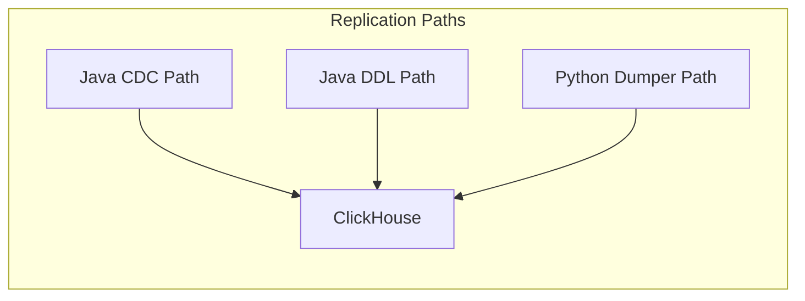
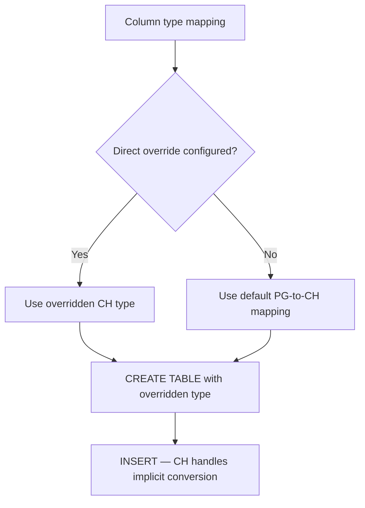
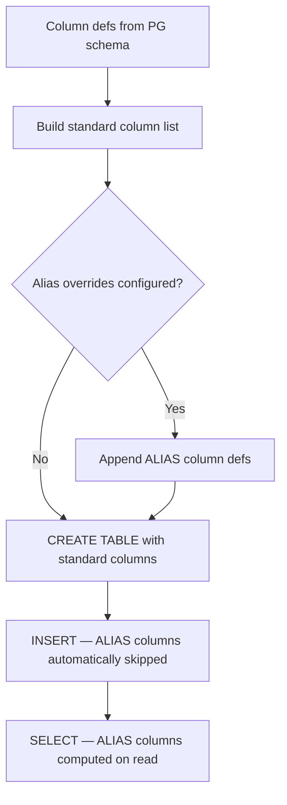
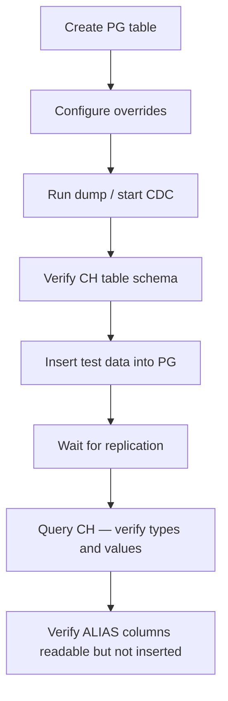

# Column Type Override Mapping — Architecture

## 1. Overview

The **Column Type Override Mapping** feature allows users to customise how
PostgreSQL column types are mapped to ClickHouse types during replication.
Two distinct override modes are supported:

| Mode | What it does | Storage impact | INSERT behaviour |
|------|-------------|---------------|-----------------|
| **Direct** | Replaces the default ClickHouse type for a column | Column stored with the overridden type | ClickHouse implicit conversion at INSERT time |
| **Alias** | Adds a *companion* ALIAS column with a user-defined expression | Original column unchanged; ALIAS column is virtual — computed on read | ALIAS columns are never included in INSERT — already handled by existing skip logic |

Both modes must work across all three replication paths:



1. **Java CDC path** — Debezium captures changes; tables auto-created via
   [`ClickHouseAutoCreateTable.createTableSyntax()`](sink-connector/src/main/java/com/altinity/clickhouse/sink/connector/db/operations/ClickHouseAutoCreateTable.java:105);
   types mapped via [`ClickHouseDataTypeMapper`](sink-connector/src/main/java/com/altinity/clickhouse/sink/connector/converters/ClickHouseDataTypeMapper.java)
   and overridden in
   [`ClickHouseTableOperationsBase.getColumnNameToCHDataTypeMapping()`](sink-connector/src/main/java/com/altinity/clickhouse/sink/connector/db/operations/ClickHouseTableOperationsBase.java:196).
2. **Java DDL path** —
   [`PostgreSQLDDLParserService.mapPostgresTypeToClickHouse()`](sink-connector-lightweight/src/main/java/com/altinity/clickhouse/debezium/embedded/ddl/parser/PostgreSQLDDLParserService.java:248)
   handles DDL changes and schema drift.
3. **Python dumper path** —
   [`postgres_type_mapper.py`](sink-connector/python/ch_sink_tools/db_load/postgres_type_mapper.py)
   maps types;
   [`build_create_table()`](sink-connector/python/ch_sink_tools/db_load/postgres_type_mapper.py:340)
   creates tables;
   [`build_insert_structure()`](sink-connector/python/ch_sink_tools/db_load/postgres_type_mapper.py:379)
   handles inserts.

---

## 2. Existing Override Mechanisms

Before designing the new feature it is important to understand what already
exists, so we extend rather than duplicate.

### 2.1 Java side

| Mechanism | Scope | Applied where |
|-----------|-------|---------------|
| `default_column_datatype_mapping.<col>=<CHType>` | Per-column-name — **global** across all tables | Parsed by [`DefaultColumnDataTypeMappingConfig`](sink-connector/src/main/java/com/altinity/clickhouse/sink/connector/config/DefaultColumnDataTypeMappingConfig.java:17), applied at [`ClickHouseTableOperationsBase` lines 196–207](sink-connector/src/main/java/com/altinity/clickhouse/sink/connector/db/operations/ClickHouseTableOperationsBase.java:196) during CREATE TABLE |
| [`ColumnOverrides`](sink-connector/src/main/java/com/altinity/clickhouse/sink/connector/db/ColumnOverrides.java:10) | Hardcoded DateTime→String override map | Applied at INSERT time by [`QueryFormatter` line 293](sink-connector/src/main/java/com/altinity/clickhouse/sink/connector/db/QueryFormatter.java:293) |
| [`SchemaOverrideConfig`](sink-connector/src/main/java/com/altinity/clickhouse/sink/connector/config/SchemaOverrideConfig.java:14) | Table-level DDL overrides — `partition_by`, `primary_key`, `settings` | Applied during CREATE TABLE |
| [`DBMetadata.getAliasAndMaterializedColumnsForTableAndDatabase()`](sink-connector/src/main/java/com/altinity/clickhouse/sink/connector/db/DBMetadata.java:572) | Queries `system.columns WHERE default_kind='ALIAS'` | Used to skip ALIAS columns during INSERT — **this already works** |

### 2.2 Python side

| Mechanism | Status |
|-----------|--------|
| Override config | **Does not exist** — must be added |
| Key insertion points | [`build_column_defs()`](sink-connector/python/ch_sink_tools/db_load/postgres_type_mapper.py:324), [`build_create_table()`](sink-connector/python/ch_sink_tools/db_load/postgres_type_mapper.py:340), [`build_insert_structure()`](sink-connector/python/ch_sink_tools/db_load/postgres_type_mapper.py:379) |
| Type mapping | [`pg_type_to_ch()`](sink-connector/python/ch_sink_tools/db/postgres.py:142), [`get_table_columns()`](sink-connector/python/ch_sink_tools/db/postgres.py:332) |

---

## 3. Configuration Format

A unified configuration schema that works in both Java properties/YAML and
Python CLI/config.

### 3.1 YAML format (canonical — used by both Java CDC config and Python dumper config)

```yaml
column_type_overrides:
  direct:
    - table: "public.events"          # schema.table — or "*" for all tables
      column: "created_at"
      target_type: "DateTime64(3)"

    - table: "*"                       # wildcard: applies to every table
      column: "status_code"
      target_type: "String"

  alias:
    - table: "public.events"
      column: "created_at"
      alias_type: "DateTime64(3)"
      expression: "parseDateTime64BestEffort(created_at)"

    - table: "public.prices"
      column: "amount"
      alias_type: "Float64"
      expression: "toFloat64(amount)"
```

### 3.2 Java flat properties format (for Debezium connector config)

```properties
# Direct overrides
# Pattern: column_type_override.direct.<schema>.<table>.<column>=<CHType>
column_type_override.direct.public.events.created_at=DateTime64(3)
column_type_override.direct.*.*.status_code=String

# Alias overrides
# Pattern: column_type_override.alias.<schema>.<table>.<column>=<CHType>|<expression>
column_type_override.alias.public.events.created_at=DateTime64(3)|parseDateTime64BestEffort(created_at)
column_type_override.alias.public.prices.amount=Float64|toFloat64(amount)
```

### 3.3 Python CLI arguments

```bash
# Via CLI flag pointing to a YAML file
python -m ch_sink_tools.db_dump.postgres_dumper \
  --column-type-overrides /path/to/overrides.yml \
  ...

# OR inline JSON for simple cases
python -m ch_sink_tools.db_dump.postgres_dumper \
  --column-type-override-direct 'public.events.created_at=DateTime64(3)' \
  --column-type-override-alias 'public.events.created_at=DateTime64(3)|parseDateTime64BestEffort(created_at)' \
  ...
```

### 3.4 Configuration parsing module

A new shared config parser class/module will be created for each side:

- **Java**: `ColumnTypeOverrideConfig` — parses both flat properties and YAML
  formats into a normalised in-memory structure.
- **Python**: `column_type_override_config.py` — parses YAML and CLI args into
  the same normalised structure.

### 3.5 Normalised in-memory data structure

```
ColumnTypeOverrides:
  direct_overrides: List of DirectOverride
    - schema: str           # e.g. "public" or "*"
    - table: str            # e.g. "events" or "*"
    - column: str           # e.g. "created_at"
    - target_type: str      # e.g. "DateTime64(3)"

  alias_overrides: List of AliasOverride
    - schema: str
    - table: str
    - column: str
    - alias_type: str       # e.g. "DateTime64(3)"
    - expression: str       # e.g. "parseDateTime64BestEffort(created_at)"
```

Matching logic — for a given `schema.table.column`:
1. Try exact match on `schema.table.column`
2. Fall back to wildcard `*.*.column`
3. No match → use default type mapping

---

## 4. Direct Override Implementation Plan

The direct override replaces the ClickHouse column type at CREATE TABLE time.
ClickHouse handles type conversion implicitly during INSERT — for example,
inserting a string `"2024-01-15 10:30:00"` into a `DateTime64(3)` column works
because ClickHouse can parse ISO datetime strings.



### 4.1 Java CDC path

**File**: [`ClickHouseTableOperationsBase.java`](sink-connector/src/main/java/com/altinity/clickhouse/sink/connector/db/operations/ClickHouseTableOperationsBase.java)

**Current behaviour** (lines 196–207): The existing
`default_column_datatype_mapping` logic loads a map keyed by **column name
only** and overrides the type in `columnToDataTypesMap`. This is global — the
same column name in different tables gets the same override.

**Change required**:
1. Create a new `ColumnTypeOverrideConfig` class that parses
   `column_type_override.direct.*` properties into a structured map supporting
   table-qualified lookups.
2. In [`getColumnNameToCHDataTypeMapping()`](sink-connector/src/main/java/com/altinity/clickhouse/sink/connector/db/operations/ClickHouseTableOperationsBase.java:196),
   after the existing `defaultColumnDataTypeMap` logic, add a second pass that
   checks the new `ColumnTypeOverrideConfig` for table-qualified direct
   overrides. The table name and schema must be passed into this method — this
   may require adding parameters or threading context through.
3. The existing `default_column_datatype_mapping` mechanism remains unchanged
   for backward compatibility.

### 4.2 Java DDL path

**File**: [`PostgreSQLDDLParserService.java`](sink-connector-lightweight/src/main/java/com/altinity/clickhouse/debezium/embedded/ddl/parser/PostgreSQLDDLParserService.java)

**Current behaviour**: [`mapPostgresTypeToClickHouse()`](sink-connector-lightweight/src/main/java/com/altinity/clickhouse/debezium/embedded/ddl/parser/PostgreSQLDDLParserService.java:248) is a static method
that takes only a `pgType` string and returns a ClickHouse type. It has no
knowledge of table or column names.

**Change required**:
1. Add an overloaded variant or modify the call sites in
   [`PostgreSQLDDLParserListenerImpl`](sink-connector-lightweight/src/main/java/com/altinity/clickhouse/debezium/embedded/ddl/parser/PostgreSQLDDLParserListenerImpl.java)
   (lines 192, 283, 318) to pass schema, table, and column context.
2. Before falling through to the standard PG→CH mapping, check if a direct
   override is configured for the specific `schema.table.column`.
3. If a direct override exists, return the overridden type; otherwise proceed
   with the normal mapping.

### 4.3 Python dumper path

**Files**:
- [`postgres.py`](sink-connector/python/ch_sink_tools/db/postgres.py) — [`get_table_columns()`](sink-connector/python/ch_sink_tools/db/postgres.py:332)
- [`postgres_type_mapper.py`](sink-connector/python/ch_sink_tools/db_load/postgres_type_mapper.py) — [`build_column_defs()`](sink-connector/python/ch_sink_tools/db_load/postgres_type_mapper.py:324)

**Change required**:
1. Create `column_type_override_config.py` module to parse override YAML/CLI
   args.
2. In [`get_table_columns()`](sink-connector/python/ch_sink_tools/db/postgres.py:332), after computing `ch_type` via
   [`pg_type_to_ch()`](sink-connector/python/ch_sink_tools/db/postgres.py:142) at line 357, check if a direct override
   is configured for `schema.table.column_name`. If so, replace the `ch_type`
   value in the result dict.
3. No changes needed in [`build_column_defs()`](sink-connector/python/ch_sink_tools/db_load/postgres_type_mapper.py:324) or
   [`build_insert_structure()`](sink-connector/python/ch_sink_tools/db_load/postgres_type_mapper.py:379)
   — they consume the `ch_type` from the column dicts, so the override
   propagates automatically.

### 4.4 INSERT behaviour — no changes needed

ClickHouse handles implicit type conversion during INSERT. For example:
- String `"2024-01-15T10:30:00.000"` → `DateTime64(3)` ✓
- Integer `42` → `String` `"42"` ✓
- Numeric `3.14` → `Float64` ✓

If the conversion fails, ClickHouse raises an error at INSERT time — see
**Risks** section below.

---

## 5. Alias Override Implementation Plan

The alias override adds a *companion* ALIAS column to the CREATE TABLE DDL.
The original column retains its default mapped type. The ALIAS column is
computed on read via a ClickHouse expression — it is never stored and never
included in INSERT statements.



### 5.1 ALIAS column naming convention

Given an alias override for column `created_at` with type `DateTime64(3)`:

1. Lowercase the type: `datetime64(3)`
2. Replace non-alphanumeric characters with underscores: `datetime64_3_`
3. Resulting column name: `created_at_datetime64_3_`

The trailing underscore prevents collisions with user-defined columns.

**Normalisation function** (pseudocode):
```
normalize_type(type_str):
    return type_str.lower().replaceAll('[^a-z0-9]', '_') + '_'
```

**Examples**:
| Source column | Alias type | ALIAS column name |
|---------------|-----------|-------------------|
| `created_at` | `DateTime64(3)` | `created_at_datetime64_3_` |
| `amount` | `Float64` | `amount_float64_` |
| `payload` | `JSON` | `payload_json_` |

### 5.2 Java CDC path

**File**: [`ClickHouseAutoCreateTable.java`](sink-connector/src/main/java/com/altinity/clickhouse/sink/connector/db/operations/ClickHouseAutoCreateTable.java)

**Current behaviour**: [`createTableSyntax()`](sink-connector/src/main/java/com/altinity/clickhouse/sink/connector/db/operations/ClickHouseAutoCreateTable.java:105) iterates over Kafka `Field[]` to build
column definitions (lines 135–162), then appends system columns (`_version`,
`is_deleted`, `_sign`) before closing the parentheses at line 213.

**Change required**:
1. After the loop that adds regular columns (line 162) and before the system
   columns section (line 164), insert a block that:
   - Queries `ColumnTypeOverrideConfig` for alias overrides matching the
     current `databaseName.tableName`.
   - For each alias override, appends a column definition:
     ```sql
     `created_at_datetime64_3_` DateTime64(3) ALIAS parseDateTime64BestEffort(created_at),
     ```
2. **INSERT behaviour**: ALIAS columns are already skipped by
   [`DBMetadata.getAliasAndMaterializedColumnsForTableAndDatabase()`](sink-connector/src/main/java/com/altinity/clickhouse/sink/connector/db/DBMetadata.java:572)
   which queries `system.columns WHERE default_kind='ALIAS'` — **no INSERT
   changes required**.

### 5.3 Java DDL path — schema drift

**File**: [`PostgreSQLDDLParserListenerImpl.java`](sink-connector-lightweight/src/main/java/com/altinity/clickhouse/debezium/embedded/ddl/parser/PostgreSQLDDLParserListenerImpl.java)

When a DDL ALTER TABLE is processed:
1. If a new column is added that has an alias override, the ALTER TABLE
   statement must also add the companion ALIAS column.
2. If a column with an alias override is dropped, the companion ALIAS column
   should also be dropped.
3. If a column is altered (type change), the ALIAS column definition may need
   to be recreated.

### 5.4 Python dumper path

**Files**:
- [`postgres_type_mapper.py`](sink-connector/python/ch_sink_tools/db_load/postgres_type_mapper.py) — [`build_column_defs()`](sink-connector/python/ch_sink_tools/db_load/postgres_type_mapper.py:324), [`build_create_table()`](sink-connector/python/ch_sink_tools/db_load/postgres_type_mapper.py:340)

**Change required**:
1. In [`build_column_defs()`](sink-connector/python/ch_sink_tools/db_load/postgres_type_mapper.py:324), after building the
   standard column definitions (lines 331–333) and before appending the virtual
   columns `_version` and `is_deleted` (lines 335–336), check for alias
   overrides. For each match, append:
   ```python
   defs.append(f"`{col_name}_{normalized_type}_` {alias_type} ALIAS {expression}")
   ```
2. **INSERT behaviour**: [`build_insert_structure()`](sink-connector/python/ch_sink_tools/db_load/postgres_type_mapper.py:379) iterates
   over the `columns` list from the source, which will not contain ALIAS
   columns — **no INSERT changes required**.

### 5.5 Generated DDL example

Given config:
```yaml
column_type_overrides:
  alias:
    - table: "public.events"
      column: "created_at"
      alias_type: "DateTime64(3)"
      expression: "parseDateTime64BestEffort(created_at)"
```

Produced CREATE TABLE:
```sql
CREATE TABLE IF NOT EXISTS `mydb`.`events`
(
    `id` Int64,
    `name` Nullable(String),
    `created_at` Nullable(String),
    `created_at_datetime64_3_` DateTime64(3) ALIAS parseDateTime64BestEffort(created_at),
    `_version` UInt64 DEFAULT 0,
    `is_deleted` UInt8 DEFAULT 0
)
ENGINE = ReplacingMergeTree(_version, is_deleted)
ORDER BY (`id`)
SETTINGS index_granularity = 8192
```

---

## 6. E2E Test Plan

### 6.1 New Scenario: Scenario H — Column Type Override Tests

These tests extend the existing E2E test infrastructure in
[`__internal/e2e/`](__internal/e2e/).

### 6.2 Test cases

#### H.1 — Direct override: PG TEXT → CH DateTime64(3)

| Step | Action |
|------|--------|
| 1 | Create PG table: `CREATE TABLE test_direct_dt (id SERIAL PRIMARY KEY, event_time TEXT)` |
| 2 | Configure direct override: `public.test_direct_dt.event_time=DateTime64(3)` |
| 3 | Dump/replicate to ClickHouse |
| 4 | Insert PG row: `INSERT INTO test_direct_dt (event_time) VALUES ('2024-01-15 10:30:00.123')` |
| 5 | Verify CH column type is `Nullable(DateTime64(3))` via `system.columns` |
| 6 | Verify CH value is queryable: `SELECT event_time FROM test_direct_dt WHERE event_time > '2024-01-15'` returns the row |

#### H.2 — Direct override: PG INTEGER → CH String

| Step | Action |
|------|--------|
| 1 | Create PG table: `CREATE TABLE test_direct_str (id SERIAL PRIMARY KEY, status_code INTEGER)` |
| 2 | Configure direct override: `public.test_direct_str.status_code=String` |
| 3 | Dump/replicate to ClickHouse |
| 4 | Insert PG row: `INSERT INTO test_direct_str (status_code) VALUES (200)` |
| 5 | Verify CH column type is `Nullable(String)` |
| 6 | Verify CH value: `SELECT status_code FROM test_direct_str` returns `'200'` as string |

#### H.3 — Alias override: PG TEXT + DateTime64 ALIAS

| Step | Action |
|------|--------|
| 1 | Create PG table: `CREATE TABLE test_alias_dt (id SERIAL PRIMARY KEY, created_at TEXT)` |
| 2 | Configure alias override: column `created_at`, type `DateTime64(3)`, expression `parseDateTime64BestEffort(created_at)` |
| 3 | Dump/replicate to ClickHouse |
| 4 | Insert PG row: `INSERT INTO test_alias_dt (created_at) VALUES ('2024-06-15 14:30:00.456')` |
| 5 | Verify CH has both columns: `created_at` as `Nullable(String)` and `created_at_datetime64_3_` as `DateTime64(3)` with `default_kind='ALIAS'` |
| 6 | Verify `SELECT created_at_datetime64_3_ FROM test_alias_dt` returns a proper DateTime64 value |
| 7 | Verify ALIAS column is NOT in the INSERT column list — confirm via ClickHouse query log or by checking the INSERT succeeds without mentioning the alias column |

#### H.4 — Alias override: PG NUMERIC + Float64 ALIAS

| Step | Action |
|------|--------|
| 1 | Create PG table: `CREATE TABLE test_alias_float (id SERIAL PRIMARY KEY, amount NUMERIC(10,2))` |
| 2 | Configure alias override: column `amount`, type `Float64`, expression `toFloat64(amount)` |
| 3 | Dump/replicate to ClickHouse |
| 4 | Insert PG row: `INSERT INTO test_alias_float (amount) VALUES (123.45)` |
| 5 | Verify CH has `amount` as `Nullable(Decimal(10,2))` and `amount_float64_` as `Float64` with `default_kind='ALIAS'` |
| 6 | Verify `SELECT amount_float64_ FROM test_alias_float` returns `123.45` as Float64 |

#### H.5 — Verify ALIAS columns excluded from INSERT

| Step | Action |
|------|--------|
| 1 | Use any table with an alias override already created |
| 2 | Insert additional rows via the replication pipeline |
| 3 | Verify INSERT succeeds — this confirms ALIAS columns are properly excluded |
| 4 | On Java CDC path: verify [`DBMetadata.getAliasAndMaterializedColumnsForTableAndDatabase()`](sink-connector/src/main/java/com/altinity/clickhouse/sink/connector/db/DBMetadata.java:572) returns the alias column name |
| 5 | On Python path: verify [`build_insert_structure()`](sink-connector/python/ch_sink_tools/db_load/postgres_type_mapper.py:379) does not include alias columns since they are not in the source column list |

### 6.3 Test flow diagram



---

## 7. Implementation Checklist

### Phase 1: Configuration parsing

- [ ] **Java**: Create `ColumnTypeOverrideConfig` class to parse `column_type_override.direct.*` and `column_type_override.alias.*` from flat properties
- [ ] **Java**: Add unit tests for `ColumnTypeOverrideConfig` — exact match, wildcard match, no match
- [ ] **Python**: Create `column_type_override_config.py` module to parse YAML and CLI args
- [ ] **Python**: Add unit tests for override config parsing

### Phase 2: Direct override implementation

- [ ] **Java CDC**: Extend [`getColumnNameToCHDataTypeMapping()`](sink-connector/src/main/java/com/altinity/clickhouse/sink/connector/db/operations/ClickHouseTableOperationsBase.java:196) to accept table/schema context and apply direct overrides after existing `defaultColumnDataTypeMap` logic
- [ ] **Java CDC**: Add unit test — verify direct override replaces column type in the returned map
- [ ] **Java DDL**: Modify call sites in [`PostgreSQLDDLParserListenerImpl`](sink-connector-lightweight/src/main/java/com/altinity/clickhouse/debezium/embedded/ddl/parser/PostgreSQLDDLParserListenerImpl.java) to pass column context and check direct overrides
- [ ] **Java DDL**: Add unit test — verify ALTER TABLE / CREATE TABLE with direct override produces correct CH DDL
- [ ] **Python**: Apply direct override in [`get_table_columns()`](sink-connector/python/ch_sink_tools/db/postgres.py:332) after `pg_type_to_ch()` call at line 357
- [ ] **Python**: Add unit test — verify `get_table_columns()` returns overridden `ch_type`

### Phase 3: Alias override implementation

- [ ] **Java CDC**: Extend [`createTableSyntax()`](sink-connector/src/main/java/com/altinity/clickhouse/sink/connector/db/operations/ClickHouseAutoCreateTable.java:105) to append ALIAS column definitions after regular columns, before system columns
- [ ] **Java CDC**: Add unit test — verify generated CREATE TABLE includes ALIAS column
- [ ] **Java CDC**: Verify existing [`DBMetadata.getAliasAndMaterializedColumnsForTableAndDatabase()`](sink-connector/src/main/java/com/altinity/clickhouse/sink/connector/db/DBMetadata.java:572) skips new ALIAS columns during INSERT — add integration test
- [ ] **Java DDL**: Handle ALIAS columns in ALTER TABLE — add companion ALIAS column when a source column with alias override is added; drop ALIAS column when source column is dropped
- [ ] **Python**: Extend [`build_column_defs()`](sink-connector/python/ch_sink_tools/db_load/postgres_type_mapper.py:324) to append ALIAS column definitions
- [ ] **Python**: Add unit test — verify `build_column_defs()` and `build_create_table()` produce correct DDL with ALIAS columns
- [ ] **Python**: Verify [`build_insert_structure()`](sink-connector/python/ch_sink_tools/db_load/postgres_type_mapper.py:379) naturally excludes ALIAS columns — add unit test

### Phase 4: E2E tests

- [ ] Implement Scenario H test cases (H.1 through H.5) in the E2E test framework
- [ ] Run E2E tests for both Python dumper path and Java CDC path
- [ ] Document test results

### Phase 5: Documentation

- [ ] Add `column_type_overrides` configuration reference to user-facing docs
- [ ] Add examples for common override patterns — datetime parsing, numeric conversion
- [ ] Update changelog

---

## 8. Risks and Mitigations

### 8.1 ClickHouse implicit conversion failures

**Risk**: Direct overrides rely on ClickHouse's implicit type conversion at
INSERT time. If the source data cannot be converted — e.g., a malformed string
`"not-a-date"` inserted into a `DateTime64(3)` column — ClickHouse will reject
the entire INSERT batch.

**Mitigation**:
- Document supported conversion patterns clearly.
- For unreliable data, recommend the **alias** approach instead — the original
  column stores the raw value safely, while the ALIAS expression can use
  fault-tolerant functions like `parseDateTime64BestEffortOrNull()`.
- Consider adding an `input_format_allow_errors_num` / `input_format_allow_errors_ratio` setting recommendation for tolerant ingestion.

### 8.2 Configuration complexity

**Risk**: Two override modes with table-qualified column names and wildcard
support could be confusing for users.

**Mitigation**:
- Provide clear documentation with examples for each use case.
- Validate config at startup — log warnings for overrides that reference
  non-existent tables or columns.
- Start with exact matches only; add wildcard support as a follow-up if the
  simpler form proves insufficient.

### 8.3 ALIAS column naming collisions

**Risk**: The generated ALIAS column name `{col}_{normalized_type}_` could
collide with an existing column in the source table.

**Mitigation**:
- The trailing underscore convention reduces collision probability — source
  columns rarely end with a type suffix plus underscore.
- At table creation time, check for collisions and log an error with a clear
  message if detected.
- Allow users to specify a custom ALIAS column name in the config as a future
  enhancement.

### 8.4 Schema drift with ALIAS columns

**Risk**: If the source column type changes (e.g., PG ALTER COLUMN), the ALIAS
expression may become invalid.

**Mitigation**:
- On schema drift detection in the DDL path, validate that the ALIAS
  expression is still compatible with the new source type.
- Log a warning if the ALIAS column expression references a column whose type
  has changed.

### 8.5 Performance of ALIAS columns

**Risk**: ALIAS columns are computed on every SELECT — complex expressions
could slow queries.

**Mitigation**:
- This is inherent to ClickHouse ALIAS columns and not specific to this
  feature. Document that ALIAS columns are computed on read.
- For high-frequency query columns, recommend using MATERIALIZED columns
  instead (future enhancement).

### 8.6 Backward compatibility

**Risk**: The new `column_type_override.*` properties could conflict with
existing `default_column_datatype_mapping.*` properties.

**Mitigation**:
- Use a distinct property prefix (`column_type_override.` vs
  `default_column_datatype_mapping.`).
- Document the precedence: `column_type_override.direct` takes priority over
  `default_column_datatype_mapping` when both match the same column.
- The existing `default_column_datatype_mapping` mechanism remains fully
  functional and unchanged.
