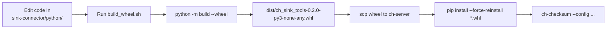
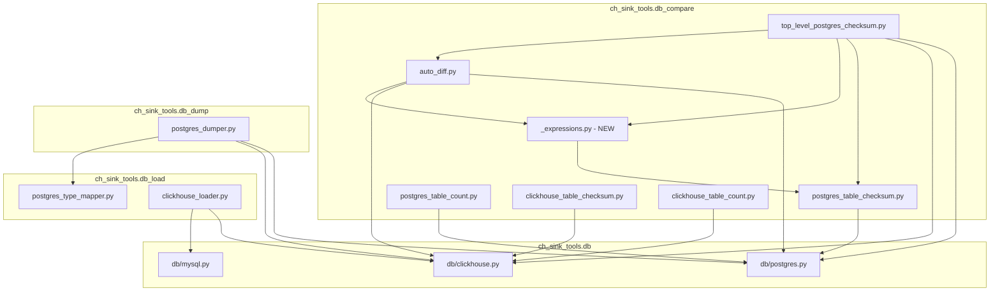

# Python Packaging Design — Sink Connector Tools

**Document:** `plans/postgres/20-python-packaging-design.md`
**Date:** 2026-03-03
**Status:** DRAFT

---

## 1. Executive Summary

The Python tooling under `sink-connector/python/` currently ships as a flat
collection of scripts with fragile import paths (`sys.path.append()` hacks,
`PYTHONPATH` overrides, wildcard imports).  This document designs a proper
Python package so that:

1. A single `pip install` on the target server (`ch-server`) replaces the
   current `rsync + PYTHONPATH` deployment.
2. CLI entry points (`ch-checksum`, `ch-dump`, `ch-count`, etc.) become
   first-class commands.
3. Imports become absolute, predictable, and testable.
4. The entire toolchain ships as **one `.whl` file** that is `scp`'d to the
   target and installed into the existing virtualenv.

### Constraints

| Constraint | Value |
|---|---|
| Target Python version | **≥ 3.6** (no f-strings in new code) |
| Target server | `ch-server` |
| Deployment method | `scp` wheel → `pip install *.whl` |
| Current deploy path | `/opt/sink-tools/` |
| Virtualenv location | `/opt/sink-tools/.venv` |

---

## 2. Current State Analysis

### 2.1 Directory Layout

```
sink-connector/python/
├── __init__.py                          # empty
├── requirements.txt                     # 7 deps
├── db/
│   ├── __init__.py                      # empty
│   ├── clickhouse.py                    # CH connection helpers
│   ├── mysql.py                         # MySQL connection helpers
│   └── postgres.py                      # PG connection helpers + type mapping
├── db_compare/
│   ├── __init__.py                      # version = 0.1
│   ├── auto_diff.py                     # binary-search divergent row finder
│   ├── binary_search_divergent_rows.py  # standalone hardcoded script
│   ├── clickhouse_table_checksum.py     # CH checksum (MySQL-era)
│   ├── clickhouse_table_count.py        # CH row count
│   ├── mysql_table_checksum.py          # MySQL checksum
│   ├── mysql_table_count.py             # MySQL count
│   ├── postgres_table_checksum.py       # PG checksum primitives
│   ├── postgres_table_count.py          # PG row count
│   ├── top_level_postgres_checksum.py   # main PG checksum orchestrator
│   ├── top_level_table_checksum.py      # MySQL version
│   ├── validate_checksums_local.py      # one-off validation script
│   └── scripts/
│       └── postgres_checksum_runner.sh  # cron wrapper
├── db_dump/
│   ├── __init__.py                      # version = 0.1
│   ├── mysql_dumper.py                  # MySQL dumper
│   └── postgres_dumper.py               # PG→CH snapshot loader
├── db_load/
│   ├── __init__.py                      # version = 0.1
│   ├── clickhouse_loader.py             # MySQL→CH loader
│   ├── postgres_type_mapper.py          # PG→CH DDL builder
│   ├── mysql_parser/                    # ANTLR-generated MySQL parser
│   └── postgres_parser/                 # ANTLR-generated PG parser
└── antlr_grammars/                      # ANTLR .g4 source files
```

### 2.2 Import Patterns (Problems)

| File | Import Pattern | Problem |
|---|---|---|
| [`top_level_postgres_checksum.py`](sink-connector/python/db_compare/top_level_postgres_checksum.py:40) | `from db.postgres import ...` | Works only when CWD = `python/` |
| [`top_level_postgres_checksum.py`](sink-connector/python/db_compare/top_level_postgres_checksum.py:60) | `from postgres_table_checksum import ...` | Sibling import; breaks outside `db_compare/` |
| [`postgres_table_checksum.py`](sink-connector/python/db_compare/postgres_table_checksum.py:1) | `from db.postgres import *` | Wildcard + CWD-dependent |
| [`clickhouse_table_checksum.py`](sink-connector/python/db_compare/clickhouse_table_checksum.py:1) | `from db.clickhouse import *` | Wildcard + CWD-dependent |
| [`postgres_dumper.py`](sink-connector/python/db_dump/postgres_dumper.py:52) | `sys.path.append(os.path.dirname(SCRIPT_DIR))` | Explicit path hack |
| [`clickhouse_loader.py`](sink-connector/python/db_load/clickhouse_loader.py:24) | `sys.path.append(os.path.dirname(SCRIPT_DIR))` | Explicit path hack |
| [`auto_diff.py`](sink-connector/python/db_compare/auto_diff.py:1) | Lazy import of `top_level_postgres_checksum` | Circular dependency workaround |

### 2.3 Current Dependencies

From [`requirements.txt`](sink-connector/python/requirements.txt):

```
clickhouse-driver>=0.2.9
psycopg2-binary
pymysql
pyyaml
sqlalchemy>=1.4
antlr4-python3-runtime==4.11.1
pandas
```

### 2.4 Current Deployment Workflow

```
developer laptop                          ch-server
─────────────────                         ─────────────
edit files in                             /opt/sink-tools/
  sink-connector/python/                    ├── db/
      │                                     ├── db_compare/
      │  rsync / scp                        ├── db_dump/
      └──────────────────────────────────►  └── db_load/
                                            .venv/  ← pip install -r requirements.txt

# Run via:
cd /opt/python-dump
python db_compare/top_level_postgres_checksum.py --config ...
python db_dump/postgres_dumper.py --config ...
```

---

## 3. Package Design

### 3.1 Package Name

**`ch_sink_tools`** — short, descriptive, avoids collision with `clickhouse-sink-connector` (the Java project).

Distribution name on the wheel: `ch_sink_tools-<version>-py3-none-any.whl`

### 3.2 Target Package Layout

```
sink-connector/python/
├── pyproject.toml                    # NEW — package metadata + build config
├── README.md                         # NEW — package readme
├── requirements.txt                  # KEEP — for legacy/CI reference
├── build_wheel.sh                    # NEW — build + deploy helper
│
└── ch_sink_tools/                    # RENAMED from flat layout
    ├── __init__.py                   # package version: __version__ = "0.2.0"
    │
    ├── db/                           # connection helpers (unchanged names)
    │   ├── __init__.py
    │   ├── clickhouse.py
    │   ├── mysql.py
    │   └── postgres.py
    │
    ├── db_compare/                   # checksum + comparison tools
    │   ├── __init__.py
    │   ├── auto_diff.py
    │   ├── clickhouse_table_checksum.py
    │   ├── clickhouse_table_count.py
    │   ├── mysql_table_checksum.py
    │   ├── mysql_table_count.py
    │   ├── postgres_table_checksum.py
    │   ├── postgres_table_count.py
    │   ├── top_level_postgres_checksum.py
    │   ├── top_level_table_checksum.py
    │   └── scripts/                  # shell wrappers (data_files)
    │       └── postgres_checksum_runner.sh
    │
    ├── db_dump/                      # snapshot dump/load tools
    │   ├── __init__.py
    │   ├── mysql_dumper.py
    │   └── postgres_dumper.py
    │
    └── db_load/                      # type mapping + loaders
        ├── __init__.py
        ├── clickhouse_loader.py
        ├── postgres_type_mapper.py
        ├── mysql_parser/             # ANTLR-generated (included as-is)
        │   └── ...
        └── postgres_parser/          # ANTLR-generated (included as-is)
            └── ...
```

**Files excluded from the package** (not moved into `ch_sink_tools/`):
- [`binary_search_divergent_rows.py`](sink-connector/python/db_compare/binary_search_divergent_rows.py:1) — standalone hardcoded script, superseded by [`auto_diff.py`](sink-connector/python/db_compare/auto_diff.py:1)
- [`validate_checksums_local.py`](sink-connector/python/db_compare/validate_checksums_local.py:1) — one-off validation with hardcoded credentials
- `antlr_grammars/` — source grammars, not runtime code

### 3.3 Import Refactoring Plan

All imports become absolute, rooted at `ch_sink_tools`:

| Current Import | New Import |
|---|---|
| `from db.postgres import *` | `from ch_sink_tools.db.postgres import get_postgres_connection, execute_pg, ...` |
| `from db.clickhouse import *` | `from ch_sink_tools.db.clickhouse import clickhouse_connection, execute_sql, ...` |
| `from db.clickhouse import clickhouse_connection` | `from ch_sink_tools.db.clickhouse import clickhouse_connection` |
| `from postgres_table_checksum import get_postgres_table_checksum` | `from ch_sink_tools.db_compare.postgres_table_checksum import get_postgres_table_checksum` |
| `from top_level_postgres_checksum import _build_ch_col_expr` | `from ch_sink_tools.db_compare.top_level_postgres_checksum import _build_ch_col_expr` |
| `from db_load.postgres_type_mapper import build_create_table` | `from ch_sink_tools.db_load.postgres_type_mapper import build_create_table` |
| `from db.mysql import is_binary_datatype` | `from ch_sink_tools.db.mysql import is_binary_datatype` |
| `from db_load.mysql_parser.mysql_parser import ...` | `from ch_sink_tools.db_load.mysql_parser.mysql_parser import ...` |

**Wildcard imports** (`from xxx import *`) will be replaced with explicit named imports in every file.

**`sys.path.append()` hacks** in [`postgres_dumper.py`](sink-connector/python/db_dump/postgres_dumper.py:52) and [`clickhouse_loader.py`](sink-connector/python/db_load/clickhouse_loader.py:24) will be removed entirely.

### 3.4 Circular Import Resolution

[`auto_diff.py`](sink-connector/python/db_compare/auto_diff.py:1) currently has a lazy import to avoid a circular dependency:

```python
# Inside run_auto_diff_for_table():
from top_level_postgres_checksum import _build_ch_col_expr
```

The function [`_build_ch_col_expr()`](sink-connector/python/db_compare/top_level_postgres_checksum.py:485) should be **extracted** into a shared utility module to break the cycle:

```
ch_sink_tools/db_compare/_expressions.py    # NEW
    └── _build_ch_col_expr()                # moved from top_level_postgres_checksum.py
    └── build_pg_select_expression()        # re-exported from postgres_table_checksum.py
```

Then both `top_level_postgres_checksum.py` and `auto_diff.py` import from
`ch_sink_tools.db_compare._expressions` — no cycle.

---

## 4. Packaging Tool Choice

### 4.1 Comparison

| Feature | setuptools | flit | hatchling |
|---|---|---|---|
| Python 3.6 support | ✅ Yes | ⚠️ flit-core ≥ 3.8 needs 3.6+ but flit CLI needs 3.8+ | ⚠️ hatchling needs 3.7+ |
| `pyproject.toml` only | ✅ (with build) | ✅ | ✅ |
| Builds wheel | ✅ | ✅ | ✅ |
| Complexity | Medium | Low | Low |
| Extra deps to build | `build` | `flit` | `hatchling` |
| ANTLR data files | ✅ Easy | ⚠️ Awkward | ✅ Easy |
| Industry standard | ✅ De facto | Niche | Growing |

### 4.2 Recommendation: **setuptools + build**

**Rationale:**
- The **build machine** (developer laptop) runs modern Python (3.10+), so
  setuptools/build work fine there.
- The **target server** only needs to run `pip install *.whl` — pip on
  Python 3.6 can install any `py3-none-any` wheel.
- setuptools handles the ANTLR-generated parser files (`.interp`, `.tokens`)
  as `package_data` without fuss.
- No additional learning curve — setuptools is the most widely understood
  build backend.

**Build command** (on dev laptop):

```bash
cd sink-connector/python
python -m build --wheel      # produces dist/ch_sink_tools-0.2.0-py3-none-any.whl
```

---

## 5. `pyproject.toml` Configuration

```toml
[build-system]
requires = ["setuptools>=64", "wheel"]
build-backend = "setuptools.build_meta"

[project]
name = "ch-sink-tools"
version = "0.2.0"
description = "PostgreSQL/MySQL → ClickHouse CDC verification and snapshot tools"
readme = "README.md"
requires-python = ">=3.6"
license = {text = "Apache-2.0"}
authors = [
    {name = "Data Platform Team"},
]

dependencies = [
    "clickhouse-driver>=0.2.9",
    "psycopg2-binary",
    "pyyaml",
]

[project.optional-dependencies]
mysql = [
    "pymysql",
    "sqlalchemy>=1.4",
    "antlr4-python3-runtime==4.11.1",
]
dataframe = [
    "pandas",
]
all = [
    "ch-sink-tools[mysql,dataframe]",
]

[project.scripts]
# PostgreSQL checksum tools
ch-checksum        = "ch_sink_tools.db_compare.top_level_postgres_checksum:main"
ch-pg-checksum     = "ch_sink_tools.db_compare.postgres_table_checksum:main"
ch-pg-count        = "ch_sink_tools.db_compare.postgres_table_count:main"
ch-ch-checksum     = "ch_sink_tools.db_compare.clickhouse_table_checksum:main"
ch-ch-count        = "ch_sink_tools.db_compare.clickhouse_table_count:main"

# Snapshot dump/load
ch-pg-dump         = "ch_sink_tools.db_dump.postgres_dumper:main"

# MySQL tools (only work if [mysql] extra is installed)
ch-mysql-checksum  = "ch_sink_tools.db_compare.top_level_table_checksum:main"
ch-mysql-dump      = "ch_sink_tools.db_dump.mysql_dumper:main"
ch-mysql-load      = "ch_sink_tools.db_load.clickhouse_loader:main"

[tool.setuptools.packages.find]
include = ["ch_sink_tools*"]

[tool.setuptools.package-data]
"ch_sink_tools.db_load.mysql_parser"    = ["*.interp", "*.tokens"]
"ch_sink_tools.db_load.postgres_parser" = ["*.interp", "*.tokens"]
"ch_sink_tools.db_compare"              = ["scripts/*.sh"]
```

---

## 6. CLI Entry Points

After `pip install ch_sink_tools-*.whl`, the following commands are available:

| Command | Script | Description |
|---|---|---|
| `ch-checksum` | [`top_level_postgres_checksum.py:main()`](sink-connector/python/db_compare/top_level_postgres_checksum.py:1917) | Full PG→CH checksum orchestrator |
| `ch-pg-checksum` | [`postgres_table_checksum.py:main()`](sink-connector/python/db_compare/postgres_table_checksum.py:638) | Single-table PG checksum |
| `ch-pg-count` | [`postgres_table_count.py:main()`](sink-connector/python/db_compare/postgres_table_count.py:93) | PG row count comparison |
| `ch-ch-checksum` | [`clickhouse_table_checksum.py:main()`](sink-connector/python/db_compare/clickhouse_table_checksum.py:328) | CH-side checksum |
| `ch-ch-count` | [`clickhouse_table_count.py:main()`](sink-connector/python/db_compare/clickhouse_table_count.py:94) | CH row count |
| `ch-pg-dump` | [`postgres_dumper.py:main()`](sink-connector/python/db_dump/postgres_dumper.py:329) | PG→CH snapshot loader |
| `ch-mysql-checksum` | `top_level_table_checksum.py:main()` | MySQL checksum (requires `[mysql]` extra) |
| `ch-mysql-dump` | `mysql_dumper.py:main()` | MySQL dump |
| `ch-mysql-load` | `clickhouse_loader.py:main()` | MySQL→CH loader |

### Before vs After

```bash
# BEFORE (current)
cd /opt/python-dump
export PYTHONPATH=/opt/python-dump
python db_compare/top_level_postgres_checksum.py --config config.yml

# AFTER (packaged)
ch-checksum --config /path/to/config.yml
```

---

## 7. Build and Deploy Workflow

### 7.1 Workflow Diagram



### 7.2 `build_wheel.sh` Script

```bash
#!/usr/bin/env bash
# build_wheel.sh — Build wheel and optionally deploy to target server
set -euo pipefail

SCRIPT_DIR="$(cd "$(dirname "${BASH_SOURCE[0]}")" && pwd)"
cd "$SCRIPT_DIR"

TARGET_HOST="${CH_DEPLOY_HOST:-ch-server}"
TARGET_USER="${CH_DEPLOY_USER:-clickhouse}"
TARGET_VENV="${CH_DEPLOY_VENV:-/opt/sink-tools/.venv}"

echo "=== Building wheel ==="
python -m build --wheel --outdir dist/

WHEEL=$(ls -1t dist/ch_sink_tools-*.whl | head -1)
echo "Built: ${WHEEL}"

if [[ "${1:-}" == "--deploy" ]]; then
    echo "=== Deploying to ${TARGET_HOST} ==="
    scp "${WHEEL}" "${TARGET_USER}@${TARGET_HOST}:/tmp/"
    WHEEL_NAME=$(basename "${WHEEL}")
    ssh "${TARGET_USER}@${TARGET_HOST}" \
        "${TARGET_VENV}/bin/pip install --force-reinstall /tmp/${WHEEL_NAME}"
    echo "=== Deployed and installed ==="
fi
```

### 7.3 Deployment Commands (Manual)

```bash
# On developer machine:
cd sink-connector/python
python -m build --wheel
scp dist/ch_sink_tools-0.2.0-py3-none-any.whl clickhouse@ch-server:/tmp/

# On ch-server:
source /opt/sink-tools/.venv/bin/activate
pip install --force-reinstall /tmp/ch_sink_tools-0.2.0-py3-none-any.whl
ch-checksum --config /path/to/config.yml
```

---

## 8. Backward Compatibility

### 8.1 Transitional `PYTHONPATH` Compatibility

During the transition period, the old invocation pattern must continue to work.
The shell wrapper [`postgres_checksum_runner.sh`](sink-connector/python/db_compare/scripts/postgres_checksum_runner.sh:1)
currently sets `PYTHONPATH` and calls `python db_compare/top_level_postgres_checksum.py`.

**Strategy:** After `pip install`, the package is on `sys.path` via the virtualenv's
`site-packages`.  The existing `PYTHONPATH` export becomes a no-op (harmless).
The `python db_compare/top_level_postgres_checksum.py` invocation will still work
because `if __name__ == "__main__": main()` blocks are preserved.

**However**, the import statements inside each script will have changed from
`from db.postgres import ...` to `from ch_sink_tools.db.postgres import ...`.
This means direct `python db_compare/top_level_postgres_checksum.py` execution
requires the package to be installed (which it will be, via pip).

### 8.2 Migration Checklist for `ch-server`

1. Install the wheel into the existing venv
2. Verify `ch-checksum --config config.yml` works
3. Update any cron jobs from `python db_compare/top_level_postgres_checksum.py`
   to `ch-checksum`
4. Update [`postgres_checksum_runner.sh`](sink-connector/python/db_compare/scripts/postgres_checksum_runner.sh:104)
   to use `ch-checksum` instead of `python db_compare/...`
5. Remove the old `python-dump/` directory (or keep as archive)

### 8.3 Config File Compatibility

Config YAML files are **unchanged** — they are external to the package and
passed via `--config` argument. No migration needed.

---

## 9. Version Management

### 9.1 Single Source of Truth

Version is defined in **one place**: [`ch_sink_tools/__init__.py`](sink-connector/python/ch_sink_tools/__init__.py):

```python
__version__ = "0.2.0"
```

`pyproject.toml` reads it dynamically:

```toml
[project]
dynamic = ["version"]

[tool.setuptools.dynamic]
version = {attr = "ch_sink_tools.__version__"}
```

*Alternatively*, for simplicity on Python 3.6 (where `importlib.metadata` is
not available), the version can be hardcoded in `pyproject.toml`:

```toml
[project]
version = "0.2.0"
```

**Recommendation:** Use the static version in `pyproject.toml` for Python 3.6
compatibility. Duplicate it in `__init__.py` for runtime access. Update both
when bumping.

### 9.2 Versioning Scheme

| Version | Meaning |
|---|---|
| `0.1.x` | Pre-packaging era (current code) |
| `0.2.0` | First packaged release |
| `0.2.1` | Patch fixes after packaging |
| `0.3.0` | New features (e.g., new checksum modes) |
| `1.0.0` | Stable, production-hardened release |

Bump version → build wheel → deploy. No git tags required (but recommended).

---

## 10. Dependency Splitting Strategy

The current [`requirements.txt`](sink-connector/python/requirements.txt) bundles
MySQL-specific deps (`pymysql`, `sqlalchemy`, `antlr4-python3-runtime`) with
PostgreSQL deps. Since the target deployment is PostgreSQL-only:

### Core Dependencies (always installed)

```
clickhouse-driver>=0.2.9
psycopg2-binary
pyyaml
```

### Optional Extras

| Extra | Packages | When needed |
|---|---|---|
| `[mysql]` | `pymysql`, `sqlalchemy>=1.4`, `antlr4-python3-runtime==4.11.1` | MySQL checksum/dump/load tools |
| `[dataframe]` | `pandas` | `pg_execute_df()` in [`db/postgres.py`](sink-connector/python/db/postgres.py:251) |

### Install Examples

```bash
# PostgreSQL-only (our primary use case):
pip install ch_sink_tools-0.2.0-py3-none-any.whl

# With MySQL support:
pip install "ch_sink_tools-0.2.0-py3-none-any.whl[mysql]"

# Everything:
pip install "ch_sink_tools-0.2.0-py3-none-any.whl[all]"
```

---

## 11. File-by-File Refactoring Impact

### 11.1 Files Requiring Import Changes

| File | Changes Required |
|---|---|
| [`db_compare/top_level_postgres_checksum.py`](sink-connector/python/db_compare/top_level_postgres_checksum.py:40) | `from db.postgres import ...` → `from ch_sink_tools.db.postgres import ...`; `from postgres_table_checksum import ...` → `from ch_sink_tools.db_compare.postgres_table_checksum import ...`; extract `_build_ch_col_expr` to `_expressions.py` |
| [`db_compare/auto_diff.py`](sink-connector/python/db_compare/auto_diff.py:1) | `from db.clickhouse import ...` → `from ch_sink_tools.db.clickhouse import ...`; lazy import → `from ch_sink_tools.db_compare._expressions import _build_ch_col_expr` |
| [`db_compare/postgres_table_checksum.py`](sink-connector/python/db_compare/postgres_table_checksum.py:1) | `from db.postgres import *` → explicit named imports from `ch_sink_tools.db.postgres` |
| [`db_compare/postgres_table_count.py`](sink-connector/python/db_compare/postgres_table_count.py:1) | `from db.postgres import *` → explicit named imports from `ch_sink_tools.db.postgres` |
| [`db_compare/clickhouse_table_checksum.py`](sink-connector/python/db_compare/clickhouse_table_checksum.py:1) | `from db.clickhouse import *` → explicit named imports from `ch_sink_tools.db.clickhouse` |
| [`db_compare/clickhouse_table_count.py`](sink-connector/python/db_compare/clickhouse_table_count.py:1) | `from db.clickhouse import *` → explicit named imports from `ch_sink_tools.db.clickhouse` |
| [`db_dump/postgres_dumper.py`](sink-connector/python/db_dump/postgres_dumper.py:52) | Remove `sys.path.append()` hack; `from db.postgres import ...` → `from ch_sink_tools.db.postgres import ...`; `from db_load.postgres_type_mapper import ...` → `from ch_sink_tools.db_load.postgres_type_mapper import ...` |
| [`db_load/clickhouse_loader.py`](sink-connector/python/db_load/clickhouse_loader.py:24) | Remove `sys.path.append()` hack; `from db.clickhouse import *` → explicit named imports; `from db.mysql import ...` → `from ch_sink_tools.db.mysql import ...` |

### 11.2 Files Requiring No Changes (Logic)

| File | Notes |
|---|---|
| [`db/clickhouse.py`](sink-connector/python/db/clickhouse.py:1) | Only stdlib + `clickhouse_driver` + `yaml` imports |
| [`db/postgres.py`](sink-connector/python/db/postgres.py:1) | Only stdlib + `psycopg2` + optional `pandas` imports |
| [`db/mysql.py`](sink-connector/python/db/mysql.py:1) | Only stdlib + `pymysql` + `sqlalchemy` + `pandas` imports |
| [`db_load/postgres_type_mapper.py`](sink-connector/python/db_load/postgres_type_mapper.py:1) | Only stdlib imports (`re`, `logging`) |
| All ANTLR-generated files | Auto-generated; no cross-package imports |

### 11.3 New Files

| File | Purpose |
|---|---|
| `pyproject.toml` | Package metadata and build configuration |
| `build_wheel.sh` | Build + optional deploy script |
| `README.md` | Package documentation |
| `ch_sink_tools/__init__.py` | Package root with `__version__` |
| `ch_sink_tools/db_compare/_expressions.py` | Shared expression builders extracted to break circular import |

---

## 12. Implementation Phases

### Phase 1: Package Structure

- Create `ch_sink_tools/` directory structure
- Move all source files from `db/`, `db_compare/`, `db_dump/`, `db_load/` into `ch_sink_tools/`
- Create `pyproject.toml`
- Create `ch_sink_tools/__init__.py` with `__version__`

### Phase 2: Import Refactoring

- Extract [`_build_ch_col_expr()`](sink-connector/python/db_compare/top_level_postgres_checksum.py:485) into `ch_sink_tools/db_compare/_expressions.py`
- Convert all `from db.xxx import` → `from ch_sink_tools.db.xxx import`
- Convert all sibling imports → absolute `ch_sink_tools.db_compare.xxx` imports
- Replace all `from xxx import *` with explicit named imports
- Remove all `sys.path.append()` hacks
- Verify no f-strings in modified lines (use `.format()` or `%` formatting)

### Phase 3: Build and Test

- Install `build` package: `pip install build`
- Run `python -m build --wheel`
- Verify wheel contents: `unzip -l dist/ch_sink_tools-*.whl`
- Install wheel in fresh venv and test each CLI entry point
- Verify `ch-checksum --config config.yml` produces same output as old invocation

### Phase 4: Deploy

- `scp` wheel to `ch-server`
- `pip install --force-reinstall` in target venv
- Run `ch-checksum --config config.yml` and compare output
- Update cron jobs and shell wrappers
- Archive old `python-dump/` directory

---

## 13. Risks and Mitigations

| Risk | Impact | Mitigation |
|---|---|---|
| Import refactoring breaks a script | HIGH | Test each CLI entry point with `--help` first; run against staging config |
| ANTLR `.interp`/`.tokens` files not included in wheel | MEDIUM | Explicit `package-data` in `pyproject.toml`; verify with `unzip -l *.whl` |
| Python 3.6 on target lacks `importlib.metadata` | LOW | Use static version in `pyproject.toml`; `__version__` in `__init__.py` for runtime |
| Circular import between `auto_diff` and `top_level_postgres_checksum` | HIGH | Extract shared functions to `_expressions.py` before packaging |
| Cron jobs still reference old paths | MEDIUM | Update cron jobs in Phase 4; old paths are harmless if package is installed |
| `pandas` import fails if not installed | LOW | Already handled with `try/except` in [`db/postgres.py`](sink-connector/python/db/postgres.py:16); make it an optional extra |

---

## Appendix A: Complete Import Dependency Graph



## Appendix B: Python 3.6 Compatibility Notes

- **No f-strings** — use `"{}".format(x)` or `"%s" % x`
- **No `dataclasses`** — use plain classes with `__init__` (already the case: [`ChecksumResult`](sink-connector/python/db_compare/top_level_postgres_checksum.py:75) uses a regular class)
- **No `:=` walrus operator**
- **No `typing.Protocol`** or `typing.TypedDict` (3.8+)
- **`typing.Optional`, `typing.List`, `typing.Dict`** are fine (3.5+)
- **`concurrent.futures`** — fine (3.2+)
- **`pathlib`** — fine (3.4+)
- **`zoneinfo`** — NOT available (3.9+); [`clickhouse_loader.py`](sink-connector/python/db_load/clickhouse_loader.py:19) imports it but this is MySQL-only code

## Appendix C: Wheel File Verification

After building, verify the wheel contains all expected files:

```bash
unzip -l dist/ch_sink_tools-0.2.0-py3-none-any.whl | head -50

# Expected entries:
# ch_sink_tools/__init__.py
# ch_sink_tools/db/__init__.py
# ch_sink_tools/db/clickhouse.py
# ch_sink_tools/db/postgres.py
# ch_sink_tools/db/mysql.py
# ch_sink_tools/db_compare/__init__.py
# ch_sink_tools/db_compare/top_level_postgres_checksum.py
# ch_sink_tools/db_compare/postgres_table_checksum.py
# ch_sink_tools/db_compare/_expressions.py
# ch_sink_tools/db_compare/auto_diff.py
# ... etc.
# ch_sink_tools/db_load/mysql_parser/MySqlLexer.interp    <- data file
# ch_sink_tools/db_load/mysql_parser/MySqlLexer.tokens    <- data file
# ch_sink_tools/db_load/postgres_parser/PostgreSQLLexer.interp
# ... etc.
```
