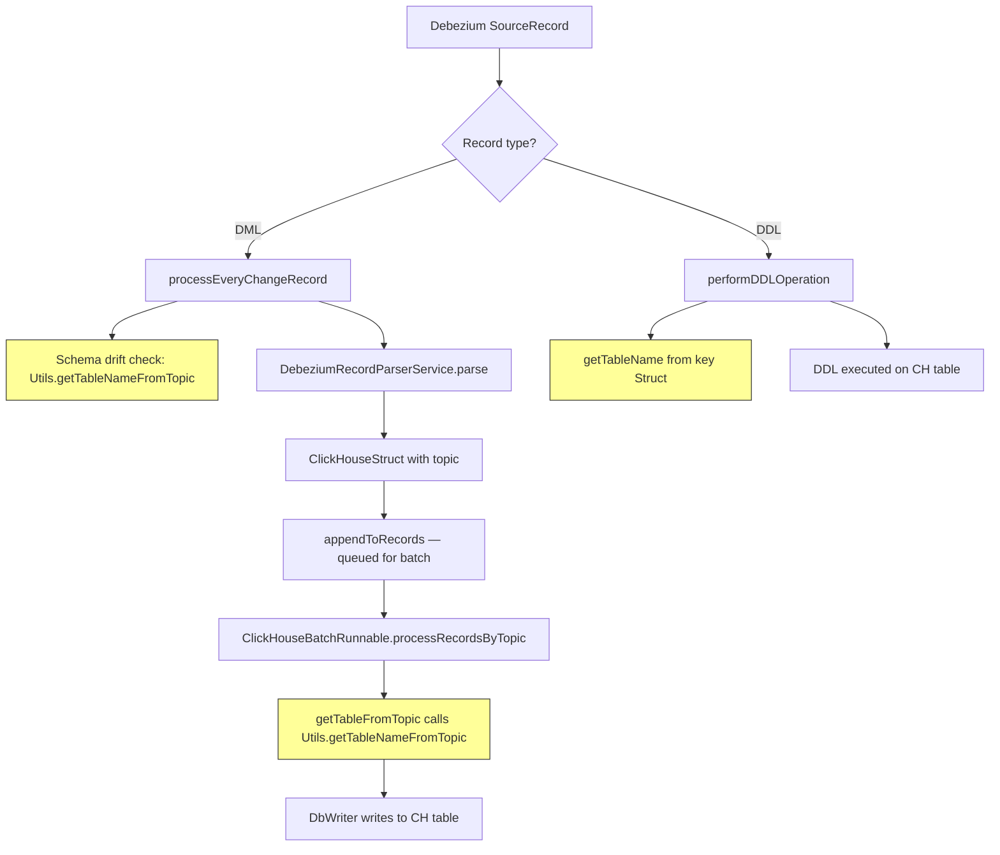
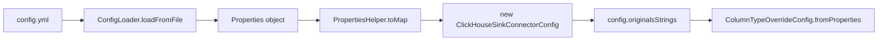

# Architecture Plan: Schema-Prefixed Table Naming & DateTime Alias Overrides

## 1. Overview

This plan covers two features for the ClickHouse Sink Connector:

1. **Schema-Prefixed Table Names** (`clickhouse.table.schema.prefix`) — When enabled, ClickHouse table names include the PostgreSQL schema as a prefix using the format `__<schema>__<tablename>`. This disambiguates tables from different PG schemas that share the same table name.

2. **DateTime Alias Override Configuration** — Deploy `column_type_override.alias.*` entries in the YAML config so that `date` columns (typed as `text` in PG) get companion `ALIAS` columns with proper ClickHouse `Date` type.

---

## 2. Feature 1: Schema-Prefixed Table Names

### 2.1 Motivation

Debezium PostgreSQL topics follow the format `{topic.prefix}.{schema}.{table}`. Currently the connector extracts only the last segment (table name), discarding the schema. When multiple PG schemas contain identically-named tables, this causes collisions in the single ClickHouse database.

### 2.2 Naming Convention

| PostgreSQL FQN | Debezium Topic | CH Table (prefix=false) | CH Table (prefix=true) |
|---|---|---|---|
| `app.public.LiteLLM_SpendLogs` | `prefix.public.LiteLLM_SpendLogs` | `LiteLLM_SpendLogs` | `__public__LiteLLM_SpendLogs` |
| `app.analytics.events` | `prefix.analytics.events` | `events` | `__analytics__events` |

### 2.3 Data Flow — Current vs. Proposed



The yellow-highlighted nodes are the extraction points that need modification.

### 2.4 Configuration

**New config property:**
- Key: `clickhouse.table.schema.prefix`
- Type: `boolean`
- Default: `false`
- When `false`: current behavior preserved (table name = last topic segment)
- When `true`: table name = `__<schema>__<tablename>` derived from topic segments

### 2.5 Files to Modify

#### 2.5.1 Config Variable Definition

**File:** [`ClickHouseSinkConnectorConfigVariables.java`](sink-connector/src/main/java/com/altinity/clickhouse/sink/connector/ClickHouseSinkConnectorConfigVariables.java:121)

Add a new enum constant before the closing of the enum, after line 121:

```java
/**
 * When true, ClickHouse table names include the PostgreSQL schema as a
 * prefix: __<schema>__<table>.  Default: false.
 */
CLICKHOUSE_TABLE_SCHEMA_PREFIX("clickhouse.table.schema.prefix");
```

> **Note:** The trailing semicolon on the last enum constant (`COLUMN_TYPE_OVERRIDE_ALIAS_PREFIX`) at line 121 must become a comma, and the new constant gets the semicolon.

#### 2.5.2 Config Registration

**File:** [`ClickHouseSinkConnectorConfig.java`](sink-connector/src/main/java/com/altinity/clickhouse/sink/connector/ClickHouseSinkConnectorConfig.java:827)

Add a new `.define()` block inside [`newConfigDef()`](sink-connector/src/main/java/com/altinity/clickhouse/sink/connector/ClickHouseSinkConnectorConfig.java:215) before the closing semicolon at line 827:

```java
.define(
        ClickHouseSinkConnectorConfigVariables
                .CLICKHOUSE_TABLE_SCHEMA_PREFIX.toString(),
        Type.BOOLEAN,
        false,
        Importance.LOW,
        "When true, ClickHouse table names include the PostgreSQL "
                + "schema as a prefix: __<schema>__<table>",
        CONFIG_GROUP_CONNECTOR_CONFIG,
        ORDER_0,
        ConfigDef.Width.NONE,
        ClickHouseSinkConnectorConfigVariables
                .CLICKHOUSE_TABLE_SCHEMA_PREFIX.toString()
)
```

#### 2.5.3 Shared Utility — Topic Name Parsing

**File:** [`Utils.java`](sink-connector/src/main/java/com/altinity/clickhouse/sink/connector/common/Utils.java:161)

Modify [`getTableNameFromTopic()`](sink-connector/src/main/java/com/altinity/clickhouse/sink/connector/common/Utils.java:161) to accept a boolean parameter and add an overload for backward compatibility:

```java
/**
 * Extracts the table name from the given Kafka topic name.
 * Original behavior: returns the last dot-separated segment.
 */
public static String getTableNameFromTopic(String topicName) {
    return getTableNameFromTopic(topicName, false);
}

/**
 * Extracts the table name from the given Kafka topic name.
 * When schemaPrefix is true, returns __<schema>__<table> using
 * the second-to-last and last segments respectively.
 *
 * Topic format: {topic.prefix}.{schema}.{table}
 * Split example: [prefix, public, LiteLLM_SpendLogs]
 *   schema = splitName[length-2]
 *   table  = splitName[length-1]
 *   result = __public__LiteLLM_SpendLogs
 */
public static String getTableNameFromTopic(String topicName,
                                            boolean schemaPrefix) {
    String tableName = null;
    String[] splitName = topicName.split("\\.");
    if (splitName.length >= 3) {
        if (schemaPrefix) {
            String schema = splitName[splitName.length - 2];
            String table = splitName[splitName.length - 1];
            tableName = "__" + schema + "__" + table;
        } else {
            tableName = splitName[splitName.length - 1];
        }
    }
    return tableName;
}
```

#### 2.5.4 Lightweight Path — DebeziumChangeEventCapture

**File:** [`DebeziumChangeEventCapture.java`](sink-connector-lightweight/src/main/java/com/altinity/clickhouse/debezium/embedded/cdc/DebeziumChangeEventCapture.java)

**Change 1 — [`extractTableNameFromTopic()`](sink-connector-lightweight/src/main/java/com/altinity/clickhouse/debezium/embedded/cdc/DebeziumChangeEventCapture.java:760) (line 760)**

Change from `private static` to accept a boolean flag:

```java
private static String extractTableNameFromTopic(String topic,
                                                 boolean schemaPrefix) {
    if (topic == null || topic.isEmpty()) {
        return null;
    }
    if (schemaPrefix) {
        // Use the shared utility that handles schema prefix extraction
        return Utils.getTableNameFromTopic(topic, true);
    }
    int lastDot = topic.lastIndexOf('.');
    if (lastDot < 0 || lastDot == topic.length() - 1) {
        return topic;
    }
    return topic.substring(lastDot + 1);
}
```

Add backward-compatible overload:

```java
private static String extractTableNameFromTopic(String topic) {
    return extractTableNameFromTopic(topic, false);
}
```

**Change 2 — [`getTableName()`](sink-connector-lightweight/src/main/java/com/altinity/clickhouse/debezium/embedded/cdc/DebeziumChangeEventCapture.java:735) (line 735)**

When schema prefix is enabled, also extract the schema from the source record key and prepend it:

```java
private String getTableName(SourceRecord sr) {
    if (sr != null && sr.key() instanceof Struct) {
        try {
            String tableName = (String) ((Struct) sr.key()).get("tableName");
            if (tableName != null && !tableName.isEmpty()) {
                // Check if schema prefix is enabled
                boolean schemaPrefix = isSchemaPrefix();
                if (schemaPrefix) {
                    String schema = extractSchemaFromRecord(sr);
                    if (schema != null && !schema.isEmpty()) {
                        return "__" + schema + "__" + tableName;
                    }
                }
                return tableName;
            }
        } catch (Exception e) {
            log.debug("tableName field not found in source record key");
        }
    }
    return null;
}
```

**Change 3 — Add helper methods:**

```java
/**
 * Returns true if clickhouse.table.schema.prefix is enabled.
 */
private boolean isSchemaPrefix() {
    try {
        return config.getBoolean(
            ClickHouseSinkConnectorConfigVariables
                .CLICKHOUSE_TABLE_SCHEMA_PREFIX.toString());
    } catch (Exception e) {
        return false;
    }
}

/**
 * Extracts the PostgreSQL schema name from the source record.
 * Reads from the value's 'source' struct 'schema' field.
 */
private static String extractSchemaFromRecord(SourceRecord sr) {
    try {
        if (sr.value() instanceof Struct) {
            Struct valueStruct = (Struct) sr.value();
            Object sourceObj = valueStruct.get("source");
            if (sourceObj instanceof Struct) {
                Struct sourceStruct = (Struct) sourceObj;
                return (String) sourceStruct.get("schema");
            }
        }
    } catch (Exception e) {
        // schema field may not exist
    }
    return null;
}
```

**Change 4 — Schema drift detection in [`processEveryChangeRecord()`](sink-connector-lightweight/src/main/java/com/altinity/clickhouse/debezium/embedded/cdc/DebeziumChangeEventCapture.java:1009) (line 1009-1010)**

Currently calls `Utils.getTableNameFromTopic(dmlTopic)`. Update to pass the schema prefix flag:

```java
boolean schemaPrefix = isSchemaPrefix();
String dmlTable = Utils.getTableNameFromTopic(dmlTopic, schemaPrefix);
```

**Change 5 — DDL cache invalidation in [`performDDLOperation()`](sink-connector-lightweight/src/main/java/com/altinity/clickhouse/debezium/embedded/cdc/DebeziumChangeEventCapture.java:586) (line 586)**

The call to `getTableName(sr)` at line 586 already goes through the modified `getTableName()` method, so it will automatically include the schema prefix. No additional change needed here.

#### 2.5.5 Kafka Connect Path — ClickHouseBatchRunnable & ClickHouseBatchWriter

**File:** [`ClickHouseBatchRunnable.java`](sink-connector/src/main/java/com/altinity/clickhouse/sink/connector/executor/ClickHouseBatchRunnable.java:489) — [`getTableFromTopic()`](sink-connector/src/main/java/com/altinity/clickhouse/sink/connector/executor/ClickHouseBatchRunnable.java:489) (line 489)

```java
public String getTableFromTopic(String topicName) {
    String tableName = null;
    if (this.topic2TableMap.containsKey(topicName) == false) {
        boolean schemaPrefix = false;
        try {
            schemaPrefix = config.getBoolean(
                ClickHouseSinkConnectorConfigVariables
                    .CLICKHOUSE_TABLE_SCHEMA_PREFIX.toString());
        } catch (Exception e) { /* default false */ }
        tableName = Utils.getTableNameFromTopic(topicName, schemaPrefix);
        this.topic2TableMap.put(topicName, tableName);
    } else {
        tableName = this.topic2TableMap.get(topicName);
    }
    return tableName;
}
```

**File:** [`ClickHouseBatchWriter.java`](sink-connector/src/main/java/com/altinity/clickhouse/sink/connector/executor/ClickHouseBatchWriter.java:261) — [`getTableFromTopic()`](sink-connector/src/main/java/com/altinity/clickhouse/sink/connector/executor/ClickHouseBatchWriter.java:261) (line 261)

Same change as `ClickHouseBatchRunnable.getTableFromTopic()`. The `ClickHouseBatchWriter` class also has a `config` field — apply the identical pattern.

### 2.6 Components Unaffected (Verification)

These components receive the already-transformed table name and require no changes:

| Component | File | Reason |
|---|---|---|
| [`PostgresSchemaChangeDetector`](sink-connector-lightweight/src/main/java/com/altinity/clickhouse/debezium/embedded/postgres/schema/PostgresSchemaChangeDetector.java) | `PostgresSchemaChangeDetector.java` | Receives `tableName` from caller; operates on the transformed name |
| [`ClickHouseAutoCreateTable`](sink-connector/src/main/java/com/altinity/clickhouse/sink/connector/db/operations/ClickHouseAutoCreateTable.java) | `ClickHouseAutoCreateTable.java` | [`createNewTable()`](sink-connector/src/main/java/com/altinity/clickhouse/sink/connector/db/operations/ClickHouseAutoCreateTable.java:61) takes `tableName` as parameter |
| [`DbWriter`](sink-connector/src/main/java/com/altinity/clickhouse/sink/connector/db/DbWriter.java) | `DbWriter.java` | Takes `tableName` in constructor |
| [`PostgreSQLDDLParserService`](sink-connector-lightweight/src/main/java/com/altinity/clickhouse/debezium/embedded/ddl/parser/PostgreSQLDDLParserService.java) | `PostgreSQLDDLParserService.java` | DDL parsing extracts table name from DDL SQL text — separate from topic-based extraction |

### 2.7 DDL Table Name Extraction — Special Consideration

For DDL events in the lightweight path, the table name comes from two places:

1. **Key struct** — via [`getTableName(sr)`](sink-connector-lightweight/src/main/java/com/altinity/clickhouse/debezium/embedded/cdc/DebeziumChangeEventCapture.java:735) which reads `tableName` from the Debezium key. This is modified in §2.5.4 Change 2 to apply the prefix.

2. **DDL SQL text parsing** — The [`PostgreSQLDDLParserService`](sink-connector-lightweight/src/main/java/com/altinity/clickhouse/debezium/embedded/ddl/parser/PostgreSQLDDLParserService.java) extracts the table name from the SQL DDL statement itself. When schema prefix is enabled, the DDL parser produces `CREATE TABLE __schema__tablename` because it receives the already-prefixed table name from the caller in `performDDLOperation`. This needs verification during testing.

### 2.8 Interaction with topic2table.map

If the user has configured `clickhouse.topic2table.map`, those explicit mappings take precedence over any topic-based extraction. The schema prefix logic only applies when no explicit mapping exists for a topic. This is the existing behavior — the `getTableFromTopic()` methods check the map first.

---

## 3. Feature 2: DateTime Alias Override in Config

### 3.1 Motivation

Several LiteLLM tables store `date` as a PostgreSQL `text` column. In ClickHouse, having a companion `ALIAS` column of type `Date` enables efficient date-based queries and partitioning without modifying the source schema.

### 3.2 Existing Mechanism

The [`ColumnTypeOverrideConfig`](sink-connector/src/main/java/com/altinity/clickhouse/sink/connector/config/ColumnTypeOverrideConfig.java) class already supports both direct and alias overrides:

- **Config format:** `column_type_override.alias.<schema>.<table>.<column>=<CHType>|<expression>`
- **Parsing:** [`fromProperties()`](sink-connector/src/main/java/com/altinity/clickhouse/sink/connector/config/ColumnTypeOverrideConfig.java:93) iterates all properties with prefix `column_type_override.alias.`
- **Alias column naming:** [`getAliasColumnName()`](sink-connector/src/main/java/com/altinity/clickhouse/sink/connector/config/ColumnTypeOverrideConfig.java:462) generates names like `date_date_` from column `date` + type `Date`
- **DDL integration:** [`PostgreSQLDDLParserListenerImpl`](sink-connector-lightweight/src/main/java/com/altinity/clickhouse/debezium/embedded/ddl/parser/PostgreSQLDDLParserListenerImpl.java:146) already adds alias columns during CREATE TABLE
- **Auto-create integration:** [`ClickHouseAutoCreateTable`](sink-connector/src/main/java/com/altinity/clickhouse/sink/connector/db/operations/ClickHouseAutoCreateTable.java:4) imports `ColumnTypeOverrideConfig`

### 3.3 Config Wiring Verification

The YAML config loading path:



The [`ConfigLoader`](sink-connector-lightweight/src/main/java/com/altinity/clickhouse/debezium/embedded/config/ConfigLoader.java:59) at line 59 loads YAML key-value pairs into a `Properties` object. Keys containing dots (like `column_type_override.alias.public.LiteLLM_DailyAgentSpend.date`) are preserved as flat strings. The [`ColumnTypeOverrideConfig.fromProperties()`](sink-connector/src/main/java/com/altinity/clickhouse/sink/connector/config/ColumnTypeOverrideConfig.java:93) method then matches them by the `column_type_override.alias.` prefix.

**Potential issue:** The [`ConfigLoader`](sink-connector-lightweight/src/main/java/com/altinity/clickhouse/debezium/embedded/config/ConfigLoader.java:34) at line 34 iterates `yamlFile.entrySet()` and casts values to either `Integer` or `String`. The YAML key `column_type_override.alias.public.LiteLLM_DailyAgentSpend.date` with value `"Date|toDate(date)"` will be loaded correctly as a String property. However, SnakeYAML may interpret dotted keys as nested maps. **This must be verified** — if SnakeYAML treats dots as nesting, the keys would need to be quoted in the YAML file.

### 3.4 Config Entries to Add

Add to the deployment `config.yml`:

```yaml
"column_type_override.alias.public.LiteLLM_DailyAgentSpend.date": "Date|toDate(date)"
"column_type_override.alias.public.LiteLLM_DailyEndUserSpend.date": "Date|toDate(date)"
"column_type_override.alias.public.LiteLLM_DailyOrganizationSpend.date": "Date|toDate(date)"
"column_type_override.alias.public.LiteLLM_DailyTagSpend.date": "Date|toDate(date)"
"column_type_override.alias.public.LiteLLM_DailyTeamSpend.date": "Date|toDate(date)"
"column_type_override.alias.public.LiteLLM_DailyUserSpend.date": "Date|toDate(date)"
```

> **Important:** Keys must be quoted in YAML to prevent SnakeYAML from interpreting dots as nested map levels.

### 3.5 Expected Behavior

When the connector auto-creates or processes DDL for these tables, it will:

1. Create the normal `date` column as `String` (mapped from PG `text`)
2. Create a companion alias column `date_date_` of type `Date ALIAS toDate(date)`

Example generated DDL fragment:
```sql
`date` String,
`date_date_` Date ALIAS toDate(date)
```

### 3.6 Interaction with Schema-Prefixed Table Names

When Feature 1 is also enabled, the ClickHouse table name becomes `__public__LiteLLM_DailyAgentSpend`. The alias override matching uses the **source schema and table name** (not the ClickHouse table name). The [`ColumnTypeOverrideConfig`](sink-connector/src/main/java/com/altinity/clickhouse/sink/connector/config/ColumnTypeOverrideConfig.java:228) matching at line 228 compares against the `schema` and `table` parameters passed by the caller.

**Critical:** Verify that the callers of `getAliasOverrides()` pass the **original PG schema/table** names, not the prefixed ClickHouse table name. The DDL parser path in [`PostgreSQLDDLParserListenerImpl`](sink-connector-lightweight/src/main/java/com/altinity/clickhouse/debezium/embedded/ddl/parser/PostgreSQLDDLParserListenerImpl.java:146) at line 146 uses `databaseName` and `plainTable` extracted from DDL SQL, which should be the original PG names. The auto-create path in [`ClickHouseAutoCreateTable`](sink-connector/src/main/java/com/altinity/clickhouse/sink/connector/db/operations/ClickHouseAutoCreateTable.java:61) receives `databaseName` and `tableName` — when schema prefix is enabled, `tableName` will be `__public__LiteLLM_DailyAgentSpend`, but the override config expects `LiteLLM_DailyAgentSpend`. **This requires a fix** if auto-create is used instead of DDL parsing.

### 3.7 Fix for Auto-Create with Schema Prefix

In [`ClickHouseAutoCreateTable.createNewTable()`](sink-connector/src/main/java/com/altinity/clickhouse/sink/connector/db/operations/ClickHouseAutoCreateTable.java:61), when calling `ColumnTypeOverrideConfig` methods, strip the `__schema__` prefix to get the original table name for matching:

```java
// When looking up overrides, use the original table name without schema prefix
String lookupTable = tableName;
if (tableName.startsWith("__") && tableName.contains("__", 2)) {
    // Extract original table name: __public__MyTable → MyTable
    int secondPrefix = tableName.indexOf("__", 2);
    lookupTable = tableName.substring(secondPrefix + 2);
}
```

Alternatively, pass the original PG schema and table as separate parameters through the call chain.

---

## 4. Files Summary

### Feature 1: Schema-Prefixed Table Names

| # | File | Change | Lines |
|---|---|---|---|
| 1 | [`ClickHouseSinkConnectorConfigVariables.java`](sink-connector/src/main/java/com/altinity/clickhouse/sink/connector/ClickHouseSinkConnectorConfigVariables.java:121) | Add `CLICKHOUSE_TABLE_SCHEMA_PREFIX` enum | ~121 |
| 2 | [`ClickHouseSinkConnectorConfig.java`](sink-connector/src/main/java/com/altinity/clickhouse/sink/connector/ClickHouseSinkConnectorConfig.java:827) | Add `.define()` for the new boolean config | ~827 |
| 3 | [`Utils.java`](sink-connector/src/main/java/com/altinity/clickhouse/sink/connector/common/Utils.java:161) | Add overloaded `getTableNameFromTopic(topic, schemaPrefix)` | ~161 |
| 4 | [`DebeziumChangeEventCapture.java`](sink-connector-lightweight/src/main/java/com/altinity/clickhouse/debezium/embedded/cdc/DebeziumChangeEventCapture.java:735) | Modify `getTableName()`, `extractTableNameFromTopic()`, add helpers | ~735, 760, 1009 |
| 5 | [`ClickHouseBatchRunnable.java`](sink-connector/src/main/java/com/altinity/clickhouse/sink/connector/executor/ClickHouseBatchRunnable.java:489) | Pass schema prefix flag in `getTableFromTopic()` | ~489 |
| 6 | [`ClickHouseBatchWriter.java`](sink-connector/src/main/java/com/altinity/clickhouse/sink/connector/executor/ClickHouseBatchWriter.java:261) | Pass schema prefix flag in `getTableFromTopic()` | ~261 |

### Feature 2: DateTime Alias Override

| # | File | Change |
|---|---|---|
| 1 | Deployment `config.yml` | Add 6 `column_type_override.alias.*` entries |
| 2 | [`ClickHouseAutoCreateTable.java`](sink-connector/src/main/java/com/altinity/clickhouse/sink/connector/db/operations/ClickHouseAutoCreateTable.java:61) | Strip schema prefix before override lookup (if Feature 1 is also active) |

---

## 5. Testing Strategy

### 5.1 Unit Tests

| Test | File | Description |
|---|---|---|
| `Utils.getTableNameFromTopic` — no prefix | [`Utils.java`](sink-connector/src/main/java/com/altinity/clickhouse/sink/connector/common/Utils.java:161) | Verify `getTableNameFromTopic("prefix.public.MyTable", false)` returns `"MyTable"` |
| `Utils.getTableNameFromTopic` — with prefix | [`Utils.java`](sink-connector/src/main/java/com/altinity/clickhouse/sink/connector/common/Utils.java:161) | Verify `getTableNameFromTopic("prefix.public.MyTable", true)` returns `"__public__MyTable"` |
| `Utils.getTableNameFromTopic` — multi-dot prefix | [`Utils.java`](sink-connector/src/main/java/com/altinity/clickhouse/sink/connector/common/Utils.java:161) | Verify `getTableNameFromTopic("a.b.c.public.MyTable", true)` returns `"__public__MyTable"` |
| `Utils.getTableNameFromTopic` — two segments | [`Utils.java`](sink-connector/src/main/java/com/altinity/clickhouse/sink/connector/common/Utils.java:161) | Verify `getTableNameFromTopic("host.table", true)` returns `null` (< 3 segments) |
| `extractTableNameFromTopic` — with prefix | [`DebeziumChangeEventCapture.java`](sink-connector-lightweight/src/main/java/com/altinity/clickhouse/debezium/embedded/cdc/DebeziumChangeEventCapture.java:760) | Via reflection or by making method package-private for testing |
| `ColumnTypeOverrideConfig` alias parsing | [`ColumnTypeOverrideConfig.java`](sink-connector/src/main/java/com/altinity/clickhouse/sink/connector/config/ColumnTypeOverrideConfig.java:93) | Verify `Date\|toDate(date)` parses correctly with aliasType=`Date`, expression=`toDate(date)` |
| Config loading | Verify `ConfigLoader` preserves dotted keys when quoted in YAML |

### 5.2 Integration Tests

| Test | Description |
|---|---|
| End-to-end schema prefix | Start connector with `clickhouse.table.schema.prefix: true`, insert into PG `public.test_table`, verify CH table `__public__test_table` is created and populated |
| DDL with schema prefix | Execute `ALTER TABLE` on PG, verify DDL is applied to `__public__test_table` in CH |
| Multiple schemas | Insert into `public.events` and `analytics.events`, verify two separate CH tables `__public__events` and `__analytics__events` |
| Alias override | Configure `column_type_override.alias.public.test_table.date` and verify the companion `date_date_` alias column is created |
| Schema prefix + alias | Both features enabled simultaneously — verify alias matching still works with prefixed table names |
| Backward compatibility | Run with `clickhouse.table.schema.prefix: false` (default) — verify no behavior change |

### 5.3 Existing Test Files to Extend

- [`ColumnOverridesTest.java`](sink-connector/src/test/java/com/altinity/clickhouse/sink/connector/db/ColumnOverridesTest.java) — Add alias override test cases
- [`ClickHouseBatchRunnableTest.java`](sink-connector/src/test/java/com/altinity/clickhouse/sink/connector/executor/ClickHouseBatchRunnableTest.java) — Add `getTableFromTopic` with schema prefix test

---

## 6. Deployment Steps

### 6.1 Code Deployment

1. Implement all code changes from §2.5 and §3.7
2. Run full unit test suite
3. Run integration tests from §5.2
4. Build new Docker image via [`.github/workflows/docker-build.yml`](.github/workflows/docker-build.yml)
5. Deploy updated connector image

### 6.2 Config Deployment

1. Add to the deployment server's `config.yml`:

```yaml
# Feature 1: Schema-prefixed table names
clickhouse.table.schema.prefix: true

# Feature 2: DateTime alias overrides for LiteLLM tables
"column_type_override.alias.public.LiteLLM_DailyAgentSpend.date": "Date|toDate(date)"
"column_type_override.alias.public.LiteLLM_DailyEndUserSpend.date": "Date|toDate(date)"
"column_type_override.alias.public.LiteLLM_DailyOrganizationSpend.date": "Date|toDate(date)"
"column_type_override.alias.public.LiteLLM_DailyTagSpend.date": "Date|toDate(date)"
"column_type_override.alias.public.LiteLLM_DailyTeamSpend.date": "Date|toDate(date)"
"column_type_override.alias.public.LiteLLM_DailyUserSpend.date": "Date|toDate(date)"
```

2. Restart the connector with the updated config

### 6.3 Post-Deployment — Existing Tables Migration

If tables were previously created without the schema prefix:

1. **Rename existing CH tables** to the new naming convention:
   ```sql
   RENAME TABLE LiteLLM_SpendLogs TO `__public__LiteLLM_SpendLogs`;
   ```

2. **Add alias columns** to existing tables that won't be re-created:
   ```sql
   ALTER TABLE `__public__LiteLLM_DailyAgentSpend`
       ADD COLUMN `date_date_` Date ALIAS toDate(date);
   ```

3. **Update Debezium offsets** — Table renames in ClickHouse don't affect Debezium offsets since offsets are topic-based. The connector will map the same topic to the new table name.

---

## 7. Rollback Plan

### 7.1 Feature 1 Rollback

1. Set `clickhouse.table.schema.prefix: false` in `config.yml` (or remove the key — default is `false`)
2. Restart the connector
3. If tables were renamed, rename them back:
   ```sql
   RENAME TABLE `__public__LiteLLM_SpendLogs` TO LiteLLM_SpendLogs;
   ```
4. The code changes are backward-compatible — the new overloaded methods default to the original behavior

### 7.2 Feature 2 Rollback

1. Remove the `column_type_override.alias.*` entries from `config.yml`
2. Restart the connector
3. Optionally drop the alias columns from existing tables:
   ```sql
   ALTER TABLE `__public__LiteLLM_DailyAgentSpend` DROP COLUMN `date_date_`;
   ```
4. Alias columns are read-only and don't affect data writes — they can be left in place safely

---

## 8. Risk Assessment

| Risk | Impact | Mitigation |
|---|---|---|
| SnakeYAML interprets dotted keys as nested maps | Alias overrides won't load | Quote keys in YAML; add integration test |
| Schema prefix breaks existing `topic2table.map` entries | Tables not found | Explicit topic-to-table mappings override topic parsing; document this |
| DDL parser receives prefixed table name for override lookup | Alias overrides don't match | Strip prefix before override lookup in auto-create path |
| Existing tables not renamed after enabling prefix | Data written to old table names | Provide migration script; document in deployment steps |
| `getTableName()` key struct doesn't have schema info for all connector types | Prefix applied inconsistently | Fall back to topic-based extraction; add logging for diagnosis |

---

## 9. Implementation Order

1. Config variable + registration (§2.5.1, §2.5.2)
2. `Utils.getTableNameFromTopic()` overload (§2.5.3)
3. `DebeziumChangeEventCapture` changes (§2.5.4)
4. `ClickHouseBatchRunnable` + `ClickHouseBatchWriter` changes (§2.5.5)
5. Unit tests for `Utils` and config
6. Auto-create fix for override lookup with prefix (§3.7)
7. Integration tests
8. Config deployment with alias overrides (§3.4)
9. Existing table migration (§6.3)
