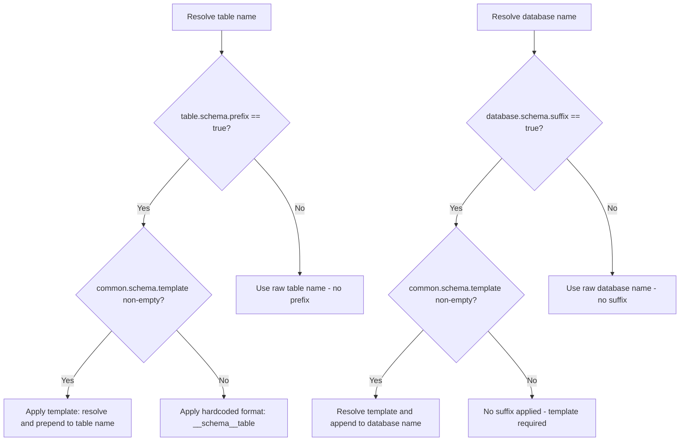
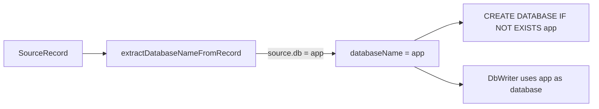
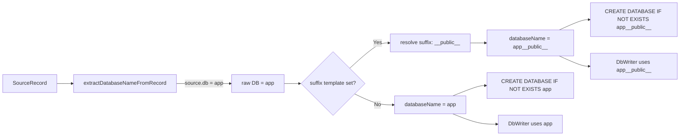

# Architecture Plan: Template-Based Naming for Database Suffix and Table Prefix

## 1. Overview

This plan extends the Phase 70 schema-prefix feature (commit `e3ee5d66`) with two new **template-based** config options that use `{{ schema }}` placeholders. The existing boolean `clickhouse.table.schema.prefix` is preserved for backward compatibility.

### 1.1 New Config Properties

| Config Key | Type | Default | Purpose |
|---|---|---|---|
| `clickhouse.database.schema.suffix` | BOOLEAN | `false` | determine if we will put the suffix based on schema suffix is clickhouse.common.schema.template |
| `clickhouse.common.schema.template` | STRING | `""` (empty) | Template prepended to the ClickHouse table name can also be used for table prefix |
| `clickhouse.table.schema.prefix` | BOOLEAN | `false` | *Existing* — hardcoded `__<schema>__` format change to use template clickhouse.common.schema.template if available |

---

## 2. Config Hierarchy and Precedence Rules



**Rules:**
1. `clickhouse.table.schema.prefix` (boolean true) enables table schema prefixing
2. When prefix is enabled, `clickhouse.common.schema.template` (non-empty) **overrides** the hardcoded `__<schema>__` format
3. When prefix is enabled but template is empty → hardcoded `__<schema>__` format (backward compatible)
4. `clickhouse.database.schema.suffix` (boolean true) enables database schema suffixing — requires `clickhouse.common.schema.template` to be set
5. The template is shared between both features

---

## 3. Template Resolution Logic

Simple `String.replace()` — no Jinja engine required.

```java
/**
 * Resolves a template string by replacing the {{ schema }} placeholder
 * with the actual PostgreSQL schema name.
 *
 * @param template  the template string, e.g. "__{{ schema }}__"
 * @param schema    the actual schema name, e.g. "public"
 * @return the resolved string, e.g. "__public__"
 */
public static String resolveSchemaTemplate(String template, String schema) {
    if (template == null || template.isEmpty()) {
        return "";
    }
    if (schema == null || schema.isEmpty()) {
        return "";  // Cannot resolve without a schema
    }
    return template.replace("{{ schema }}", schema);
}
```

### 3.1 Schema Extraction from Topic

The schema name is the **second-to-last** dot-separated segment of the Debezium topic:

```
Topic: myprefix.public.LiteLLM_SpendLogs
Split: [myprefix, public, LiteLLM_SpendLogs]
         ^prefix   ^schema  ^table
Index:   [0]       [len-2]  [len-1]
```

Existing code in [`Utils.getTableNameFromTopic()`](sink-connector/src/main/java/com/altinity/clickhouse/sink/connector/common/Utils.java:181) already extracts this. The new logic will reuse the same extraction pattern.

---

## 4. Files to Modify

### 4.1 [`ClickHouseSinkConnectorConfigVariables.java`](sink-connector/src/main/java/com/altinity/clickhouse/sink/connector/ClickHouseSinkConnectorConfigVariables.java)

**Changes:** Add two new enum constants before the closing semicolon.

Current last entry (line 127):
```java
CLICKHOUSE_TABLE_SCHEMA_PREFIX("clickhouse.table.schema.prefix");
```

New entries — change the semicolon on the existing entry to a comma and add:
```java
CLICKHOUSE_TABLE_SCHEMA_PREFIX("clickhouse.table.schema.prefix"),

CLICKHOUSE_DATABASE_SCHEMA_SUFFIX("clickhouse.database.schema.suffix"),

CLICKHOUSE_TABLE_SCHEMA_TEMPLATE("clickhouse.table.schema.template");
```

### 4.2 [`ClickHouseSinkConnectorConfig.java`](sink-connector/src/main/java/com/altinity/clickhouse/sink/connector/ClickHouseSinkConnectorConfig.java)

**Changes:** Add two new `.define()` blocks after the existing `CLICKHOUSE_TABLE_SCHEMA_PREFIX` definition (line 828–841).

```java
.define(
    ClickHouseSinkConnectorConfigVariables
        .CLICKHOUSE_DATABASE_SCHEMA_SUFFIX.toString(),
    Type.STRING,
    "",
    Importance.LOW,
    "Template string appended to the ClickHouse database name. "
        + "Use {{ schema }} as placeholder for the PostgreSQL schema name. "
        + "Example: '__{{ schema }}__' turns DB 'app' into 'app__public__'. "
        + "Empty string disables the suffix.",
    CONFIG_GROUP_CONNECTOR_CONFIG,
    ORDER_0,
    ConfigDef.Width.NONE,
    ClickHouseSinkConnectorConfigVariables
        .CLICKHOUSE_DATABASE_SCHEMA_SUFFIX.toString()
)
.define(
    ClickHouseSinkConnectorConfigVariables
        .CLICKHOUSE_TABLE_SCHEMA_TEMPLATE.toString(),
    Type.STRING,
    "",
    Importance.LOW,
    "Template string prepended to the ClickHouse table name. "
        + "Use {{ schema }} as placeholder for the PostgreSQL schema name. "
        + "Example: '__{{ schema }}__' turns table 'orders' into '__public__orders'. "
        + "When non-empty, takes precedence over clickhouse.table.schema.prefix. "
        + "Empty string disables the template.",
    CONFIG_GROUP_CONNECTOR_CONFIG,
    ORDER_0,
    ConfigDef.Width.NONE,
    ClickHouseSinkConnectorConfigVariables
        .CLICKHOUSE_TABLE_SCHEMA_TEMPLATE.toString()
)
```

### 4.3 [`Utils.java`](sink-connector/src/main/java/com/altinity/clickhouse/sink/connector/common/Utils.java)

**Changes:** Add new methods and refactor existing `getTableNameFromTopic()`.

#### 4.3.1 New static method: `resolveSchemaTemplate()`

```java
/**
 * Resolves a template by replacing {{ schema }} with the actual schema.
 * Returns empty string if template or schema is null/empty.
 */
public static String resolveSchemaTemplate(String template, String schema) {
    if (template == null || template.isEmpty()
            || schema == null || schema.isEmpty()) {
        return "";
    }
    return template.replace("{{ schema }}", schema);
}
```

#### 4.3.2 New static method: `extractSchemaFromTopic()`

```java
/**
 * Extracts the schema segment from a Debezium topic.
 * Topic format: {prefix}.{schema}.{table}
 * Returns the second-to-last dot-separated segment, or null if fewer than 3 segments.
 */
public static String extractSchemaFromTopic(String topicName) {
    if (topicName == null || topicName.isEmpty()) {
        return null;
    }
    String[] parts = topicName.split("\\.");
    if (parts.length >= 3) {
        return parts[parts.length - 2];
    }
    return null;
}
```

#### 4.3.3 New overload: `getTableNameFromTopic(String, boolean, String)`

Add a new overload that accepts a table schema template:

```java
/**
 * Extracts the table name from a topic, applying template-based or
 * boolean-based schema prefix logic.
 *
 * Precedence:
 *   1. tableSchemaTemplate non-empty → resolve and prepend
 *   2. schemaPrefix == true → hardcoded __schema__table format
 *   3. Otherwise → raw table name
 */
public static String getTableNameFromTopic(String topicName,
                                            boolean schemaPrefix,
                                            String tableSchemaTemplate) {
    if (topicName == null || topicName.isEmpty()) {
        return null;
    }
    String[] splitName = topicName.split("\\.");
    if (splitName.length < 3) {
        return splitName.length > 0 ? splitName[splitName.length - 1] : null;
    }

    String schema = splitName[splitName.length - 2];
    String table = splitName[splitName.length - 1];

    // Priority 1: template-based naming
    if (tableSchemaTemplate != null && !tableSchemaTemplate.isEmpty()) {
        String resolved = resolveSchemaTemplate(tableSchemaTemplate, schema);
        return resolved + table;
    }

    // Priority 2: boolean schema prefix
    if (schemaPrefix) {
        return "__" + schema + "__" + table;
    }

    // Default: raw table name
    return table;
}
```

The existing two-arg `getTableNameFromTopic(String, boolean)` delegates:
```java
public static String getTableNameFromTopic(String topicName,
                                            boolean schemaPrefix) {
    return getTableNameFromTopic(topicName, schemaPrefix, null);
}
```

#### 4.3.4 New static method: `applyDatabaseSchemaSuffix()`

```java
/**
 * Applies the database schema suffix template to a database name.
 *
 * @param databaseName the raw database name from source.db
 * @param suffixTemplate the template string, e.g. "__{{ schema }}__"
 * @param schema the actual schema name
 * @return the database name with suffix applied, or original if template is empty
 */
public static String applyDatabaseSchemaSuffix(String databaseName,
                                                String suffixTemplate,
                                                String schema) {
    if (databaseName == null || databaseName.isEmpty()) {
        return databaseName;
    }
    String resolved = resolveSchemaTemplate(suffixTemplate, schema);
    if (resolved.isEmpty()) {
        return databaseName;
    }
    return databaseName + resolved;
}
```

### 4.4 [`DebeziumChangeEventCapture.java`](sink-connector-lightweight/src/main/java/com/altinity/clickhouse/debezium/embedded/cdc/DebeziumChangeEventCapture.java)

**Changes:** Multiple modifications across fields, `setup()`, `getTableName()`, `extractTableNameFromTopic()`, `extractDatabaseNameFromRecord()`, and the DML processing path.

#### 4.4.1 New fields (after line 132)

```java
/** Template for table schema prefix, e.g. "__{{ schema }}__". Empty = disabled. */
private String tableSchemaTemplate = "";

/** Template suffix for database name, e.g. "__{{ schema }}__". Empty = disabled. */
private String databaseSchemaSuffix = "";
```

#### 4.4.2 `setup()` method (after line 405)

Read the two new config values from properties:

```java
// Initialize template-based naming configs
this.tableSchemaTemplate = props.getProperty(
    ClickHouseSinkConnectorConfigVariables.CLICKHOUSE_TABLE_SCHEMA_TEMPLATE.toString(), "");
this.databaseSchemaSuffix = props.getProperty(
    ClickHouseSinkConnectorConfigVariables.CLICKHOUSE_DATABASE_SCHEMA_SUFFIX.toString(), "");
```

#### 4.4.3 `getTableName()` method (line 748)

Update to use template-based naming with precedence logic:

```java
private String getTableName(SourceRecord sr) {
    if (sr != null && sr.key() instanceof Struct) {
        try {
            String tableName = (String) ((Struct) sr.key()).get("tableName");
            if (tableName != null && !tableName.isEmpty()) {
                String topic = sr.topic();
                String schema = Utils.extractSchemaFromTopic(topic);

                // Priority 1: template-based
                if (tableSchemaTemplate != null && !tableSchemaTemplate.isEmpty()
                        && schema != null) {
                    String resolved = Utils.resolveSchemaTemplate(
                            tableSchemaTemplate, schema);
                    return resolved + tableName;
                }

                // Priority 2: boolean prefix
                if (schemaPrefixEnabled && schema != null) {
                    return "__" + schema + "__" + tableName;
                }

                return tableName;
            }
        } catch (Exception e) {
            log.debug("tableName field not found in source record key");
        }
    }
    return null;
}
```

#### 4.4.4 `extractTableNameFromTopic()` method (line 799)

Update to pass template:

```java
private String extractTableNameFromTopic(String topic,
                                          boolean schemaPrefix) {
    if (topic == null || topic.isEmpty()) {
        return null;
    }
    return Utils.getTableNameFromTopic(topic, schemaPrefix, tableSchemaTemplate);
}
```

#### 4.4.5 `extractDatabaseNameFromRecord()` method (line 826)

Add database suffix application:

```java
private String extractDatabaseNameFromRecord(SourceRecord sr) {
    String db = null;
    // Try to read from the value's 'source' struct
    try {
        if (sr.value() instanceof Struct) {
            Struct valueStruct = (Struct) sr.value();
            Object sourceObj = valueStruct.get("source");
            if (sourceObj instanceof Struct) {
                Struct sourceStruct = (Struct) sourceObj;
                try {
                    db = (String) sourceStruct.get("db");
                } catch (Exception e) {
                    log.trace("'db' field not in source struct: {}", e.getMessage());
                }
            }
        }
    } catch (Exception e) {
        log.debug("Could not extract db from source struct: {}", e.getMessage());
    }

    if (db == null || db.isEmpty()) {
        String fallback = getDatabaseName(sr);
        db = "system".equals(fallback) ? null : fallback;
    }

    // Apply database schema suffix if configured
    if (db != null && !db.isEmpty()
            && databaseSchemaSuffix != null && !databaseSchemaSuffix.isEmpty()) {
        String schema = Utils.extractSchemaFromTopic(sr.topic());
        db = Utils.applyDatabaseSchemaSuffix(db, databaseSchemaSuffix, schema);
    }

    return db;
}
```

#### 4.4.6 DML schema-drift check (line 1054)

Update the `Utils.getTableNameFromTopic()` call to include the template:

```java
String dmlTable = Utils.getTableNameFromTopic(dmlTopic, schemaPrefixEnabled, tableSchemaTemplate);
```

#### 4.4.7 DDL `performDDLOperation()` — database suffix (line 546)

The `getDatabaseName()` call at line 546 also needs the suffix applied:

```java
String databaseName = getDatabaseName(sr);
// Apply database schema suffix if configured
if (databaseSchemaSuffix != null && !databaseSchemaSuffix.isEmpty()) {
    String schema = Utils.extractSchemaFromTopic(sr.topic());
    databaseName = Utils.applyDatabaseSchemaSuffix(
            databaseName, databaseSchemaSuffix, schema);
}
```

### 4.5 [`ClickHouseBatchRunnable.java`](sink-connector/src/main/java/com/altinity/clickhouse/sink/connector/executor/ClickHouseBatchRunnable.java)

**Changes:** Update `getTableFromTopic()` at line 489 to support template-based naming.

```java
public String getTableFromTopic(String topicName) {
    String tableName = null;
    if (this.topic2TableMap.containsKey(topicName) == false) {
        boolean schemaPrefix = this.config != null &&
                this.config.getBoolean(
                    ClickHouseSinkConnectorConfigVariables
                        .CLICKHOUSE_TABLE_SCHEMA_PREFIX.toString());
        String tableTemplate = this.config != null
                ? this.config.getString(
                    ClickHouseSinkConnectorConfigVariables
                        .CLICKHOUSE_TABLE_SCHEMA_TEMPLATE.toString())
                : "";
        tableName = Utils.getTableNameFromTopic(topicName, schemaPrefix, tableTemplate);
        this.topic2TableMap.put(topicName, tableName);
    } else {
        tableName = this.topic2TableMap.get(topicName);
    }
    return tableName;
}
```

### 4.6 [`ClickHouseCreateDatabase.java`](sink-connector/src/main/java/com/altinity/clickhouse/sink/connector/db/operations/ClickHouseCreateDatabase.java)

**No changes required.** The database name with suffix is resolved *before* reaching `createNewDatabase()`. The caller already passes the fully-qualified database name as the `dbName` parameter. The suffix is applied at the point where the database name is extracted from the source record (in `DebeziumChangeEventCapture`), so `ClickHouseCreateDatabase` receives the final name.

---

## 5. Database Routing Impact

### 5.1 Current Flow



### 5.2 New Flow with Suffix



### 5.3 Impact Points

The database name is resolved in **two** places:

| Location | Method | Current Code | Change |
|---|---|---|---|
| [`DebeziumChangeEventCapture.java:826`](sink-connector-lightweight/src/main/java/com/altinity/clickhouse/debezium/embedded/cdc/DebeziumChangeEventCapture.java:826) | `extractDatabaseNameFromRecord()` | Returns raw `source.db` | Apply suffix template before returning |
| [`DebeziumChangeEventCapture.java:546`](sink-connector-lightweight/src/main/java/com/altinity/clickhouse/debezium/embedded/cdc/DebeziumChangeEventCapture.java:546) | `performDDLOperation()` | Calls `getDatabaseName()` | Apply suffix template to result |

**Kafka Connect path:** In [`ClickHouseBatchRunnable.java`](sink-connector/src/main/java/com/altinity/clickhouse/sink/connector/executor/ClickHouseBatchRunnable.java), the database name comes from the `ClickHouseStruct.database` field which is set during parsing. The database suffix would need to be applied when the `ClickHouseStruct` is populated. However, in the lightweight/embedded path (which is the PostgreSQL path), this is handled in `DebeziumChangeEventCapture`. For the Kafka Connect path, a similar suffix application would be needed in the record parsing layer if database suffix support is desired there.

---

## 6. Edge Cases

### 6.1 Schema is null

When the topic has fewer than 3 dot-separated segments, `extractSchemaFromTopic()` returns `null`. In this case:
- `resolveSchemaTemplate()` returns `""` (empty)
- Table name falls through to raw name (no prefix applied)
- Database name remains unmodified (no suffix applied)
- **No error is thrown** — the system degrades gracefully to default behavior

### 6.2 Template has no `{{ schema }}` placeholder

If the user sets a template without the placeholder (e.g., `"prefix_"`):
- `String.replace()` returns the template unchanged
- The literal string is prepended/appended as-is
- Example: template `"prefix_"` → table becomes `prefix_orders`
- This is valid behavior — the user may want a static prefix/suffix

### 6.3 Both template and boolean are set

If `clickhouse.table.schema.template = "__{{ schema }}__"` AND `clickhouse.table.schema.prefix = true`:
- The **template takes precedence** (priority 1 in the resolution logic)
- The boolean is ignored
- This should be logged at `WARN` level during setup to alert the user

### 6.4 Schema contains special characters

ClickHouse database and table names have restrictions. If the resolved name contains invalid characters:
- The connector should log a warning but proceed — ClickHouse will reject the invalid name at query time
- No additional validation is added for this phase

### 6.5 Empty schema string

If the schema segment exists but is empty (e.g., topic `prefix..table`):
- `extractSchemaFromTopic()` returns `""` (empty string)
- `resolveSchemaTemplate()` treats empty schema as no-op → returns `""`
- Behavior degrades to no prefix/suffix

### 6.6 Database suffix with multiple schemas

When a PostgreSQL source has multiple schemas (e.g., `public`, `analytics`), each schema produces a **different** ClickHouse database name:
- `app__public__` for tables in the `public` schema
- `app__analytics__` for tables in the `analytics` schema
- The `CREATE DATABASE IF NOT EXISTS` call ensures each database is created on demand

---

## 7. Implementation Checklist

- [ ] Add `CLICKHOUSE_DATABASE_SCHEMA_SUFFIX` and `CLICKHOUSE_TABLE_SCHEMA_TEMPLATE` to [`ClickHouseSinkConnectorConfigVariables.java`](sink-connector/src/main/java/com/altinity/clickhouse/sink/connector/ClickHouseSinkConnectorConfigVariables.java)
- [ ] Add `.define()` blocks in [`ClickHouseSinkConnectorConfig.java`](sink-connector/src/main/java/com/altinity/clickhouse/sink/connector/ClickHouseSinkConnectorConfig.java)
- [ ] Add `resolveSchemaTemplate()`, `extractSchemaFromTopic()`, `applyDatabaseSchemaSuffix()`, and new `getTableNameFromTopic(String, boolean, String)` overload to [`Utils.java`](sink-connector/src/main/java/com/altinity/clickhouse/sink/connector/common/Utils.java)
- [ ] Refactor existing `getTableNameFromTopic(String, boolean)` to delegate to new three-arg overload
- [ ] Add `tableSchemaTemplate` and `databaseSchemaSuffix` fields to [`DebeziumChangeEventCapture.java`](sink-connector-lightweight/src/main/java/com/altinity/clickhouse/debezium/embedded/cdc/DebeziumChangeEventCapture.java)
- [ ] Read new config values in `setup()` method
- [ ] Update `getTableName()` with template precedence logic
- [ ] Update `extractTableNameFromTopic()` to pass template
- [ ] Update `extractDatabaseNameFromRecord()` to apply database suffix
- [ ] Update `performDDLOperation()` to apply database suffix to DDL database name
- [ ] Update DML schema-drift check call at line 1054 to include template
- [ ] Update `getTableFromTopic()` in [`ClickHouseBatchRunnable.java`](sink-connector/src/main/java/com/altinity/clickhouse/sink/connector/executor/ClickHouseBatchRunnable.java) to read and pass template
- [ ] Add WARN log in `setup()` if both template and boolean prefix are configured
- [ ] Build and verify compilation
- [ ] Commit changes

---

## 8. Testing Strategy

### 8.1 Unit Tests

Add tests in [`ClickHouseBatchRunnableTest.java`](sink-connector/src/test/java/com/altinity/clickhouse/sink/connector/executor/ClickHouseBatchRunnableTest.java) or a new `UtilsTemplateTest.java`:

| Test Case | Input | Expected |
|---|---|---|
| Template empty, prefix false | topic `p.public.t`, template `""`, prefix `false` | `t` |
| Template empty, prefix true | topic `p.public.t`, template `""`, prefix `true` | `__public__t` |
| Template set, prefix false | topic `p.public.t`, template `__{{ schema }}__` | `__public__t` |
| Template set, prefix true (template wins) | topic `p.public.t`, template `__{{ schema }}__`, prefix `true` | `__public__t` |
| Template without placeholder | topic `p.public.t`, template `pfx_` | `pfx_t` |
| Schema null (2-segment topic) | topic `p.t`, template `__{{ schema }}__` | `t` |
| DB suffix applied | db `app`, template `__{{ schema }}__`, schema `public` | `app__public__` |
| DB suffix empty | db `app`, template `""`, schema `public` | `app` |
| DB suffix, schema null | db `app`, template `__{{ schema }}__`, schema `null` | `app` |

### 8.2 Integration Tests

Validate end-to-end with a PostgreSQL source that has multiple schemas, confirming:
- Tables land in correctly-named ClickHouse databases
- Table names include the template prefix
- DDL operations target the correct database/table
