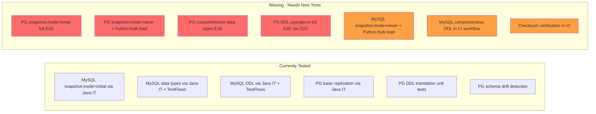
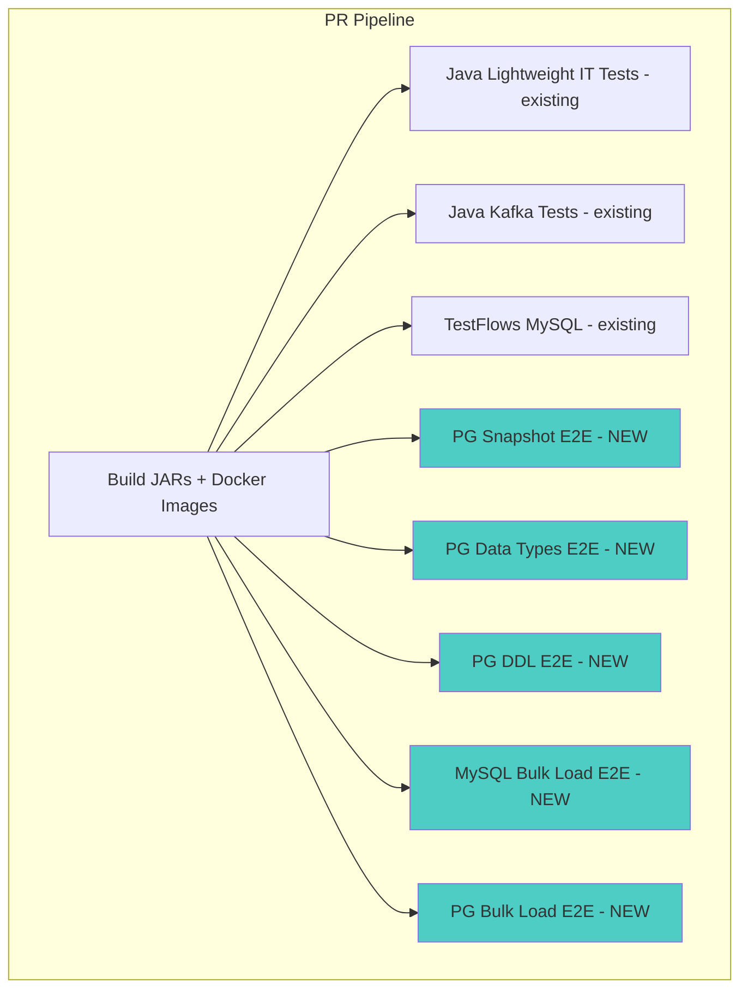
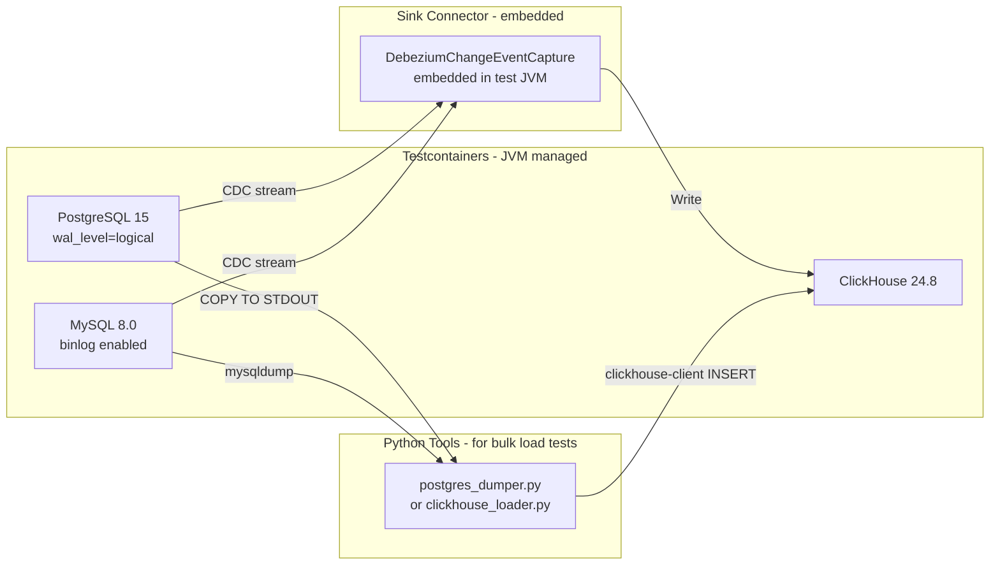

# E2E Integration Test Plan for ClickHouse Sink Connector

## Executive Summary

This document defines a comprehensive end-to-end integration test plan for the ClickHouse sink connector, covering **both MySQL and PostgreSQL** sources. The plan addresses three critical gaps in the current CI pipeline:

1. **Snapshot mode coverage** — testing `snapshot.mode=initial` AND `snapshot.mode=never` with Python bulk load
2. **Data type compatibility** — testing all supported data types for both source databases
3. **DDL operation coverage** — testing all supported DDL operations for both source databases

**Current State**: The existing CI runs Java IT tests via testcontainers and TestFlows Python tests via Docker Compose — but these are **MySQL-only** for the Python/TestFlows layer, and the Java PostgreSQL tests cover only a narrow set of scenarios. No CI test currently exercises the Python bulk load path (`snapshot.mode=never` + `postgres_dumper.py`).

---

## Table of Contents

1. [Current Test Infrastructure Analysis](#1-current-test-infrastructure-analysis)
2. [Gap Analysis](#2-gap-analysis)
3. [Test Matrix](#3-test-matrix)
4. [Architecture](#4-architecture)
5. [Snapshot Mode Tests](#5-snapshot-mode-tests)
6. [Data Type Tests](#6-data-type-tests)
7. [DDL Operation Tests](#7-ddl-operation-tests)
8. [Checksum Verification](#8-checksum-verification)
9. [Workflow Structure](#9-workflow-structure)
10. [Implementation Phases](#10-implementation-phases)

---

## 1. Current Test Infrastructure Analysis

### 1.1 Existing Workflow Files

| Workflow | Purpose | Trigger | Runner |
|----------|---------|---------|--------|
| [`docker-build.yml`](.github/workflows/docker-build.yml) | Build Kafka + Lightweight JARs and Docker images | `workflow_call` | `ubuntu-latest` |
| [`pull-request.yml`](.github/workflows/pull-request.yml) | PR pipeline: build → TestFlows → Java tests | PR events | Various |
| [`sink-connector-lightweight-tests.yml`](.github/workflows/sink-connector-lightweight-tests.yml) | Run Java IT tests for lightweight connector | `workflow_call` | `self-hosted, cx53` |
| [`sink-connector-kafka-tests.yml`](.github/workflows/sink-connector-kafka-tests.yml) | Run Java unit tests for Kafka connector | `workflow_call` | `self-hosted, cx53` |
| [`testflows-sink-connector-lightweight.yml`](.github/workflows/testflows-sink-connector-lightweight.yml) | Run TestFlows Python integration tests | `workflow_call` | `self-hosted, cx53` |

### 1.2 Existing Java Integration Tests

**MySQL Tests** — Located in [`sink-connector-lightweight/src/test/java/com/altinity/clickhouse/debezium/embedded/`](sink-connector-lightweight/src/test/java/com/altinity/clickhouse/debezium/embedded/):

| Test Class | What It Tests |
|------------|---------------|
| [`ClickHouseDebeziumEmbeddedMySqlDockerIT`](sink-connector-lightweight/src/test/java/com/altinity/clickhouse/debezium/embedded/ClickHouseDebeziumEmbeddedMySqlDockerIT.java) | Basic MySQL → ClickHouse replication |
| [`CreateTableDataTypesIT`](sink-connector-lightweight/src/test/java/com/altinity/clickhouse/debezium/embedded/ddl/parser/CreateTableDataTypesIT.java) | MySQL data type mapping via testcontainers |
| [`AlterTableAddColumnIT`](sink-connector-lightweight/src/test/java/com/altinity/clickhouse/debezium/embedded/ddl/parser/AlterTableAddColumnIT.java) | MySQL ALTER TABLE ADD COLUMN |
| [`AlterTableDropColumnCacheIT`](sink-connector-lightweight/src/test/java/com/altinity/clickhouse/debezium/embedded/ddl/parser/AlterTableDropColumnCacheIT.java) | MySQL ALTER TABLE DROP COLUMN |
| [`AlterTableModifyColumnIT`](sink-connector-lightweight/src/test/java/com/altinity/clickhouse/debezium/embedded/ddl/parser/AlterTableModifyColumnIT.java) | MySQL ALTER TABLE MODIFY COLUMN |
| [`TableOperationsIT`](sink-connector-lightweight/src/test/java/com/altinity/clickhouse/debezium/embedded/ddl/parser/TableOperationsIT.java) | MySQL table operations |
| [`TruncateTableIT`](sink-connector-lightweight/src/test/java/com/altinity/clickhouse/debezium/embedded/ddl/parser/TruncateTableIT.java) | MySQL TRUNCATE TABLE |
| [`DateTimeWithTimeZoneIT`](sink-connector-lightweight/src/test/java/com/altinity/clickhouse/debezium/embedded/ddl/parser/DateTimeWithTimeZoneIT.java) | DateTime with timezone |
| [`ReplicatedRMTIT`](sink-connector-lightweight/src/test/java/com/altinity/clickhouse/debezium/embedded/ReplicatedRMTIT.java) | Replicated ReplacingMergeTree |

**PostgreSQL Tests** — Existing but limited:

| Test Class | What It Tests |
|------------|---------------|
| [`PostgresInitialDockerIT`](sink-connector-lightweight/src/test/java/com/altinity/clickhouse/debezium/embedded/PostgresInitialDockerIT.java) | Basic PG → CH replication with decoderbufs, snapshot mode initial |
| [`ClickHouseDebeziumEmbeddedPostgresPgoutputDockerIT`](sink-connector-lightweight/src/test/java/com/altinity/clickhouse/debezium/embedded/ClickHouseDebeziumEmbeddedPostgresPgoutputDockerIT.java) | PG → CH with pgoutput plugin |
| [`PostgresDDLOperationsIT`](sink-connector-lightweight/src/test/java/com/altinity/clickhouse/debezium/embedded/PostgresDDLOperationsIT.java) | DDL translation unit tests against ClickHouse — **parser only, no CDC** |
| [`PostgresSchemaDriftIT`](sink-connector-lightweight/src/test/java/com/altinity/clickhouse/debezium/embedded/PostgresSchemaDriftIT.java) | Schema drift detection and auto-reconciliation |
| [`PostgresDeleteOperationsIT`](sink-connector-lightweight/src/test/java/com/altinity/clickhouse/debezium/embedded/PostgresDeleteOperationsIT.java) | PG DELETE operations |
| [`PostgresUpdateOperationsIT`](sink-connector-lightweight/src/test/java/com/altinity/clickhouse/debezium/embedded/PostgresUpdateOperationsIT.java) | PG UPDATE operations |

### 1.3 Existing Python/TestFlows Integration Tests

Located in [`sink-connector-lightweight/tests/integration/`](sink-connector-lightweight/tests/integration/):

- Framework: **TestFlows** with Docker Compose cluster management
- Source DB: **MySQL only** — no PostgreSQL tests exist
- Tests cover: insert, delete, update, truncate, alter, datatypes, deduplication, autocreate, schema_changes, schema_only, virtual_columns, multiple_databases, multiple_tables, etc.
- Infrastructure: Uses [`cluster.py`](sink-connector-lightweight/tests/integration/helpers/cluster.py) for Docker Compose orchestration
- All tests are run via [`regression.py`](sink-connector-lightweight/tests/integration/regression.py) → [`regression_auto.py`](sink-connector-lightweight/tests/integration/regression_auto.py)

### 1.4 Python Snapshot/Load Tools

Located in [`sink-connector/python/ch_sink_tools/`](sink-connector/python/ch_sink_tools/):

| Tool | Purpose |
|------|---------|
| [`postgres_dumper.py`](sink-connector/python/ch_sink_tools/db_dump/postgres_dumper.py) | PostgreSQL → ClickHouse parallel snapshot loader using COPY + clickhouse-client |
| [`mysql_dumper.py`](sink-connector/python/ch_sink_tools/db_dump/mysql_dumper.py) | MySQL → ClickHouse snapshot loader |
| [`clickhouse_loader.py`](sink-connector/python/ch_sink_tools/db_load/clickhouse_loader.py) | Generic ClickHouse loader from dump files |
| [`postgres_type_mapper.py`](sink-connector/python/ch_sink_tools/db_load/postgres_type_mapper.py) | Complete PostgreSQL → ClickHouse type mapping — 50+ types |

### 1.5 Test Fixtures

| Fixture | Source DB | Content |
|---------|-----------|---------|
| [`init_postgres.sql`](sink-connector-lightweight/src/test/resources/init_postgres.sql) | PostgreSQL | tm table with UUID/numeric/timestamptz/jsonb, protocol_test with bigserial, redata with numeric |
| [`data_types.sql`](sink-connector-lightweight/src/test/resources/data_types.sql) | MySQL | Comprehensive MySQL data types: integers, binary, temporal, numeric, string, spatial, enum, set |
| [`init_clickhouse_it.sql`](sink-connector-lightweight/src/test/resources/init_clickhouse_it.sql) | ClickHouse | Init script for ClickHouse test container |

---

## 2. Gap Analysis

### 2.1 What Is MISSING from Current CI



### 2.2 Critical Gaps Summary

| Gap | Severity | Source DB | Description |
|-----|----------|-----------|-------------|
| **No PG `snapshot.mode=never` test** | 🔴 Critical | PostgreSQL | The Python bulk load path (`postgres_dumper.py`) is never tested in CI |
| **No PG data type E2E test** | 🔴 Critical | PostgreSQL | Only 3 PG types tested via `init_postgres.sql` — need all 40+ |
| **No PG DDL E2E via CDC** | 🔴 Critical | PostgreSQL | `PostgresDDLOperationsIT` tests parser only, not full CDC pipeline |
| **No MySQL `snapshot.mode=never` test** | 🟡 High | MySQL | The `clickhouse_loader.py` bulk load is never tested in CI |
| **No cross-DB checksum validation** | 🟡 High | Both | No automated row count / checksum verification in CI |
| **TestFlows is MySQL-only** | 🟡 High | PostgreSQL | The entire TestFlows Python test suite has zero PG coverage |

---

## 3. Test Matrix

### 3.1 Full Test Matrix

| Test Dimension | MySQL | PostgreSQL |
|----------------|-------|------------|
| `snapshot.mode=initial` | ✅ Existing Java IT | 🔴 **New: E2E test** |
| `snapshot.mode=never` + Python load | 🔴 **New: E2E test** | 🔴 **New: E2E test** |
| Integer types | ✅ Existing Java IT | 🔴 **New: E2E test** |
| Numeric/Decimal types | ✅ Existing Java IT | 🔴 **New: E2E test** |
| String types | ✅ Existing Java IT | 🔴 **New: E2E test** |
| Date/Time types | ✅ Existing Java IT | 🔴 **New: E2E test** |
| Boolean type | ✅ Existing | 🔴 **New: E2E test** |
| UUID type | N/A | 🔴 **New: E2E test** |
| JSON/JSONB types | ✅ Existing | 🔴 **New: E2E test** |
| Binary types | ✅ Existing Java IT | 🔴 **New: E2E test** |
| Array types | N/A | 🟡 **New: E2E test** |
| Network types | N/A | 🟡 **New: E2E test** |
| Geometric types | ✅ Existing | 🟡 **New: E2E test** |
| Enum/Set types | ✅ Existing | N/A |
| CREATE TABLE DDL | ✅ Existing Java IT | 🔴 **New: E2E via CDC** |
| ALTER TABLE ADD COLUMN | ✅ Existing Java IT | 🔴 **New: E2E via CDC** |
| ALTER TABLE DROP COLUMN | ✅ Existing Java IT | 🔴 **New: E2E via CDC** |
| ALTER TABLE MODIFY/CHANGE | ✅ Existing Java IT | 🔴 **New: E2E via CDC** |
| ALTER TABLE RENAME COLUMN | 🟡 Limited | 🔴 **New: E2E via CDC** |
| DROP TABLE | ✅ Existing Java IT | 🔴 **New: E2E via CDC** |
| TRUNCATE TABLE | ✅ Existing Java IT | 🔴 **New: E2E via CDC** |
| RENAME TABLE | ✅ Existing Java IT | 🟡 **New: E2E via CDC** |

### 3.2 Test Jobs for CI



---

## 4. Architecture

### 4.1 Test Framework Choice

All new E2E tests will be implemented as **Java integration tests using Testcontainers**, matching the existing pattern in [`PostgresInitialDockerIT`](sink-connector-lightweight/src/test/java/com/altinity/clickhouse/debezium/embedded/PostgresInitialDockerIT.java). This is the best choice because:

1. **Existing infrastructure** — Testcontainers is already set up with Maven Surefire, ClickHouse containers, and MySQL/PostgreSQL containers
2. **Self-contained** — No external Docker Compose files needed; containers are managed programmatically
3. **CI-friendly** — Already runs in the [`sink-connector-lightweight-tests.yml`](.github/workflows/sink-connector-lightweight-tests.yml) workflow
4. **Java ecosystem** — Direct access to connector internals for deeper verification

For the **Python bulk load tests**, we will use a hybrid approach: Java Testcontainers to spin up the database containers, then invoke the Python tools via `ProcessBuilder` or a dedicated shell script test harness.

### 4.2 Container Architecture Per Test



### 4.3 Test Base Classes

New base classes to standardize test setup:

| Base Class | Purpose |
|------------|---------|
| `PostgresE2EBaseIT` | Start PG + CH containers, configure Debezium properties, provide helper methods |
| `MySQLE2EBaseIT` | Start MySQL + CH containers (extends existing `DDLBaseIT` pattern) |
| `BulkLoadBaseIT` | Start source DB + CH containers, install Python tools, run dump/load |

### 4.4 Test Tagging Strategy

Using JUnit 5 `@Tag` annotations to enable selective test execution:

```java
@Tag("postgres")           // All PostgreSQL tests
@Tag("mysql")              // All MySQL tests
@Tag("snapshot")           // Snapshot mode tests
@Tag("bulk-load")          // Python bulk load tests
@Tag("data-types")         // Data type mapping tests
@Tag("ddl")                // DDL operation tests
@Tag("e2e")                // Full end-to-end tests
```

---

## 5. Snapshot Mode Tests

### 5.1 PostgreSQL `snapshot.mode=initial` Test

**Test class**: `PostgresSnapshotInitialE2EIT`

**Scenario**:
1. Create PostgreSQL container with [`init_postgres_all_types.sql`](sink-connector-lightweight/src/test/resources/) fixture containing tables with diverse data types and pre-populated rows
2. Start ClickHouse container
3. Configure Debezium with `snapshot.mode=initial`
4. Start `DebeziumChangeEventCapture` in background thread
5. Wait for snapshot to complete — verify via offset storage `snapshot` field
6. Verify all tables exist in ClickHouse with correct schemas
7. Verify row counts match between PostgreSQL and ClickHouse
8. Verify sample data values for key data types
9. Insert additional rows in PostgreSQL — verify CDC streaming picks them up
10. Stop connector and verify clean shutdown

**Key assertions**:
- All table schemas auto-created in ClickHouse with correct column types
- Row counts match exactly
- UUID, JSONB, TIMESTAMPTZ, NUMERIC values preserved correctly
- Offset storage shows `last_snapshot_record`, `lsn`, `txId`

### 5.2 PostgreSQL `snapshot.mode=never` + Python Bulk Load

**Test class**: `PostgresBulkLoadE2EIT`

**Scenario**:
1. Create PostgreSQL container with test data
2. Start ClickHouse container
3. Run `postgres_dumper.py` to bulk load data from PG to CH
4. Verify tables and data in ClickHouse match PostgreSQL
5. Verify offset table is populated with correct LSN
6. Configure Debezium with `snapshot.mode=never`
7. Start `DebeziumChangeEventCapture`
8. Insert/update/delete rows in PostgreSQL
9. Verify CDC changes appear in ClickHouse
10. Verify no duplicate rows from snapshot overlap

**Key assertions**:
- Bulk load creates tables with correct types using [`postgres_type_mapper.py`](sink-connector/python/ch_sink_tools/db_load/postgres_type_mapper.py)
- LSN offset is correctly written to ClickHouse offset table
- CDC resumes from correct position without data loss or duplication
- INSERT/UPDATE/DELETE after bulk load are correctly replicated

### 5.3 MySQL `snapshot.mode=initial` Test

Already covered by existing Java IT tests. **No new test needed** — just verify existing [`CreateTableDataTypesIT`](sink-connector-lightweight/src/test/java/com/altinity/clickhouse/debezium/embedded/ddl/parser/CreateTableDataTypesIT.java) runs in CI.

### 5.4 MySQL `snapshot.mode=never` + Python Bulk Load

**Test class**: `MySQLBulkLoadE2EIT`

**Scenario**:
1. Create MySQL container with test data from [`data_types.sql`](sink-connector-lightweight/src/test/resources/data_types.sql)
2. Start ClickHouse container
3. Run `clickhouse_loader.py` to bulk load data
4. Configure Debezium with `snapshot.mode=never`
5. Start connector and verify CDC streaming works
6. Insert/update/delete rows and verify replication

---

## 6. Data Type Tests

### 6.1 PostgreSQL Data Types to Test

Based on the comprehensive mapping in [`postgres_type_mapper.py`](sink-connector/python/ch_sink_tools/db_load/postgres_type_mapper.py) and the test specifications in [`05-data-types-coverage.md`](plans/postgres/05-data-types-coverage.md):

**Test class**: `PostgresDataTypesE2EIT`

#### Integer Types

| PostgreSQL Type | Expected ClickHouse Type | Test Values |
|-----------------|--------------------------|-------------|
| `SMALLINT` / `INT2` | `Int16` | 0, -32768, 32767, NULL |
| `INTEGER` / `INT4` / `SERIAL` | `Int32` | 0, -2147483648, 2147483647, NULL |
| `BIGINT` / `INT8` / `BIGSERIAL` | `Int64` | 0, -9223372036854775808, 9223372036854775807, NULL |

#### Numeric Types

| PostgreSQL Type | Expected ClickHouse Type | Test Values |
|-----------------|--------------------------|-------------|
| `NUMERIC(10,2)` | `Decimal(10,2)` | 12345.67, -99999.99, 0.01, NULL |
| `NUMERIC(21,5)` | `Decimal(21,5)` | 1234567890.12345, -999999.99999, NULL |
| `NUMERIC` | `Decimal(38,9)` or `Decimal(18,6)` | Large values, NULL |
| `REAL` / `FLOAT4` | `Float32` | 3.14159, -2.71828, 1.23e-4, NULL |
| `DOUBLE PRECISION` / `FLOAT8` | `Float64` | Scientific notation, edge cases, NULL |
| `MONEY` | `String` | $1,234.56, NULL |

#### String Types

| PostgreSQL Type | Expected ClickHouse Type | Test Values |
|-----------------|--------------------------|-------------|
| `TEXT` | `String` | Empty string, Unicode, long text, NULL |
| `VARCHAR(255)` | `String` | Standard strings, max length, NULL |
| `CHAR(10)` | `String` | Fixed-width, padding behavior, NULL |
| `BYTEA` | `String` | Binary data, NULL |

#### Date/Time Types

| PostgreSQL Type | Expected ClickHouse Type | Test Values |
|-----------------|--------------------------|-------------|
| `DATE` | `Date32` | 1970-01-01, 2024-02-29 leap year, 2299-12-31, NULL |
| `TIMESTAMP` | `DateTime64(6)` | Min, max, microsecond precision, NULL |
| `TIMESTAMPTZ` | `DateTime64(6)` | Various timezones, UTC, NULL |
| `TIME` | `String` | 00:00:00, 23:59:59.999999, NULL |
| `TIME WITH TIME ZONE` | `String` | Various TZ offsets, NULL |
| `INTERVAL` | `String` | 1 year 2 months, 3 days, NULL |

#### Boolean Type

| PostgreSQL Type | Expected ClickHouse Type | Test Values |
|-----------------|--------------------------|-------------|
| `BOOLEAN` | `UInt8` | true/1, false/0, NULL |

#### UUID Type

| PostgreSQL Type | Expected ClickHouse Type | Test Values |
|-----------------|--------------------------|-------------|
| `UUID` | `UUID` | Standard UUID, nil UUID, NULL |

#### JSON Types

| PostgreSQL Type | Expected ClickHouse Type | Test Values |
|-----------------|--------------------------|-------------|
| `JSON` | `String` | Nested objects, arrays, null JSON, NULL |
| `JSONB` | `String` | Nested objects, arrays, null JSON, NULL |

#### Network Types

| PostgreSQL Type | Expected ClickHouse Type | Test Values |
|-----------------|--------------------------|-------------|
| `INET` | `String` | IPv4, IPv6, CIDR notation, NULL |
| `CIDR` | `String` | Network ranges, NULL |
| `MACADDR` | `String` | Standard MAC, NULL |

#### Geometric Types

| PostgreSQL Type | Expected ClickHouse Type | Test Values |
|-----------------|--------------------------|-------------|
| `POINT` | `String` | Various coordinates, NULL |
| `LINE` | `String` | Line equations, NULL |
| `POLYGON` | `String` | Simple polygons, NULL |
| `CIRCLE` | `String` | Various circles, NULL |

#### Special Types

| PostgreSQL Type | Expected ClickHouse Type | Test Values |
|-----------------|--------------------------|-------------|
| `BIT` | `String` | Bit strings, NULL |
| `BIT VARYING` | `String` | Variable bit strings, NULL |
| `TSVECTOR` | `String` | Full-text search vectors, NULL |
| `XML` | `String` | XML documents, NULL |
| `INT4RANGE` | `String` | Integer ranges, NULL |
| `TSTZRANGE` | `String` | Timestamp ranges, NULL |

#### SQL Fixture File

Create [`init_postgres_all_types.sql`](sink-connector-lightweight/src/test/resources/init_postgres_all_types.sql) with all the above types in a single test table with edge case values pre-populated.

### 6.2 MySQL Data Types to Test

The existing [`data_types.sql`](sink-connector-lightweight/src/test/resources/data_types.sql) already covers most MySQL types. Verify the following are included in CI:

| MySQL Type | Expected ClickHouse Type | Status |
|------------|--------------------------|--------|
| `TINYINT` / `TINYINT UNSIGNED` | `Int8` / `UInt8` | ✅ Existing |
| `SMALLINT` / `SMALLINT UNSIGNED` | `Int16` / `UInt16` | ✅ Existing |
| `MEDIUMINT` / `MEDIUMINT UNSIGNED` | `Int32` / `UInt32` | ✅ Existing |
| `INT` / `INT UNSIGNED` | `Int32` / `UInt32` | ✅ Existing |
| `BIGINT` / `BIGINT UNSIGNED` | `Int64` / `UInt64` | ✅ Existing |
| `FLOAT` | `Float32` | ✅ Existing |
| `DOUBLE` | `Float64` | ✅ Existing |
| `DECIMAL(p,s)` | `Decimal(p,s)` | ✅ Existing |
| `DATE` | `Date32` | ✅ Existing |
| `DATETIME(0-6)` | `DateTime64(0-6)` | ✅ Existing |
| `TIMESTAMP(0-6)` | `DateTime64(0-6)` | ✅ Existing |
| `TIME` | `String` | ✅ Existing |
| `YEAR` | `Int32` | ✅ Existing |
| `CHAR` / `VARCHAR` | `String` | ✅ Existing |
| `TEXT` / variants | `String` | ✅ Existing |
| `BINARY` / `VARBINARY` | `String` | ✅ Existing |
| `BLOB` / variants | `String` | ✅ Existing |
| `ENUM` | `String` | ✅ Existing |
| `SET` | `String` | ✅ Existing |
| `JSON` | `String` | ✅ Existing |
| `POINT` / `GEOMETRY` | `String` | ✅ Existing |
| `BIT` | `String` | ✅ Existing |

**Action**: No new MySQL data type tests needed — existing coverage is comprehensive. Focus on ensuring these tests run reliably in CI.

---

## 7. DDL Operation Tests

### 7.1 PostgreSQL DDL Operations

**Current state**: [`PostgresDDLOperationsIT`](sink-connector-lightweight/src/test/java/com/altinity/clickhouse/debezium/embedded/PostgresDDLOperationsIT.java) tests DDL **translation only** — it translates PostgreSQL DDL via the parser and executes it on ClickHouse, but does **not** test the full CDC pipeline with event triggers.

**New test class**: `PostgresDDLCdcE2EIT`

This test requires the DDL event trigger system from [`10-postgresql-ddl-architecture.md`](plans/postgres/10-postgresql-ddl-architecture.md) to be deployed on the PostgreSQL container.

#### DDL Operations to Test

| Operation | PostgreSQL DDL | Expected ClickHouse Result | Priority |
|-----------|---------------|---------------------------|----------|
| CREATE TABLE | `CREATE TABLE t1 ...` | Table created with ReplacingMergeTree, _sign, _version | 🔴 P0 |
| ALTER TABLE ADD COLUMN | `ALTER TABLE t1 ADD COLUMN col1 TEXT` | Column added as Nullable | 🔴 P0 |
| ALTER TABLE DROP COLUMN | `ALTER TABLE t1 DROP COLUMN col1` | Column removed | 🔴 P0 |
| ALTER TABLE ALTER TYPE | `ALTER TABLE t1 ALTER COLUMN col1 TYPE BIGINT` | Column type changed | 🟡 P1 |
| ALTER TABLE RENAME COLUMN | `ALTER TABLE t1 RENAME COLUMN old TO new` | Column renamed | 🟡 P1 |
| DROP TABLE | `DROP TABLE t1` | Table dropped | 🔴 P0 |
| TRUNCATE TABLE | `TRUNCATE TABLE t1` | Table emptied | 🔴 P0 |
| CREATE TABLE IF NOT EXISTS | `CREATE TABLE IF NOT EXISTS t1 ...` | Idempotent creation | 🟡 P1 |
| DROP TABLE IF EXISTS | `DROP TABLE IF EXISTS t1` | Idempotent drop | 🟡 P1 |

#### DDL E2E Test Scenario

```
1. Start PostgreSQL with DDL event triggers installed
2. Start ClickHouse
3. Start CDC connector with snapshot.mode=initial
4. Wait for initial snapshot
5. Execute DDL on PostgreSQL:
   a. CREATE TABLE new_table (id SERIAL PRIMARY KEY, name TEXT)
   b. Wait for table to appear in ClickHouse
   c. INSERT INTO new_table VALUES (1, 'test')
   d. Wait for row in ClickHouse
   e. ALTER TABLE new_table ADD COLUMN email TEXT
   f. Wait for column in ClickHouse
   g. INSERT INTO new_table VALUES (2, 'test2', 'test@example.com')
   h. Verify row with new column in ClickHouse
   i. ALTER TABLE new_table DROP COLUMN email
   j. Verify column removed in ClickHouse
   k. TRUNCATE TABLE new_table
   l. Verify table empty in ClickHouse
   m. DROP TABLE new_table
   n. Verify table gone from ClickHouse
6. Stop connector
```

### 7.2 MySQL DDL Operations

Existing Java IT tests already cover MySQL DDL operations comprehensively. The following are already tested:

| Operation | Test Class | Status |
|-----------|-----------|--------|
| CREATE TABLE | [`AutoCreateTableIT`](sink-connector-lightweight/src/test/java/com/altinity/clickhouse/debezium/embedded/ddl/parser/AutoCreateTableIT.java) | ✅ Existing |
| ALTER TABLE ADD COLUMN | [`AlterTableAddColumnIT`](sink-connector-lightweight/src/test/java/com/altinity/clickhouse/debezium/embedded/ddl/parser/AlterTableAddColumnIT.java) | ✅ Existing |
| ALTER TABLE DROP COLUMN | [`AlterTableDropColumnCacheIT`](sink-connector-lightweight/src/test/java/com/altinity/clickhouse/debezium/embedded/ddl/parser/AlterTableDropColumnCacheIT.java) | ✅ Existing |
| ALTER TABLE MODIFY COLUMN | [`AlterTableModifyColumnIT`](sink-connector-lightweight/src/test/java/com/altinity/clickhouse/debezium/embedded/ddl/parser/AlterTableModifyColumnIT.java) | ✅ Existing |
| ALTER TABLE CHANGE COLUMN | [`AlterTableChangeColumnIT`](sink-connector-lightweight/src/test/java/com/altinity/clickhouse/debezium/embedded/ddl/parser/AlterTableChangeColumnIT.java) | ✅ Existing |
| TRUNCATE TABLE | [`TruncateTableIT`](sink-connector-lightweight/src/test/java/com/altinity/clickhouse/debezium/embedded/ddl/parser/TruncateTableIT.java) | ✅ Existing |
| Table Operations | [`TableOperationsIT`](sink-connector-lightweight/src/test/java/com/altinity/clickhouse/debezium/embedded/ddl/parser/TableOperationsIT.java) | ✅ Existing |

**Action**: No new MySQL DDL tests needed. Focus on ensuring existing tests run reliably in CI.

---

## 8. Checksum Verification

### 8.1 Verification Strategy

Each E2E test should verify data integrity using these methods:

| Method | What It Verifies | Implementation |
|--------|-----------------|----------------|
| **Row count match** | No missing/duplicate rows | `SELECT count(*) FROM source_table` vs `SELECT count(*) FROM ch_table FINAL` |
| **Column type match** | Correct type mapping | Query `system.columns` and compare against expected types |
| **Sample value match** | Data correctness | Select known rows by PK and compare column values |
| **NULL handling** | NULL preservation | Verify NULLs in source appear as NULLs in ClickHouse |
| **Edge case values** | Boundary conditions | Min/max values, empty strings, zero dates, etc. |

### 8.2 Checksum Helper Methods

Create a shared utility class `E2EVerificationHelper`:

```java
public class E2EVerificationHelper {
    // Verify row count matches between source and ClickHouse
    static void assertRowCountMatch(Connection source, Connection ch, 
                                     String sourceTable, String chTable);
    
    // Verify column types match expected mapping
    static void assertColumnTypes(Connection ch, String table, 
                                   Map<String, String> expectedTypes);
    
    // Verify specific row values
    static void assertRowValues(Connection ch, String table, 
                                 String pkColumn, Object pkValue, 
                                 Map<String, Object> expectedValues);
    
    // Wait for replication to catch up
    static void waitForReplication(Connection ch, String table, 
                                    int expectedRows, Duration timeout);
}
```

### 8.3 Using Existing Checksum Tools

For the Python bulk load tests, leverage the existing checksum tools:

- [`postgres_table_checksum.py`](sink-connector/python/ch_sink_tools/db_compare/postgres_table_checksum.py) — PostgreSQL → ClickHouse row comparison
- [`clickhouse_table_checksum.py`](sink-connector/python/ch_sink_tools/db_compare/clickhouse_table_checksum.py) — ClickHouse checksum computation
- [`top_level_postgres_checksum.py`](sink-connector/python/ch_sink_tools/db_compare/top_level_postgres_checksum.py) — Top-level PostgreSQL checksum orchestration

---

## 9. Workflow Structure

### 9.1 New GitHub Actions Workflow

Create a new reusable workflow: `.github/workflows/e2e-integration-tests.yml`

```yaml
name: E2E Integration Tests

on:
  workflow_call:
    inputs:
      SINK_CONNECTOR_IMAGE:
        description: Lightweight connector docker image
        required: true
        type: string
  workflow_dispatch:
    inputs:
      SINK_CONNECTOR_IMAGE:
        description: Lightweight connector docker image
        required: true
        type: string

jobs:
  # Job 1: PostgreSQL E2E tests
  postgres-e2e:
    runs-on: [self-hosted, on-demand, type-cx53, image-x86-app-docker-ce]
    steps:
      - uses: actions/checkout@v2
      - name: Set up JDK 17
        uses: actions/setup-java@v3
        with:
          java-version: 17
          distribution: temurin
          cache: maven
      - name: Build Library
        working-directory: sink-connector
        run: mvn clean install -DskipTests=true
      - name: Run PostgreSQL E2E Tests
        working-directory: sink-connector-lightweight
        run: >
          mvn test -pl . 
          -Dgroups="postgres,e2e"
          -Dsurefire.failIfNoSpecifiedTests=false
      - name: Publish Test Report
        uses: mikepenz/action-junit-report@v4
        if: always()
        with:
          report_paths: sink-connector-lightweight/target/surefire-reports/*.xml
          check_name: PostgreSQL E2E Test Report
          fail_on_failure: true

  # Job 2: Bulk load E2E tests
  bulk-load-e2e:
    runs-on: [self-hosted, on-demand, type-cx53, image-x86-app-docker-ce]
    steps:
      - uses: actions/checkout@v2
      - name: Set up JDK 17
        uses: actions/setup-java@v3
        with:
          java-version: 17
          distribution: temurin
          cache: maven
      - name: Set up Python 3.12
        uses: actions/setup-python@v5
        with:
          python-version: 3.12
      - name: Install Python dependencies
        working-directory: sink-connector/python
        run: pip install -e .
      - name: Build Library
        working-directory: sink-connector
        run: mvn clean install -DskipTests=true
      - name: Run Bulk Load E2E Tests
        working-directory: sink-connector-lightweight
        run: >
          mvn test -pl .
          -Dgroups="bulk-load,e2e"
          -Dsurefire.failIfNoSpecifiedTests=false
      - name: Publish Test Report
        uses: mikepenz/action-junit-report@v4
        if: always()
        with:
          report_paths: sink-connector-lightweight/target/surefire-reports/*.xml
          check_name: Bulk Load E2E Test Report
          fail_on_failure: true
```

### 9.2 Integration with Existing PR Pipeline

Update [`pull-request.yml`](.github/workflows/pull-request.yml) to include the new workflow:

```yaml
  # Add after existing java-tests-lightweight job
  e2e-tests:
    needs: [build-kafka-lightweight]
    uses: ./.github/workflows/e2e-integration-tests.yml
    secrets: inherit
    with:
      SINK_CONNECTOR_IMAGE: >-
        altinityinfra/clickhouse-sink-connector:${{ github.event.number }}-${{ github.sha }}-lt
```

### 9.3 Estimated Job Durations

| Job | Expected Duration | Parallelizable |
|-----|-------------------|----------------|
| PostgreSQL Snapshot E2E | ~5-8 min | Yes |
| PostgreSQL Data Types E2E | ~5-8 min | Yes |
| PostgreSQL DDL E2E | ~5-8 min | Yes |
| PostgreSQL Bulk Load E2E | ~8-12 min | Yes |
| MySQL Bulk Load E2E | ~8-12 min | Yes |
| **Total wall-clock time** | **~12 min** with parallelism | |

All jobs run independently and can execute in parallel, staying well within the 30-minute constraint.

---

## 10. Implementation Phases

### Phase 1: Foundation — PostgreSQL Snapshot + Data Types

**Goal**: Establish PG E2E test infrastructure and cover the most critical gaps

1. Create `PostgresE2EBaseIT` base class with shared PG + CH container setup
2. Create `E2EVerificationHelper` utility class for data verification
3. Create `init_postgres_all_types.sql` test fixture with all 40+ PG data types
4. Implement `PostgresSnapshotInitialE2EIT` — full E2E snapshot test
5. Implement `PostgresDataTypesE2EIT` — verify all PG data type mappings via CDC

### Phase 2: PostgreSQL DDL E2E via CDC

**Goal**: Test DDL operations through the full CDC pipeline

1. Create `init_postgres_ddl_triggers.sql` fixture that installs event triggers
2. Implement `PostgresDDLCdcE2EIT` — CREATE, ALTER ADD/DROP/RENAME, DROP, TRUNCATE via CDC
3. Add DDL lifecycle test: CREATE → INSERT → ALTER → INSERT → DROP

### Phase 3: Python Bulk Load E2E

**Goal**: Test the `snapshot.mode=never` path with Python bulk load tools

1. Implement `PostgresBulkLoadE2EIT` — run `postgres_dumper.py` then start CDC
2. Implement `MySQLBulkLoadE2EIT` — run `clickhouse_loader.py` then start CDC  
3. Verify LSN/binlog offset handoff between bulk load and CDC connector

### Phase 4: CI Workflow Integration

**Goal**: Wire everything into GitHub Actions

1. Create `.github/workflows/e2e-integration-tests.yml` reusable workflow
2. Update `.github/workflows/pull-request.yml` to call the new workflow
3. Add JUnit test report publishing
4. Add test artifact collection for failure debugging

### Phase 5: Hardening and Edge Cases

**Goal**: Expand coverage and improve reliability

1. Add timezone-sensitive date/time tests for PostgreSQL
2. Add large-batch tests — 10K+ rows for snapshot performance verification
3. Add concurrent DDL + DML tests
4. Add connector restart/recovery tests
5. Add multi-schema PostgreSQL tests

---

## Appendix A: New Files to Create

| File | Purpose |
|------|---------|
| `sink-connector-lightweight/src/test/java/.../PostgresE2EBaseIT.java` | Base class for PG E2E tests |
| `sink-connector-lightweight/src/test/java/.../PostgresSnapshotInitialE2EIT.java` | PG snapshot.mode=initial test |
| `sink-connector-lightweight/src/test/java/.../PostgresDataTypesE2EIT.java` | PG data type mapping test |
| `sink-connector-lightweight/src/test/java/.../PostgresDDLCdcE2EIT.java` | PG DDL via full CDC pipeline |
| `sink-connector-lightweight/src/test/java/.../PostgresBulkLoadE2EIT.java` | PG snapshot.mode=never + Python load |
| `sink-connector-lightweight/src/test/java/.../MySQLBulkLoadE2EIT.java` | MySQL snapshot.mode=never + Python load |
| `sink-connector-lightweight/src/test/java/.../E2EVerificationHelper.java` | Shared verification utilities |
| `sink-connector-lightweight/src/test/resources/init_postgres_all_types.sql` | PG fixture with all data types |
| `sink-connector-lightweight/src/test/resources/init_postgres_ddl_triggers.sql` | PG DDL event trigger setup |
| `.github/workflows/e2e-integration-tests.yml` | New CI workflow for E2E tests |

## Appendix B: Existing Files to Modify

| File | Change |
|------|--------|
| [`.github/workflows/pull-request.yml`](.github/workflows/pull-request.yml) | Add `e2e-tests` job calling new workflow |
| [`sink-connector-lightweight/pom.xml`](sink-connector-lightweight/pom.xml) | Potentially add Surefire configuration for tag-based test groups |

## Appendix C: Dependencies

- **Testcontainers** — already in `pom.xml`
- **PostgreSQL JDBC driver** — already in `pom.xml`
- **ClickHouse JDBC driver** — already in `pom.xml`
- **Python 3.12+** — needed on CI runner for bulk load tests
- **ch_sink_tools Python package** — installed from [`sink-connector/python/`](sink-connector/python/)
