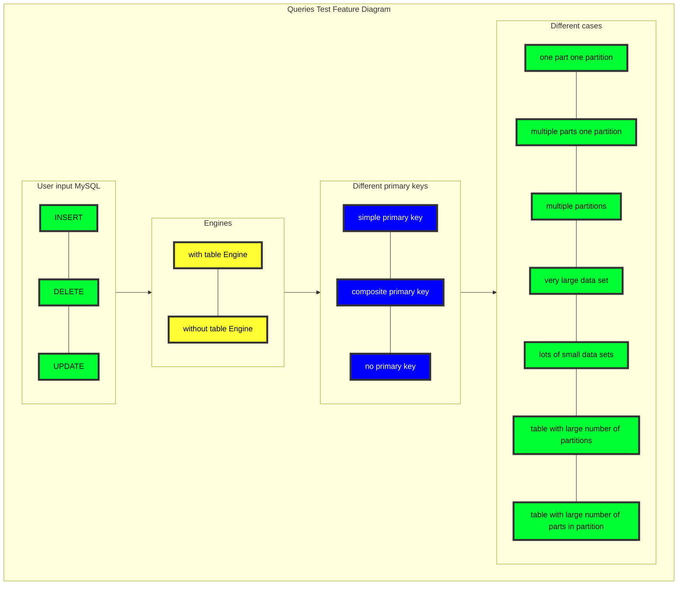
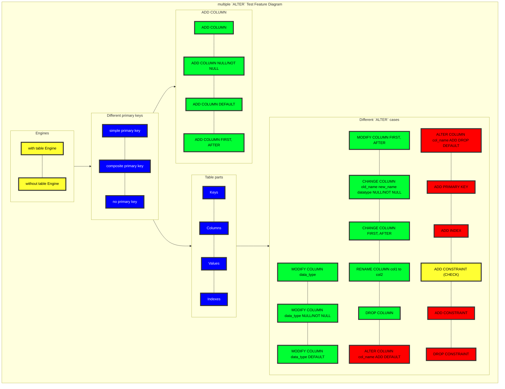

# SRS030 MySQL to ClickHouse Replication
# Software Requirements Specification

## Table of Contents

* 1 [Introduction](#introduction)
* 2 [Terminology](#terminology)
    * 2.1 [SRS](#srs)
    * 2.2 [MySQL](#mysql)
* 3 [Requirements](#requirements)
    * 3.1 [General](#general)
        * 3.1.1 [RQ.SRS-030.ClickHouse.MySQLToClickHouseReplication](#rqsrs-030clickhousemysqltoclickhousereplication)
    * 3.2 [Consistency](#consistency)
        * 3.2.1 [RQ.SRS-030.ClickHouse.MySQLToClickHouseReplication.Consistency](#rqsrs-030clickhousemysqltoclickhousereplicationconsistency)
        * 3.2.2 [Multiple MySQL Masters](#multiple-mysql-masters)
            * 3.2.2.1 [RQ.SRS-030.ClickHouse.MySQLToClickHouseReplication.Consistency.MultipleMySQLMasters](#rqsrs-030clickhousemysqltoclickhousereplicationconsistencymultiplemysqlmasters)
        * 3.2.3 [Deduplication](#deduplication)
            * 3.2.3.1 [RQ.SRS-030.ClickHouse.MySQLToClickHouseReplication.Consistency.Deduplication](#rqsrs-030clickhousemysqltoclickhousereplicationconsistencydeduplication)
        * 3.2.4 [Selects](#selects)
            * 3.2.4.1 [RQ.SRS-030.ClickHouse.MySQLToClickHouseReplication.Consistency.Select](#rqsrs-030clickhousemysqltoclickhousereplicationconsistencyselect)
        * 3.2.5 [Only Once Guarantee](#only-once-guarantee)
            * 3.2.5.1 [RQ.SRS-030.ClickHouse.MySQLToClickHouseReplication.OnlyOnceGuarantee](#rqsrs-030clickhousemysqltoclickhousereplicationonlyonceguarantee)
    * 3.3 [Transactions](#transactions)
        * 3.3.1 [RQ.SRS-030.ClickHouse.MySQLToClickHouseReplication.Transactions](#rqsrs-030clickhousemysqltoclickhousereplicationtransactions)
    * 3.4 [Supported Versions](#supported-versions)
        * 3.4.1 [RQ.SRS-030.ClickHouse.MySQLToClickHouseReplication.MySQLVersions](#rqsrs-030clickhousemysqltoclickhousereplicationmysqlversions)
    * 3.5 [Supported Storage Engines](#supported-storage-engines)
        * 3.5.1 [RQ.SRS-030.ClickHouse.MySQLToClickHouseReplication.MySQLStorageEngines.ReplacingMergeTree](#rqsrs-030clickhousemysqltoclickhousereplicationmysqlstorageenginesreplacingmergetree)
            * 3.5.1.1 [RQ.SRS-030.ClickHouse.MySQLToClickHouseReplication.MySQLStorageEngines.ReplacingMergeTree.VirtualColumnNames](#rqsrs-030clickhousemysqltoclickhousereplicationmysqlstorageenginesreplacingmergetreevirtualcolumnnames)
        * 3.5.2 [RQ.SRS-030.ClickHouse.MySQLToClickHouseReplication.MySQLStorageEngines.ReplicatedReplacingMergeTree](#rqsrs-030clickhousemysqltoclickhousereplicationmysqlstorageenginesreplicatedreplacingmergetree)
            * 3.5.2.1 [RQ.SRS-030.ClickHouse.MySQLToClickHouseReplication.MySQLStorageEngines.ReplicatedReplacingMergeTree.DifferentVersionColumnNames](#rqsrs-030clickhousemysqltoclickhousereplicationmysqlstorageenginesreplicatedreplacingmergetreedifferentversioncolumnnames)
    * 3.6 [Data Types](#data-types)
        * 3.6.1 [Integer Types](#integer-types)
            * 3.6.1.1 [RQ.SRS-030.ClickHouse.MySQLToClickHouseReplication.DataTypes.IntegerTypes](#rqsrs-030clickhousemysqltoclickhousereplicationdatatypesintegertypes)
        * 3.6.2 [Decimal](#decimal)
            * 3.6.2.1 [RQ.SRS-030.ClickHouse.MySQLToClickHouseReplication.DataTypes.Decimal](#rqsrs-030clickhousemysqltoclickhousereplicationdatatypesdecimal)
        * 3.6.3 [Double](#double)
            * 3.6.3.1 [RQ.SRS-030.ClickHouse.MySQLToClickHouseReplication.DataTypes.Double](#rqsrs-030clickhousemysqltoclickhousereplicationdatatypesdouble)
        * 3.6.4 [DateTime](#datetime)
            * 3.6.4.1 [RQ.SRS-030.ClickHouse.MySQLToClickHouseReplication.DataTypes.DateTime](#rqsrs-030clickhousemysqltoclickhousereplicationdatatypesdatetime)
        * 3.6.5 [Binary](#binary)
            * 3.6.5.1 [RQ.SRS-030.ClickHouse.MySQLToClickHouseReplication.DataTypes.Binary](#rqsrs-030clickhousemysqltoclickhousereplicationdatatypesbinary)
        * 3.6.6 [String](#string)
            * 3.6.6.1 [RQ.SRS-030.ClickHouse.MySQLToClickHouseReplication.DataTypes.String](#rqsrs-030clickhousemysqltoclickhousereplicationdatatypesstring)
        * 3.6.7 [Blob Types](#blob-types)
            * 3.6.7.1 [RQ.SRS-030.ClickHouse.MySQLToClickHouseReplication.DataTypes.BlobTypes](#rqsrs-030clickhousemysqltoclickhousereplicationdatatypesblobtypes)
        * 3.6.8 [Nullable](#nullable)
            * 3.6.8.1 [RQ.SRS-030.ClickHouse.MySQLToClickHouseReplication.DataTypes.Nullable](#rqsrs-030clickhousemysqltoclickhousereplicationdatatypesnullable)
        * 3.6.9 [Enum](#enum)
            * 3.6.9.1 [RQ.SRS-030.ClickHouse.MySQLToClickHouseReplication.DataTypes.EnumToEnum](#rqsrs-030clickhousemysqltoclickhousereplicationdatatypesenumtoenum)
            * 3.6.9.2 [RQ.SRS-030.ClickHouse.MySQLToClickHouseReplication.DataTypes.EnumToString](#rqsrs-030clickhousemysqltoclickhousereplicationdatatypesenumtostring)
        * 3.6.10 [JSON](#json)
            * 3.6.10.1 [RQ.SRS-030.ClickHouse.MySQLToClickHouseReplication.DataTypes.JSON](#rqsrs-030clickhousemysqltoclickhousereplicationdatatypesjson)
        * 3.6.11 [Year](#year)
            * 3.6.11.1 [RQ.SRS-030.ClickHouse.MySQLToClickHouseReplication.DataTypes.Year](#rqsrs-030clickhousemysqltoclickhousereplicationdatatypesyear)
        * 3.6.12 [Bytes](#bytes)
            * 3.6.12.1 [RQ.SRS-030.ClickHouse.MySQLToClickHouseReplication.DataTypes.Bytes](#rqsrs-030clickhousemysqltoclickhousereplicationdatatypesbytes)
    * 3.7 [Queries](#queries)
        * 3.7.1 [Test Feature Diagram](#test-feature-diagram)
        * 3.7.2 [Inserts](#inserts)
            * 3.7.2.1 [RQ.SRS-030.ClickHouse.MySQLToClickHouseReplication.Queries.Inserts](#rqsrs-030clickhousemysqltoclickhousereplicationqueriesinserts)
                * 3.7.2.1.1 [RQ.SRS-030.ClickHouse.MySQLToClickHouseReplication.Queries.Inserts.PartitionLimits](#rqsrs-030clickhousemysqltoclickhousereplicationqueriesinsertspartitionlimits)
        * 3.7.3 [Updates](#updates)
            * 3.7.3.1 [RQ.SRS-030.ClickHouse.MySQLToClickHouseReplication.Queries.Updates](#rqsrs-030clickhousemysqltoclickhousereplicationqueriesupdates)
        * 3.7.4 [Deletes](#deletes)
            * 3.7.4.1 [RQ.SRS-030.ClickHouse.MySQLToClickHouseReplication.Queries.Deletes](#rqsrs-030clickhousemysqltoclickhousereplicationqueriesdeletes)
    * 3.8 [Table Schema Creation](#table-schema-creation)
        * 3.8.1 [RQ.SRS-030.ClickHouse.MySQLToClickHouseReplication.TableSchemaCreation](#rqsrs-030clickhousemysqltoclickhousereplicationtableschemacreation)
        * 3.8.2 [Auto Create](#auto-create)
            * 3.8.2.1 [RQ.SRS-030.ClickHouse.MySQLToClickHouseReplication.TableSchemaCreation.AutoCreate](#rqsrs-030clickhousemysqltoclickhousereplicationtableschemacreationautocreate)
            * 3.8.2.2 [RQ.SRS-030.ClickHouse.MySQLToClickHouseReplication.TableSchemaCreation.MultipleAutoCreate](#rqsrs-030clickhousemysqltoclickhousereplicationtableschemacreationmultipleautocreate)
        * 3.8.3 [Auto Drop](#auto-drop)
            * 3.8.3.1 [RQ.SRS-030.ClickHouse.MySQLToClickHouseReplication.TableSchemaCreation.AutoDrop](#rqsrs-030clickhousemysqltoclickhousereplicationtableschemacreationautodrop)
    * 3.9 [Alter](#alter)
        * 3.9.1 [RQ.SRS-030.ClickHouse.MySQLToClickHouseReplication.Alter](#rqsrs-030clickhousemysqltoclickhousereplicationalter)
        * 3.9.2 [Test `ALTER` Feature Diagram](#test-alter-feature-diagram)
        * 3.9.3 [Test multiple `ALTER` Feature Diagram](#test-multiple-alter-feature-diagram)
        * 3.9.4 [Add Index](#add-index)
            * 3.9.4.1 [RQ.SRS-030.ClickHouse.MySQLToClickHouseReplication.Alter.AddIndex](#rqsrs-030clickhousemysqltoclickhousereplicationalteraddindex)
        * 3.9.5 [Add Key](#add-key)
            * 3.9.5.1 [RQ.SRS-030.ClickHouse.MySQLToClickHouseReplication.Alter.AddKey](#rqsrs-030clickhousemysqltoclickhousereplicationalteraddkey)
        * 3.9.6 [Add FullText](#add-fulltext)
            * 3.9.6.1 [RQ.SRS-030.ClickHouse.MySQLToClickHouseReplication.Alter.AddFullText](#rqsrs-030clickhousemysqltoclickhousereplicationalteraddfulltext)
        * 3.9.7 [Add Special](#add-special)
            * 3.9.7.1 [RQ.SRS-030.ClickHouse.MySQLToClickHouseReplication.Alter.AddSpecial](#rqsrs-030clickhousemysqltoclickhousereplicationalteraddspecial)
        * 3.9.8 [Drop Check](#drop-check)
            * 3.9.8.1 [RQ.SRS-030.ClickHouse.MySQLToClickHouseReplication.Alter.DropCheck](#rqsrs-030clickhousemysqltoclickhousereplicationalterdropcheck)
        * 3.9.9 [Drop Default](#drop-default)
            * 3.9.9.1 [RQ.SRS-030.ClickHouse.MySQLToClickHouseReplication.Alter.DropDefault](#rqsrs-030clickhousemysqltoclickhousereplicationalterdropdefault)
        * 3.9.10 [Check](#check)
            * 3.9.10.1 [RQ.SRS-030.ClickHouse.MySQLToClickHouseReplication.Alter.Check](#rqsrs-030clickhousemysqltoclickhousereplicationaltercheck)
        * 3.9.11 [Constraint](#constraint)
            * 3.9.11.1 [RQ.SRS-030.ClickHouse.MySQLToClickHouseReplication.Alter.Constraint](#rqsrs-030clickhousemysqltoclickhousereplicationalterconstraint)
        * 3.9.12 [Index](#index)
            * 3.9.12.1 [RQ.SRS-030.ClickHouse.MySQLToClickHouseReplication.Alter.Index](#rqsrs-030clickhousemysqltoclickhousereplicationalterindex)
        * 3.9.13 [Character Set](#character-set)
            * 3.9.13.1 [RQ.SRS-030.ClickHouse.MySQLToClickHouseReplication.Alter.CharacterSet](#rqsrs-030clickhousemysqltoclickhousereplicationaltercharacterset)
        * 3.9.14 [Convert To Character Set](#convert-to-character-set)
            * 3.9.14.1 [RQ.SRS-030.ClickHouse.MySQLToClickHouseReplication.Alter.ConvertToCharacterSet](#rqsrs-030clickhousemysqltoclickhousereplicationalterconverttocharacterset)
        * 3.9.15 [Algorithm](#algorithm)
            * 3.9.15.1 [RQ.SRS-030.ClickHouse.MySQLToClickHouseReplication.Alter.Algorithm](#rqsrs-030clickhousemysqltoclickhousereplicationalteralgorithm)
        * 3.9.16 [Force](#force)
            * 3.9.16.1 [RQ.SRS-030.ClickHouse.MySQLToClickHouseReplication.Alter.Force](#rqsrs-030clickhousemysqltoclickhousereplicationalterforce)
        * 3.9.17 [Lock](#lock)
            * 3.9.17.1 [RQ.SRS-030.ClickHouse.MySQLToClickHouseReplication.Alter.Lock](#rqsrs-030clickhousemysqltoclickhousereplicationalterlock)
        * 3.9.18 [Unlock](#unlock)
            * 3.9.18.1 [RQ.SRS-030.ClickHouse.MySQLToClickHouseReplication.Alter.Unlock](#rqsrs-030clickhousemysqltoclickhousereplicationalterunlock)
        * 3.9.19 [Validation](#validation)
            * 3.9.19.1 [RQ.SRS-030.ClickHouse.MySQLToClickHouseReplication.Alter.Validation](#rqsrs-030clickhousemysqltoclickhousereplicationaltervalidation)
        * 3.9.20 [Columns](#columns)
            * 3.9.20.1 [Add](#add)
                * 3.9.20.1.1 [RQ.SRS-030.ClickHouse.MySQLToClickHouseReplication.Alter.Columns.Add](#rqsrs-030clickhousemysqltoclickhousereplicationaltercolumnsadd)
                * 3.9.20.1.2 [RQ.SRS-030.ClickHouse.MySQLToClickHouseReplication.Alter.Columns.Add.NullNotNull](#rqsrs-030clickhousemysqltoclickhousereplicationaltercolumnsaddnullnotnull)
                * 3.9.20.1.3 [RQ.SRS-030.ClickHouse.MySQLToClickHouseReplication.Alter.Columns.Add.Default](#rqsrs-030clickhousemysqltoclickhousereplicationaltercolumnsadddefault)
                * 3.9.20.1.4 [RQ.SRS-030.ClickHouse.MySQLToClickHouseReplication.Alter.Columns.Add.FirstAfter](#rqsrs-030clickhousemysqltoclickhousereplicationaltercolumnsaddfirstafter)
                * 3.9.20.1.5 [RQ.SRS-030.ClickHouse.MySQLToClickHouseReplication.Alter.Columns.Add.Multiple](#rqsrs-030clickhousemysqltoclickhousereplicationaltercolumnsaddmultiple)
            * 3.9.20.2 [Modify](#modify)
                * 3.9.20.2.1 [RQ.SRS-030.ClickHouse.MySQLToClickHouseReplication.Alter.Columns.Modify](#rqsrs-030clickhousemysqltoclickhousereplicationaltercolumnsmodify)
                * 3.9.20.2.2 [RQ.SRS-030.ClickHouse.MySQLToClickHouseReplication.Alter.Columns.Modify.NullNotNull](#rqsrs-030clickhousemysqltoclickhousereplicationaltercolumnsmodifynullnotnull)
                * 3.9.20.2.3 [RQ.SRS-030.ClickHouse.MySQLToClickHouseReplication.Alter.Columns.Modify.Default](#rqsrs-030clickhousemysqltoclickhousereplicationaltercolumnsmodifydefault)
                * 3.9.20.2.4 [RQ.SRS-030.ClickHouse.MySQLToClickHouseReplication.Alter.Columns.Modify.FirstAfter](#rqsrs-030clickhousemysqltoclickhousereplicationaltercolumnsmodifyfirstafter)
                * 3.9.20.2.5 [RQ.SRS-030.ClickHouse.MySQLToClickHouseReplication.Alter.Columns.Modify.Multiple](#rqsrs-030clickhousemysqltoclickhousereplicationaltercolumnsmodifymultiple)
            * 3.9.20.3 [Change](#change)
                * 3.9.20.3.1 [RQ.SRS-030.ClickHouse.MySQLToClickHouseReplication.Alter.Columns.Change.NullNotNullOldNew](#rqsrs-030clickhousemysqltoclickhousereplicationaltercolumnschangenullnotnulloldnew)
                * 3.9.20.3.2 [RQ.SRS-030.ClickHouse.MySQLToClickHouseReplication.Alter.Columns.Change.FirstAfter](#rqsrs-030clickhousemysqltoclickhousereplicationaltercolumnschangefirstafter)
                * 3.9.20.3.3 [RQ.SRS-030.ClickHouse.MySQLToClickHouseReplication.Alter.Columns.Change.Multiple](#rqsrs-030clickhousemysqltoclickhousereplicationaltercolumnschangemultiple)
            * 3.9.20.4 [Drop](#drop)
                * 3.9.20.4.1 [RQ.SRS-030.ClickHouse.MySQLToClickHouseReplication.Alter.Columns.Drop](#rqsrs-030clickhousemysqltoclickhousereplicationaltercolumnsdrop)
                * 3.9.20.4.2 [RQ.SRS-030.ClickHouse.MySQLToClickHouseReplication.Alter.Columns.Drop.Multiple](#rqsrs-030clickhousemysqltoclickhousereplicationaltercolumnsdropmultiple)
            * 3.9.20.5 [Rename](#rename)
                * 3.9.20.5.1 [RQ.SRS-030.ClickHouse.MySQLToClickHouseReplication.Alter.Columns.Rename](#rqsrs-030clickhousemysqltoclickhousereplicationaltercolumnsrename)
                * 3.9.20.5.2 [RQ.SRS-030.ClickHouse.MySQLToClickHouseReplication.Alter.Columns.Rename.Multiple](#rqsrs-030clickhousemysqltoclickhousereplicationaltercolumnsrenamemultiple)
        * 3.9.21 [Add Constraint](#add-constraint)
            * 3.9.21.1 [RQ.SRS-030.ClickHouse.MySQLToClickHouseReplication.Alter.AddConstraint](#rqsrs-030clickhousemysqltoclickhousereplicationalteraddconstraint)
        * 3.9.22 [Drop Constraint](#drop-constraint)
            * 3.9.22.1 [RQ.SRS-030.ClickHouse.MySQLToClickHouseReplication.Alter.DropConstraint](#rqsrs-030clickhousemysqltoclickhousereplicationalterdropconstraint)
    * 3.10 [Primary Key](#primary-key)
        * 3.10.1 [No Primary Key](#no-primary-key)
            * 3.10.1.1 [RQ.SRS-030.ClickHouse.MySQLToClickHouseReplication.PrimaryKey.No](#rqsrs-030clickhousemysqltoclickhousereplicationprimarykeyno)
        * 3.10.2 [Simple Primary Key](#simple-primary-key)
            * 3.10.2.1 [RQ.SRS-030.ClickHouse.MySQLToClickHouseReplication.PrimaryKey.Simple](#rqsrs-030clickhousemysqltoclickhousereplicationprimarykeysimple)
        * 3.10.3 [Composite Primary Key](#composite-primary-key)
            * 3.10.3.1 [RQ.SRS-030.ClickHouse.MySQLToClickHouseReplication.PrimaryKey.Composite](#rqsrs-030clickhousemysqltoclickhousereplicationprimarykeycomposite)
    * 3.11 [Multiple Upstream Servers](#multiple-upstream-servers)
        * 3.11.1 [RQ.SRS-030.ClickHouse.MySQLToClickHouseReplication.MultipleUpstreamServers](#rqsrs-030clickhousemysqltoclickhousereplicationmultipleupstreamservers)
    * 3.12 [Multiple Downstream Servers](#multiple-downstream-servers)
        * 3.12.1 [RQ.SRS-030.ClickHouse.MySQLToClickHouseReplication.MultipleDownstreamServers](#rqsrs-030clickhousemysqltoclickhousereplicationmultipledownstreamservers)
    * 3.13 [Archival Mode](#archival-mode)
        * 3.13.1 [RQ.SRS-030.ClickHouse.MySQLToClickHouseReplication.ArchivalMode](#rqsrs-030clickhousemysqltoclickhousereplicationarchivalmode)
    * 3.14 [Bootstrapping Mode](#bootstrapping-mode)
        * 3.14.1 [RQ.SRS-030.ClickHouse.MySQLToClickHouseReplication.BootstrappingMode](#rqsrs-030clickhousemysqltoclickhousereplicationbootstrappingmode)
    * 3.15 [Binlog Position](#binlog-position)
        * 3.15.1 [RQ.SRS-030.ClickHouse.MySQLToClickHouseReplication.BinlogPosition](#rqsrs-030clickhousemysqltoclickhousereplicationbinlogposition)
    * 3.16 [Column Mapping And Transformation Rules](#column-mapping-and-transformation-rules)
        * 3.16.1 [RQ.SRS-030.ClickHouse.MySQLToClickHouseReplication.ColumnMappingAndTransformationRules](#rqsrs-030clickhousemysqltoclickhousereplicationcolumnmappingandtransformationrules)
    * 3.17 [Columns Inconsistency](#columns-inconsistency)
        * 3.17.1 [RQ.SRS-030.ClickHouse.MySQLToClickHouseReplication.ColumnsInconsistency](#rqsrs-030clickhousemysqltoclickhousereplicationcolumnsinconsistency)
    * 3.18 [Latency](#latency)
        * 3.18.1 [RQ.SRS-030.ClickHouse.MySQLToClickHouseReplication.Latency](#rqsrs-030clickhousemysqltoclickhousereplicationlatency)
    * 3.19 [Performance ](#performance-)
        * 3.19.1 [RQ.SRS-030.ClickHouse.MySQLToClickHouseReplication.Performance](#rqsrs-030clickhousemysqltoclickhousereplicationperformance)
        * 3.19.2 [Large Daily Data Volumes](#large-daily-data-volumes)
            * 3.19.2.1 [RQ.SRS-030.ClickHouse.MySQLToClickHouseReplication.Performance.LargeDailyDataVolumes](#rqsrs-030clickhousemysqltoclickhousereplicationperformancelargedailydatavolumes)
    * 3.20 [Settings](#settings)
        * 3.20.1 [clickhouse.topic2table.map](#clickhousetopic2tablemap)
            * 3.20.1.1 [RQ.SRS-030.ClickHouse.MySQLToClickHouseReplication.Settings.Topic2TableMap](#rqsrs-030clickhousemysqltoclickhousereplicationsettingstopic2tablemap)
    * 3.21 [Table Names](#table-names)
        * 3.21.1 [Valid](#valid)
            * 3.21.1.1 [RQ.SRS-030.ClickHouse.MySQLToClickHouseReplication.TableNames.Valid](#rqsrs-030clickhousemysqltoclickhousereplicationtablenamesvalid)
        * 3.21.2 [Invalid](#invalid)
            * 3.21.2.1 [RQ.SRS-030.ClickHouse.MySQLToClickHouseReplication.TableNames.Invalid](#rqsrs-030clickhousemysqltoclickhousereplicationtablenamesinvalid)
    * 3.22 [Column Names](#column-names)
        * 3.22.1 [Replicate Tables With Special Column Names](#replicate-tables-with-special-column-names)
                * 3.22.1.0.1 [RQ.SRS-030.ClickHouse.MySQLToClickHouseReplication.ColumnNames.Special](#rqsrs-030clickhousemysqltoclickhousereplicationcolumnnamesspecial)
    * 3.23 [Prometheus ](#prometheus-)
        * 3.23.1 [RQ.SRS-030.ClickHouse.MySQLToClickHouseReplication.Prometheus](#rqsrs-030clickhousemysqltoclickhousereplicationprometheus)

## Introduction

This software requirements specification covers requirements related to [Altinity Sink Connector]'s
support for data replication from [MySQL] databases to [ClickHouse].

## Terminology

### SRS

Software Requirements Specification

### MySQL

[MySQL](https://www.mysql.com/) server.

## Requirements

### General

#### RQ.SRS-030.ClickHouse.MySQLToClickHouseReplication
version: 1.0

[Altinity Sink Connector] SHALL support replication of single or multiple tables from [MySQL] database.

### Consistency

#### RQ.SRS-030.ClickHouse.MySQLToClickHouseReplication.Consistency

[Altinity Sink Connector] SHALL support consistent data replication from [MySQL] to [CLickHouse].

#### Multiple MySQL Masters

##### RQ.SRS-030.ClickHouse.MySQLToClickHouseReplication.Consistency.MultipleMySQLMasters

[Altinity Sink Connector] SHALL support consistent data replication from [MySQL] to [CLickHouse] when one or more MySQL
masters are going down.

#### Deduplication

##### RQ.SRS-030.ClickHouse.MySQLToClickHouseReplication.Consistency.Deduplication
version: 1.0

[Altinity Sink Connector] SHALL support data deduplication when it receives the same data twice from [MySQL].

#### Selects

##### RQ.SRS-030.ClickHouse.MySQLToClickHouseReplication.Consistency.Select
version: 1.0

[ClickHouse] `SELECT ... FINAL` query SHALL always return exactly same data as [MySQL].

#### Only Once Guarantee

##### RQ.SRS-030.ClickHouse.MySQLToClickHouseReplication.OnlyOnceGuarantee
version: 1.0

[Altinity Sink Connector] SHALL support [MySQL] replication to [CLickHouse] with only-once guarantee.
Block level de-duplication SHALL be used if it is going to replicated tables
but the publisher SHALL publish only once.

The following cases SHALL be supported:

1. [MySQL] database crash
2. [MySQL] database event stream provider crash
3. [MySQL] restart
3. [ClickHouse] server crash
4. [Clickhouse] server restart
7. [Debezium] server crash
8. [Debezium] server restart
9. [Altinity Sink Connector] server crash
10. [Altinity Sink Connector] server restart
11. [Schemaregistry] server crash
12. [Schemaregistry] server restart
13. [Zookeeper] read only mode

### Transactions

#### RQ.SRS-030.ClickHouse.MySQLToClickHouseReplication.Transactions
version: 1.0

[Altinity Sink Connector] SHALL support transactions for replicated [MySQL] tables.

### Supported Versions

#### RQ.SRS-030.ClickHouse.MySQLToClickHouseReplication.MySQLVersions
version: 1.0
 
[Altinity Sink Connector] SHALL support replication from the following [MySQL] versions:

* [MySQL 8.0](https://dev.mysql.com/doc/refman/8.0/en/)


### Supported Storage Engines

#### RQ.SRS-030.ClickHouse.MySQLToClickHouseReplication.MySQLStorageEngines.ReplacingMergeTree
version: 1.0

[Altinity Sink Connector] SHALL support replication of tables that use "InnoDB" [MySQL] storage engine to
"ReplacingMergeTree" [ClickHouse] table engine.

##### RQ.SRS-030.ClickHouse.MySQLToClickHouseReplication.MySQLStorageEngines.ReplacingMergeTree.VirtualColumnNames
version: 1.0

[Altinity Sink Connector] SHALL support replication of tables that use "InnoDB" [MySQL] storage engine to
"ReplacingMergeTree" [ClickHouse] table engine and virtual column names by default should be "_version" and "_sign".


#### RQ.SRS-030.ClickHouse.MySQLToClickHouseReplication.MySQLStorageEngines.ReplicatedReplacingMergeTree
version: 1.0

[Altinity Sink Connector] SHALL support replication of tables that use "InnoDB" [MySQL] storage engine to
"ReplicatedReplacingMergeTree" [ClickHouse] table engine.

##### RQ.SRS-030.ClickHouse.MySQLToClickHouseReplication.MySQLStorageEngines.ReplicatedReplacingMergeTree.DifferentVersionColumnNames
version: 1.0

[Altinity Sink Connector] SHALL support replication of tables that use "InnoDB" [MySQL] storage engine to
"ReplicatedReplacingMergeTree" [ClickHouse] table engine with different version column names.

### Data Types

#### Integer Types

##### RQ.SRS-030.ClickHouse.MySQLToClickHouseReplication.DataTypes.IntegerTypes
version: 1.0

[Altinity Sink Connector] SHALL support data replication to [ClickHouse] of tables that contain columns with
'Integer' data types as they supported by [MySQL].

Integer data types connection table:

| MySQL              |           ClickHouse            | Min edge value | Max edge value |
|:-------------------|:-------------------------------:|----------------|:--------------:|
| Bigint             |              Int64              | 2^63           |     2^63-1     |
| Bigint Unsigned    |             UInt64              | 0              |     2^64-1     |
| Int                |              Int32              | -2147483648    |   2147483647   |
| Int Unsigned       |             UInt32              | 0              |   4294967295   |
| Mediumint          |              Int32              | -8388608       |    8388607     |
| Mediumint Unsigned |             UInt32              | 0              |    16777215    |
| Smallint           |              Int16              | -32768         |     32767      |
| Smallint Unsigned  |             UInt16              | 0              |     65535      |
| Tinyint            |              Int8               | -128           |      127       |
| Tinyint Unsigned   |              UInt8              | 0              |      255       |

#### Decimal

##### RQ.SRS-030.ClickHouse.MySQLToClickHouseReplication.DataTypes.Decimal
version: 1.0

[Altinity Sink Connector] SHALL support data replication to [CLickHouse] of tables that contain columns with
'Decimal' data types as they supported by [MySQL].

[ClickHouse]'s 'Decimal32(S)', 'Decimal64(S)', 'Decimal128(S)', 'Decimal256(S)' also can be
manually used for [MySQL] 'Decimal'.

Data types connection table:

| MySQL        |  ClickHouse  |
|:-------------|:------------:|
| Decimal(x,y) | Decimal(x,y) |

#### Double

##### RQ.SRS-030.ClickHouse.MySQLToClickHouseReplication.DataTypes.Double
version: 1.0

[Altinity Sink Connector] SHALL support data replication to [CLickHouse] of tables that contain columns with
'Double' data types as they supported by [MySQL].

Data types connection table:

| MySQL        |  ClickHouse  |
|:-------------|:------------:|
| Double       |   Float64    |

#### DateTime

##### RQ.SRS-030.ClickHouse.MySQLToClickHouseReplication.DataTypes.DateTime
version: 1.0

[Altinity Sink Connector] SHALL support data replication to [CLickHouse] of tables that contain columns with 'Data' and 'Time'
data types as they supported by [MySQL].

Data types connection table:

| MySQL       |       ClickHouse        |
|:------------|:-----------------------:|
| Date        |         Date32          |
| DateTime(6) | DateTime64(6) or String |
| DATETIME    |       DateTime64        |
| Time        |         String          |
| Time(6)     |         String          |
| Timestamp   |        DateTime         |

#### Binary

##### RQ.SRS-030.ClickHouse.MySQLToClickHouseReplication.DataTypes.Binary
version: 1.0

[Altinity Sink Connector] SHALL support data replication to [CLickHouse] replication of tables that contain columns with 'Binary'
data types as they supported by [MySQL].

Data types connection table:

| MySQL        |              ClickHouse              |
|:-------------|:------------------------------------:|
| Binary       |             String + hex             |
| varbinary(*) |             String + hex             |

#### String

##### RQ.SRS-030.ClickHouse.MySQLToClickHouseReplication.DataTypes.String
version: 1.0

[Altinity Sink Connector] SHALL support data replication to [CLickHouse] of tables that contain columns with 'String'
data types as they supported by [MySQL].

Data types connection table:

| MySQL        |           ClickHouse            |
|:-------------|:-------------------------------:|
| Char         | String / LowCardinality(String) |
| Text         |             String              |
| varbinary(*) |          String + hex           |
| varchar(*)   |             String              |

#### Blob Types

##### RQ.SRS-030.ClickHouse.MySQLToClickHouseReplication.DataTypes.BlobTypes
version: 1.0

[Altinity Sink Connector] SHALL support data replication to [CLickHouse] of tables that contain columns with 'Blob' [MySQL]
data types and correctly unhex() them.

```sql
SELECT unhex(blob_column) FROM our_table FORMAT CSV;
```

Data types connection table:

| MySQL        |           ClickHouse            |
|:-------------|:-------------------------------:|
| Blob         |          String + hex           |
| Longblob     |          String + hex           |
| Mediumblob   |          String + hex           |

#### Nullable

##### RQ.SRS-030.ClickHouse.MySQLToClickHouseReplication.DataTypes.Nullable
version: 1.0

[Altinity Sink Connector] SHALL support data replication to [CLickHouse] of tables that contain columns with NULL [MySQL]
data types if this expected `Nullable(DataType)` construction should be used.

For example, [MySQL] `VARCHAR(*)` maps to [ClickHouse] `Nullable(String)` and MySQL
`VARCHAR(*) NOT NULL` maps to [ClickHouse] `String`

#### Enum

##### RQ.SRS-030.ClickHouse.MySQLToClickHouseReplication.DataTypes.EnumToEnum
version: 1.0

[Altinity Sink Connector] SHALL support data replication to [CLickHouse] of tables that contain columns with 'ENUM'
data types as they supported by [MySQL].

Data types connection table:

| MySQL | ClickHouse |
|:------|:----------:|
| ENUM  |    ENUM    |

##### RQ.SRS-030.ClickHouse.MySQLToClickHouseReplication.DataTypes.EnumToString
version: 1.0

[Altinity Sink Connector] SHALL support data replication to [CLickHouse] of tables that contain columns with 'ENUM'
data types as they supported by [MySQL].

Data types connection table:

| MySQL | ClickHouse |
|:------|:----------:|
| ENUM  |   String   |

#### JSON

##### RQ.SRS-030.ClickHouse.MySQLToClickHouseReplication.DataTypes.JSON
version: 1.0

[Altinity Sink Connector] SHALL support data replication to [CLickHouse] of tables that contain columns with 'JSON'
data types as they supported by [MySQL].

Data types connection table:

| MySQL | ClickHouse |
|:------|:----------:|
| JSON  |   String   |

#### Year

##### RQ.SRS-030.ClickHouse.MySQLToClickHouseReplication.DataTypes.Year
version: 1.0

[Altinity Sink Connector] SHALL support data replication to [CLickHouse] of tables that contain columns with 'Year'
data types as they supported by [MySQL].

Data types connection table:

| MySQL | ClickHouse |
|:------|:----------:|
| Year  |   Int32    |

#### Bytes

##### RQ.SRS-030.ClickHouse.MySQLToClickHouseReplication.DataTypes.Bytes
version: 1.0

[Altinity Sink Connector] SHALL support data replication to [CLickHouse] of tables that contain columns with 'BIT(m)'
data types where m: 2 - 64 as they supported by [MySQL].

Data types connection table:

| MySQL  | ClickHouse |
|:-------|:----------:|
| BIT(m) |   String   |


### Queries

#### Test Feature Diagram



#### Inserts

##### RQ.SRS-030.ClickHouse.MySQLToClickHouseReplication.Queries.Inserts
version: 1.0

[Altinity Sink Connector] SHALL support new data inserts replication from [MySQL] to [CLickHouse].

###### RQ.SRS-030.ClickHouse.MySQLToClickHouseReplication.Queries.Inserts.PartitionLimits
version: 1.0

[Altinity Sink Connector] SHALL support correct data inserts replication from [MySQL] to [CLickHouse] when partition 
limits are hitting or avoid such situations.


#### Updates

##### RQ.SRS-030.ClickHouse.MySQLToClickHouseReplication.Queries.Updates
version: 1.0

[Altinity Sink Connector] SHALL support data updates replication from [MySQL] to [CLickHouse].

#### Deletes

##### RQ.SRS-030.ClickHouse.MySQLToClickHouseReplication.Queries.Deletes
version: 1.0

[Altinity Sink Connector] SHALL support data deletes replication from [MySQL] to [CLickHouse].

### Table Schema Creation

#### RQ.SRS-030.ClickHouse.MySQLToClickHouseReplication.TableSchemaCreation
version: 1.0

[Altinity Sink Connector]SHALL support the following ways to replicate schema from [MySQL] to [CLickHouse]:
* auto-create option
* `clickhouse_loader` script
* `chump` utility

#### Auto Create

##### RQ.SRS-030.ClickHouse.MySQLToClickHouseReplication.TableSchemaCreation.AutoCreate
version: 1.0

[Altinity Sink Connector] SHALL support auto table creation from [MySQL] to [CLickHouse].

##### RQ.SRS-030.ClickHouse.MySQLToClickHouseReplication.TableSchemaCreation.MultipleAutoCreate
version: 1.0

[Altinity Sink Connector] SHALL support auto creation of multiple tables from [MySQL] to [CLickHouse].

#### Auto Drop

##### RQ.SRS-030.ClickHouse.MySQLToClickHouseReplication.TableSchemaCreation.AutoDrop
version: 1.0

[Altinity Sink Connector] SHALL support `DROP TABLE` query from [MySQL] to [CLickHouse].

### Alter

#### RQ.SRS-030.ClickHouse.MySQLToClickHouseReplication.Alter
version: 1.0

[Altinity Sink Connector] SHALL support `ALTER` queries or generate an exception if it does not.

```sql
alter_option: {
    table_options
  | ADD [COLUMN] col_name column_definition
        [FIRST | AFTER col_name]
  | ADD [COLUMN] (col_name column_definition,...)
  | ADD {INDEX | KEY} [index_name]
        [index_type] (key_part,...) [index_option] ...
  | ADD {FULLTEXT | SPATIAL} [INDEX | KEY] [index_name]
        (key_part,...) [index_option] ...
  | ADD [CONSTRAINT [symbol]] PRIMARY KEY
        [index_type] (key_part,...)
        [index_option] ...
  | ADD [CONSTRAINT [symbol]] UNIQUE [INDEX | KEY]
        [index_name] [index_type] (key_part,...)
        [index_option] ...
  | ADD [CONSTRAINT [symbol]] FOREIGN KEY
        [index_name] (col_name,...)
        reference_definition
  | ADD [CONSTRAINT [symbol]] CHECK (expr) [[NOT] ENFORCED]
  | DROP {CHECK | CONSTRAINT} symbol
  | ALTER {CHECK | CONSTRAINT} symbol [NOT] ENFORCED
  | ALGORITHM [=] {DEFAULT | INSTANT | INPLACE | COPY}
  | ALTER [COLUMN] col_name {
        SET DEFAULT {literal | (expr)}
      | SET {VISIBLE | INVISIBLE}
      | DROP DEFAULT
    }
  | ALTER INDEX index_name {VISIBLE | INVISIBLE}
  | CHANGE [COLUMN] old_col_name new_col_name column_definition
        [FIRST | AFTER col_name]
  | [DEFAULT] CHARACTER SET [=] charset_name [COLLATE [=] collation_name]
  | CONVERT TO CHARACTER SET charset_name [COLLATE collation_name]
  | {DISABLE | ENABLE} KEYS
  | {DISCARD | IMPORT} TABLESPACE
  | DROP [COLUMN] col_name
  | DROP {INDEX | KEY} index_name
  | DROP PRIMARY KEY
  | DROP FOREIGN KEY fk_symbol
  | FORCE
  | LOCK [=] {DEFAULT | NONE | SHARED | EXCLUSIVE}
  | MODIFY [COLUMN] col_name column_definition
        [FIRST | AFTER col_name]
  | ORDER BY col_name [, col_name] ...
  | RENAME COLUMN old_col_name TO new_col_name
  | RENAME {INDEX | KEY} old_index_name TO new_index_name
  | RENAME [TO | AS] new_tbl_name
  | {WITHOUT | WITH} VALIDATION
}
```


#### Test `ALTER` Feature Diagram

```mermaid
flowchart TB;

  classDef yellow fill:#ffff33,stroke:#333,stroke-width:4px,color:black;
  classDef yellow2 fill:#ffff33,stroke:#333,stroke-width:4px,color:red;
  classDef green fill:#00ff33,stroke:#333,stroke-width:4px,color:black;
  classDef red fill:red,stroke:#333,stroke-width:4px,color:black;
  classDef blue fill:blue,stroke:#333,stroke-width:4px,color:white;
  
  subgraph O["`ALTER` Test Feature Diagram"]
  D-->C-->B

  1D---2D
  1C---2C---3C
  1B---2B---3B---4B---5B---6B---7B
  8B---9B---10B---11B---12B---13B
  14B---15B---16B---17B---18B---19B
  
    
    subgraph D["Engines"]
        1D["with table Engine"]:::yellow
        2D["without table Engine"]:::yellow
    end
    
    subgraph C["Different primary keys"]
        1C["simple primary key"]:::blue
        2C["composite primary key"]:::blue
        3C["no primary key"]:::blue
    end
    
    subgraph B["Different `ALTER` cases"]
        1B["ADD COLUMN"]:::green
        2B["ADD COLUMN NULL/NOT NULL"]:::green
        3B["ADD COLUMN DEFAULT"]:::green
        4B["ADD COLUMN FIRST, AFTER"]:::green
        5B["MODIFY COLUMN data_type"]:::green
        6B["MODIFY COLUMN data_type NULL/NOT NULL"]:::green
        7B["MODIFY COLUMN data_type DEFAULT"]:::green
        8B["MODIFY COLUMN FIRST, AFTER"]:::green
        9B["CHANGE COLUMN old_name new_name datatype NULL/NOT NULL"]:::green
        10B["CHANGE COLUMN FIRST, AFTER"]:::green
        11B["RENAME COLUMN col1 to col2"]:::green
        12B["DROP COLUMN"]:::green
        13B["ALTER COLUMN col_name ADD DEFAULT"]:::red
        14B["ALTER COLUMN col_name ADD DROP DEFAULT"]:::red
        15B["ADD PRIMARY KEY"]:::red
        16B["ADD INDEX"]:::red
        17B["ADD CONSTRAINT (CHECK)"]:::yellow
        18B["ADD CONSTRAINT"]:::red
        19B["DROP CONSTRAINT"]:::red
        
    end
    

    

  end
```

#### Test multiple `ALTER` Feature Diagram



#### Add Index

##### RQ.SRS-030.ClickHouse.MySQLToClickHouseReplication.Alter.AddIndex
version: 1.0

[Altinity Sink Connector] SHALL support `ADD INDEX` query from [MySQL] to [CLickHouse].

#### Add Key

##### RQ.SRS-030.ClickHouse.MySQLToClickHouseReplication.Alter.AddKey
version: 1.0

[Altinity Sink Connector] SHALL support `ADD Key` query from [MySQL] to [CLickHouse].

#### Add FullText

##### RQ.SRS-030.ClickHouse.MySQLToClickHouseReplication.Alter.AddFullText
version: 1.0

[Altinity Sink Connector] SHALL support `ADD FULLTEXT` query from [MySQL] to [CLickHouse].

#### Add Special

##### RQ.SRS-030.ClickHouse.MySQLToClickHouseReplication.Alter.AddSpecial
version: 1.0

[Altinity Sink Connector] SHALL support `ADD SPECIAL` query from [MySQL] to [CLickHouse].

#### Drop Check

##### RQ.SRS-030.ClickHouse.MySQLToClickHouseReplication.Alter.DropCheck
version: 1.0

[Altinity Sink Connector] SHALL support `DROP CHECK` query from [MySQL] to [CLickHouse].

#### Drop Default

##### RQ.SRS-030.ClickHouse.MySQLToClickHouseReplication.Alter.DropDefault
version: 1.0

[Altinity Sink Connector] SHALL support `DROP DEFAULT` query from [MySQL] to [CLickHouse].

#### Check

##### RQ.SRS-030.ClickHouse.MySQLToClickHouseReplication.Alter.Check
version: 1.0

[Altinity Sink Connector] SHALL support `ALTER CHECK` query from [MySQL] to [CLickHouse].

#### Constraint

##### RQ.SRS-030.ClickHouse.MySQLToClickHouseReplication.Alter.Constraint
version: 1.0

[Altinity Sink Connector] SHALL support `ALTER CONSTRAINT` query from [MySQL] to [CLickHouse].

#### Index

##### RQ.SRS-030.ClickHouse.MySQLToClickHouseReplication.Alter.Index
version: 1.0

[Altinity Sink Connector] SHALL support `ALTER INDEX` query from [MySQL] to [CLickHouse].

#### Character Set

##### RQ.SRS-030.ClickHouse.MySQLToClickHouseReplication.Alter.CharacterSet
version: 1.0

[Altinity Sink Connector] SHALL support `ALTER CHARACTER SET` query from [MySQL] to [CLickHouse].

#### Convert To Character Set

##### RQ.SRS-030.ClickHouse.MySQLToClickHouseReplication.Alter.ConvertToCharacterSet
version: 1.0

[Altinity Sink Connector] SHALL support `ALTER CONVERT TO CHARACTER SET` query from [MySQL] to [CLickHouse].

#### Algorithm

##### RQ.SRS-030.ClickHouse.MySQLToClickHouseReplication.Alter.Algorithm
version: 1.0

[Altinity Sink Connector] SHALL support `ALTER ALGORITHM` query from [MySQL] to [CLickHouse].

#### Force

##### RQ.SRS-030.ClickHouse.MySQLToClickHouseReplication.Alter.Force
version: 1.0

[Altinity Sink Connector] SHALL support `ALTER FORCE` query from [MySQL] to [CLickHouse].

#### Lock

##### RQ.SRS-030.ClickHouse.MySQLToClickHouseReplication.Alter.Lock
version: 1.0

[Altinity Sink Connector] SHALL support `ALTER LOCK` query from [MySQL] to [CLickHouse].

#### Unlock

##### RQ.SRS-030.ClickHouse.MySQLToClickHouseReplication.Alter.Unlock
version: 1.0

[Altinity Sink Connector] SHALL support `ALTER UNLOCK` query from [MySQL] to [CLickHouse].

#### Validation

##### RQ.SRS-030.ClickHouse.MySQLToClickHouseReplication.Alter.Validation
version: 1.0

[Altinity Sink Connector] SHALL support `ALTER VALIDATION` query from [MySQL] to [CLickHouse].

#### Columns

##### Add

###### RQ.SRS-030.ClickHouse.MySQLToClickHouseReplication.Alter.Columns.Add
version: 1.0

[Altinity Sink Connector] SHALL support `ADD COLUMN` query from [MySQL] to [CLickHouse].

###### RQ.SRS-030.ClickHouse.MySQLToClickHouseReplication.Alter.Columns.Add.NullNotNull
version: 1.0

[Altinity Sink Connector] SHALL support `ADD COLUMN NULL/NOT NULL` query from [MySQL] to [CLickHouse].

###### RQ.SRS-030.ClickHouse.MySQLToClickHouseReplication.Alter.Columns.Add.Default
version: 1.0

[Altinity Sink Connector] SHALL support `ADD COLUMN DEFAULT` query from [MySQL] to [CLickHouse].


###### RQ.SRS-030.ClickHouse.MySQLToClickHouseReplication.Alter.Columns.Add.FirstAfter
version: 1.0

[Altinity Sink Connector] SHALL support `ADD COLUMN FIRST, AFTER` query from [MySQL] to [CLickHouse].

###### RQ.SRS-030.ClickHouse.MySQLToClickHouseReplication.Alter.Columns.Add.Multiple
version: 1.0

[Altinity Sink Connector] SHALL support multiple `ADD COLUMN` query from [MySQL] to [CLickHouse].


##### Modify

###### RQ.SRS-030.ClickHouse.MySQLToClickHouseReplication.Alter.Columns.Modify
version: 1.0

[Altinity Sink Connector] SHALL support `MODIFY COLUMN data_type` query from [MySQL] to [CLickHouse].


###### RQ.SRS-030.ClickHouse.MySQLToClickHouseReplication.Alter.Columns.Modify.NullNotNull
version: 1.0

[Altinity Sink Connector] SHALL support `MODIFY COLUMN data_type NULL/NOT NULL` query from [MySQL] to [CLickHouse].

###### RQ.SRS-030.ClickHouse.MySQLToClickHouseReplication.Alter.Columns.Modify.Default
version: 1.0

[Altinity Sink Connector] SHALL support `MODIFY COLUMN data_type DEFAULT` query from [MySQL] to [CLickHouse].

###### RQ.SRS-030.ClickHouse.MySQLToClickHouseReplication.Alter.Columns.Modify.FirstAfter
version: 1.0

[Altinity Sink Connector] SHALL support `MODIFY COLUMN data_type FIRST, AFTER` query from [MySQL] to [CLickHouse].

###### RQ.SRS-030.ClickHouse.MySQLToClickHouseReplication.Alter.Columns.Modify.Multiple
version: 1.0

[Altinity Sink Connector] SHALL support multiple `MODIFY COLUMN` query from [MySQL] to [CLickHouse].

##### Change

###### RQ.SRS-030.ClickHouse.MySQLToClickHouseReplication.Alter.Columns.Change.NullNotNullOldNew
version: 1.0

[Altinity Sink Connector] SHALL support `CHANGE COLUMN old_name new_name datatype NULL/NOT NULL` query from [MySQL] to [CLickHouse].

###### RQ.SRS-030.ClickHouse.MySQLToClickHouseReplication.Alter.Columns.Change.FirstAfter
version: 1.0

[Altinity Sink Connector] SHALL support `CHANGE COLUMN FIRST, AFTER` query from [MySQL] to [CLickHouse].

###### RQ.SRS-030.ClickHouse.MySQLToClickHouseReplication.Alter.Columns.Change.Multiple
version: 1.0

[Altinity Sink Connector] SHALL support multiple `CHANGE COLUMN` query from [MySQL] to [CLickHouse].

##### Drop

###### RQ.SRS-030.ClickHouse.MySQLToClickHouseReplication.Alter.Columns.Drop
version: 1.0

[Altinity Sink Connector] SHALL support `DROP COLUMN` query from [MySQL] to [CLickHouse].

###### RQ.SRS-030.ClickHouse.MySQLToClickHouseReplication.Alter.Columns.Drop.Multiple
version: 1.0

[Altinity Sink Connector] SHALL support multiple `DROP COLUMN` query from [MySQL] to [CLickHouse].

##### Rename

###### RQ.SRS-030.ClickHouse.MySQLToClickHouseReplication.Alter.Columns.Rename
version: 1.0

[Altinity Sink Connector] SHALL support `RENAME COLUMN col1 to col2` query from [MySQL] to [CLickHouse].

###### RQ.SRS-030.ClickHouse.MySQLToClickHouseReplication.Alter.Columns.Rename.Multiple
version: 1.0

[Altinity Sink Connector] SHALL support multiple `RENAME COLUMN col1 to col2` query from [MySQL] to [CLickHouse].

#### Add Constraint

##### RQ.SRS-030.ClickHouse.MySQLToClickHouseReplication.Alter.AddConstraint
version: 1.0

[Altinity Sink Connector] SHALL support `ADD CONSTRAINT` query from [MySQL] to [CLickHouse].

#### Drop Constraint

##### RQ.SRS-030.ClickHouse.MySQLToClickHouseReplication.Alter.DropConstraint
version: 1.0

[Altinity Sink Connector] SHALL support `DROP CONSTRAINT` query from [MySQL] to [CLickHouse].

### Primary Key

#### No Primary Key

##### RQ.SRS-030.ClickHouse.MySQLToClickHouseReplication.PrimaryKey.No
version: 1.0

[Altinity Sink Connector] query SHALL support [MySQL] data replication to [CLickHouse] on queries to tables
with no `PRIMARY KEY`.

#### Simple Primary Key

##### RQ.SRS-030.ClickHouse.MySQLToClickHouseReplication.PrimaryKey.Simple
version: 1.0

[Altinity Sink Connector] query SHALL support [MySQL] data replication to [CLickHouse] on queries with the same order
as simple `PRIMARY KEY` does.

#### Composite Primary Key

##### RQ.SRS-030.ClickHouse.MySQLToClickHouseReplication.PrimaryKey.Composite
version: 1.0

[Altinity Sink Connector] query SHALL support [MySQL] data replication to [CLickHouse] on queries with the same order 
as composite `PRIMARY KEY` does.

### Multiple Upstream Servers

#### RQ.SRS-030.ClickHouse.MySQLToClickHouseReplication.MultipleUpstreamServers
version: 1.0

[Altinity Sink Connector] SHALL support [MySQL] replication to [CLickHouse] from multiple [MySQL] upstream servers.

### Multiple Downstream Servers

#### RQ.SRS-030.ClickHouse.MySQLToClickHouseReplication.MultipleDownstreamServers
version: 1.0

[Altinity Sink Connector] SHALL support [MySQL] replication to [CLickHouse] when using multiple downstream [ClickHouse] servers.

### Archival Mode

#### RQ.SRS-030.ClickHouse.MySQLToClickHouseReplication.ArchivalMode
version: 1.0

[Altinity Sink Connector] SHALL support [MySQL] replication to [CLickHouse] with archival mode that
SHALL ignore deletes for some or all tables in [ClickHouse].

### Bootstrapping Mode

#### RQ.SRS-030.ClickHouse.MySQLToClickHouseReplication.BootstrappingMode
version: 1.0

[Altinity Sink Connector] SHALL support [MySQL] replication to [CLickHouse] with 
bootstrapping mode for the initial replication of very large tables
that bypasses event stream by using [MySQL] dump files.

### Binlog Position

#### RQ.SRS-030.ClickHouse.MySQLToClickHouseReplication.BinlogPosition
version: 1.0

[Altinity Sink Connector] SHALL support ability to start replication to [CLickHouse] 
from specific [MySQL] binlog position.

### Column Mapping And Transformation Rules

#### RQ.SRS-030.ClickHouse.MySQLToClickHouseReplication.ColumnMappingAndTransformationRules
version: 1.0

[Altinity Sink Connector] SHALL support [MySQL] replication to [CLickHouse] with support for
defining column mapping and transformations rules.

### Columns Inconsistency

#### RQ.SRS-030.ClickHouse.MySQLToClickHouseReplication.ColumnsInconsistency
version: 1.0

[Altinity Sink Connector] SHALL support [MySQL] replication to [CLickHouse] replica table when it has fewer columns.
[MySQL] replication to [CLickHouse] is not available in all other cases of columns inconsistency .

### Latency

#### RQ.SRS-030.ClickHouse.MySQLToClickHouseReplication.Latency
version: 1.0

[Altinity Sink Connector] SHALL support [MySQL] replication to [CLickHouse] with latency as close as possible to real-time.

### Performance 

#### RQ.SRS-030.ClickHouse.MySQLToClickHouseReplication.Performance
version: 1.0

[Altinity Sink Connector] SHALL support [MySQL] replication to [CLickHouse] more than 100,000 rows/sec.

#### Large Daily Data Volumes

##### RQ.SRS-030.ClickHouse.MySQLToClickHouseReplication.Performance.LargeDailyDataVolumes
version: 1.0

[Altinity Sink Connector] SHALL support [MySQL] replication to [CLickHouse] with large daily data volumes of at least 20-30TB per day.

### Settings

#### clickhouse.topic2table.map

##### RQ.SRS-030.ClickHouse.MySQLToClickHouseReplication.Settings.Topic2TableMap
version: 1.0

[Altinity Sink Connector] SHALL support `clickhouse.topic2table.map` setting for mapping [MySQL] tables to
[ClickHouse] tables that have different name.

### Table Names

#### Valid

##### RQ.SRS-030.ClickHouse.MySQLToClickHouseReplication.TableNames.Valid
version: 1.0

[Altinity Sink Connector] SHALL support replication of a table that was created on a source database with a name that follows the rules below.

- Names starting with a number

- Names containing spaces

- Names using reserved keywords

- Names with mixed alphanumeric characters and safe symbols

#### Invalid

##### RQ.SRS-030.ClickHouse.MySQLToClickHouseReplication.TableNames.Invalid
version: 1.0

[Altinity Sink Connector] SHALL not support replication and SHALL output an error when trying to replicate a table with a name which [ClickHouse] does not support.


### Column Names

#### Replicate Tables With Special Column Names

###### RQ.SRS-030.ClickHouse.MySQLToClickHouseReplication.ColumnNames.Special
version: 1.0

[Altinity Sink Connector] SHALL support replication from the source tables that have special column names.

For example,

If we create a source table that contains the column with the `is_deleted` name,

```sql
CREATE TABLE new_table(col1 VARCHAR(255), col2 INT, is_deleted INT)
```

The `ReplacingMergeTree` table created on ClickHouse side SHALL be updated and the `is_deleted` column should be renamed to  `_is_deleted` so there are no column name conflicts between ClickHouse and source table.

### Prometheus 

#### RQ.SRS-030.ClickHouse.MySQLToClickHouseReplication.Prometheus
version: 1.0

[Altinity Sink Connector] SHALL support expose data transfer representation to [Prometheus] service.

[SRS]: #srs
[MySQL]: #mysql
[Prometheus]: https://prometheus.io/
[ClickHouse]: https://clickhouse.com/en/docs
[Altinity Sink Connector]: https://github.com/Altinity/clickhouse-sink-connector
[Git]: https://git-scm.com/
[GitLab]: https://gitlab.com
