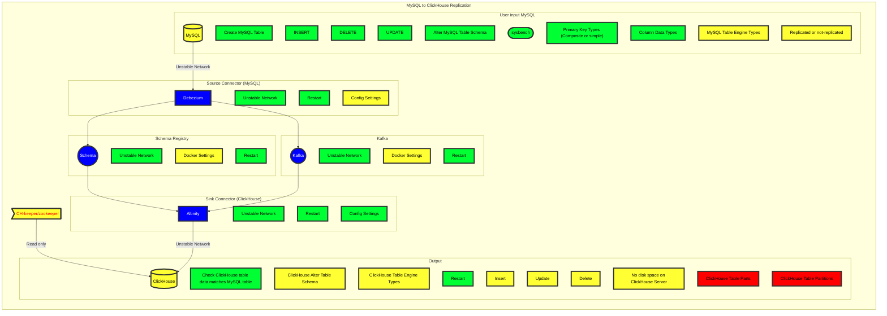
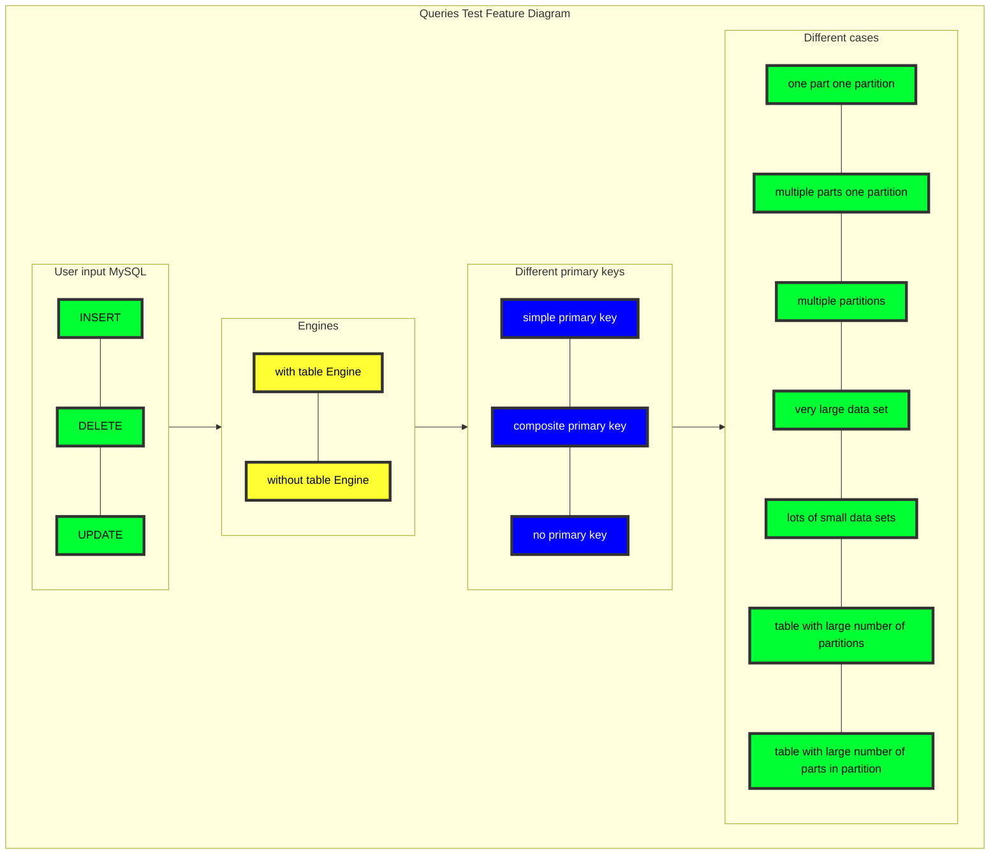

# SRS030 MySQL to ClickHouse Replication
# Software Requirements Specification

## Table of Contents

* 1 [Introduction](#introduction)
* 2 [Terminology](#terminology)
  * 2.1 [SRS](#srs)
  * 2.2 [MySQL](#mysql)
* 3 [Feature Diagram](#feature-diagram)
* 4 [Requirements](#requirements)
  * 4.1 [General](#general)
    * 4.1.1 [RQ.SRS-030.ClickHouse.MySQLToClickHouseReplication](#rqsrs-030clickhousemysqltoclickhousereplication)
  * 4.2 [Consistency](#consistency)
    * 4.2.1 [RQ.SRS-030.ClickHouse.MySQLToClickHouseReplication.Consistency](#rqsrs-030clickhousemysqltoclickhousereplicationconsistency)
    * 4.2.2 [Multiple MySQL Masters](#multiple-mysql-masters)
      * 4.2.2.1 [RQ.SRS-030.ClickHouse.MySQLToClickHouseReplication.Consistency.MultipleMySQLMasters](#rqsrs-030clickhousemysqltoclickhousereplicationconsistencymultiplemysqlmasters)
    * 4.2.3 [Deduplication](#deduplication)
      * 4.2.3.1 [RQ.SRS-030.ClickHouse.MySQLToClickHouseReplication.Consistency.Deduplication](#rqsrs-030clickhousemysqltoclickhousereplicationconsistencydeduplication)
    * 4.2.4 [Selects](#selects)
      * 4.2.4.1 [RQ.SRS-030.ClickHouse.MySQLToClickHouseReplication.Consistency.Select](#rqsrs-030clickhousemysqltoclickhousereplicationconsistencyselect)
    * 4.2.5 [Only Once Guarantee](#only-once-guarantee)
      * 4.2.5.1 [RQ.SRS-030.ClickHouse.MySQLToClickHouseReplication.OnlyOnceGuarantee](#rqsrs-030clickhousemysqltoclickhousereplicationonlyonceguarantee)
  * 4.3 [Transactions](#transactions)
    * 4.3.1 [RQ.SRS-030.ClickHouse.MySQLToClickHouseReplication.Transactions](#rqsrs-030clickhousemysqltoclickhousereplicationtransactions)
  * 4.4 [Supported Versions](#supported-versions)
    * 4.4.1 [RQ.SRS-030.ClickHouse.MySQLToClickHouseReplication.MySQLVersions](#rqsrs-030clickhousemysqltoclickhousereplicationmysqlversions)
  * 4.5 [Supported Storage Engines](#supported-storage-engines)
    * 4.5.1 [RQ.SRS-030.ClickHouse.MySQLToClickHouseReplication.MySQLStorageEngines.ReplacingMergeTree](#rqsrs-030clickhousemysqltoclickhousereplicationmysqlstorageenginesreplacingmergetree)
      * 4.5.1.1 [RQ.SRS-030.ClickHouse.MySQLToClickHouseReplication.MySQLStorageEngines.ReplacingMergeTree.VirtualColumnNames](#rqsrs-030clickhousemysqltoclickhousereplicationmysqlstorageenginesreplacingmergetreevirtualcolumnnames)
    * 4.5.2 [RQ.SRS-030.ClickHouse.MySQLToClickHouseReplication.MySQLStorageEngines.ReplicatedReplacingMergeTree](#rqsrs-030clickhousemysqltoclickhousereplicationmysqlstorageenginesreplicatedreplacingmergetree)
      * 4.5.2.1 [RQ.SRS-030.ClickHouse.MySQLToClickHouseReplication.MySQLStorageEngines.ReplicatedReplacingMergeTree.DifferentVersionColumnNames](#rqsrs-030clickhousemysqltoclickhousereplicationmysqlstorageenginesreplicatedreplacingmergetreedifferentversioncolumnnames)
  * 4.6 [Data Types](#data-types)
    * 4.6.1 [Integer Types](#integer-types)
      * 4.6.1.1 [RQ.SRS-030.ClickHouse.MySQLToClickHouseReplication.DataTypes.IntegerTypes](#rqsrs-030clickhousemysqltoclickhousereplicationdatatypesintegertypes)
    * 4.6.2 [Decimal](#decimal)
      * 4.6.2.1 [RQ.SRS-030.ClickHouse.MySQLToClickHouseReplication.DataTypes.Decimal](#rqsrs-030clickhousemysqltoclickhousereplicationdatatypesdecimal)
    * 4.6.3 [Double](#double)
      * 4.6.3.1 [RQ.SRS-030.ClickHouse.MySQLToClickHouseReplication.DataTypes.Double](#rqsrs-030clickhousemysqltoclickhousereplicationdatatypesdouble)
    * 4.6.4 [DateTime](#datetime)
      * 4.6.4.1 [RQ.SRS-030.ClickHouse.MySQLToClickHouseReplication.DataTypes.DateTime](#rqsrs-030clickhousemysqltoclickhousereplicationdatatypesdatetime)
    * 4.6.5 [Binary](#binary)
      * 4.6.5.1 [RQ.SRS-030.ClickHouse.MySQLToClickHouseReplication.DataTypes.Binary](#rqsrs-030clickhousemysqltoclickhousereplicationdatatypesbinary)
    * 4.6.6 [String](#string)
      * 4.6.6.1 [RQ.SRS-030.ClickHouse.MySQLToClickHouseReplication.DataTypes.String](#rqsrs-030clickhousemysqltoclickhousereplicationdatatypesstring)
    * 4.6.7 [Blob Types](#blob-types)
      * 4.6.7.1 [RQ.SRS-030.ClickHouse.MySQLToClickHouseReplication.DataTypes.BlobTypes](#rqsrs-030clickhousemysqltoclickhousereplicationdatatypesblobtypes)
    * 4.6.8 [Nullable](#nullable)
      * 4.6.8.1 [RQ.SRS-030.ClickHouse.MySQLToClickHouseReplication.DataTypes.Nullable](#rqsrs-030clickhousemysqltoclickhousereplicationdatatypesnullable)
    * 4.6.9 [Enum](#enum)
      * 4.6.9.1 [RQ.SRS-030.ClickHouse.MySQLToClickHouseReplication.DataTypes.EnumToEnum](#rqsrs-030clickhousemysqltoclickhousereplicationdatatypesenumtoenum)
      * 4.6.9.2 [RQ.SRS-030.ClickHouse.MySQLToClickHouseReplication.DataTypes.EnumToString](#rqsrs-030clickhousemysqltoclickhousereplicationdatatypesenumtostring)
    * 4.6.10 [JSON](#json)
      * 4.6.10.1 [RQ.SRS-030.ClickHouse.MySQLToClickHouseReplication.DataTypes.JSON](#rqsrs-030clickhousemysqltoclickhousereplicationdatatypesjson)
    * 4.6.11 [Year](#year)
      * 4.6.11.1 [RQ.SRS-030.ClickHouse.MySQLToClickHouseReplication.DataTypes.Year](#rqsrs-030clickhousemysqltoclickhousereplicationdatatypesyear)
    * 4.6.12 [Bytes](#bytes)
      * 4.6.12.1 [RQ.SRS-030.ClickHouse.MySQLToClickHouseReplication.DataTypes.Bytes](#rqsrs-030clickhousemysqltoclickhousereplicationdatatypesbytes)
  * 4.7 [Queries](#queries)
    * 4.7.1 [Test Feature Diagram](#test-feature-diagram)
    * 4.7.2 [Inserts](#inserts)
      * 4.7.2.1 [RQ.SRS-030.ClickHouse.MySQLToClickHouseReplication.Queries.Inserts](#rqsrs-030clickhousemysqltoclickhousereplicationqueriesinserts)
        * 4.7.2.1.1 [RQ.SRS-030.ClickHouse.MySQLToClickHouseReplication.Queries.Inserts.PartitionLimits](#rqsrs-030clickhousemysqltoclickhousereplicationqueriesinsertspartitionlimits)
    * 4.7.3 [Updates](#updates)
      * 4.7.3.1 [RQ.SRS-030.ClickHouse.MySQLToClickHouseReplication.Queries.Updates](#rqsrs-030clickhousemysqltoclickhousereplicationqueriesupdates)
    * 4.7.4 [Deletes](#deletes)
      * 4.7.4.1 [RQ.SRS-030.ClickHouse.MySQLToClickHouseReplication.Queries.Deletes](#rqsrs-030clickhousemysqltoclickhousereplicationqueriesdeletes)
  * 4.8 [Table Schema Creation](#table-schema-creation)
    * 4.8.1 [RQ.SRS-030.ClickHouse.MySQLToClickHouseReplication.TableSchemaCreation](#rqsrs-030clickhousemysqltoclickhousereplicationtableschemacreation)
    * 4.8.2 [Auto Create](#auto-create)
      * 4.8.2.1 [RQ.SRS-030.ClickHouse.MySQLToClickHouseReplication.TableSchemaCreation.AutoCreate](#rqsrs-030clickhousemysqltoclickhousereplicationtableschemacreationautocreate)
      * 4.8.2.2 [RQ.SRS-030.ClickHouse.MySQLToClickHouseReplication.TableSchemaCreation.MultipleAutoCreate](#rqsrs-030clickhousemysqltoclickhousereplicationtableschemacreationmultipleautocreate)
    * 4.8.3 [Auto Drop](#auto-drop)
      * 4.8.3.1 [RQ.SRS-030.ClickHouse.MySQLToClickHouseReplication.TableSchemaCreation.AutoDrop](#rqsrs-030clickhousemysqltoclickhousereplicationtableschemacreationautodrop)
  * 4.9 [Columns](#columns)
    * 4.9.1 [Modify](#modify)
      * 4.9.1.1 [RQ.SRS-030.ClickHouse.MySQLToClickHouseReplication.Columns.Modify](#rqsrs-030clickhousemysqltoclickhousereplicationcolumnsmodify)
    * 4.9.2 [Add](#add)
      * 4.9.2.1 [RQ.SRS-030.ClickHouse.MySQLToClickHouseReplication.Columns.Add](#rqsrs-030clickhousemysqltoclickhousereplicationcolumnsadd)
    * 4.9.3 [Remove](#remove)
      * 4.9.3.1 [RQ.SRS-030.ClickHouse.MySQLToClickHouseReplication.Columns.Remove](#rqsrs-030clickhousemysqltoclickhousereplicationcolumnsremove)
  * 4.10 [Primary Key](#primary-key)
    * 4.10.1 [No Primary Key](#no-primary-key)
      * 4.10.1.1 [RQ.SRS-030.ClickHouse.MySQLToClickHouseReplication.PrimaryKey.No](#rqsrs-030clickhousemysqltoclickhousereplicationprimarykeyno)
    * 4.10.2 [Simple Primary Key](#simple-primary-key)
      * 4.10.2.1 [RQ.SRS-030.ClickHouse.MySQLToClickHouseReplication.PrimaryKey.Simple](#rqsrs-030clickhousemysqltoclickhousereplicationprimarykeysimple)
    * 4.10.3 [Composite Primary Key](#composite-primary-key)
      * 4.10.3.1 [RQ.SRS-030.ClickHouse.MySQLToClickHouseReplication.PrimaryKey.Composite](#rqsrs-030clickhousemysqltoclickhousereplicationprimarykeycomposite)
  * 4.11 [Multiple Upstream Servers](#multiple-upstream-servers)
    * 4.11.1 [RQ.SRS-030.ClickHouse.MySQLToClickHouseReplication.MultipleUpstreamServers](#rqsrs-030clickhousemysqltoclickhousereplicationmultipleupstreamservers)
  * 4.12 [Multiple Downstream Servers](#multiple-downstream-servers)
    * 4.12.1 [RQ.SRS-030.ClickHouse.MySQLToClickHouseReplication.MultipleDownstreamServers](#rqsrs-030clickhousemysqltoclickhousereplicationmultipledownstreamservers)
  * 4.13 [Archival Mode](#archival-mode)
    * 4.13.1 [RQ.SRS-030.ClickHouse.MySQLToClickHouseReplication.ArchivalMode](#rqsrs-030clickhousemysqltoclickhousereplicationarchivalmode)
  * 4.14 [Bootstrapping Mode](#bootstrapping-mode)
    * 4.14.1 [RQ.SRS-030.ClickHouse.MySQLToClickHouseReplication.BootstrappingMode](#rqsrs-030clickhousemysqltoclickhousereplicationbootstrappingmode)
  * 4.15 [Binlog Position](#binlog-position)
    * 4.15.1 [RQ.SRS-030.ClickHouse.MySQLToClickHouseReplication.BinlogPosition](#rqsrs-030clickhousemysqltoclickhousereplicationbinlogposition)
  * 4.16 [Column Mapping And Transformation Rules](#column-mapping-and-transformation-rules)
    * 4.16.1 [RQ.SRS-030.ClickHouse.MySQLToClickHouseReplication.ColumnMappingAndTransformationRules](#rqsrs-030clickhousemysqltoclickhousereplicationcolumnmappingandtransformationrules)
  * 4.17 [Latency](#latency)
    * 4.17.1 [RQ.SRS-030.ClickHouse.MySQLToClickHouseReplication.Latency](#rqsrs-030clickhousemysqltoclickhousereplicationlatency)
  * 4.18 [Performance ](#performance-)
    * 4.18.1 [RQ.SRS-030.ClickHouse.MySQLToClickHouseReplication.Performance](#rqsrs-030clickhousemysqltoclickhousereplicationperformance)
    * 4.18.2 [Large Daily Data Volumes](#large-daily-data-volumes)
      * 4.18.2.1 [RQ.SRS-030.ClickHouse.MySQLToClickHouseReplication.Performance.LargeDailyDataVolumes](#rqsrs-030clickhousemysqltoclickhousereplicationperformancelargedailydatavolumes)
  * 4.19 [Settings](#settings)
    * 4.19.1 [clickhouse.topic2table.map](#clickhousetopic2tablemap)
      * 4.19.1.1 [RQ.SRS-030.ClickHouse.MySQLToClickHouseReplication.Settings.Topic2TableMap](#rqsrs-030clickhousemysqltoclickhousereplicationsettingstopic2tablemap)
  * 4.20 [Prometheus ](#prometheus-)
    * 4.20.1 [RQ.SRS-030.ClickHouse.MySQLToClickHouseReplication.Prometheus](#rqsrs-030clickhousemysqltoclickhousereplicationprometheus)

## Introduction

This software requirements specification covers requirements related to [Altinity Sink Connector]'s
support for data replication from [MySQL] databases to [ClickHouse].

## Terminology

### SRS

Software Requirements Specification

### MySQL

[MySQL](https://www.mysql.com/) server.

## Feature Diagram

Test feature diagram.



## Requirements

### General

#### RQ.SRS-030.ClickHouse.MySQLToClickHouseReplication
version: 1.0

[Altinity Sink Connector] SHALL support replication of single or multiple tables from [MySQL] database.

### Consistency

#### RQ.SRS-030.ClickHouse.MySQLToClickHouseReplication.Consistency

[Altinity Sink Connector] SHALL support consistent data replication from [MySQL] to [CLickHouse].

#### Multiple MySQL Masters

##### RQ.SRS-030.ClickHouse.MySQLToClickHouseReplication.Consistency.MultipleMySQLMasters

[Altinity Sink Connector] SHALL support consistent data replication from [MySQL] to [CLickHouse] when one or more MySQL
masters are going down.

#### Deduplication

##### RQ.SRS-030.ClickHouse.MySQLToClickHouseReplication.Consistency.Deduplication
version: 1.0

[Altinity Sink Connector] SHALL support data deduplication when it receives the same data twice from [MySQL].

#### Selects

##### RQ.SRS-030.ClickHouse.MySQLToClickHouseReplication.Consistency.Select
version: 1.0

[ClickHouse] `SELECT ... FINAL` query SHALL always return exactly same data as [MySQL].

#### Only Once Guarantee

##### RQ.SRS-030.ClickHouse.MySQLToClickHouseReplication.OnlyOnceGuarantee
version: 1.0

[Altinity Sink Connector] SHALL support [MySQL] replication to [CLickHouse] with only-once guarantee.
Block level de-duplication SHALL be used if it is going to replicated tables
but the publisher SHALL publish only once.

The following cases SHALL be supported:

1. [MySQL] database crash
2. [MySQL] database event stream provider crash
3. [MySQL] restart
3. [ClickHouse] server crash
4. [Clickhouse] server restart
5. [Kafka] server crash
6. [Kafka] server restart
7. [Debezium] server crash
8. [Debezium] server restart
9. [Altinity Sink Connector] server crash
10. [Altinity Sink Connector] server restart
11. [Schemaregistry] server crash
12. [Schemaregistry] server restart
13. [Zookeeper] read only mode

### Transactions

#### RQ.SRS-030.ClickHouse.MySQLToClickHouseReplication.Transactions
version: 1.0

[Altinity Sink Connector] SHALL support transactions for replicated [MySQL] tables.

### Supported Versions

#### RQ.SRS-030.ClickHouse.MySQLToClickHouseReplication.MySQLVersions
version: 1.0
 
[Altinity Sink Connector] SHALL support replication from the following [MySQL] versions:

* [MySQL 8.0](https://dev.mysql.com/doc/refman/8.0/en/)


### Supported Storage Engines

#### RQ.SRS-030.ClickHouse.MySQLToClickHouseReplication.MySQLStorageEngines.ReplacingMergeTree
version: 1.0

[Altinity Sink Connector] SHALL support replication of tables that use "InnoDB" [MySQL] storage engine to
"ReplacingMergeTree" [ClickHouse] table engine.

##### RQ.SRS-030.ClickHouse.MySQLToClickHouseReplication.MySQLStorageEngines.ReplacingMergeTree.VirtualColumnNames
version: 1.0

[Altinity Sink Connector] SHALL support replication of tables that use "InnoDB" [MySQL] storage engine to
"ReplacingMergeTree" [ClickHouse] table engine and virtual column names by default should be "_version" and "_sign".


#### RQ.SRS-030.ClickHouse.MySQLToClickHouseReplication.MySQLStorageEngines.ReplicatedReplacingMergeTree
version: 1.0

[Altinity Sink Connector] SHALL support replication of tables that use "InnoDB" [MySQL] storage engine to
"ReplicatedReplacingMergeTree" [ClickHouse] table engine.

##### RQ.SRS-030.ClickHouse.MySQLToClickHouseReplication.MySQLStorageEngines.ReplicatedReplacingMergeTree.DifferentVersionColumnNames
version: 1.0

[Altinity Sink Connector] SHALL support replication of tables that use "InnoDB" [MySQL] storage engine to
"ReplicatedReplacingMergeTree" [ClickHouse] table engine with different version column names.

### Data Types

#### Integer Types

##### RQ.SRS-030.ClickHouse.MySQLToClickHouseReplication.DataTypes.IntegerTypes
version: 1.0

[Altinity Sink Connector] SHALL support data replication to [ClickHouse] of tables that contain columns with
'Integer' data types as they supported by [MySQL].

Integer data types connection table:

| MySQL              |           ClickHouse            | Min edge value | Max edge value |
|:-------------------|:-------------------------------:|----------------|:--------------:|
| Bigint             |              Int64              | 2^63           |     2^63-1     |
| Bigint Unsigned    |             UInt64              | 0              |     2^64-1     |
| Int                |              Int32              | -2147483648    |   2147483647   |
| Int Unsigned       |             UInt32              | 0              |   4294967295   |
| Mediumint          |              Int32              | -8388608       |    8388607     |
| Mediumint Unsigned |             UInt32              | 0              |    16777215    |
| Smallint           |              Int16              | -32768         |     32767      |
| Smallint Unsigned  |             UInt16              | 0              |     65535      |
| Tinyint            |              Int8               | -128           |      127       |
| Tinyint Unsigned   |              UInt8              | 0              |      255       |

#### Decimal

##### RQ.SRS-030.ClickHouse.MySQLToClickHouseReplication.DataTypes.Decimal
version: 1.0

[Altinity Sink Connector] SHALL support data replication to [CLickHouse] of tables that contain columns with
'Decimal' data types as they supported by [MySQL].

[ClickHouse]'s 'Decimal32(S)', 'Decimal64(S)', 'Decimal128(S)', 'Decimal256(S)' also can be
manually used for [MySQL] 'Decimal'.

Data types connection table:

| MySQL        |  ClickHouse  |
|:-------------|:------------:|
| Decimal(x,y) | Decimal(x,y) |

#### Double

##### RQ.SRS-030.ClickHouse.MySQLToClickHouseReplication.DataTypes.Double
version: 1.0

[Altinity Sink Connector] SHALL support data replication to [CLickHouse] of tables that contain columns with
'Double' data types as they supported by [MySQL].

Data types connection table:

| MySQL        |  ClickHouse  |
|:-------------|:------------:|
| Double       |   Float64    |

#### DateTime

##### RQ.SRS-030.ClickHouse.MySQLToClickHouseReplication.DataTypes.DateTime
version: 1.0

[Altinity Sink Connector] SHALL support data replication to [CLickHouse] of tables that contain columns with 'Data' and 'Time'
data types as they supported by [MySQL].

Data types connection table:

| MySQL       |       ClickHouse        |
|:------------|:-----------------------:|
| Date        |         Date32          |
| DateTime(6) | DateTime64(6) or String |
| DATETIME    |       DateTime64        |
| Time        |         String          |
| Time(6)     |         String          |
| Timestamp   |        DateTime         |

#### Binary

##### RQ.SRS-030.ClickHouse.MySQLToClickHouseReplication.DataTypes.Binary
version: 1.0

[Altinity Sink Connector] SHALL support data replication to [CLickHouse] replication of tables that contain columns with 'Binary'
data types as they supported by [MySQL].

Data types connection table:

| MySQL        |              ClickHouse              |
|:-------------|:------------------------------------:|
| Binary       |             String + hex             |
| varbinary(*) |             String + hex             |

#### String

##### RQ.SRS-030.ClickHouse.MySQLToClickHouseReplication.DataTypes.String
version: 1.0

[Altinity Sink Connector] SHALL support data replication to [CLickHouse] of tables that contain columns with 'String'
data types as they supported by [MySQL].

Data types connection table:

| MySQL        |           ClickHouse            |
|:-------------|:-------------------------------:|
| Char         | String / LowCardinality(String) |
| Text         |             String              |
| varbinary(*) |          String + hex           |
| varchar(*)   |             String              |

#### Blob Types

##### RQ.SRS-030.ClickHouse.MySQLToClickHouseReplication.DataTypes.BlobTypes
version: 1.0

[Altinity Sink Connector] SHALL support data replication to [CLickHouse] of tables that contain columns with 'Blob' [MySQL]
data types and correctly unhex() them.

```sql
SELECT unhex(blob_column) FROM our_table FORMAT CSV;
```

Data types connection table:

| MySQL        |           ClickHouse            |
|:-------------|:-------------------------------:|
| Blob         |          String + hex           |
| Longblob     |          String + hex           |
| Mediumblob   |          String + hex           |

#### Nullable

##### RQ.SRS-030.ClickHouse.MySQLToClickHouseReplication.DataTypes.Nullable
version: 1.0

[Altinity Sink Connector] SHALL support data replication to [CLickHouse] of tables that contain columns with NULL [MySQL]
data types if this expected `Nullable(DataType)` construction should be used.

For example, [MySQL] `VARCHAR(*)` maps to [ClickHouse] `Nullable(String)` and MySQL
`VARCHAR(*) NOT NULL` maps to [ClickHouse] `String`

#### Enum

##### RQ.SRS-030.ClickHouse.MySQLToClickHouseReplication.DataTypes.EnumToEnum
version: 1.0

[Altinity Sink Connector] SHALL support data replication to [CLickHouse] of tables that contain columns with 'ENUM'
data types as they supported by [MySQL].

Data types connection table:

| MySQL | ClickHouse |
|:------|:----------:|
| ENUM  |    ENUM    |

##### RQ.SRS-030.ClickHouse.MySQLToClickHouseReplication.DataTypes.EnumToString
version: 1.0

[Altinity Sink Connector] SHALL support data replication to [CLickHouse] of tables that contain columns with 'ENUM'
data types as they supported by [MySQL].

Data types connection table:

| MySQL | ClickHouse |
|:------|:----------:|
| ENUM  |   String   |

#### JSON

##### RQ.SRS-030.ClickHouse.MySQLToClickHouseReplication.DataTypes.JSON
version: 1.0

[Altinity Sink Connector] SHALL support data replication to [CLickHouse] of tables that contain columns with 'JSON'
data types as they supported by [MySQL].

Data types connection table:

| MySQL | ClickHouse |
|:------|:----------:|
| JSON  |   String   |

#### Year

##### RQ.SRS-030.ClickHouse.MySQLToClickHouseReplication.DataTypes.Year
version: 1.0

[Altinity Sink Connector] SHALL support data replication to [CLickHouse] of tables that contain columns with 'Year'
data types as they supported by [MySQL].

Data types connection table:

| MySQL | ClickHouse |
|:------|:----------:|
| Year  |   Int32    |

#### Bytes

##### RQ.SRS-030.ClickHouse.MySQLToClickHouseReplication.DataTypes.Bytes
version: 1.0

[Altinity Sink Connector] SHALL support data replication to [CLickHouse] of tables that contain columns with 'BIT(m)'
data types where m: 2 - 64 as they supported by [MySQL].

Data types connection table:

| MySQL  | ClickHouse |
|:-------|:----------:|
| BIT(m) |   String   |


### Queries

#### Test Feature Diagram



#### Inserts

##### RQ.SRS-030.ClickHouse.MySQLToClickHouseReplication.Queries.Inserts
version: 1.0

[Altinity Sink Connector] SHALL support new data inserts replication from [MySQL] to [CLickHouse].

###### RQ.SRS-030.ClickHouse.MySQLToClickHouseReplication.Queries.Inserts.PartitionLimits
version: 1.0

[Altinity Sink Connector] SHALL support correct data inserts replication from [MySQL] to [CLickHouse] when partition 
limits are hitting or avoid such situations.


#### Updates

##### RQ.SRS-030.ClickHouse.MySQLToClickHouseReplication.Queries.Updates
version: 1.0

[Altinity Sink Connector] SHALL support data updates replication from [MySQL] to [CLickHouse].

#### Deletes

##### RQ.SRS-030.ClickHouse.MySQLToClickHouseReplication.Queries.Deletes
version: 1.0

[Altinity Sink Connector] SHALL support data deletes replication from [MySQL] to [CLickHouse].

### Table Schema Creation

#### RQ.SRS-030.ClickHouse.MySQLToClickHouseReplication.TableSchemaCreation
version: 1.0

[Altinity Sink Connector]SHALL support the following ways to replicate schema from [MySQL] to [CLickHouse]:
* auto-create option
* `clickhouse_loader` script
* `chump` utility

#### Auto Create

##### RQ.SRS-030.ClickHouse.MySQLToClickHouseReplication.TableSchemaCreation.AutoCreate
version: 1.0

[Altinity Sink Connector] SHALL support auto table creation from [MySQL] to [CLickHouse].

##### RQ.SRS-030.ClickHouse.MySQLToClickHouseReplication.TableSchemaCreation.MultipleAutoCreate
version: 1.0

[Altinity Sink Connector] SHALL support auto creation of multiple tables from [MySQL] to [CLickHouse].

#### Auto Drop

##### RQ.SRS-030.ClickHouse.MySQLToClickHouseReplication.TableSchemaCreation.AutoDrop
version: 1.0

[Altinity Sink Connector] SHALL support `DROP TABLE` query from [MySQL] to [CLickHouse].

### Columns

#### Modify

##### RQ.SRS-030.ClickHouse.MySQLToClickHouseReplication.Columns.Modify
version: 1.0

[Altinity Sink Connector] SHALL support `MODIFY COLUMN` query from [MySQL] to [CLickHouse].

#### Add

##### RQ.SRS-030.ClickHouse.MySQLToClickHouseReplication.Columns.Add
version: 1.0

[Altinity Sink Connector] SHALL support `ADD COLUMN` query from [MySQL] to [CLickHouse].

#### Remove

##### RQ.SRS-030.ClickHouse.MySQLToClickHouseReplication.Columns.Remove
version: 1.0

[Altinity Sink Connector] SHALL support `REMOVE COLUMN` query from [MySQL] to [CLickHouse].

### Primary Key

#### No Primary Key

##### RQ.SRS-030.ClickHouse.MySQLToClickHouseReplication.PrimaryKey.No
version: 1.0

[Altinity Sink Connector] query SHALL support [MySQL] data replication to [CLickHouse] on queries to tables
with no `PRIMARY KEY`.

#### Simple Primary Key

##### RQ.SRS-030.ClickHouse.MySQLToClickHouseReplication.PrimaryKey.Simple
version: 1.0

[Altinity Sink Connector] query SHALL support [MySQL] data replication to [CLickHouse] on queries with the same order
as simple `PRIMARY KEY` does.

#### Composite Primary Key

##### RQ.SRS-030.ClickHouse.MySQLToClickHouseReplication.PrimaryKey.Composite
version: 1.0

[Altinity Sink Connector] query SHALL support [MySQL] data replication to [CLickHouse] on queries with the same order 
as composite `PRIMARY KEY` does.

### Multiple Upstream Servers

#### RQ.SRS-030.ClickHouse.MySQLToClickHouseReplication.MultipleUpstreamServers
version: 1.0

[Altinity Sink Connector] SHALL support [MySQL] replication to [CLickHouse] from multiple [MySQL] upstream servers.

### Multiple Downstream Servers

#### RQ.SRS-030.ClickHouse.MySQLToClickHouseReplication.MultipleDownstreamServers
version: 1.0

[Altinity Sink Connector] SHALL support [MySQL] replication to [CLickHouse] when using multiple downstream [ClickHouse] servers.

### Archival Mode

#### RQ.SRS-030.ClickHouse.MySQLToClickHouseReplication.ArchivalMode
version: 1.0

[Altinity Sink Connector] SHALL support [MySQL] replication to [CLickHouse] with archival mode that
SHALL ignore deletes for some or all tables in [ClickHouse].

### Bootstrapping Mode

#### RQ.SRS-030.ClickHouse.MySQLToClickHouseReplication.BootstrappingMode
version: 1.0

[Altinity Sink Connector] SHALL support [MySQL] replication to [CLickHouse] with 
bootstrapping mode for the initial replication of very large tables
that bypasses event stream by using [MySQL] dump files.

### Binlog Position

#### RQ.SRS-030.ClickHouse.MySQLToClickHouseReplication.BinlogPosition
version: 1.0

[Altinity Sink Connector] SHALL support ability to start replication to [CLickHouse] 
from specific [MySQL] binlog position.

### Column Mapping And Transformation Rules

#### RQ.SRS-030.ClickHouse.MySQLToClickHouseReplication.ColumnMappingAndTransformationRules
version: 1.0

[Altinity Sink Connector] SHALL support [MySQL] replication to [CLickHouse] with support for
defining column mapping and transformations rules.

### Latency

#### RQ.SRS-030.ClickHouse.MySQLToClickHouseReplication.Latency
version: 1.0

[Altinity Sink Connector] SHALL support [MySQL] replication to [CLickHouse] with latency as close as possible to real-time.

### Performance 

#### RQ.SRS-030.ClickHouse.MySQLToClickHouseReplication.Performance
version: 1.0

[Altinity Sink Connector] SHALL support [MySQL] replication to [CLickHouse] more than 100,000 rows/sec.

#### Large Daily Data Volumes

##### RQ.SRS-030.ClickHouse.MySQLToClickHouseReplication.Performance.LargeDailyDataVolumes
version: 1.0

[Altinity Sink Connector] SHALL support [MySQL] replication to [CLickHouse] with large daily data volumes of at least 20-30TB per day.

### Settings

#### clickhouse.topic2table.map

##### RQ.SRS-030.ClickHouse.MySQLToClickHouseReplication.Settings.Topic2TableMap
version: 1.0

[Altinity Sink Connector] SHALL support `clickhouse.topic2table.map` setting for mapping [MySQL] tables to
[ClickHouse] tables that have different name.

### Prometheus 

#### RQ.SRS-030.ClickHouse.MySQLToClickHouseReplication.Prometheus
version: 1.0

[Altinity Sink Connector] SHALL support expose data transfer representation to [Prometheus] service.

[SRS]: #srs
[MySQL]: #mysql
[Prometheus]: https://prometheus.io/
[ClickHouse]: https://clickhouse.com/en/docs
[Altinity Sink Connector]: https://github.com/Altinity/clickhouse-sink-connector
[Git]: https://git-scm.com/
[GitLab]: https://gitlab.com
