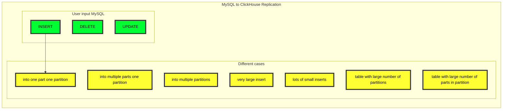

```mermaid
graph LR;

  classDef yellow fill:#ffff33,stroke:#333,stroke-width:4px,color:black;
  classDef yellow2 fill:#ffff33,stroke:#333,stroke-width:4px,color:red;
  classDef green fill:#00ff33,stroke:#333,stroke-width:4px,color:black;
  classDef red fill:red,stroke:#333,stroke-width:4px,color:black;
  classDef blue fill:blue,stroke:#333,stroke-width:4px,color:white;
  
  subgraph O["MySQL to ClickHouse Replication"]
    1A-->1B;
    click id1 "https://www.mysql.com/" _blank
    click id6 "https://clickhouse.com/" _blank
    click id5 "https://github.com/Altinity/clickhouse-sink-connector" _blank

    

  
    subgraph A["User input MySQL"]

        1A["INSERT"]:::green
        2A["DELETE"]:::green
        3A["UPDATE"]:::green
    end
    
    subgraph B["Different cases"]
        1B[" into one part one partition"]:::yellow
        2B["into multiple parts one partition"]:::yellow
        3B["into multiple partitions"]:::yellow
        4B["very large insert"]:::yellow
        5B["lots of small inserts"]:::yellow
        6B["table with large number of partitions"]:::yellow
        7B["table with large number of parts in partition"]:::yellow
    end
    

    

  end
```